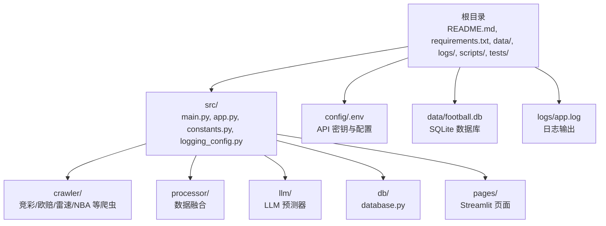
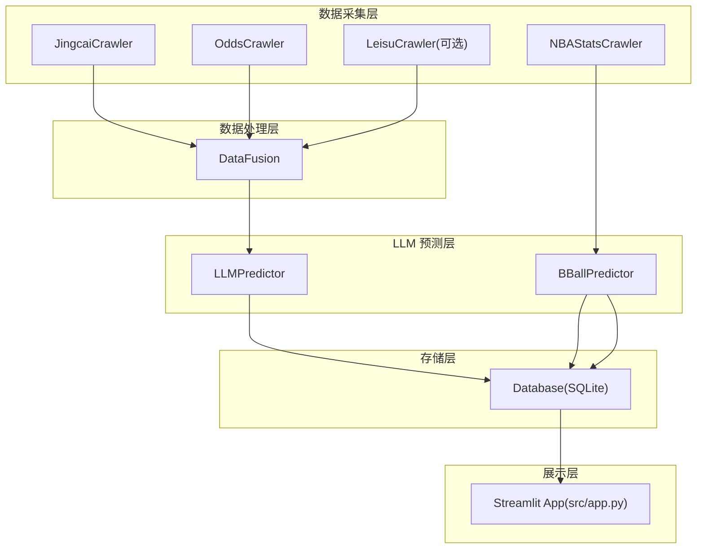
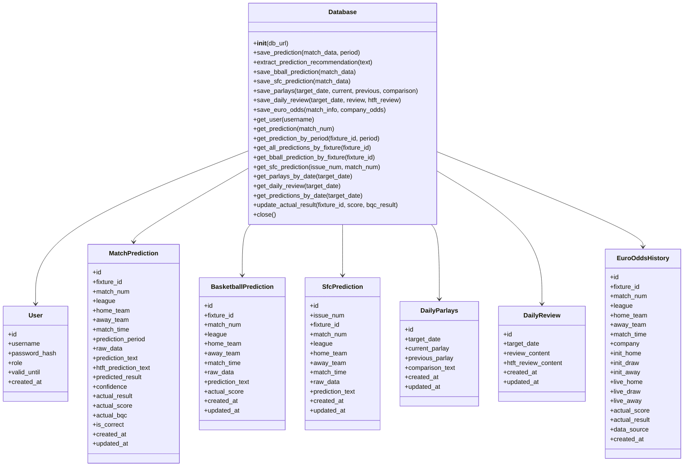
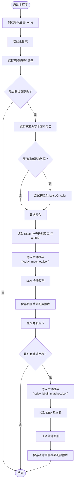
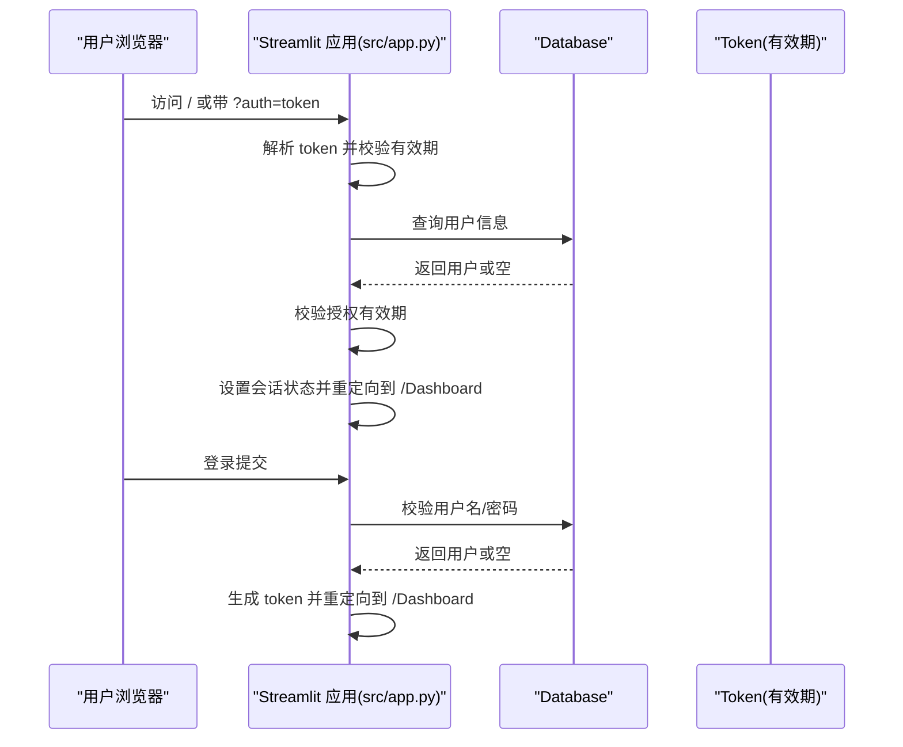
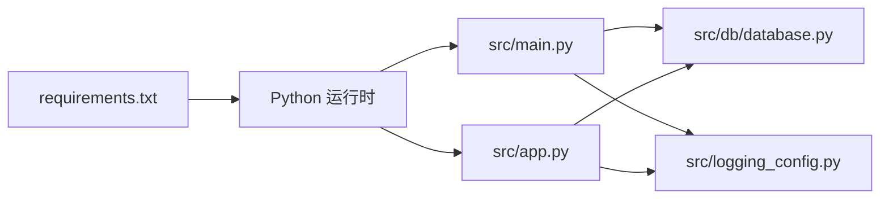

# 开发环境搭建

<cite>
**本文引用的文件**
- [README.md](file://README.md)
- [requirements.txt](file://requirements.txt)
- [src/main.py](file://src/main.py)
- [src/app.py](file://src/app.py)
- [src/db/database.py](file://src/db/database.py)
- [src/logging_config.py](file://src/logging_config.py)
- [start_server.bat](file://start_server.bat)
- [start_server.ps1](file://start_server.ps1)
- [src/constants.py](file://src/constants.py)
</cite>

## 目录
1. [简介](#简介)
2. [项目结构](#项目结构)
3. [核心组件](#核心组件)
4. [架构总览](#架构总览)
5. [详细组件分析](#详细组件分析)
6. [依赖关系分析](#依赖关系分析)
7. [性能考虑](#性能考虑)
8. [故障排查指南](#故障排查指南)
9. [结论](#结论)
10. [附录](#附录)

## 简介
本指南面向新加入的开发者，帮助你在本地快速搭建完整的开发环境，涵盖 Python 环境、虚拟环境、依赖安装、IDE 配置、调试设置、代码格式化、数据库准备、API 密钥配置以及本地服务启动流程。同时提供常见问题的解决方案与性能优化建议，确保你能顺利运行项目并开展后续开发工作。

## 项目结构
该项目采用分层与功能模块结合的组织方式：
- 根目录包含配置、数据、日志、脚本、测试等资源与启动脚本
- 源代码位于 src 目录，按功能划分为爬虫、数据处理、LLM 预测、数据库访问、页面与应用入口等
- 使用 SQLite 作为本地数据库，数据文件位于 data 目录
- 通过 Streamlit 提供 Web 界面，入口为 src/app.py
- 主程序入口为 src/main.py，负责调度各模块执行完整预测流程

图表来源
- [README.md:24-40](file://README.md#L24-L40)
- [src/main.py:18:32](file://src/main.py#L18-L32)
- [src/db/database.py:200:218](file://src/db/database.py#L200-L218)

章节来源
- [README.md:24-40](file://README.md#L24-L40)
- [src/main.py:18:32](file://src/main.py#L18-L32)

## 核心组件
- 主程序入口：负责加载环境变量、初始化日志、调度爬虫、数据融合、LLM 预测、结果入库与篮球预测流程
- 数据库模块：定义 SQLAlchemy 模型与数据库连接，提供预测结果、用户、复盘等表的增删改查接口
- 日志配置：统一控制终端与文件日志输出，支持按天轮转与保留策略
- Streamlit 应用：提供登录与看板页面，基于数据库查询展示预测结果
- 启动脚本：Windows 批处理与 PowerShell 脚本分别用于启动 Streamlit 服务

章节来源
- [src/main.py:34:135](file://src/main.py#L34-L135)
- [src/db/database.py:200:562](file://src/db/database.py#L200-L562)
- [src/logging_config.py:8:30](file://src/logging_config.py#L8-L30)
- [src/app.py:110:166](file://src/app.py#L110-L166)
- [start_server.bat:1-13](file://start_server.bat#L1-L13)
- [start_server.ps1:1-10](file://start_server.ps1#L1-L10)

## 架构总览
系统整体由“数据采集—数据处理—LLM 预测—存储—展示”五层构成，主程序与 Streamlit 分别承担批处理与交互式访问两种模式。

图表来源
- [src/main.py:25:32](file://src/main.py#L25-L32)
- [src/main.py:42:63](file://src/main.py#L42-L63)
- [src/main.py:113:133](file://src/main.py#L113-L133)
- [src/main.py:141:172](file://src/main.py#L141-L172)
- [src/db/database.py:200:218](file://src/db/database.py#L200-L218)
- [src/app.py:29:31](file://src/app.py#L29-L31)

## 详细组件分析

### 数据库模块分析
- 数据库连接：自动创建 data/football.db 并初始化表结构；支持 SQLite 路径与目录存在性校验
- 表结构：包含用户、足球预测、篮球预测、胜负彩预测、每日串关方案、每日复盘、欧赔历史等
- 关键能力：保存/更新预测、提取竞彩推荐、按日期窗口查询、更新实际赛果、保存欧赔历史、保存/获取串关方案与复盘
- 兼容性：对比赛时间解析与实际结果推导提供多种格式兼容

图表来源
- [src/db/database.py:58:198](file://src/db/database.py#L58-L198)
- [src/db/database.py:200:562](file://src/db/database.py#L200-L562)

章节来源
- [src/db/database.py:200:562](file://src/db/database.py#L200-L562)

### 主程序流程分析
主程序负责：
- 加载环境变量与日志
- 足球：抓取竞彩赛程与赔率 → 抓取第三方基本面与盘口 → 数据融合 → LLM 预测 → 保存预测 → 入库
- 篮球：抓取竞彩篮球 → 读取 NBA 基本面 → LLM 预测 → 保存预测 → 入库
- 可选启用 Leisu 爬虫，失败时记录告警但不影响主流程

图表来源
- [src/main.py:34:177](file://src/main.py#L34-L177)

章节来源
- [src/main.py:34:177](file://src/main.py#L34-L177)

### Streamlit 应用与登录流程
- 登录页：校验用户名、密码与有效期，生成带时间戳的 base64 token，写入会话状态并跳转看板
- 看板页：基于数据库查询展示预测结果，隐藏默认侧边栏导航
- 配置：通过环境变量加载，设置页面标题、图标、布局与初始侧边栏状态

图表来源
- [src/app.py:64:82](file://src/app.py#L64-L82)
- [src/app.py:94:108](file://src/app.py#L94-L108)
- [src/app.py:110:166](file://src/app.py#L110-L166)
- [src/constants.py:3:4](file://src/constants.py#L3-L4)

章节来源
- [src/app.py:64:166](file://src/app.py#L64-L166)
- [src/constants.py:3:4](file://src/constants.py#L3-L4)

## 依赖关系分析
- Python 版本：项目使用 requests、beautifulsoup4、pandas、openai、sqlalchemy、python-dotenv、streamlit、schedule、loguru、playwright、nest_asyncio、simpleeval、openpyxl 等库
- 运行时依赖：主程序与 Streamlit 应用均通过 python-dotenv 加载 config/.env 中的环境变量
- 数据库：SQLAlchemy + SQLite，数据库文件位于 data/football.db

图表来源
- [requirements.txt:1-16](file://requirements.txt#L1-L16)
- [src/main.py:1:23](file://src/main.py#L1-L23)
- [src/app.py:1:27](file://src/app.py#L1-L27)
- [src/db/database.py:1:7](file://src/db/database.py#L1-L7)
- [src/logging_config.py:1:3](file://src/logging_config.py#L1-L3)

章节来源
- [requirements.txt:1-16](file://requirements.txt#L1-L16)
- [src/main.py:1:23](file://src/main.py#L1-L23)
- [src/app.py:1:27](file://src/app.py#L1-L27)
- [src/db/database.py:1:7](file://src/db/database.py#L1-L7)
- [src/logging_config.py:1:3](file://src/logging_config.py#L1-L3)

## 性能考虑
- 异步事件循环兼容：在 Windows 上强制使用 ProactorEventLoopPolicy，避免子进程相关异常
- 日志轮转：按天轮转并保留 7 天，避免日志过大影响磁盘空间
- 数据库连接：延迟初始化与会话管理，减少连接开销
- 缓存策略：将中间结果写入本地 JSON 文件，便于重跑与调试
- 网络请求：合理设置超时与重试，避免阻塞主线程

章节来源
- [src/main.py:8:16](file://src/main.py#L8-L16)
- [src/app.py:9:14](file://src/app.py#L9-L14)
- [src/logging_config.py:26:27](file://src/logging_config.py#L26-L27)
- [src/db/database.py:200:218](file://src/db/database.py#L200-L218)

## 故障排查指南
- 端口占用
  - 现象：启动 Streamlit 报错或无法访问
  - 处理：确认 8501 端口未被占用，或修改启动脚本中的端口参数
  - 参考：[start_server.bat:10-11](file://start_server.bat#L10-L11)、[start_server.ps1:7-9](file://start_server.ps1#L7-L9)
- 环境变量未加载
  - 现象：API 密钥或配置读取为空
  - 处理：确认 config/.env 已创建且路径正确，主程序与应用入口均已加载
  - 参考：[src/main.py:179:182](file://src/main.py#L179-L182)、[src/app.py:19:21](file://src/app.py#L19-L21)
- 数据库文件权限
  - 现象：无法创建/写入 data/football.db
  - 处理：确保 data/ 目录存在且当前用户具有读写权限
  - 参考：[src/db/database.py:204:211](file://src/db/database.py#L204-L211)
- Windows 平台异步异常
  - 现象：子进程调用时报错
  - 处理：确保已应用 nest_asyncio 与事件循环策略
  - 参考：[src/main.py:8:16](file://src/main.py#L8-L16)、[src/app.py:9:17](file://src/app.py#L9-L17)
- 登录失败或 Token 过期
  - 现象：登录后立即失效或无法跳转看板
  - 处理：检查 AUTH_TOKEN_TTL 是否合理，确认用户有效期限未过
  - 参考：[src/constants.py:3:4](file://src/constants.py#L3-L4)、[src/app.py:64:82](file://src/app.py#L64-L82)

章节来源
- [start_server.bat:10-11](file://start_server.bat#L10-L11)
- [start_server.ps1:7-9](file://start_server.ps1#L7-L9)
- [src/main.py:179:182](file://src/main.py#L179-L182)
- [src/app.py:19:21](file://src/app.py#L19-L21)
- [src/db/database.py:204:211](file://src/db/database.py#L204-L211)
- [src/main.py:8:16](file://src/main.py#L8-L16)
- [src/app.py:9:17](file://src/app.py#L9-L17)
- [src/constants.py:3:4](file://src/constants.py#L3-L4)
- [src/app.py:64:82](file://src/app.py#L64-L82)

## 结论
通过本指南，你可以完成从 Python 环境、虚拟环境、依赖安装到数据库准备、API 密钥配置与本地服务启动的全流程。建议在开发过程中遵循日志规范、合理使用缓存与会话管理，并关注平台兼容性与性能细节，以获得稳定高效的开发体验。

## 附录

### 开发环境搭建步骤
- Python 环境要求
  - 使用 Python 3.8+（建议 3.10/3.11）
  - 推荐使用虚拟环境隔离依赖
- 创建虚拟环境
  - Linux/macOS: python3 -m venv venv
  - Windows: python -m venv venv
- 激活虚拟环境
  - Linux/macOS: source venv/bin/activate
  - Windows: venv\Scripts\Activate.ps1
- 安装依赖
  - pip install -r requirements.txt
- 准备数据库
  - 首次运行会自动创建 data/football.db 与表结构
- 配置 API 密钥
  - 在 config/.env 中添加所需密钥（如 LLM API 密钥、第三方接口密钥等）
- 启动本地服务
  - Windows: 双击 start_server.bat 或运行 start_server.ps1
  - macOS/Linux: ./start_server.sh（如存在）

章节来源
- [requirements.txt:1-16](file://requirements.txt#L1-L16)
- [src/db/database.py:200:218](file://src/db/database.py#L200-L218)
- [src/main.py:179:182](file://src/main.py#L179-L182)
- [src/app.py:19:21](file://src/app.py#L19-L21)
- [start_server.bat:1-13](file://start_server.bat#L1-L13)
- [start_server.ps1:1-10](file://start_server.ps1#L1-L10)

### IDE 配置与调试设置
- 推荐使用 VS Code 或 PyCharm
- 断点调试
  - 在 src/main.py 与 src/app.py 中设置断点，逐步执行观察变量与流程
- 环境变量
  - 在 IDE 中配置运行环境，指向 config/.env
- 日志查看
  - 查看 logs/app.log，定位异常与性能瓶颈

章节来源
- [src/main.py:34:177](file://src/main.py#L34-L177)
- [src/app.py:110:166](file://src/app.py#L110-L166)
- [src/logging_config.py:8:30](file://src/logging_config.py#L8-L30)

### 代码格式化与质量工具
- 格式化工具：推荐使用 ruff 或 black
- Lint 工具：使用 ruff 或 flake8
- 项目内建议
  - 统一缩进与命名风格
  - 对异常捕获与日志输出保持一致

章节来源
- [requirements.txt:1-16](file://requirements.txt#L1-L16)