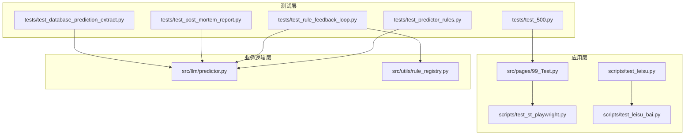
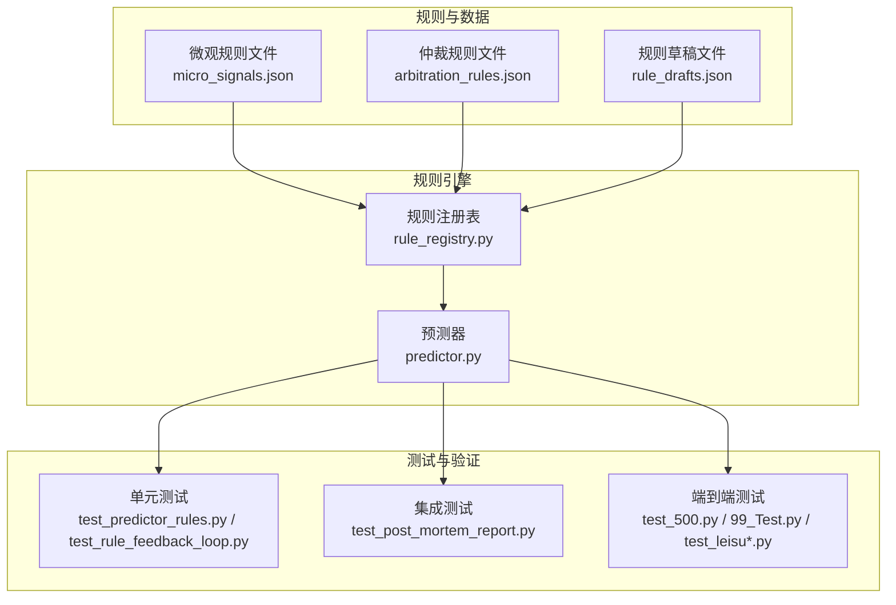
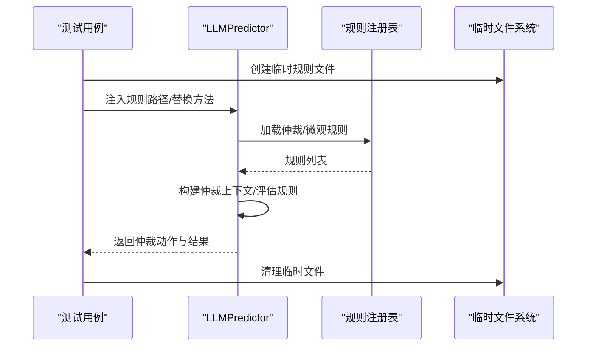
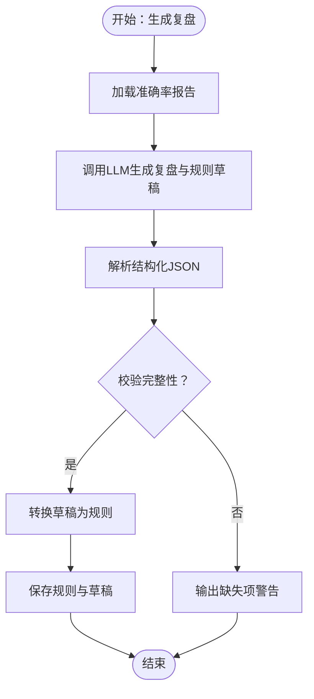
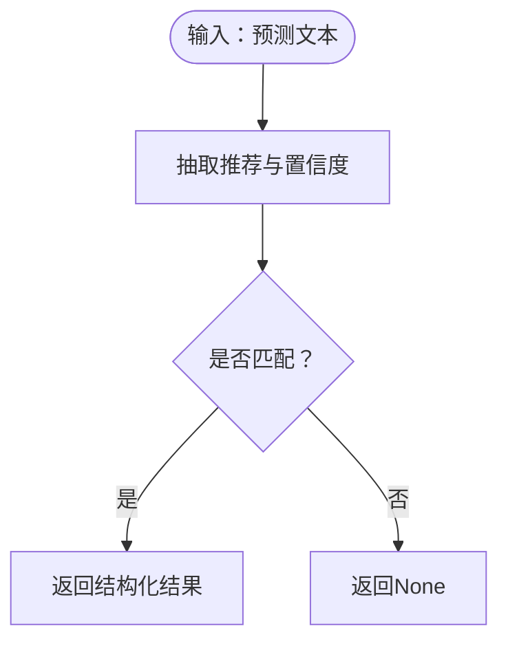
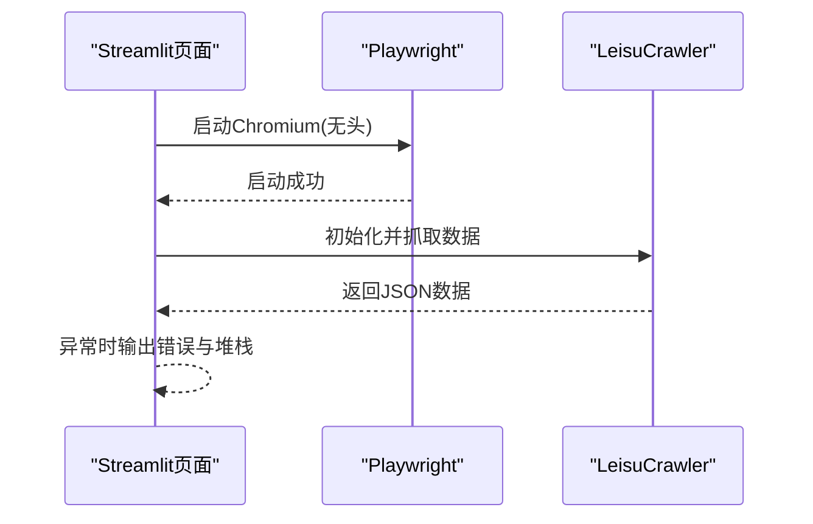
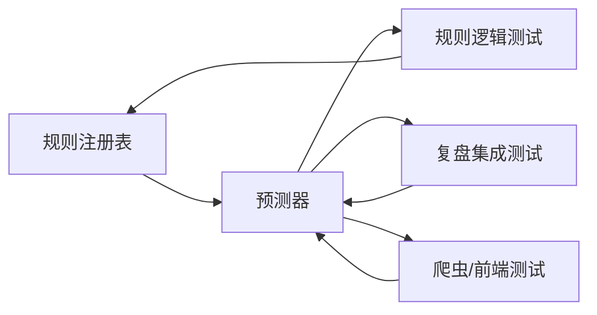

# 测试策略与实践

<cite>
**本文引用的文件**
- [tests/test_500.py](file://tests/test_500.py)
- [tests/test_predictor_rules.py](file://tests/test_predictor_rules.py)
- [tests/test_rule_feedback_loop.py](file://tests/test_rule_feedback_loop.py)
- [tests/test_post_mortem_report.py](file://tests/test_post_mortem_report.py)
- [tests/test_database_prediction_extract.py](file://tests/test_database_prediction_extract.py)
- [src/pages/99_Test.py](file://src/pages/99_Test.py)
- [scripts/test_st_playwright.py](file://scripts/test_st_playwright.py)
- [scripts/test_leisu.py](file://scripts/test_leisu.py)
- [scripts/test_leisu_bai.py](file://scripts/test_leisu_bai.py)
- [src/llm/predictor.py](file://src/llm/predictor.py)
- [src/utils/rule_registry.py](file://src/utils/rule_registry.py)
</cite>

## 目录
1. [引言](#引言)
2. [项目结构](#项目结构)
3. [核心组件](#核心组件)
4. [架构总览](#架构总览)
5. [详细组件分析](#详细组件分析)
6. [依赖分析](#依赖分析)
7. [性能考量](#性能考量)
8. [故障排查指南](#故障排查指南)
9. [结论](#结论)
10. [附录](#附录)

## 引言
本文件面向“足球预测系统”的测试策略与实践，结合现有仓库中的测试用例与脚本，构建覆盖单元测试、集成测试与端到端测试的完整体系。内容涵盖测试用例编写规范、Mock 对象使用、测试数据管理、持续集成与自动化执行、覆盖率要求、性能与压力测试、回归测试以及测试环境与缺陷跟踪流程。

## 项目结构
项目采用功能分层组织：src 下包含业务逻辑（LLM 预测器、规则引擎、爬虫、数据库访问等），tests 存放各类测试用例，scripts 提供调试与验证脚本，data 中存放规则与报告等静态资源。测试覆盖范围包括：
- 规则引擎与仲裁逻辑（predictor_rules、rule_feedback_loop）
- 复盘与规则反馈循环（post_mortem_report）
- 数据抽取与数据库交互（database_prediction_extract）
- 爬虫与前端集成（test_500、99_Test、test_leisu 系列）

图表来源
- [tests/test_500.py:1-55](file://tests/test_500.py#L1-L55)
- [tests/test_predictor_rules.py:1-1211](file://tests/test_predictor_rules.py#L1-L1211)
- [tests/test_rule_feedback_loop.py:1-658](file://tests/test_rule_feedback_loop.py#L1-L658)
- [tests/test_post_mortem_report.py:1-338](file://tests/test_post_mortem_report.py#L1-L338)
- [tests/test_database_prediction_extract.py:1-24](file://tests/test_database_prediction_extract.py#L1-L24)
- [src/pages/99_Test.py:1-19](file://src/pages/99_Test.py#L1-L19)
- [scripts/test_st_playwright.py:1-26](file://scripts/test_st_playwright.py#L1-L26)
- [scripts/test_leisu.py:1-129](file://scripts/test_leisu.py#L1-L129)
- [scripts/test_leisu_bai.py:1-28](file://scripts/test_leisu_bai.py#L1-L28)
- [src/llm/predictor.py:1-200](file://src/llm/predictor.py#L1-L200)
- [src/utils/rule_registry.py:1-200](file://src/utils/rule_registry.py#L1-L200)

章节来源
- [tests/test_500.py:1-55](file://tests/test_500.py#L1-L55)
- [tests/test_predictor_rules.py:1-1211](file://tests/test_predictor_rules.py#L1-L1211)
- [tests/test_rule_feedback_loop.py:1-658](file://tests/test_rule_feedback_loop.py#L1-L658)
- [tests/test_post_mortem_report.py:1-338](file://tests/test_post_mortem_report.py#L1-L338)
- [tests/test_database_prediction_extract.py:1-24](file://tests/test_database_prediction_extract.py#L1-L24)
- [src/pages/99_Test.py:1-19](file://src/pages/99_Test.py#L1-L19)
- [scripts/test_st_playwright.py:1-26](file://scripts/test_st_playwright.py#L1-L26)
- [scripts/test_leisu.py:1-129](file://scripts/test_leisu.py#L1-L129)
- [scripts/test_leisu_bai.py:1-28](file://scripts/test_leisu_bai.py#L1-L28)
- [src/llm/predictor.py:1-200](file://src/llm/predictor.py#L1-L200)
- [src/utils/rule_registry.py:1-200](file://src/utils/rule_registry.py#L1-L200)

## 核心组件
- 规则引擎与仲裁器：负责加载与评估仲裁规则、构建风控策略、生成重试提示与仲裁建议。
- 规则注册表：提供规则文件路径、加载/保存规则列表、条件与动作标准化、规则 ID 生成与去重。
- 预测器：封装 LLM 客户端、动态规则拼装、数据格式化、信号与冲突矩阵分析、复盘生成。
- 爬虫与前端：提供网页抓取与 Streamlit 集成测试入口。
- 数据抽取：从预测文本中抽取推荐与置信度等结构化信息。

章节来源
- [src/llm/predictor.py:1-200](file://src/llm/predictor.py#L1-L200)
- [src/utils/rule_registry.py:1-200](file://src/utils/rule_registry.py#L1-L200)

## 架构总览
测试体系围绕“规则驱动 + 数据驱动 + 人工复盘”展开，通过单元测试验证规则解析与仲裁逻辑，通过集成测试验证规则与预测器协同，通过端到端测试验证爬虫与前端交互。

图表来源
- [src/utils/rule_registry.py:1-200](file://src/utils/rule_registry.py#L1-L200)
- [src/llm/predictor.py:1-200](file://src/llm/predictor.py#L1-L200)
- [tests/test_predictor_rules.py:1-1211](file://tests/test_predictor_rules.py#L1-L1211)
- [tests/test_rule_feedback_loop.py:1-658](file://tests/test_rule_feedback_loop.py#L1-L658)
- [tests/test_post_mortem_report.py:1-338](file://tests/test_post_mortem_report.py#L1-L338)
- [tests/test_500.py:1-55](file://tests/test_500.py#L1-L55)
- [src/pages/99_Test.py:1-19](file://src/pages/99_Test.py#L1-L19)
- [scripts/test_leisu.py:1-129](file://scripts/test_leisu.py#L1-L129)
- [scripts/test_leisu_bai.py:1-28](file://scripts/test_leisu_bai.py#L1-L28)

## 详细组件分析

### 规则引擎与仲裁逻辑测试
- 目标：验证仲裁规则加载、条件求值、动作应用、风控策略构建与重试消息生成。
- 关键点：
  - 使用临时目录与临时文件模拟规则文件，避免污染生产数据。
  - 通过替换类方法或属性实现 Mock，隔离外部依赖。
  - 断言规则条件与动作的规范化、上下文构建与仲裁结果。
- 典型场景：
  - 信息真空仲裁、微观规则冲突矩阵、风控覆盖与置信度上限。
  - 欧亚盘口差异检测、浅水陷阱识别、盘口变化趋势分析。
  - 场景化规则模板与 Euro 配置标签的条件表达。

图表来源
- [tests/test_predictor_rules.py:1-1211](file://tests/test_predictor_rules.py#L1-L1211)
- [src/utils/rule_registry.py:1-200](file://src/utils/rule_registry.py#L1-L200)
- [src/llm/predictor.py:1-200](file://src/llm/predictor.py#L1-L200)

章节来源
- [tests/test_predictor_rules.py:1-1211](file://tests/test_predictor_rules.py#L1-L1211)
- [src/utils/rule_registry.py:1-200](file://src/utils/rule_registry.py#L1-L200)
- [src/llm/predictor.py:1-200](file://src/llm/predictor.py#L1-L200)

### 规则反馈循环与复盘测试
- 目标：验证规则草稿到规则的转换、错误案例覆盖、复盘提示生成与规则建议输出。
- 关键点：
  - 使用 Fake LLM 客户端返回预定义响应，确保测试稳定可控。
  - 验证复盘提示的维度标记、错误归因与规则处置建议。
  - 校验规则 ID 生成、唯一性与去重逻辑。

图表来源
- [tests/test_post_mortem_report.py:1-338](file://tests/test_post_mortem_report.py#L1-L338)
- [tests/test_rule_feedback_loop.py:1-658](file://tests/test_rule_feedback_loop.py#L1-L658)

章节来源
- [tests/test_post_mortem_report.py:1-338](file://tests/test_post_mortem_report.py#L1-L338)
- [tests/test_rule_feedback_loop.py:1-658](file://tests/test_rule_feedback_loop.py#L1-L658)

### 数据抽取与数据库测试
- 目标：验证从预测文本中抽取推荐与置信度的能力，确保数据库层输出一致性。
- 关键点：
  - 使用多组样本文本覆盖单/双选与空值场景。
  - 断言抽取结果与预期格式一致。

图表来源
- [tests/test_database_prediction_extract.py:1-24](file://tests/test_database_prediction_extract.py#L1-L24)

章节来源
- [tests/test_database_prediction_extract.py:1-24](file://tests/test_database_prediction_extract.py#L1-L24)

### 爬虫与前端集成测试
- 目标：验证爬虫初始化、数据抓取与 Streamlit 页面交互。
- 关键点：
  - 使用 headless 模式启动浏览器，减少环境依赖。
  - 在 Streamlit 页面中触发爬虫，捕获异常并输出堆栈信息。

图表来源
- [src/pages/99_Test.py:1-19](file://src/pages/99_Test.py#L1-L19)
- [scripts/test_st_playwright.py:1-26](file://scripts/test_st_playwright.py#L1-L26)
- [scripts/test_leisu.py:1-129](file://scripts/test_leisu.py#L1-L129)
- [scripts/test_leisu_bai.py:1-28](file://scripts/test_leisu_bai.py#L1-L28)

章节来源
- [src/pages/99_Test.py:1-19](file://src/pages/99_Test.py#L1-L19)
- [scripts/test_st_playwright.py:1-26](file://scripts/test_st_playwright.py#L1-L26)
- [scripts/test_leisu.py:1-129](file://scripts/test_leisu.py#L1-L129)
- [scripts/test_leisu_bai.py:1-28](file://scripts/test_leisu_bai.py#L1-L28)

## 依赖分析
- 组件耦合：
  - 规则注册表与预测器紧密耦合，前者提供规则文件路径与标准化，后者消费规则并生成仲裁结果。
  - 测试用例通过替换方法或属性实现解耦，避免对外部服务与文件系统的依赖。
- 外部依赖：
  - LLM 客户端、浏览器自动化（Playwright）、网络请求（requests）等，测试中通过 Mock 与本地化配置降低外部依赖风险。

图表来源
- [src/utils/rule_registry.py:1-200](file://src/utils/rule_registry.py#L1-L200)
- [src/llm/predictor.py:1-200](file://src/llm/predictor.py#L1-L200)
- [tests/test_predictor_rules.py:1-1211](file://tests/test_predictor_rules.py#L1-L1211)
- [tests/test_rule_feedback_loop.py:1-658](file://tests/test_rule_feedback_loop.py#L1-L658)
- [tests/test_post_mortem_report.py:1-338](file://tests/test_post_mortem_report.py#L1-L338)
- [src/pages/99_Test.py:1-19](file://src/pages/99_Test.py#L1-L19)

章节来源
- [src/utils/rule_registry.py:1-200](file://src/utils/rule_registry.py#L1-L200)
- [src/llm/predictor.py:1-200](file://src/llm/predictor.py#L1-L200)
- [tests/test_predictor_rules.py:1-1211](file://tests/test_predictor_rules.py#L1-L1211)
- [tests/test_rule_feedback_loop.py:1-658](file://tests/test_rule_feedback_loop.py#L1-L658)
- [tests/test_post_mortem_report.py:1-338](file://tests/test_post_mortem_report.py#L1-L338)
- [src/pages/99_Test.py:1-19](file://src/pages/99_Test.py#L1-L19)

## 性能考量
- 规则评估复杂度：仲裁规则与微观规则数量与条件复杂度直接影响评估耗时，建议：
  - 将高频规则前置，利用短路与上下文裁剪减少不必要的计算。
  - 对条件表达式进行标准化与缓存（如上下文构建结果）。
- LLM 调用成本控制：
  - 通过动态规则拼装减少上下文长度，避免重复规则。
  - 使用 Mock 客户端在测试中替代真实调用，保证稳定性与速度。
- 爬虫与前端测试：
  - 使用 headless 模式与超时控制，避免长时间等待。
  - 对网络请求设置合理超时与重试策略。

## 故障排查指南
- 规则条件非法：
  - 现象：规则条件包含不支持的伪代码或函数。
  - 处理：使用注册表提供的条件标准化函数，将别名与逻辑运算符转换为可执行表达式。
- 仲裁动作不生效：
  - 现象：预测文本未按风控策略更新。
  - 处理：检查仲裁动作类型与上下文字段，确认动作应用逻辑与重试消息生成。
- 复盘提示缺失：
  - 现象：复盘报告缺少盘口复盘或规则建议。
  - 处理：校验输入报告的完整性，确保结构化 JSON 输出符合预期。
- 爬虫/前端异常：
  - 现象：Playwright 启动失败或页面交互异常。
  - 处理：检查事件循环策略、浏览器版本与页面元素定位，必要时启用 headless 并增加等待时间。

章节来源
- [src/utils/rule_registry.py:1-200](file://src/utils/rule_registry.py#L1-L200)
- [tests/test_rule_feedback_loop.py:1-658](file://tests/test_rule_feedback_loop.py#L1-L658)
- [scripts/test_st_playwright.py:1-26](file://scripts/test_st_playwright.py#L1-L26)
- [src/pages/99_Test.py:1-19](file://src/pages/99_Test.py#L1-L19)

## 结论
本测试策略以规则为中心，结合 Mock 与临时文件机制，实现了对规则引擎、仲裁逻辑、复盘流程与前端/爬虫集成的全链路验证。建议在 CI 中固定覆盖率阈值（如规则评估与仲裁路径覆盖率不低于 80%），并引入性能基线监控与回归测试清单，持续提升系统稳定性与可维护性。

## 附录

### 测试用例编写规范
- 命名与结构：测试函数以 test_ 开头，清晰描述被测行为与期望结果。
- 数据准备：优先使用临时目录与临时文件，避免共享状态。
- Mock 使用：通过替换类方法或属性实现隔离，必要时使用内置 Mock 工具。
- 断言策略：针对关键分支与边界条件进行断言，覆盖正常、异常与边界场景。

### Mock 对象使用最佳实践
- 替换外部依赖：如 LLM 客户端、文件系统、网络请求等。
- 保持最小化：仅替换必要的方法或属性，避免过度 Mock 导致测试脆弱。
- 清理与恢复：在 finally 块中恢复原始方法或删除临时文件。

### 测试数据管理
- 规则文件：使用临时目录存放 micro_signals.json、arbitration_rules.json、rule_drafts.json，测试结束后清理。
- 复盘数据：构造结构化准确率报告与错误案例，确保复盘流程可重复。
- 爬虫数据：通过本地化页面或 Mock 页面内容，减少对外部网站的依赖。

### 持续集成与自动化执行
- 执行策略：在 CI 中分别运行单元测试、集成测试与端到端测试，确保规则变更与前端/爬虫改动不会破坏核心逻辑。
- 覆盖率要求：建议规则评估与仲裁路径覆盖率不低于 80%，关键分支覆盖率不低于 90%。
- 报告与告警：测试失败时输出详细日志与堆栈，便于快速定位问题。

### 性能测试与压力测试
- 规则评估压力：构造大量规则与复杂条件，测量评估耗时与内存占用。
- LLM 调用压力：模拟高并发请求，观察响应时间与错误率。
- 爬虫压力：模拟多页面并发抓取，验证稳定性与资源占用。

### 回归测试与缺陷跟踪
- 回归测试：针对规则变更与修复，补充或调整测试用例，确保历史问题不再重现。
- 缺陷跟踪：将问题分类为规则问题、仲裁问题、前端/爬虫问题与数据抽取问题，建立闭环处理流程。