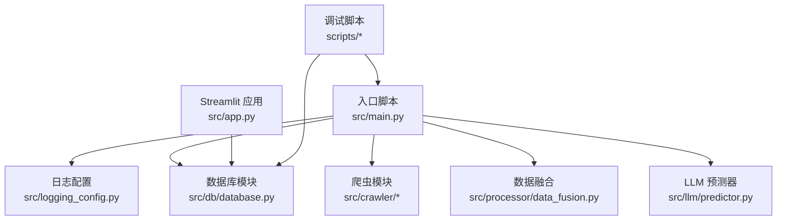
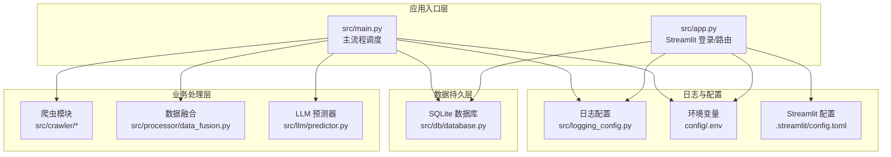
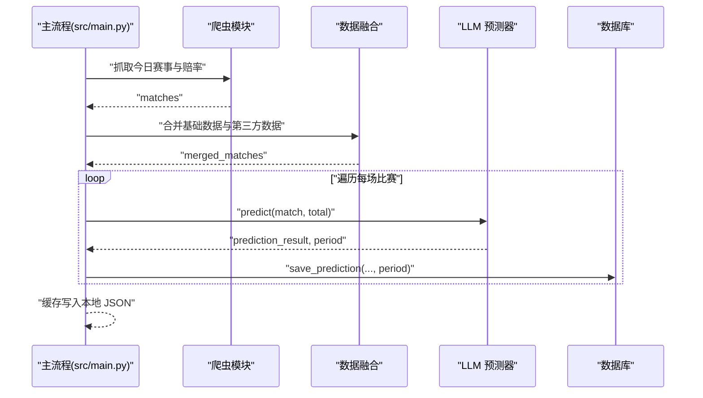
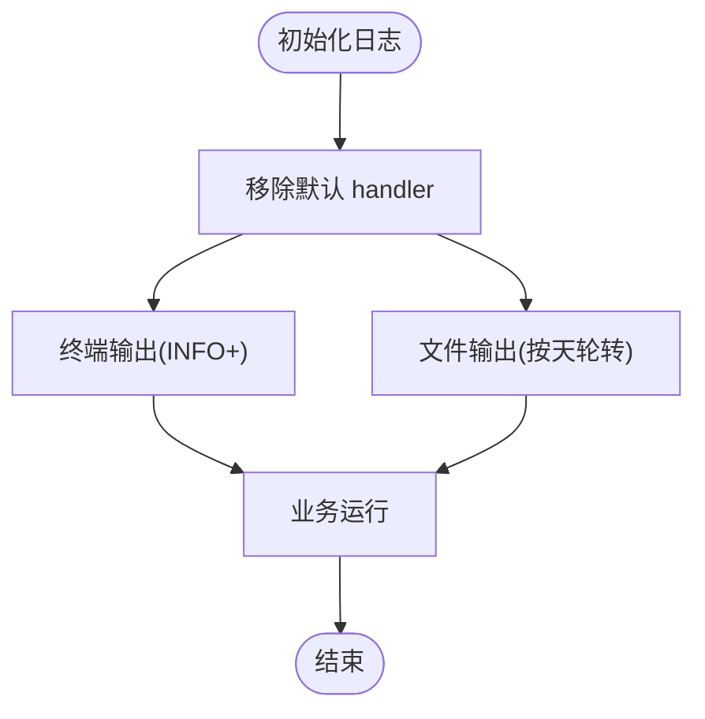
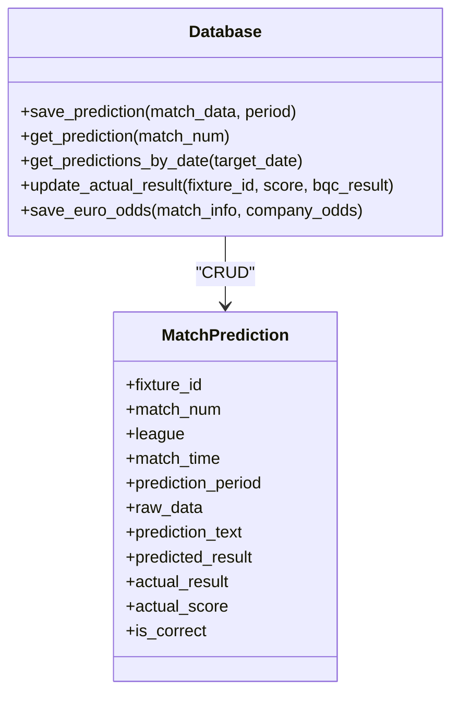
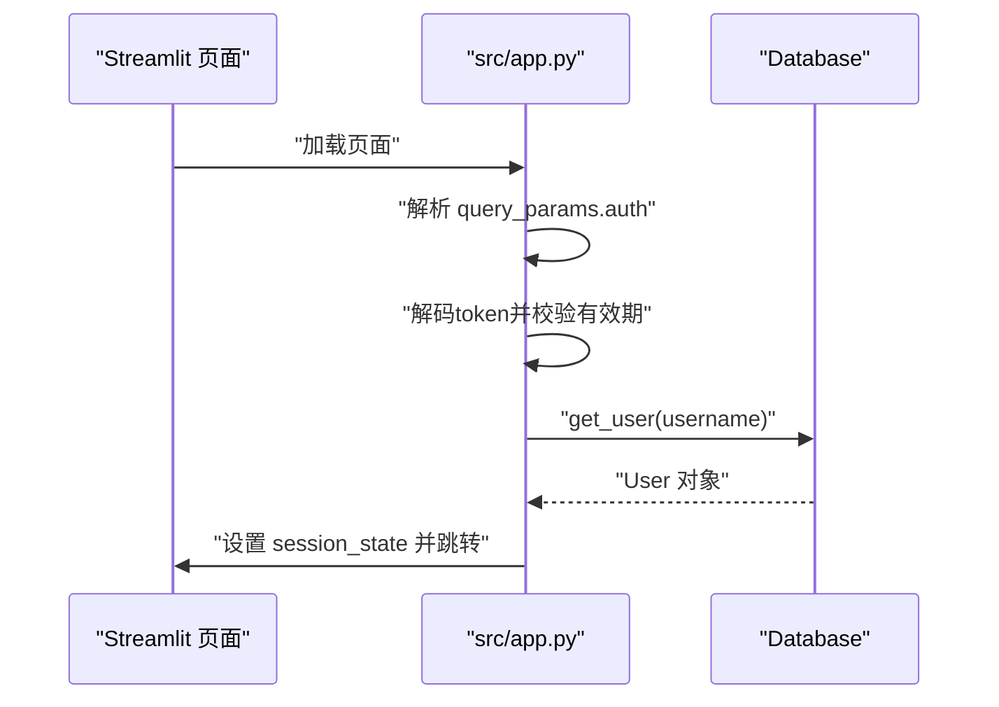
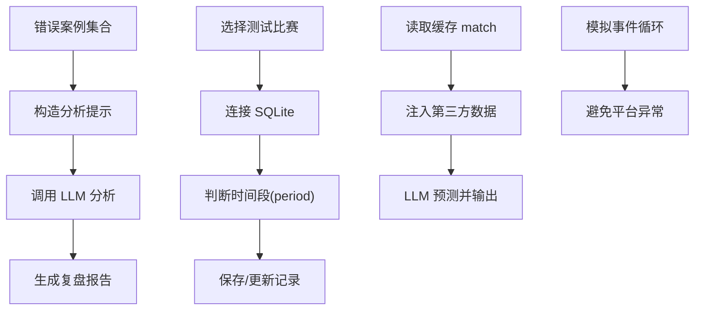
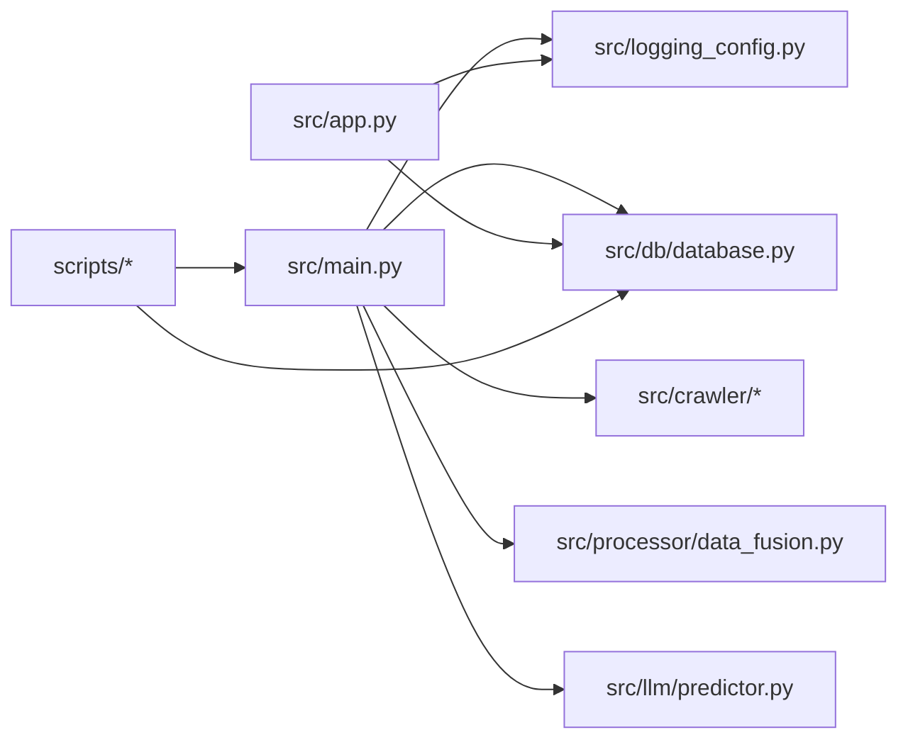

# 调试技巧与性能优化

<cite>
**本文档引用的文件**
- [src/main.py](file://src/main.py)
- [src/app.py](file://src/app.py)
- [src/logging_config.py](file://src/logging_config.py)
- [src/db/database.py](file://src/db/database.py)
- [scripts/test_db.py](file://scripts/test_db.py)
- [scripts/analyze_errors.py](file://scripts/analyze_errors.py)
- [scripts/debug_reprediction.py](file://scripts/debug_reprediction.py)
- [scripts/rerun_007_predict.py](file://scripts/rerun_007_predict.py)
- [scripts/test_streamlit_loop.py](file://scripts/test_streamlit_loop.py)
- [scripts/test_time_period.py](file://scripts/test_time_period.py)
- [src/constants.py](file://src/constants.py)
- [config/.env](file://config/.env)
- [.streamlit/config.toml](file://.streamlit/config.toml)
</cite>

## 目录
1. [简介](#简介)
2. [项目结构](#项目结构)
3. [核心组件](#核心组件)
4. [架构总览](#架构总览)
5. [详细组件分析](#详细组件分析)
6. [依赖关系分析](#依赖关系分析)
7. [性能考量](#性能考量)
8. [故障排查指南](#故障排查指南)
9. [结论](#结论)
10. [附录](#附录)

## 简介
本文件面向调试与性能优化场景，结合项目现有代码与脚本，系统梳理调试工具使用、断点设置、变量检查、日志分析、错误追踪与异常处理最佳实践；同时提供性能瓶颈识别、内存泄漏检测、CPU 使用优化、数据库查询优化、网络请求调优与缓存策略改进方法，并给出生产环境问题排查与监控告警配置建议。

## 项目结构
该项目采用分层与功能模块化组织：入口脚本负责调度爬虫、数据融合、LLM 预测与数据库持久化；Streamlit 页面提供登录与可视化入口；日志配置集中管理；数据库模块封装 ORM 表结构与常用查询；脚本目录提供独立的调试与分析工具。

图表来源
- [src/main.py:34-136](file://src/main.py#L34-L136)
- [src/app.py:110-163](file://src/app.py#L110-L163)
- [src/logging_config.py:8-29](file://src/logging_config.py#L8-L29)
- [src/db/database.py:200-308](file://src/db/database.py#L200-L308)

章节来源
- [src/main.py:1-183](file://src/main.py#L1-L183)
- [src/app.py:1-166](file://src/app.py#L1-L166)
- [src/logging_config.py:1-30](file://src/logging_config.py#L1-L30)
- [src/db/database.py:1-567](file://src/db/database.py#L1-L567)

## 核心组件
- 入口调度与流程控制：负责按阶段执行抓取、数据融合、LLM 预测、缓存写入与数据库持久化。
- 日志系统：统一终端与文件输出，支持按天轮转与保留策略。
- 数据库模块：定义多张表（预测、篮球预测、胜负彩、串关方案、复盘、欧赔历史等），提供保存、查询与更新接口。
- Streamlit 登录与路由：基于 token 的轻量认证与页面跳转。
- 调试脚本：独立工具用于数据库查询、错误归因、重新预测模拟、时间窗口判断与异步事件循环模拟。

章节来源
- [src/main.py:34-136](file://src/main.py#L34-L136)
- [src/logging_config.py:8-29](file://src/logging_config.py#L8-L29)
- [src/db/database.py:200-308](file://src/db/database.py#L200-L308)
- [src/app.py:110-163](file://src/app.py#L110-L163)

## 架构总览
整体流程自上而下分为三层：应用入口层（main/app）、业务处理层（爬虫/融合/LLM）、数据持久层（SQLite）。日志贯穿全链路，调试脚本独立于主流程，便于问题定位与性能验证。

图表来源
- [src/main.py:34-136](file://src/main.py#L34-L136)
- [src/app.py:110-163](file://src/app.py#L110-L163)
- [src/logging_config.py:8-29](file://src/logging_config.py#L8-L29)
- [src/db/database.py:200-308](file://src/db/database.py#L200-L308)
- [config/.env:1-20](file://config/.env#L1-L20)
- [.streamlit/config.toml:1-5](file://.streamlit/config.toml#L1-L5)

## 详细组件分析

### 组件A：主流程调度与阶段化执行
- 关键职责：按阶段执行竞彩/篮球数据抓取、第三方数据注入、数据融合、LLM 预测、缓存写入与数据库持久化。
- 断点与变量检查建议：
  - 在抓取阶段设置断点，检查返回的 matches 是否为空，避免后续空数据传播。
  - 在数据融合后断点检查 merged_matches 结构，确认字段完整性（如盘口、赔率、基本面）。
  - 在 LLM 预测循环中逐条断点，记录 prediction_result 与 period，便于后续重跑与对比。
  - 在数据库保存前断点，核验 fixture_id、prediction_period、raw_data 结构一致性。
- 异常处理：对第三方数据源（如雷速）注入失败进行捕获与降级处理，保证主流程继续执行。

图表来源
- [src/main.py:40-136](file://src/main.py#L40-L136)
- [src/db/database.py:256-304](file://src/db/database.py#L256-L304)

章节来源
- [src/main.py:34-136](file://src/main.py#L34-L136)

### 组件B：日志系统与日志分析
- 日志配置：移除默认 handler，分别输出到终端与文件，按天轮转并保留7天。
- 日志分析建议：
  - 使用日志聚合工具（如集中式日志平台）收集 app.log，按时间窗口统计 ERROR/WARNING 数量。
  - 对关键函数（抓取、融合、预测、保存）打点，形成调用链日志，便于定位耗时与异常。
  - 对异常栈进行结构化输出，配合上下文参数（fixture_id、match_num）进行检索。

图表来源
- [src/logging_config.py:8-29](file://src/logging_config.py#L8-L29)

章节来源
- [src/logging_config.py:8-29](file://src/logging_config.py#L8-L29)

### 组件C：数据库模块与查询优化
- 表结构与职责：用户、比赛预测、篮球预测、胜负彩、串关方案、复盘、欧赔历史等。
- 查询优化要点：
  - 使用索引字段（fixture_id、match_num、target_date）进行过滤，避免全表扫描。
  - 分页/窗口查询：按日期窗口（12:00-次日12:00）获取预测记录，减少结果集大小。
  - 合理使用 ORM 查询链，避免 N+1 查询；必要时使用原生 SQL 批量插入/更新。
  - 列补齐与兼容：对既有 SQLite 库动态补齐列，减少迁移成本。
- 事务与回滚：保存失败时统一 rollback，避免脏数据。

图表来源
- [src/db/database.py:200-308](file://src/db/database.py#L200-L308)
- [src/db/database.py:68-103](file://src/db/database.py#L68-L103)

章节来源
- [src/db/database.py:200-308](file://src/db/database.py#L200-L308)

### 组件D：Streamlit 登录与路由
- 认证机制：基于 base64 编码的 token，携带用户名与时间戳，有效期可配置。
- 路由与跳转：通过 URL 参数 auth 恢复登录状态，进入 Dashboard。
- 调试建议：
  - 在登录校验处断点，检查 token 解码、时间戳有效性与用户有效期。
  - 在页面跳转前打印 session_state 关键字段，确保状态一致。

图表来源
- [src/app.py:64-82](file://src/app.py#L64-L82)
- [src/app.py:94-108](file://src/app.py#L94-L108)
- [src/db/database.py:309-310](file://src/db/database.py#L309-L310)

章节来源
- [src/app.py:64-82](file://src/app.py#L64-L82)
- [src/app.py:94-108](file://src/app.py#L94-L108)
- [src/constants.py:3-4](file://src/constants.py#L3-L4)

### 组件E：调试脚本与问题复盘
- 错误归因分析：读取错误案例，构造 LLM 分析提示，生成复盘报告。
- 重新预测调试：连接 SQLite，模拟时间段判断与记录更新，验证保存逻辑。
- 单场重跑：从缓存读取特定比赛，注入第三方数据，调用 LLM 预测并输出结果。
- 时间段判断：验证比赛时间与当前时间差，确定预测时间段（pre_24h/pre_12h/final）。
- 异步事件循环：模拟 Streamlit 的事件循环策略，避免 Windows 平台异常。

图表来源
- [scripts/analyze_errors.py:13-90](file://scripts/analyze_errors.py#L13-L90)
- [scripts/debug_reprediction.py:15-114](file://scripts/debug_reprediction.py#L15-L114)
- [scripts/rerun_007_predict.py:11-33](file://scripts/rerun_007_predict.py#L11-L33)
- [scripts/test_time_period.py:30-39](file://scripts/test_time_period.py#L30-L39)
- [scripts/test_streamlit_loop.py:7-30](file://scripts/test_streamlit_loop.py#L7-L30)

章节来源
- [scripts/analyze_errors.py:13-90](file://scripts/analyze_errors.py#L13-L90)
- [scripts/debug_reprediction.py:15-114](file://scripts/debug_reprediction.py#L15-L114)
- [scripts/rerun_007_predict.py:11-33](file://scripts/rerun_007_predict.py#L11-L33)
- [scripts/test_time_period.py:30-39](file://scripts/test_time_period.py#L30-L39)
- [scripts/test_streamlit_loop.py:7-30](file://scripts/test_streamlit_loop.py#L7-L30)

## 依赖关系分析
- 入口脚本依赖日志配置、爬虫、数据融合、LLM 预测器与数据库模块。
- Streamlit 应用依赖数据库与日志配置，使用环境变量加载配置。
- 调试脚本独立运行，但可复用数据库与预测器能力。

图表来源
- [src/main.py:25-32](file://src/main.py#L25-L32)
- [src/app.py:25-27](file://src/app.py#L25-L27)
- [src/logging_config.py:8-29](file://src/logging_config.py#L8-L29)
- [src/db/database.py:200-308](file://src/db/database.py#L200-L308)

章节来源
- [src/main.py:25-32](file://src/main.py#L25-L32)
- [src/app.py:25-27](file://src/app.py#L25-L27)

## 性能考量
- CPU 使用优化
  - 预测循环中逐条处理，建议在高并发场景下引入队列与并发限制，避免 LLM API 限流。
  - 对第三方数据抓取与解析进行异步化改造，减少阻塞等待。
- 内存泄漏检测
  - 在长生命周期对象（如 LeisuCrawler）使用后务必关闭资源，确保 finally/try-except 正确释放。
  - 对大型 JSON 缓存读写进行分块处理，避免一次性加载过大对象。
- 数据库查询优化
  - 使用索引字段过滤，避免 LIKE 全模糊；对日期范围查询使用边界索引。
  - 批量插入/更新时使用原生 SQL，减少 ORM 开销。
- 网络请求调优
  - 对外部 API 请求设置超时与重试策略，避免阻塞主流程。
  - 使用连接池与并发限制，防止资源耗尽。
- 缓存策略改进
  - 本地 JSON 缓存用于中间结果，建议增加版本号与校验和，避免脏缓存。
  - 对高频读取的静态数据（如规则、知识库）使用内存缓存与失效策略。

[本节为通用性能指导，不直接分析具体文件，故无章节来源]

## 故障排查指南
- Python 调试工具与断点设置
  - 使用 IDE 断点在关键函数入口与返回处设置，检查输入参数与返回值。
  - 在异常捕获处断点，查看异常类型与堆栈，结合上下文变量定位问题。
- 变量检查方法
  - 在数据融合后断点检查字段完整性（如盘口、赔率、基本面）。
  - 在数据库保存前断点核验 fixture_id、prediction_period、raw_data 结构。
- 日志分析
  - 使用日志聚合工具按时间窗口统计 ERROR/WARNING 数量，定位异常热点。
  - 对关键函数打点，形成调用链日志，便于回溯。
- 错误追踪与异常处理最佳实践
  - 对第三方数据源注入失败进行捕获与降级处理，保证主流程继续执行。
  - 数据库保存失败统一 rollback，避免脏数据。
- 生产环境问题排查与监控告警
  - 建议配置日志告警阈值（如 ERROR 每分钟超过阈值触发告警）。
  - 对数据库慢查询与锁等待进行监控，设置阈值告警。
  - 对 LLM API 调用延迟与错误率进行监控，异常时自动降级或重试。

章节来源
- [src/main.py:54-68](file://src/main.py#L54-L68)
- [src/db/database.py:301-304](file://src/db/database.py#L301-L304)
- [scripts/test_db.py:1-9](file://scripts/test_db.py#L1-L9)

## 结论
通过规范的日志体系、结构化的调试脚本与数据库查询优化，可以有效提升系统的可观测性与稳定性。建议在生产环境中进一步完善监控告警、缓存与异步化改造，持续优化 LLM 调用与第三方数据抓取的性能与可靠性。

## 附录
- 环境变量与配置
  - LLM API 密钥与基础地址、数据库 URL、消息推送配置等集中于 config/.env。
  - Streamlit 配置 headless=true，适合服务端部署。
- 常量与令牌有效期
  - 登录令牌 TTL 可在 constants 中统一配置，便于全局修改。

章节来源
- [config/.env:1-20](file://config/.env#L1-L20)
- [.streamlit/config.toml:1-5](file://.streamlit/config.toml#L1-L5)
- [src/constants.py:3-4](file://src/constants.py#L3-L4)