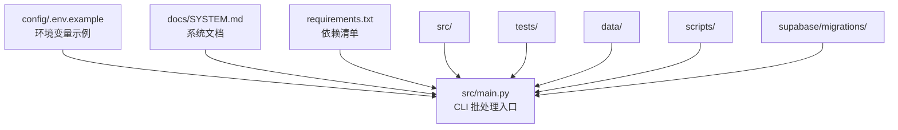
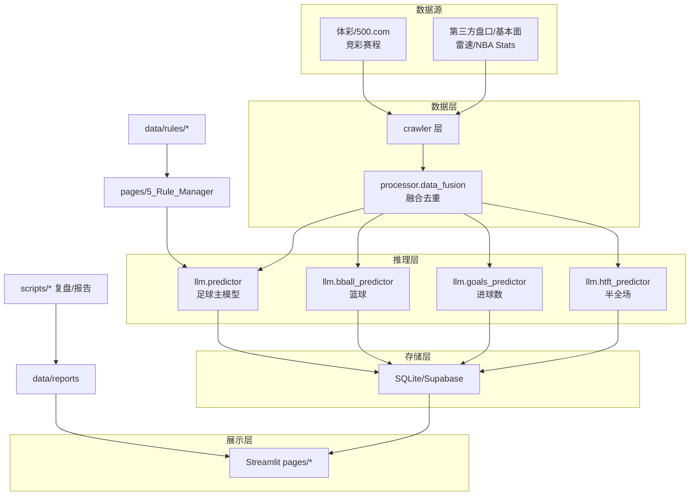
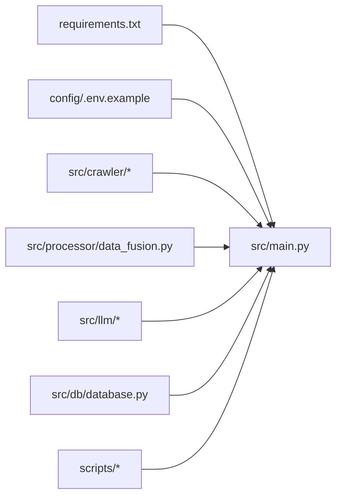

# 贡献流程与协作规范

<cite>
**本文引用的文件**
- [README.md](file://README.md)
- [docs/SYSTEM.md](file://docs/SYSTEM.md)
- [src/main.py](file://src/main.py)
- [requirements.txt](file://requirements.txt)
- [config/.env.example](file://config/.env.example)
- [tests/test_predictor_rules.py](file://tests/test_predictor_rules.py)
- [tests/test_rule_feedback_loop.py](file://tests/test_rule_feedback_loop.py)
</cite>

## 目录
1. [简介](#简介)
2. [项目结构](#项目结构)
3. [核心组件](#核心组件)
4. [架构总览](#架构总览)
5. [详细组件分析](#详细组件分析)
6. [依赖关系分析](#依赖关系分析)
7. [性能考量](#性能考量)
8. [故障排查指南](#故障排查指南)
9. [结论](#结论)
10. [附录](#附录)

## 简介
本文件旨在建立标准化的贡献流程与团队协作规范，覆盖 Git 工作流、分支管理策略、Pull Request（PR）流程、代码审查标准、合并条件、发布流程、问题报告与功能请求流程、版本发布周期、团队沟通与决策机制、冲突解决、文档更新与变更日志维护、以及向后兼容性考虑。文档以现有代码库为依据，结合系统架构与测试实践，形成可落地的协作准则。

## 项目结构
项目采用分层与功能域结合的组织方式：
- config：环境变量与示例配置
- data：运行期数据、报告、规则库与临时产物
- docs：方案、计划、策略与系统文档
- scripts：运维、复盘与一次性分析脚本
- src：核心源码（入口、爬虫、处理器、LLM、数据库、页面、工具）
- tests：单元测试与规则反馈闭环测试
- supabase/migrations：云端迁移脚本
- .streamlit、.vercel：运行时配置与静态站点重写

**图表来源**
- [docs/SYSTEM.md:52-95](file://docs/SYSTEM.md#L52-L95)
- [src/main.py:1-183](file://src/main.py#L1-L183)
- [requirements.txt:1-16](file://requirements.txt#L1-L16)
- [config/.env.example:1-16](file://config/.env.example#L1-L16)

**章节来源**
- [README.md:24-41](file://README.md#L24-L41)
- [docs/SYSTEM.md:52-95](file://docs/SYSTEM.md#L52-L95)

## 核心组件
- 入口层：CLI 批处理入口负责每日预测与落库；Web 登录入口由 Streamlit 提供。
- 数据采集层：多源爬虫抓取竞彩、第三方盘口与基本面数据。
- 处理融合层：统一数据格式、对齐队名、融合多源数据。
- LLM 预测层：基于 Prompt 模板与规则引擎生成预测报告。
- 数据库层：SQLite/可选 Supabase，提供结构化落库与查询。
- 页面层：Streamlit 多页看板，支持复盘、规则管理与篮球看板。
- 工具层：规则注册表、规则草案、敏感词过滤与限流检测。

**章节来源**
- [docs/SYSTEM.md:101-184](file://docs/SYSTEM.md#L101-L184)

## 架构总览
系统采用“数据抓取 + LLM 推理 + 复盘反馈”的闭环架构，支持足球与篮球两条主线流程，具备规则引擎与反馈闭环能力。

**图表来源**
- [docs/SYSTEM.md:26-48](file://docs/SYSTEM.md#L26-L48)
- [src/main.py:34-136](file://src/main.py#L34-L136)

**章节来源**
- [docs/SYSTEM.md:24-48](file://docs/SYSTEM.md#L24-L48)

## 详细组件分析

### Git 工作流与分支管理策略
- 分支命名规范
  - feature/<功能主题>：新功能开发
  - fix/<问题编号或简述>：缺陷修复
  - refactor/<重构范围>：重构分支
  - hotfix/<紧急修复>：紧急线上修复
- 分支保护策略
  - main/master 分支保护：禁止直接推送，必须通过 PR 合并
  - 代码审查：至少一名维护者批准
  - CI/测试：确保通过单元测试与规则反馈闭环测试
- 提交信息规范
  - 格式：类型(作用域): 概述；正文可选；关联 Issue（可选）
  - 类型：feat、fix、docs、style、refactor、perf、test、chore、revert
  - 示例：feat(crawler): 新增欧洲赔率历史抓取脚本；fix(#123): 修复 Leisu 爬虫异常

**章节来源**
- [docs/SYSTEM.md:282-294](file://docs/SYSTEM.md#L282-L294)

### Pull Request 流程与代码审查标准
- PR 创建
  - 选择合适的基线分支（通常为 main）
  - 在标题中标注类型与影响范围（如 [Feature]、[Refactor]）
  - 在描述中说明背景、改动内容、测试方法与潜在风险
- 代码审查要点
  - 逻辑正确性：是否符合业务规则（如规则引擎、仲裁规则）
  - 可测试性：是否新增或完善单元测试
  - 文档同步：是否更新相关文档与注释
  - 兼容性：是否破坏既有接口或行为
- 审查标准
  - 通过所有单元测试与规则反馈闭环测试
  - 通过代码风格检查与依赖扫描
  - 无高危安全漏洞与敏感信息泄露
  - 评审人至少一名维护者同意合并

**章节来源**
- [tests/test_predictor_rules.py:1-800](file://tests/test_predictor_rules.py#L1-L800)
- [tests/test_rule_feedback_loop.py:1-658](file://tests/test_rule_feedback_loop.py#L1-L658)

### 合并条件与发布流程
- 合并条件
  - 通过 CI/自动化测试（pytest）
  - 至少一名维护者批准
  - 无阻塞式冲突
  - 文档与变更日志更新到位
- 发布流程
  - 版本标记：语义化版本（MAJOR.MINOR.PATCH）
  - 变更日志：记录新增、修复、破坏性变更
  - 部署：本地验证后部署至生产环境（Streamlit 服务建议部署于 Windows Server/云主机内网）

**章节来源**
- [docs/SYSTEM.md:277-279](file://docs/SYSTEM.md#L277-L279)

### 问题报告模板与功能请求流程
- 问题报告模板（Issue 模板）
  - 标题：简洁描述问题
  - 环境：操作系统、Python 版本、依赖版本
  - 复现步骤：最小可复现步骤
  - 预期行为与实际行为
  - 日志与截图（如适用）
- 功能请求流程（Feature Request）
  - 描述需求背景与收益
  - 提供验收标准与测试场景
  - 评估对现有架构的影响
  - 通过评审后纳入开发计划

**章节来源**
- [docs/SYSTEM.md:282-294](file://docs/SYSTEM.md#L282-L294)

### 版本发布周期与里程碑
- 周期：建议按月发布稳定版本，紧急修复可 hotfix
- 里程碑：每个版本对应一个发布说明，记录变更与回归测试结果
- 回归测试：每次发布前执行关键路径测试（预测、规则、复盘）

**章节来源**
- [docs/SYSTEM.md:282-294](file://docs/SYSTEM.md#L282-L294)

### 团队沟通渠道、决策流程与冲突解决
- 沟通渠道
  - Slack/Teams/钉钉群：日常沟通与问题讨论
  - GitHub Discussions：开放性问题与方案讨论
- 决策流程
  - 小范围决策：负责人拍板
  - 影响面广的变更：提交评审会议，形成决议
- 冲突解决
  - 优先协商与代码评审
  - 无法达成共识时，由技术负责人裁决

**章节来源**
- [docs/SYSTEM.md:282-294](file://docs/SYSTEM.md#L282-L294)

### 文档更新要求、变更日志维护与向后兼容性
- 文档更新要求
  - 新功能与配置变更需同步更新 docs/SYSTEM.md 与 README.md
  - API 变更需更新接口说明与示例
- 变更日志维护
  - 每次发布更新 CHANGELOG 或在 release notes 中记录
  - 包含新增、修复、破坏性变更与迁移指南
- 向后兼容性
  - 遵循语义化版本，破坏性变更提升 MAJOR 版本
  - 保持数据库 Schema 的兼容性，必要时提供迁移脚本

**章节来源**
- [docs/SYSTEM.md:297-320](file://docs/SYSTEM.md#L297-L320)

## 依赖关系分析
- 运行时依赖：requests、beautifulsoup4、pandas、openai、sqlalchemy、python-dotenv、streamlit、schedule、loguru、playwright、nest_asyncio、simpleeval、openpyxl
- 环境变量：LLM_API_KEY、LLM_API_BASE、LLM_MODEL、ENABLE_LEISU、DATABASE_URL 等
- 关键路径：CLI 入口（src/main.py）串联爬虫、融合、LLM、数据库与报告脚本

**图表来源**
- [requirements.txt:1-16](file://requirements.txt#L1-L16)
- [config/.env.example:1-16](file://config/.env.example#L1-L16)
- [src/main.py:25-32](file://src/main.py#L25-L32)

**章节来源**
- [requirements.txt:1-16](file://requirements.txt#L1-L16)
- [config/.env.example:1-16](file://config/.env.example#L1-L16)
- [src/main.py:25-32](file://src/main.py#L25-L32)

## 性能考量
- 数据抓取与解析：合理设置并发与重试，避免对第三方 API 造成压力
- LLM 调用：控制 Prompt 长度与上下文，减少 Token 消耗
- 数据库写入：批量插入与事务控制，降低 I/O 开销
- 缓存策略：利用 data/today_matches.json 等缓存文件，支持断点续跑

**章节来源**
- [src/main.py:102-126](file://src/main.py#L102-L126)

## 故障排查指南
- 环境配置
  - 确认 config/.env 中 LLM 与数据库配置正确
  - 安装 Playwright 依赖以启用 Leisu 爬虫
- 预测流程
  - 检查 CLI 入口是否正常抓取赛程与盘口数据
  - 核对数据库连接与表结构
- 规则与仲裁
  - 确认 data/rules/* 是否存在且格式正确
  - 运行规则反馈闭环测试，验证仲裁规则生效
- 复盘与报告
  - 检查 scripts/* 输出是否生成报告与 CSV
  - 核对 Streamlit 页面是否正常加载

**章节来源**
- [docs/SYSTEM.md:237-294](file://docs/SYSTEM.md#L237-L294)
- [tests/test_rule_feedback_loop.py:1-658](file://tests/test_rule_feedback_loop.py#L1-L658)

## 结论
本文基于现有代码库与系统文档，建立了标准化的贡献流程与协作规范，明确了 Git 工作流、分支策略、PR 流程、代码审查标准、合并条件、发布流程、问题与功能请求流程、沟通与决策机制、冲突解决、文档与变更日志维护以及向后兼容性要求。建议团队在实践中持续优化流程，确保高质量交付与可持续演进。

## 附录
- 关键路径速查：规则管理、数据库迁移、页面扩展、日志调整等

**章节来源**
- [docs/SYSTEM.md:310-320](file://docs/SYSTEM.md#L310-L320)