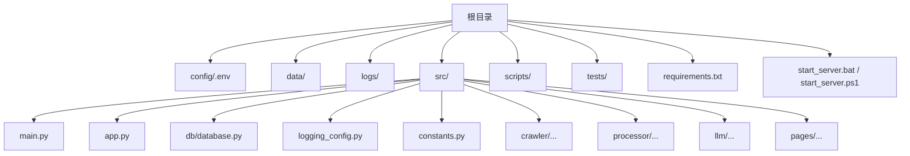
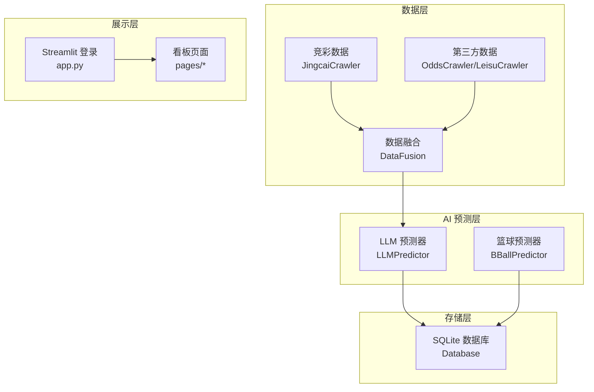
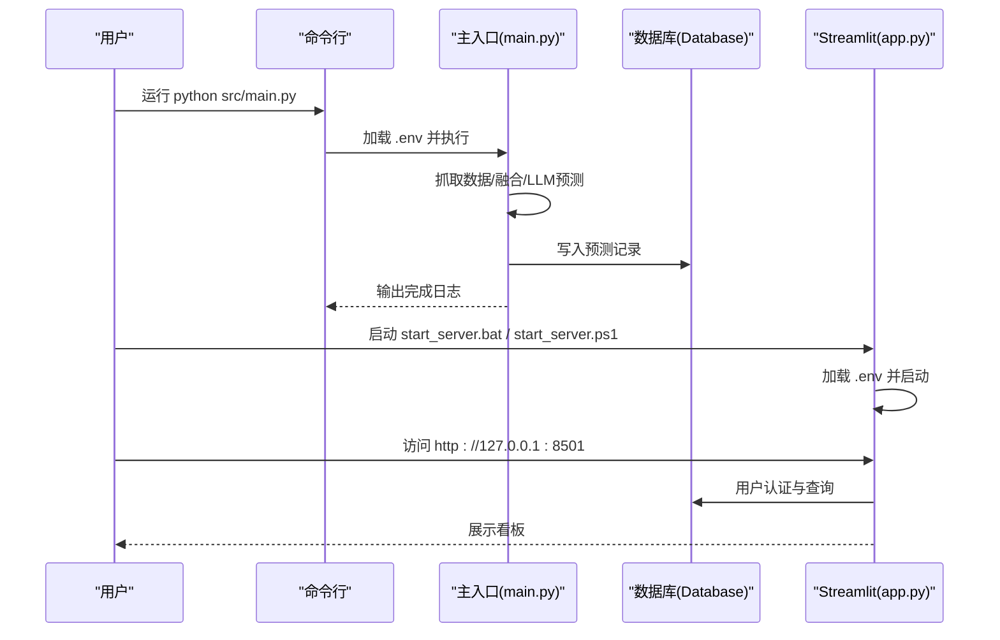
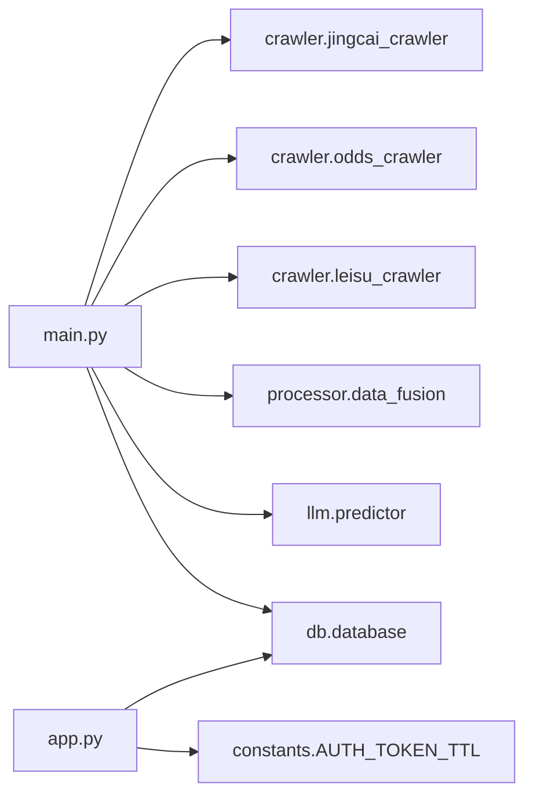

# 快速开始

<cite>
**本文引用的文件**   
- [README.md](file://README.md)
- [requirements.txt](file://requirements.txt)
- [src/main.py](file://src/main.py)
- [src/app.py](file://src/app.py)
- [src/db/database.py](file://src/db/database.py)
- [src/logging_config.py](file://src/logging_config.py)
- [src/constants.py](file://src/constants.py)
- [start_server.bat](file://start_server.bat)
- [start_server.ps1](file://start_server.ps1)
- [scripts/test_db.py](file://scripts/test_db.py)
</cite>

## 目录
1. [简介](#简介)
2. [项目结构](#项目结构)
3. [核心组件](#核心组件)
4. [架构总览](#架构总览)
5. [详细组件分析](#详细组件分析)
6. [依赖关系分析](#依赖关系分析)
7. [性能注意事项](#性能注意事项)
8. [故障排除指南](#故障排除指南)
9. [结论](#结论)
10. [附录](#附录)

## 简介
本指南面向首次接触“足球预测系统”的用户，帮助你在最短时间内完成环境搭建、依赖安装、数据库初始化与配置文件设置，并成功启动系统、运行一次完整流程以及验证首次运行结果。系统支持：
- 自动抓取竞彩赛事与赔率数据
- 融合第三方基本面与盘口数据
- 使用大语言模型进行预测
- 将预测结果写入 SQLite 数据库
- 可选的 Streamlit Web 界面登录与看板访问

## 项目结构
该仓库采用按功能分层的组织方式，核心目录与职责如下：
- config：存放配置文件（如 .env）
- data：本地数据缓存（JSON、Excel 等）
- logs：日志文件
- src：源代码
  - crawler：数据抓取模块（竞彩、第三方数据源）
  - processor：数据清洗与融合
  - llm：LLM 预测引擎
  - db：数据库 ORM 与表结构定义
  - pages：Streamlit 页面
  - main.py：主流程入口
  - app.py：Streamlit 登录与看板入口
- scripts：辅助脚本（如数据库测试）
- tests：单元测试
- requirements.txt：Python 依赖清单
- 启动脚本：start_server.bat / start_server.ps1

图表来源
- [src/main.py:1-183](file://src/main.py#L1-L183)
- [src/app.py:1-166](file://src/app.py#L1-L166)
- [src/db/database.py:1-567](file://src/db/database.py#L1-L567)
- [src/logging_config.py:1-30](file://src/logging_config.py#L1-L30)
- [src/constants.py:1-5](file://src/constants.py#L1-L5)

章节来源
- [README.md:24-41](file://README.md#L24-L41)
- [requirements.txt:1-16](file://requirements.txt#L1-L16)

## 核心组件
- 数据采集与融合：抓取竞彩与第三方数据，进行清洗与融合，输出结构化 JSON 缓存
- 大语言模型预测：调用 LLM 进行推理分析，提取竞彩推荐与信心指数
- 数据库存储：将预测结果写入 SQLite 表，支持足球、篮球、胜负彩等多类记录
- Web 界面：Streamlit 登录与看板，基于用户授权与令牌跳转

章节来源
- [src/main.py:34-136](file://src/main.py#L34-L136)
- [src/db/database.py:200-308](file://src/db/database.py#L200-L308)
- [src/app.py:94-109](file://src/app.py#L94-L109)

## 架构总览
系统采用“数据采集 → 数据融合 → LLM 预测 → 存储 → 展示”的流水线式架构。主流程在主入口执行，Web 登录入口负责用户认证与页面跳转。

图表来源
- [src/main.py:25-32](file://src/main.py#L25-L32)
- [src/db/database.py:200-308](file://src/db/database.py#L200-L308)
- [src/app.py:110-166](file://src/app.py#L110-L166)

## 详细组件分析

### 环境与依赖安装
- Python 环境
  - 建议使用 Python 3.10+，确保与项目依赖兼容
  - 创建虚拟环境（venv）并激活
- 安装依赖
  - 使用 pip 安装 requirements.txt 中列出的包
- 依赖说明（节选）
  - requests、beautifulsoup4：网页抓取
  - pandas、openpyxl：Excel 读取
  - openai：LLM 调用
  - sqlalchemy：数据库 ORM
  - python-dotenv：加载 .env
  - streamlit：Web 界面
  - schedule、loguru：调度与日志
  - playwright、nest_asyncio：自动化与事件循环
  - simpleeval：表达式求值

章节来源
- [requirements.txt:1-16](file://requirements.txt#L1-L16)

### 配置文件设置
- .env（位于 config/.env）
  - 用途：存放 LLM API 密钥、数据库连接等敏感信息
  - 加载位置：主入口与 Web 入口均显式加载 .env
  - 建议项（示例）
    - OPENAI_API_KEY：LLM API 密钥
    - ENABLE_LEISU：是否启用雷速数据抓取（1/0）
    - DATABASE_URL：数据库连接（可省略，默认 SQLite）
  - 加载路径
    - 主入口：加载 config/.env
    - Web 入口：加载 config/.env

章节来源
- [src/main.py:179-182](file://src/main.py#L179-L182)
- [src/app.py:19-23](file://src/app.py#L19-L23)

### 数据库初始化与表结构
- 数据库类型：SQLite
- 初始化策略
  - 首次连接时自动创建表（如 match_predictions、basketball_predictions 等）
  - 支持动态补列（运行期检测并添加缺失列）
- 关键表
  - match_predictions：足球预测记录
  - basketball_predictions：篮球预测记录
  - users：用户表（用于 Streamlit 登录）
  - 其他：胜负彩、串关方案、复盘、欧赔历史等
- 数据库文件位置
  - data/football.db（相对项目根目录）

章节来源
- [src/db/database.py:200-233](file://src/db/database.py#L200-L233)
- [src/db/database.py:68-126](file://src/db/database.py#L68-L126)
- [src/db/database.py:502-539](file://src/db/database.py#L502-L539)

### 系统启动方法
- 命令行运行主流程
  - 执行主入口：python src/main.py
  - 作用：抓取数据、融合、LLM 预测、写入数据库
- 启动 Web 界面
  - Windows 批处理：start_server.bat
  - Windows PowerShell：start_server.ps1
  - 作用：启动 Streamlit 服务器（默认端口 8501），指向 src/app.py

章节来源
- [src/main.py:178-183](file://src/main.py#L178-L183)
- [start_server.bat:1-13](file://start_server.bat#L1-L13)
- [start_server.ps1:1-10](file://start_server.ps1#L1-L10)

### 基本使用流程
- 运行主流程
  - 执行 python src/main.py
  - 观察日志输出，确认各阶段完成（抓取、融合、预测、入库）
- 查看预测结果
  - 本地 JSON 缓存：data/today_matches.json（足球）、data/today_bball_matches.json（篮球）
  - 数据库：SQLite 表中记录
- 启动 Web 界面
  - 运行 start_server.bat 或 start_server.ps1
  - 浏览器访问 http://127.0.0.1:8501
  - 输入授权账号登录，跳转至 Dashboard

图表来源
- [src/main.py:34-136](file://src/main.py#L34-L136)
- [src/db/database.py:200-308](file://src/db/database.py#L200-L308)
- [src/app.py:110-166](file://src/app.py#L110-L166)

### 首次运行验证步骤
- 检查日志
  - logs/app.log 是否生成 INFO 级别日志
- 检查缓存
  - data/today_matches.json 是否生成
  - data/today_bball_matches.json（如有篮球比赛）是否生成
- 检查数据库
  - data/football.db 是否创建
  - 查询最近预测记录（见“故障排除指南”中的数据库测试脚本）
- 登录验证
  - 访问 http://127.0.0.1:8501
  - 使用授权账号登录，跳转 Dashboard

章节来源
- [src/logging_config.py:8-30](file://src/logging_config.py#L8-L30)
- [scripts/test_db.py:1-9](file://scripts/test_db.py#L1-L9)

## 依赖关系分析
- 模块耦合
  - main.py 作为编排入口，依赖爬虫、融合、LLM、数据库模块
  - app.py 依赖数据库与常量，负责用户认证与页面跳转
  - database.py 作为 ORM 层，被 main 与 app 共同使用
- 外部依赖
  - LLM API（OpenAI 等）
  - 第三方数据源（竞彩、第三方网站）
  - Playwright（可选，用于某些爬虫场景）

图表来源
- [src/main.py:25-32](file://src/main.py#L25-L32)
- [src/app.py:29-31](file://src/app.py#L29-L31)
- [src/db/database.py:200-308](file://src/db/database.py#L200-L308)
- [src/constants.py:3-4](file://src/constants.py#L3-L4)

## 性能注意事项
- 数据抓取与 LLM 调用为 IO 密集型，建议合理控制并发与重试
- SQLite 在高并发写入时可能成为瓶颈，生产场景建议迁移到更健壮的数据库
- 日志轮转与保留策略已在日志配置中设置，注意磁盘空间占用
- Windows 下事件循环兼容性已在入口处处理，避免子进程异常

## 故障排除指南
- 无法找到 .env
  - 确认 config/.env 是否存在，且主入口与 Web 入口均会加载
- LLM 调用失败
  - 检查 OPENAI_API_KEY 是否正确配置
- 数据库未创建或列缺失
  - 首次运行会自动创建表；若缺少列，系统会在运行期尝试补列
- 无法启动 Web 界面
  - 确认端口 8501 未被占用
  - 确认 venv 已激活，依赖已安装
- 验证数据库
  - 使用 scripts/test_db.py 查看数据库中记录的时间范围与条目

章节来源
- [src/main.py:179-182](file://src/main.py#L179-L182)
- [src/app.py:19-23](file://src/app.py#L19-L23)
- [src/db/database.py:200-233](file://src/db/database.py#L200-L233)
- [scripts/test_db.py:1-9](file://scripts/test_db.py#L1-L9)

## 结论
按照本指南完成环境与依赖安装、配置文件设置、数据库初始化后，你可以在命令行运行主流程，查看本地缓存与数据库结果；也可启动 Web 界面进行登录与看板访问。遇到问题时，可依据“故障排除指南”逐项排查。

## 附录
- 环境检查清单
  - Python 版本满足要求，虚拟环境已激活
  - requirements.txt 已安装
  - config/.env 已创建并填写必要参数
  - data/football.db 已生成
  - logs/app.log 可写
  - data/today_matches.json 已生成
  - Web 界面可访问（端口 8501）