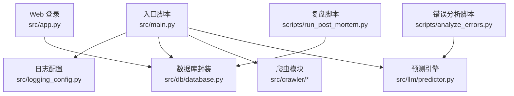
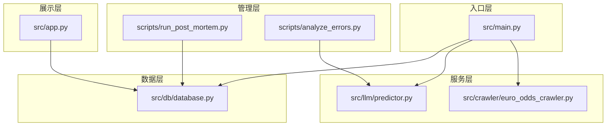
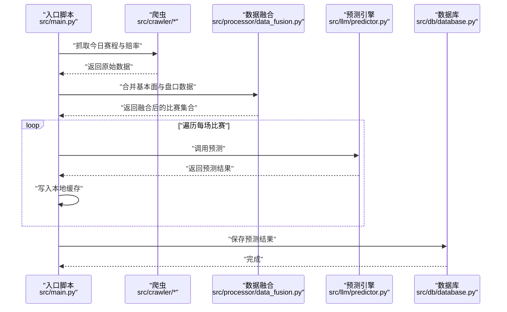
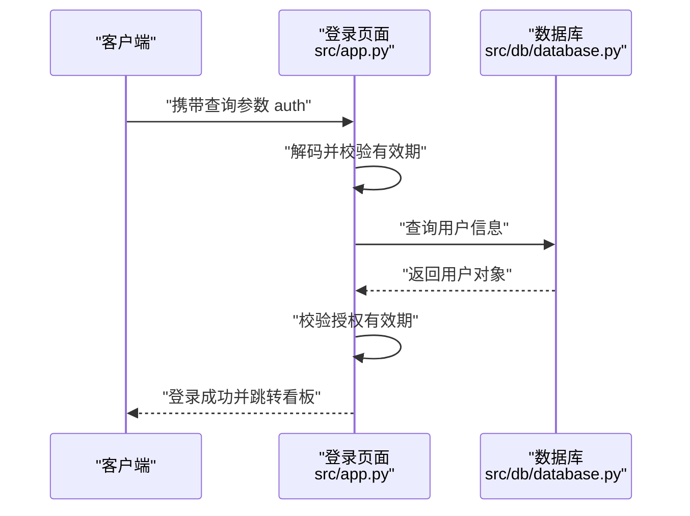
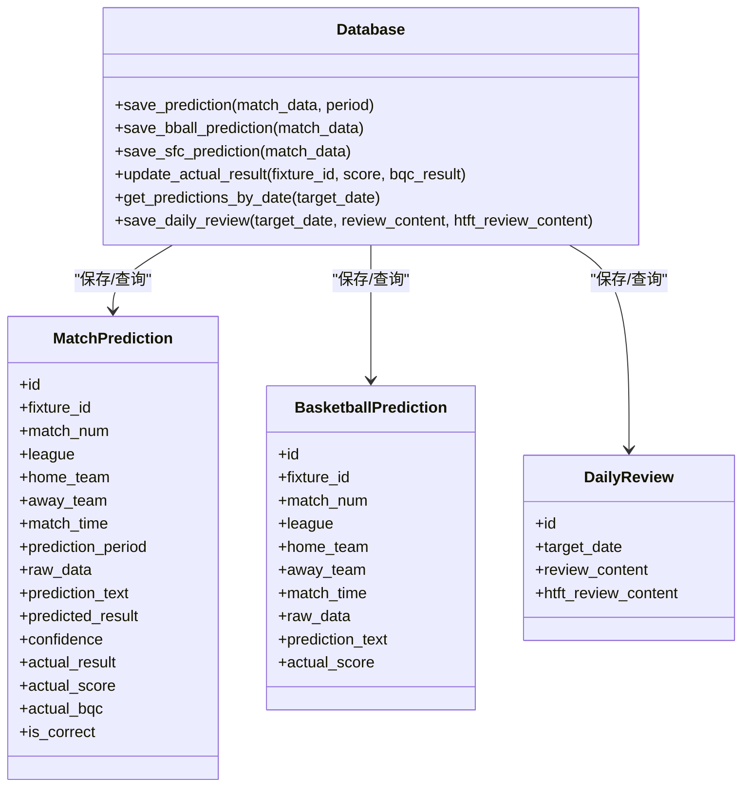
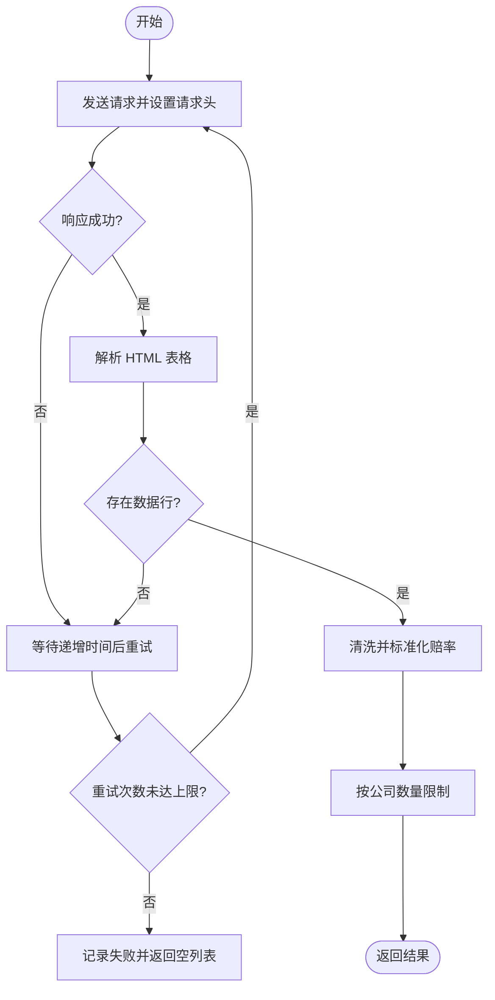
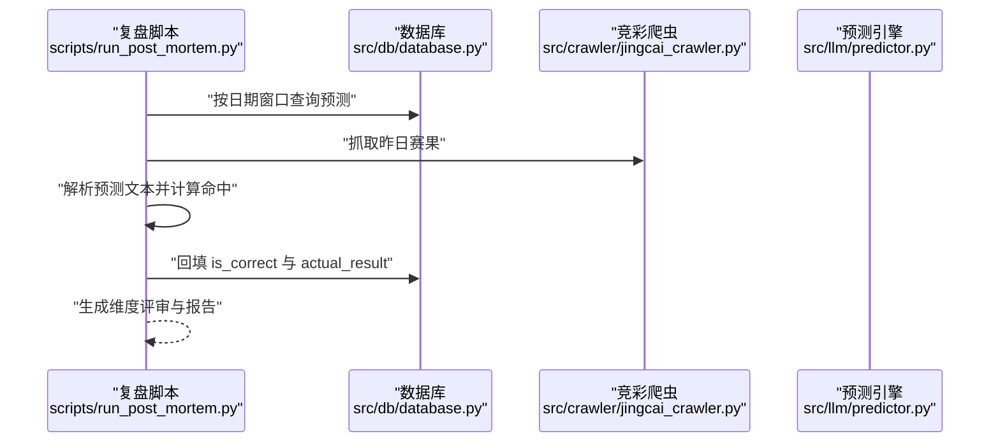
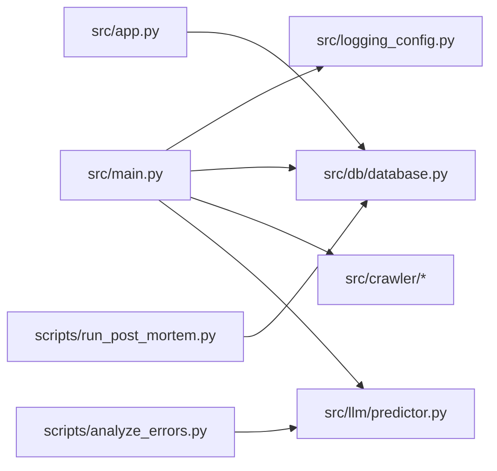

# 故障排除与FAQ

<cite>
**本文引用的文件**
- [src/main.py](file://src/main.py)
- [src/app.py](file://src/app.py)
- [src/logging_config.py](file://src/logging_config.py)
- [src/db/database.py](file://src/db/database.py)
- [src/crawler/euro_odds_crawler.py](file://src/crawler/euro_odds_crawler.py)
- [src/llm/predictor.py](file://src/llm/predictor.py)
- [scripts/run_post_mortem.py](file://scripts/run_post_mortem.py)
- [scripts/analyze_errors.py](file://scripts/analyze_errors.py)
- [scripts/test_db.py](file://scripts/test_db.py)
- [src/constants.py](file://src/constants.py)
</cite>

## 目录
1. [简介](#简介)
2. [项目结构](#项目结构)
3. [核心组件](#核心组件)
4. [架构总览](#架构总览)
5. [详细组件分析](#详细组件分析)
6. [依赖关系分析](#依赖关系分析)
7. [性能考虑](#性能考虑)
8. [故障排除指南](#故障排除指南)
9. [结论](#结论)
10. [附录](#附录)

## 简介
本文件面向使用者与管理员，提供系统故障排除与常见问题解答（FAQ）。内容涵盖：
- 常见错误的诊断方法、解决方案与预防措施
- 系统性能问题排查流程、优化建议与最佳实践
- 网络连接问题、数据同步异常与预测准确性下降的处理方法
- 日志分析技巧、调试工具使用与问题定位方法
- 系统升级、数据迁移与配置变更的风险评估与操作指引

## 项目结构
系统主要由以下模块构成：
- 入口与调度：src/main.py 负责每日任务编排（抓取、融合、预测、入库）
- Web 登录与鉴权：src/app.py 提供登录界面与会话管理
- 日志系统：src/logging_config.py 统一日志输出与轮转
- 数据库：src/db/database.py 提供预测、赛果、复盘等数据的持久化
- 爬虫：src/crawler/euro_odds_crawler.py 等负责第三方数据抓取
- 预测引擎：src/llm/predictor.py 负责提示工程与预测推理
- 复盘与分析：scripts/run_post_mortem.py、scripts/analyze_errors.py 等用于事后分析与优化
- 常量：src/constants.py 统一配置常量（如鉴权令牌有效期）

**图表来源**
- [src/main.py:34-136](file://src/main.py#L34-L136)
- [src/app.py:25-82](file://src/app.py#L25-L82)
- [src/logging_config.py:8-29](file://src/logging_config.py#L8-L29)
- [src/db/database.py:200-308](file://src/db/database.py#L200-L308)
- [src/crawler/euro_odds_crawler.py:17-111](file://src/crawler/euro_odds_crawler.py#L17-L111)
- [src/llm/predictor.py:20-46](file://src/llm/predictor.py#L20-L46)
- [scripts/run_post_mortem.py:284-492](file://scripts/run_post_mortem.py#L284-L492)
- [scripts/analyze_errors.py:13-90](file://scripts/analyze_errors.py#L13-L90)

**章节来源**
- [src/main.py:34-136](file://src/main.py#L34-L136)
- [src/app.py:25-82](file://src/app.py#L25-L82)
- [src/logging_config.py:8-29](file://src/logging_config.py#L8-L29)
- [src/db/database.py:200-308](file://src/db/database.py#L200-L308)
- [src/crawler/euro_odds_crawler.py:17-111](file://src/crawler/euro_odds_crawler.py#L17-L111)
- [src/llm/predictor.py:20-46](file://src/llm/predictor.py#L20-L46)
- [scripts/run_post_mortem.py:284-492](file://scripts/run_post_mortem.py#L284-L492)
- [scripts/analyze_errors.py:13-90](file://scripts/analyze_errors.py#L13-L90)

## 核心组件
- 任务编排器：负责抓取竞彩赛程与赔率、融合第三方数据、调用大模型预测、写入数据库与缓存
- 登录与鉴权：基于查询参数的临时令牌，结合数据库用户信息进行权限校验
- 日志系统：终端与文件双通道输出，按日轮转与保留策略
- 数据库层：统一的 ORM 封装，支持预测、赛果、复盘、串关方案等多表操作
- 爬虫层：针对第三方数据源（如欧赔）的稳定抓取与重试机制
- 预测引擎：基于规则与提示工程的大模型推理，具备盘口/市场锚点与微观信号检测能力
- 复盘与分析：自动化准确率统计、维度评审、仲裁误判分析与报告生成

**章节来源**
- [src/main.py:34-136](file://src/main.py#L34-L136)
- [src/app.py:64-82](file://src/app.py#L64-L82)
- [src/logging_config.py:8-29](file://src/logging_config.py#L8-L29)
- [src/db/database.py:200-308](file://src/db/database.py#L200-L308)
- [src/crawler/euro_odds_crawler.py:17-111](file://src/crawler/euro_odds_crawler.py#L17-L111)
- [src/llm/predictor.py:20-46](file://src/llm/predictor.py#L20-L46)
- [scripts/run_post_mortem.py:253-492](file://scripts/run_post_mortem.py#L253-L492)
- [scripts/analyze_errors.py:13-90](file://scripts/analyze_errors.py#L13-L90)

## 架构总览
系统采用“入口编排 + 多模块协作”的分层架构：
- 入口层：src/main.py 串联抓取、融合、预测与入库
- 数据层：src/db/database.py 统一访问 SQLite
- 服务层：src/crawler/* 与 src/llm/predictor.py 提供数据与推理能力
- 管理层：scripts/* 提供复盘、分析与运维辅助工具
- 展示层：src/app.py 提供登录与会话管理

**图表来源**
- [src/main.py:34-136](file://src/main.py#L34-L136)
- [src/crawler/euro_odds_crawler.py:17-111](file://src/crawler/euro_odds_crawler.py#L17-L111)
- [src/llm/predictor.py:20-46](file://src/llm/predictor.py#L20-L46)
- [src/db/database.py:200-308](file://src/db/database.py#L200-L308)
- [scripts/run_post_mortem.py:284-492](file://scripts/run_post_mortem.py#L284-L492)
- [scripts/analyze_errors.py:13-90](file://scripts/analyze_errors.py#L13-L90)
- [src/app.py:25-82](file://src/app.py#L25-L82)

## 详细组件分析

### 组件A：任务编排与数据流
- 关键流程
  - 抓取竞彩赛程与赔率
  - 抓取第三方基本面与盘口数据并融合
  - 读取 Excel 补充进球盘口/差异/倾向
  - 调用大模型进行预测并回写缓存
  - 存储预测结果至数据库
  - 篮球预测流程类似，分别处理足球与篮球
- 常见问题
  - 无比赛或抓取失败：检查竞彩接口可用性与网络代理
  - 雷速数据注入失败：确认 ENABLE_LEISU 环境变量与浏览器驱动
  - Excel 读取失败：确认路径与编码，避免 NaN 导致字段为空
  - 缓存写入失败：确认 data 目录可写
  - 数据库保存失败：检查事务回滚与异常捕获
- 优化建议
  - 对第三方接口增加指数退避重试
  - 对大模型调用设置超时与并发上限
  - 将预测结果增量写入，减少磁盘 IO

**图表来源**
- [src/main.py:40-136](file://src/main.py#L40-L136)
- [src/db/database.py:256-304](file://src/db/database.py#L256-L304)

**章节来源**
- [src/main.py:40-136](file://src/main.py#L40-L136)
- [src/db/database.py:256-304](file://src/db/database.py#L256-L304)

### 组件B：登录与鉴权
- 登录流程
  - 从查询参数解码临时令牌，校验有效期与用户状态
  - 成功后写入会话状态并跳转看板
- 常见问题
  - 令牌过期：AUTH_TOKEN_TTL 默认 8 小时，需重新登录
  - 用户不存在或密码错误：检查数据库用户记录与哈希
  - 授权到期：核对 valid_until 字段
- 优化建议
  - 前端自动刷新令牌或提供一键续期
  - 增加登录失败次数限制与风控

**图表来源**
- [src/app.py:64-82](file://src/app.py#L64-L82)
- [src/db/database.py:309-310](file://src/db/database.py#L309-L310)
- [src/constants.py:3-4](file://src/constants.py#L3-L4)

**章节来源**
- [src/app.py:64-82](file://src/app.py#L64-L82)
- [src/db/database.py:309-310](file://src/db/database.py#L309-L310)
- [src/constants.py:3-4](file://src/constants.py#L3-L4)

### 组件C：日志系统
- 特性
  - 终端输出 INFO 级别以上，彩色高亮
  - 文件输出按日轮转，保留 7 天
  - 初始化幂等，避免重复 handler
- 常见问题
  - 日志目录不存在：确认 logs 目录权限
  - 输出重复：确保移除了默认 handler
- 优化建议
  - 生产环境可降低终端输出级别
  - 增加结构化字段（trace_id、task_id）

**章节来源**
- [src/logging_config.py:8-29](file://src/logging_config.py#L8-L29)

### 组件D：数据库层
- 支持功能
  - 预测记录保存与更新（含时间段标识）
  - 赛果回填与一致性校验
  - 复盘、串关方案、欧赔历史等多表操作
  - 日期窗口查询与优先级合并
- 常见问题
  - 列缺失：首次运行自动补齐列
  - 事务回滚：捕获异常并回滚，避免脏数据
  - 查询超时：合理设置超时与索引
- 优化建议
  - 为常用查询字段建立索引
  - 批量写入时使用事务

**图表来源**
- [src/db/database.py:200-308](file://src/db/database.py#L200-L308)
- [src/db/database.py:451-478](file://src/db/database.py#L451-L478)

**章节来源**
- [src/db/database.py:200-308](file://src/db/database.py#L200-L308)
- [src/db/database.py:451-478](file://src/db/database.py#L451-L478)

### 组件E：爬虫与网络
- 欧赔爬虫
  - 重试与延迟：内置递增等待与最大重试次数
  - 限流与编码：设置请求头与 GB2312 编码
  - 数据清洗：提取表格行并过滤无效赔率
- 常见问题
  - datatb 未找到：可能被限流或页面结构变化
  - 无数据行：目标比赛尚未开盘或数据未更新
  - 赔率格式不符：正则校验失败时跳过该条
- 优化建议
  - 增加随机 UA 与 Cookie
  - 对特定公司做白名单过滤

**图表来源**
- [src/crawler/euro_odds_crawler.py:17-111](file://src/crawler/euro_odds_crawler.py#L17-L111)

**章节来源**
- [src/crawler/euro_odds_crawler.py:17-111](file://src/crawler/euro_odds_crawler.py#L17-L111)

### 组件F：预测引擎与规则
- 规则与提示工程
  - 动态规则拼接：按盘型、联赛、市场变化与资金流向构建提示
  - 市场锚点：亚赔让球方与欧赔实力方的统一口径
  - 微观信号：超深盘死水、半球生死盘、平手僵持、欧亚背离等预警
- 常见问题
  - API 密钥缺失：检查 .env 中 LLM_API_KEY 与 LLM_API_BASE
  - 模型调用失败：网络不稳定或超时，建议增加重试
  - 规则冲突：通过动态规则减少上下文负担，避免冲突
- 优化建议
  - 对长提示进行分段与摘要
  - 增加规则版本控制与灰度发布

**章节来源**
- [src/llm/predictor.py:20-46](file://src/llm/predictor.py#L20-L46)
- [src/llm/predictor.py:51-79](file://src/llm/predictor.py#L51-L79)
- [src/llm/predictor.py:700-715](file://src/llm/predictor.py#L700-L715)

### 组件G：复盘与分析
- 复盘流程
  - 从数据库抽取目标日期预测记录
  - 从竞彩抓取赛果并回填
  - 解析预测文本，计算命中与否
  - 维度评审与仲裁误判分析
  - 生成准确率报告与维度评审
- 常见问题
  - 查询不到预测记录：确认日期窗口与 fixture_id 匹配
  - 赛果为空：可能未更新或接口不可用
  - 命中判定误判：修复 AI 幻觉与让球方向识别
- 优化建议
  - 增加幂等写入与去重
  - 对维度评审结果进行可视化汇总

**图表来源**
- [scripts/run_post_mortem.py:284-492](file://scripts/run_post_mortem.py#L284-L492)
- [scripts/run_post_mortem.py:494-800](file://scripts/run_post_mortem.py#L494-L800)

**章节来源**
- [scripts/run_post_mortem.py:284-492](file://scripts/run_post_mortem.py#L284-L492)
- [scripts/run_post_mortem.py:494-800](file://scripts/run_post_mortem.py#L494-L800)

## 依赖关系分析
- 组件耦合
  - 入口脚本依赖日志、爬虫、融合、预测与数据库
  - 登录页面依赖数据库与常量
  - 复盘脚本依赖数据库与预测引擎
- 外部依赖
  - requests、BeautifulSoup、SQLAlchemy、Loguru、OpenAI SDK
- 潜在风险
  - 爬虫接口变更导致数据缺失
  - 大模型 API 不可用或限流
  - 数据库锁与并发写入冲突

**图表来源**
- [src/main.py:22-32](file://src/main.py#L22-L32)
- [src/app.py:25-29](file://src/app.py#L25-L29)
- [scripts/run_post_mortem.py:12-14](file://scripts/run_post_mortem.py#L12-L14)
- [scripts/analyze_errors.py:9](file://scripts/analyze_errors.py#L9)

**章节来源**
- [src/main.py:22-32](file://src/main.py#L22-L32)
- [src/app.py:25-29](file://src/app.py#L25-L29)
- [scripts/run_post_mortem.py:12-14](file://scripts/run_post_mortem.py#L12-L14)
- [scripts/analyze_errors.py:9](file://scripts/analyze_errors.py#L9)

## 性能考虑
- I/O 优化
  - 缓存中间结果（本地 JSON）以减少重复计算
  - 数据库批处理写入，避免频繁提交
- 网络优化
  - 爬虫增加指数退避与并发上限
  - 大模型调用设置合理超时与重试
- 计算优化
  - 预测提示分段与规则裁剪，降低上下文长度
  - 对高频查询建立索引（如 fixture_id、match_time、target_date）

[本节为通用建议，无需具体文件引用]

## 故障排除指南

### 一、网络连接问题
- 症状
  - 抓取失败、超时或返回空数据
- 诊断步骤
  - 检查代理与 DNS 设置
  - 使用 curl/浏览器访问目标站点确认可达
  - 查看日志中请求头与响应状态
- 解决方案
  - 配置系统代理或使用本地隧道
  - 增加重试与退避策略
  - 为爬虫设置合理的 User-Agent 与 Referer
- 预防措施
  - 增加网络异常捕获与告警
  - 对关键接口做健康检查

**章节来源**
- [src/crawler/euro_odds_crawler.py:17-111](file://src/crawler/euro_odds_crawler.py#L17-L111)
- [src/logging_config.py:8-29](file://src/logging_config.py#L8-L29)

### 二、数据同步异常
- 症状
  - 预测记录与赛果不一致，is_correct 字段缺失或错误
- 诊断步骤
  - 使用 scripts/test_db.py 检查日期与记录
  - 核对 fixture_id 与 match_num 是否匹配
  - 检查时间窗口与优先级合并逻辑
- 解决方案
  - 修复团队名模糊匹配与时间匹配
  - 增加幂等写入与去重
- 预防措施
  - 对日期窗口查询增加索引
  - 增加一致性校验与回放

**章节来源**
- [scripts/test_db.py:1-9](file://scripts/test_db.py#L1-L9)
- [scripts/run_post_mortem.py:563-600](file://scripts/run_post_mortem.py#L563-L600)
- [src/db/database.py:451-478](file://src/db/database.py#L451-L478)

### 三、预测准确性下降
- 症状
  - 命中率波动、仲裁误判增多
- 诊断步骤
  - 使用 scripts/run_post_mortem.py 生成维度评审与仲裁误判提示
  - 使用 scripts/analyze_errors.py 调用大模型进行深度归因
- 解决方案
  - 基于维度评审调整提示工程与规则
  - 对微观信号规则进行迭代优化
- 预防措施
  - 建立规则版本控制与灰度发布
  - 定期复盘并沉淀到知识库

**章节来源**
- [scripts/run_post_mortem.py:162-186](file://scripts/run_post_mortem.py#L162-L186)
- [scripts/run_post_mortem.py:494-800](file://scripts/run_post_mortem.py#L494-L800)
- [scripts/analyze_errors.py:13-90](file://scripts/analyze_errors.py#L13-L90)

### 四、登录与鉴权问题
- 症状
  - 登录失败、令牌过期、授权到期
- 诊断步骤
  - 检查查询参数 auth 是否存在与可解码
  - 校验 AUTH_TOKEN_TTL 与用户 valid_until
- 解决方案
  - 重新生成令牌或延长有效期
  - 检查数据库用户记录
- 预防措施
  - 前端自动续期与提示
  - 增加登录失败风控

**章节来源**
- [src/app.py:64-82](file://src/app.py#L64-L82)
- [src/constants.py:3-4](file://src/constants.py#L3-L4)
- [src/db/database.py:309-310](file://src/db/database.py#L309-L310)

### 五、日志与调试
- 日志位置
  - logs/app.log 按日轮转，保留 7 天
- 分析技巧
  - 关注 INFO 级别以上消息，定位关键节点
  - 结合异常栈与重试记录定位上游问题
- 调试工具
  - 使用 scripts/test_db.py 快速验证数据库状态
  - 在入口脚本中添加断点或临时日志

**章节来源**
- [src/logging_config.py:8-29](file://src/logging_config.py#L8-L29)
- [scripts/test_db.py:1-9](file://scripts/test_db.py#L1-L9)

### 六、系统升级、数据迁移与配置变更
- 升级风险
  - 爬虫接口变更导致数据缺失
  - 大模型 API 变更或限流
  - 数据库 schema 变更引发兼容性问题
- 迁移建议
  - 采用增量迁移与回滚预案
  - 对 schema 变更做向后兼容处理
- 配置变更
  - .env 中 API KEY、BASE_URL、ENABLE_* 等需统一校验
  - 对关键开关（如 ENABLE_LEISU）做环境隔离

**章节来源**
- [src/main.py:54-68](file://src/main.py#L54-L68)
- [src/db/database.py:219-233](file://src/db/database.py#L219-L233)
- [src/llm/predictor.py:27-42](file://src/llm/predictor.py#L27-L42)

## 结论
本指南提供了从网络、数据、预测到登录与日志的全链路故障排除方法，并结合复盘与分析工具形成闭环。建议在生产环境中：
- 建立完善的监控与告警
- 对关键接口与模型调用做重试与熔断
- 定期进行复盘与规则迭代
- 严格执行配置与迁移变更流程

[本节为总结性内容，无需具体文件引用]

## 附录

### 常见错误与处理对照
- 未找到 LLM_API_KEY：检查 .env 配置
- 爬虫 datatb 未找到：检查目标页面结构与限流
- 数据库列缺失：首次运行自动补齐
- 令牌过期：重新登录或延长有效期
- 复盘无记录：确认日期窗口与 fixture_id 匹配

**章节来源**
- [src/llm/predictor.py:35-37](file://src/llm/predictor.py#L35-L37)
- [src/crawler/euro_odds_crawler.py:40-46](file://src/crawler/euro_odds_crawler.py#L40-L46)
- [src/db/database.py:219-233](file://src/db/database.py#L219-L233)
- [src/app.py:64-82](file://src/app.py#L64-L82)
- [scripts/run_post_mortem.py:563-600](file://scripts/run_post_mortem.py#L563-L600)