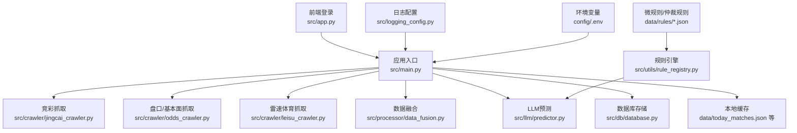
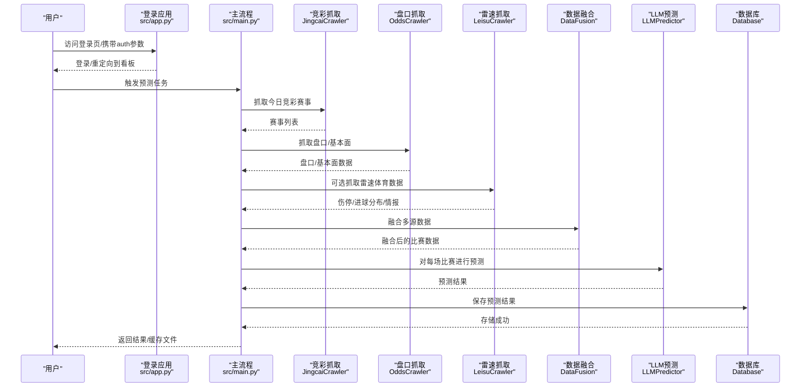
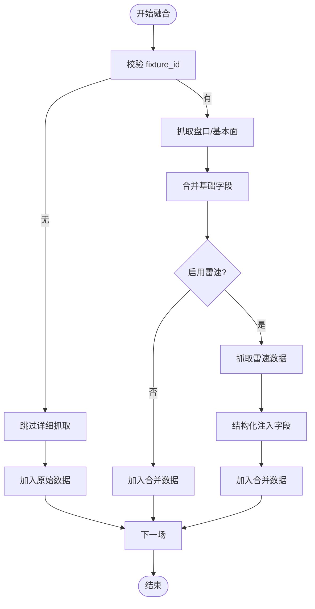
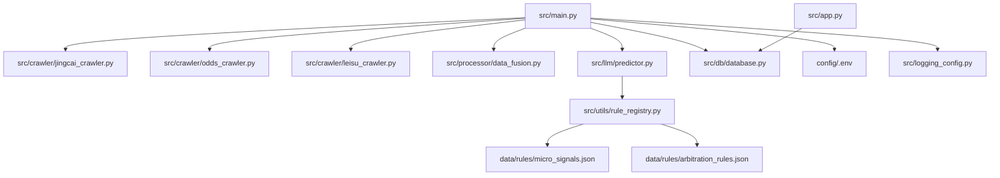
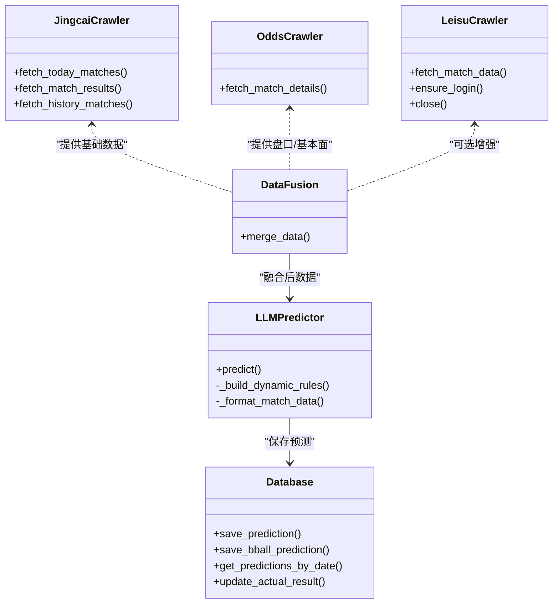

# 数据处理系统

<cite>
**本文档引用的文件**
- [src/main.py](file://src/main.py)
- [src/app.py](file://src/app.py)
- [src/processor/data_fusion.py](file://src/processor/data_fusion.py)
- [src/db/database.py](file://src/db/database.py)
- [src/crawler/jingcai_crawler.py](file://src/crawler/jingcai_crawler.py)
- [src/crawler/odds_crawler.py](file://src/crawler/odds_crawler.py)
- [src/crawler/leisu_crawler.py](file://src/crawler/leisu_crawler.py)
- [src/llm/predictor.py](file://src/llm/predictor.py)
- [src/utils/rule_registry.py](file://src/utils/rule_registry.py)
- [src/logging_config.py](file://src/logging_config.py)
- [src/constants.py](file://src/constants.py)
- [config/.env](file://config/.env)
- [data/rules/micro_signals.json](file://data/rules/micro_signals.json)
- [data/rules/arbitration_rules.json](file://data/rules/arbitration_rules.json)
</cite>

## 目录
1. [简介](#简介)
2. [项目结构](#项目结构)
3. [核心组件](#核心组件)
4. [架构总览](#架构总览)
5. [详细组件分析](#详细组件分析)
6. [依赖关系分析](#依赖关系分析)
7. [性能考量](#性能考量)
8. [故障排查指南](#故障排查指南)
9. [结论](#结论)
10. [附录](#附录)

## 简介
本技术文档面向数据科学家与开发者，系统性阐述该数据处理系统的数据融合算法、数据清洗与标准化流程、特征工程实现、数据转换规则与质量控制机制，以及缓存策略、性能优化与大数据处理方案。文档还涵盖配置选项、错误处理策略、监控指标、数据一致性保证、版本管理与数据生命周期管理，帮助读者全面掌握系统设计与实现细节。

## 项目结构
系统采用分层与功能模块化组织：
- 应用入口与调度：src/main.py 负责整体流程编排，包括抓取、融合、预测、存储与缓存。
- 数据采集层：src/crawler/* 提供竞彩、欧赔、亚指、高级统计与雷速体育等多源数据抓取。
- 数据融合层：src/processor/data_fusion.py 实现多源数据融合与增强。
- 预测与规则引擎：src/llm/predictor.py 与 src/utils/rule_registry.py 提供动态规则与仲裁机制。
- 数据存储层：src/db/database.py 提供数据库抽象与数据持久化。
- 用户界面与认证：src/app.py 提供登录与路由控制。
- 日志与配置：src/logging_config.py、src/constants.py、config/.env 提供日志、常量与环境变量。

图表来源
- [src/main.py:34-136](file://src/main.py#L34-L136)
- [src/processor/data_fusion.py:57-108](file://src/processor/data_fusion.py#L57-L108)
- [src/db/database.py:200-308](file://src/db/database.py#L200-L308)

章节来源
- [src/main.py:34-136](file://src/main.py#L34-L136)
- [src/app.py:110-166](file://src/app.py#L110-L166)

## 核心组件
- 数据采集与预处理
  - 竞彩数据抓取：src/crawler/jingcai_crawler.py 提供今日赛事、半全场赔率与历史数据抓取。
  - 盘口与基本面抓取：src/crawler/odds_crawler.py 抓取亚指、欧赔、近期战绩、交锋、伤停与澳门心水。
  - 雷速体育抓取：src/crawler/leisu_crawler.py 通过 Playwright 抓取伤停、进球分布、半全场胜负、SWOT情报等。
- 数据融合与增强
  - src/processor/data_fusion.py 将竞彩基础数据与第三方盘口/基本面数据融合，并可选注入雷速体育数据。
- 预测与规则引擎
  - src/llm/predictor.py 构建动态规则、格式化数据、检测盘口异动与微观信号，并输出预测结果。
  - src/utils/rule_registry.py 提供规则ID生成、条件规范化与仲裁规则动作解析。
- 数据存储与缓存
  - src/db/database.py 提供 MatchPrediction/BasketballPrediction/SfcPrediction/DailyParlays/DailyReview/EuroOddsHistory 等模型与CRUD操作。
  - 本地JSON缓存：data/today_matches.json、data/today_bball_matches.json 等。
- 日志与认证
  - src/logging_config.py：终端与文件双输出，按日轮转。
  - src/app.py：基于URL参数的短期认证令牌与登录态管理。

章节来源
- [src/crawler/jingcai_crawler.py:13-47](file://src/crawler/jingcai_crawler.py#L13-L47)
- [src/crawler/odds_crawler.py:17-161](file://src/crawler/odds_crawler.py#L17-L161)
- [src/crawler/leisu_crawler.py:237-322](file://src/crawler/leisu_crawler.py#L237-L322)
- [src/processor/data_fusion.py:61-108](file://src/processor/data_fusion.py#L61-L108)
- [src/llm/predictor.py:20-800](file://src/llm/predictor.py#L20-L800)
- [src/utils/rule_registry.py:102-176](file://src/utils/rule_registry.py#L102-L176)
- [src/db/database.py:200-562](file://src/db/database.py#L200-L562)
- [src/logging_config.py:8-30](file://src/logging_config.py#L8-L30)
- [src/app.py:51-166](file://src/app.py#L51-L166)

## 架构总览
系统采用“抓取-融合-预测-存储-缓存”的流水线架构，支持足球与篮球两类预测任务。前端登录控制访问，后端通过环境变量与配置文件驱动不同模块的行为。

图表来源
- [src/main.py:34-136](file://src/main.py#L34-L136)
- [src/crawler/jingcai_crawler.py:13-47](file://src/crawler/jingcai_crawler.py#L13-L47)
- [src/crawler/odds_crawler.py:17-161](file://src/crawler/odds_crawler.py#L17-L161)
- [src/crawler/leisu_crawler.py:237-322](file://src/crawler/leisu_crawler.py#L237-L322)
- [src/processor/data_fusion.py:61-108](file://src/processor/data_fusion.py#L61-L108)
- [src/db/database.py:256-308](file://src/db/database.py#L256-L308)

## 详细组件分析

### 数据融合算法与流程
- 融合策略
  - 以 fixture_id 为键合并竞彩基础数据与第三方盘口/基本面数据。
  - 可选注入雷速体育数据（伤停、进球分布、半全场、SWOT情报等）。
- 关键步骤
  - 抓取竞彩赛事列表与半全场赔率。
  - 针对每场比赛调用盘口抓取器获取亚指、欧赔、近期战绩、交锋、伤停与澳门心水。
  - 可选调用雷速抓取器获取伤停明细、进球分布、半全场胜负、历史交锋与近期战绩，并结构化注入。
- 错误处理
  - 雷速抓取失败时记录告警并继续流程。
  - 无 fixture_id 的比赛跳过详细数据抓取。

图表来源
- [src/processor/data_fusion.py:61-108](file://src/processor/data_fusion.py#L61-L108)
- [src/crawler/odds_crawler.py:17-161](file://src/crawler/odds_crawler.py#L17-L161)
- [src/crawler/leisu_crawler.py:237-322](file://src/crawler/leisu_crawler.py#L237-L322)

章节来源
- [src/processor/data_fusion.py:57-108](file://src/processor/data_fusion.py#L57-L108)

### 数据清洗与标准化流程
- 清洗策略
  - 时间字段解析：兼容无秒/有秒/ISO格式，统一为datetime。
  - 赛果解析：从比分字符串推导胜平负。
  - 伤停数据：识别转码乱码与关键词，结构化输出核心缺阵人数与明细。
  - 欧赔/亚指字段：提取初盘与即时盘，计算水位变化与盘口变化。
- 标准化规则
  - 字段命名与层级：统一为小写、下划线风格，嵌套结构清晰。
  - 数值范围：水位与盘口数值进行边界检查与异常值标记。
  - 缺失值处理：使用占位符或空结构，避免空字符串污染下游。

章节来源
- [src/db/database.py:12-57](file://src/db/database.py#L12-L57)
- [src/llm/predictor.py:283-309](file://src/llm/predictor.py#L283-L309)
- [src/llm/predictor.py:412-434](file://src/llm/predictor.py#L412-L434)

### 特征工程实现与转换规则
- 基础面特征
  - 近期战绩：场均进球/失球、净胜球等派生指标。
  - 交锋历史：历史交锋比分序列与胜负分布。
  - 积分排名：联赛积分与排名信息。
- 微观信号特征
  - 盘口异动：升盘/降盘、水位变化、盘水背离等。
  - 欧亚背离：欧赔与亚指方向不一致的量化指标。
  - 伤停影响：核心缺阵人数与结构化明细。
- 转换规则
  - 将原始HTML/文本解析为结构化JSON，统一字段类型与单位。
  - 使用规则引擎对信号进行权重与偏置调整，输出预测偏向。

章节来源
- [src/llm/predictor.py:81-282](file://src/llm/predictor.py#L81-L282)
- [src/llm/predictor.py:283-434](file://src/llm/predictor.py#L283-L434)
- [src/llm/predictor.py:483-585](file://src/llm/predictor.py#L483-L585)
- [src/llm/predictor.py:588-658](file://src/llm/predictor.py#L588-L658)

### 质量控制机制
- 规则引擎
  - 微观信号规则：data/rules/micro_signals.json 提供高危/关注信号与条件表达式。
  - 仲裁规则：data/rules/arbitration_rules.json 提供仲裁动作（禁止推翻、强制双选、限制置信度等）。
- 动态规则
  - 基于盘口深度、联赛特性与市场锚点动态组装规则，减少上下文负担。
- 数据一致性
  - 以 fixture_id 与时间段标识（pre_24h/pre_12h/final）区分记录，优先级策略确保最终裁决一致性。

章节来源
- [src/utils/rule_registry.py:102-176](file://src/utils/rule_registry.py#L102-L176)
- [data/rules/micro_signals.json:1-977](file://data/rules/micro_signals.json#L1-L977)
- [data/rules/arbitration_rules.json:1-63](file://data/rules/arbitration_rules.json#L1-L63)
- [src/db/database.py:468-478](file://src/db/database.py#L468-L478)

### 缓存策略与性能优化
- 缓存策略
  - 本地JSON缓存：将融合后的比赛数据与预测结果写入 data/today_matches.json、data/today_bball_matches.json 等，支持增量覆盖与快速读取。
  - 数据库缓存：MatchPrediction/BasketballPrediction/SfcPrediction 等模型持久化，支持按 fixture_id 与时间段检索。
- 性能优化
  - 并行抓取：竞彩与盘口抓取并发执行。
  - 雷速抓取：Playwright 浏览器复用与线程池隔离，避免事件循环冲突。
  - 预测阶段：逐场预测并增量写回缓存，减少重复计算。
  - 日志轮转：按日轮转与保留7天，避免I/O瓶颈。

章节来源
- [src/main.py:102-126](file://src/main.py#L102-L126)
- [src/crawler/leisu_crawler.py:42-57](file://src/crawler/leisu_crawler.py#L42-L57)
- [src/logging_config.py:22-29](file://src/logging_config.py#L22-L29)

### 大数据处理方案
- 数据规模
  - 单日比赛数量有限，主要瓶颈在于网页抓取与LLM推理。
- 处理策略
  - 抓取与解析：基于HTTP请求与BeautifulSoup，按需并发。
  - 存储：SQLite轻量存储，适合中小规模数据；可通过配置切换为其他数据库。
  - 预测：按比赛顺序迭代，支持断点续跑与增量更新。

章节来源
- [src/db/database.py:200-217](file://src/db/database.py#L200-L217)
- [src/main.py:118-126](file://src/main.py#L118-L126)

### 配置选项与环境变量
- 关键配置
  - LLM API密钥、基础地址与模型名称：config/.env
  - 数据库URL：SQLite默认，支持自定义
  - 雷速体育开关：ENABLE_LEISU
  - 认证令牌有效期：AUTH_TOKEN_TTL
- 配置加载
  - 应用入口与数据库模块分别加载 .env，确保路径正确。

章节来源
- [config/.env:1-20](file://config/.env#L1-L20)
- [src/constants.py:3-4](file://src/constants.py#L3-L4)
- [src/main.py:178-182](file://src/main.py#L178-L182)
- [src/db/database.py:200-217](file://src/db/database.py#L200-L217)

### 错误处理策略
- 抓取异常
  - HTTP状态码非200或解析异常时记录告警并跳过该条目。
- 雷速抓取
  - 初始化失败或子进程隔离失败时降级为匿名模式或子进程模式。
- 数据库
  - 事务回滚与异常捕获，避免脏写。
- 前端认证
  - URL参数解码失败或过期时清空状态并提示重新登录。

章节来源
- [src/crawler/jingcai_crawler.py:20-47](file://src/crawler/jingcai_crawler.py#L20-L47)
- [src/crawler/leisu_crawler.py:242-247](file://src/crawler/leisu_crawler.py#L242-L247)
- [src/db/database.py:301-304](file://src/db/database.py#L301-L304)
- [src/app.py:64-82](file://src/app.py#L64-L82)

### 监控指标
- 日志指标
  - INFO级别终端输出与文件输出，按日轮转，保留7天。
- 数据质量
  - 时间字段解析成功率、伤停数据有效性比率、欧亚盘口一致性比率。
- 运行健康
  - 抓取成功率、预测完成率、数据库写入成功率。

章节来源
- [src/logging_config.py:22-29](file://src/logging_config.py#L22-L29)

### 数据一致性保证、版本管理与生命周期
- 一致性
  - 以 fixture_id 与时间段标识区分记录，优先级策略确保最终裁决一致性。
- 版本管理
  - 规则文件采用JSON结构，支持版本字段与场景化规则组合。
- 生命周期
  - 日志按日轮转与保留7天；预测结果按日期窗口查询（12:00-次日12:00）。

章节来源
- [src/db/database.py:451-478](file://src/db/database.py#L451-L478)
- [data/rules/micro_signals.json:310-328](file://data/rules/micro_signals.json#L310-L328)
- [src/logging_config.py:26-29](file://src/logging_config.py#L26-L29)

## 依赖关系分析

图表来源
- [src/main.py:25-32](file://src/main.py#L25-L32)
- [src/llm/predictor.py:15-19](file://src/llm/predictor.py#L15-L19)
- [src/utils/rule_registry.py:6-16](file://src/utils/rule_registry.py#L6-L16)

章节来源
- [src/main.py:25-32](file://src/main.py#L25-L32)
- [src/llm/predictor.py:15-19](file://src/llm/predictor.py#L15-L19)

## 性能考量
- I/O与网络
  - 抓取阶段使用超时控制与并发策略，避免阻塞。
  - JSON缓存减少重复抓取，数据库批量写入降低I/O开销。
- 内存与CPU
  - 逐场预测与增量写回，避免一次性加载全部数据。
  - Playwright线程池隔离，避免事件循环冲突。
- 可扩展性
  - 规则引擎与数据库适配器化，便于替换与扩展。

## 故障排查指南
- 抓取失败
  - 检查竞彩/盘口/雷速目标站点可用性与反爬策略。
  - 查看日志文件定位具体异常行号。
- 数据库异常
  - 确认数据库URL与SQLite文件路径，检查权限与磁盘空间。
- 规则不生效
  - 校验规则JSON语法与字段命名，确认 enabled 状态。
- 认证问题
  - 检查 AUTH_TOKEN_TTL 与URL参数格式，确认会话状态清理。

章节来源
- [src/crawler/jingcai_crawler.py:20-47](file://src/crawler/jingcai_crawler.py#L20-L47)
- [src/db/database.py:200-217](file://src/db/database.py#L200-L217)
- [src/logging_config.py:22-29](file://src/logging_config.py#L22-L29)
- [src/app.py:64-82](file://src/app.py#L64-L82)

## 结论
该系统通过模块化设计实现了从多源数据抓取、融合、清洗标准化、特征工程、规则与仲裁、预测到存储与缓存的完整链路。借助规则引擎与仲裁机制，系统在不确定性环境中提供了稳健的质量控制与一致性保障。通过缓存与性能优化策略，系统在中小规模数据场景下具备良好的吞吐与稳定性。建议在生产环境中进一步完善监控与告警体系，并根据业务增长逐步引入分布式与流式处理能力。

## 附录
- 关键类与职责概览

图表来源
- [src/crawler/jingcai_crawler.py:6-330](file://src/crawler/jingcai_crawler.py#L6-L330)
- [src/crawler/odds_crawler.py:9-167](file://src/crawler/odds_crawler.py#L9-L167)
- [src/crawler/leisu_crawler.py:18-609](file://src/crawler/leisu_crawler.py#L18-L609)
- [src/processor/data_fusion.py:57-108](file://src/processor/data_fusion.py#L57-L108)
- [src/llm/predictor.py:20-800](file://src/llm/predictor.py#L20-L800)
- [src/db/database.py:200-562](file://src/db/database.py#L200-L562)