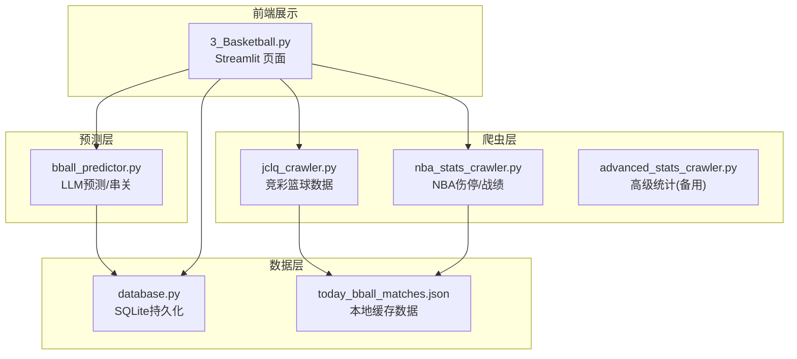
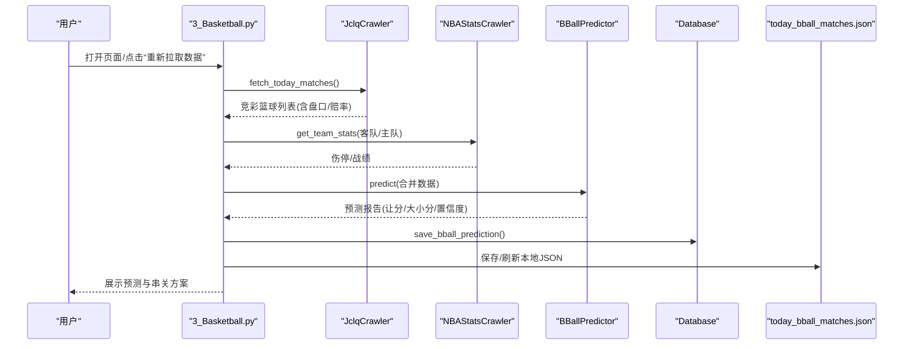
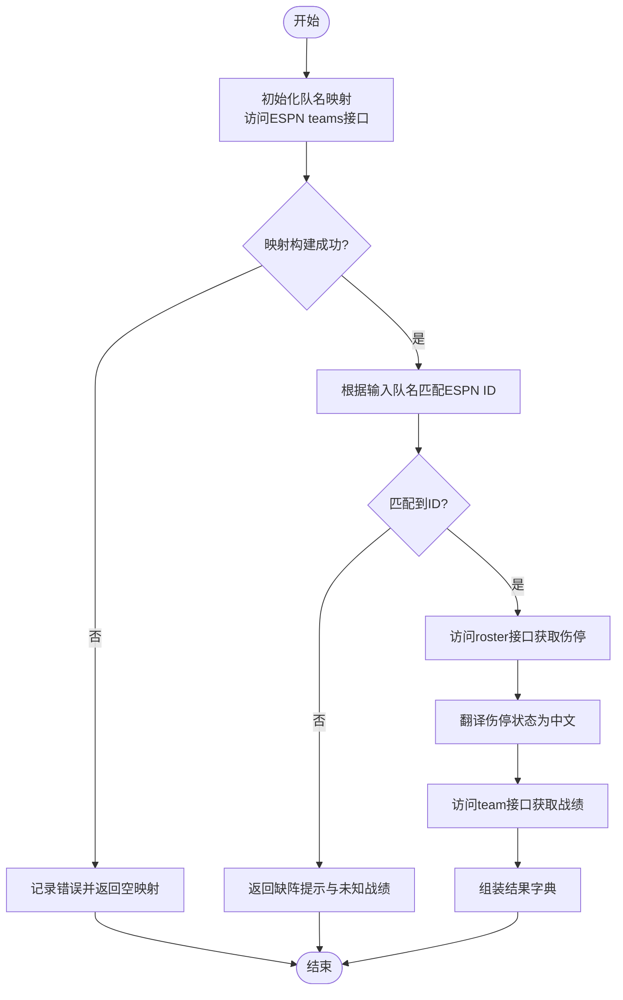
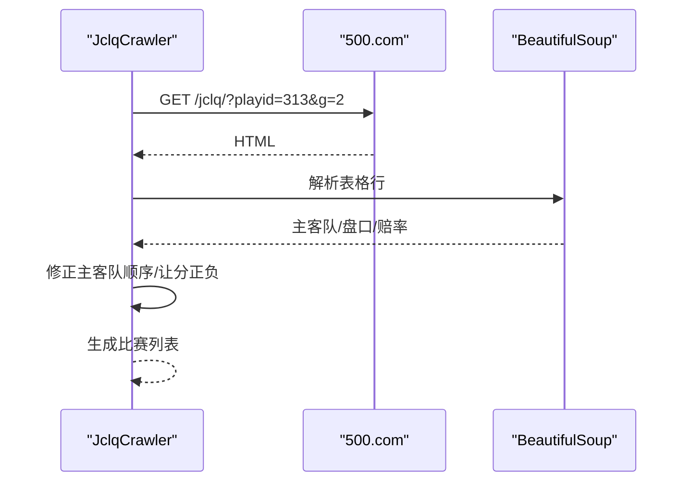
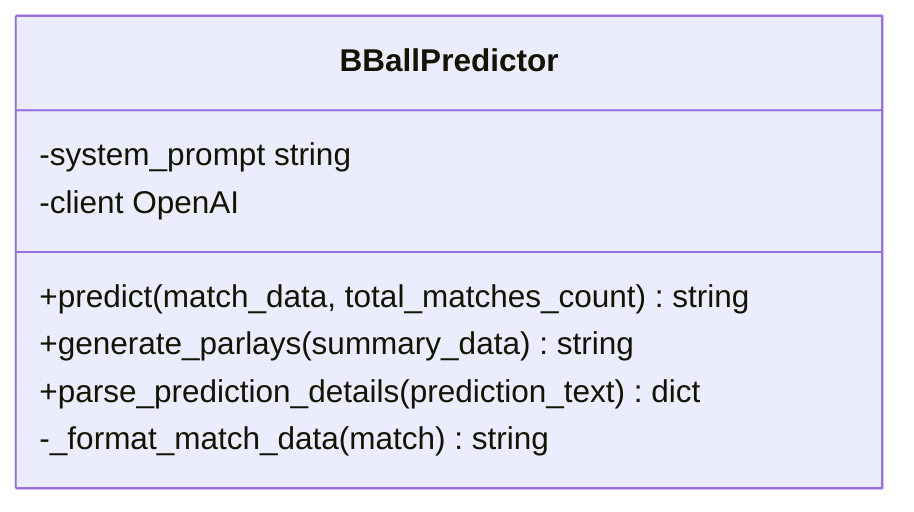
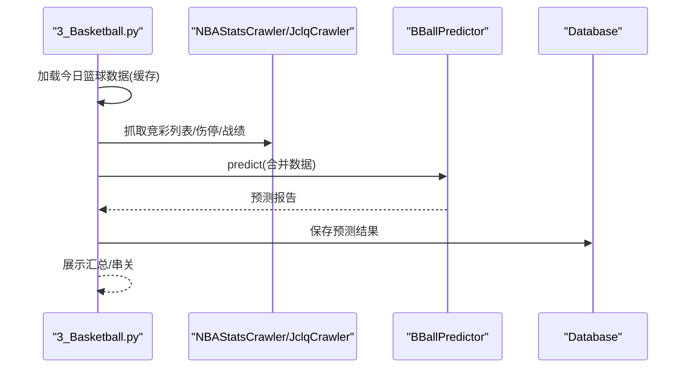
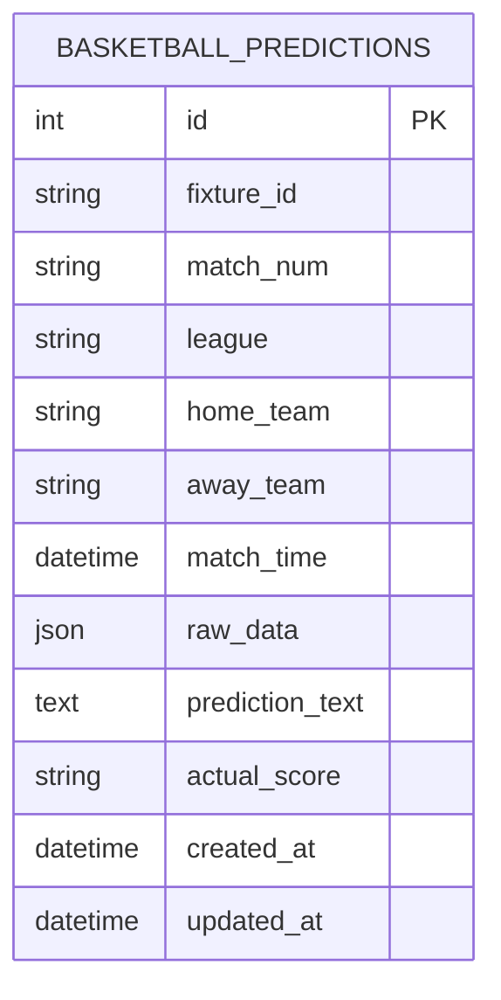
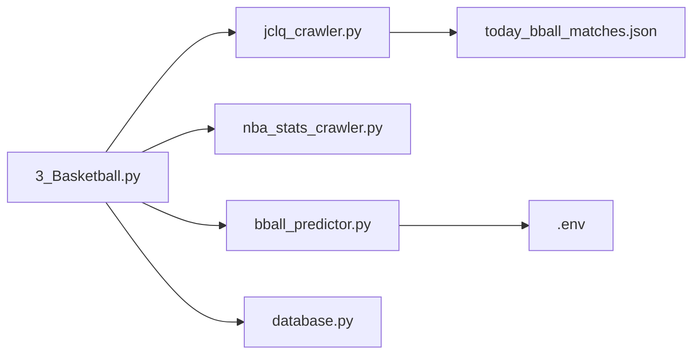

# NBA统计数据爬虫

<cite>
**本文引用的文件**
- [nba_stats_crawler.py](file://src/crawler/nba_stats_crawler.py)
- [advanced_stats_crawler.py](file://src/crawler/advanced_stats_crawler.py)
- [3_Basketball.py](file://src/pages/3_Basketball.py)
- [bball_predictor.py](file://src/llm/bball_predictor.py)
- [jclq_crawler.py](file://src/crawler/jclq_crawler.py)
- [database.py](file://src/db/database.py)
- [.env.example](file://config/.env.example)
- [basketball_prediction_plan.md](file://docs/basketball_prediction_plan.md)
- [basketball_parlay_strategy.md](file://docs/basketball_parlay_strategy.md)
- [run_bball_post_mortem.py](file://scripts/run_bball_post_mortem.py)
- [today_bball_matches.json](file://data/today_bball_matches.json)
</cite>

## 目录
1. [简介](#简介)
2. [项目结构](#项目结构)
3. [核心组件](#核心组件)
4. [架构总览](#架构总览)
5. [详细组件分析](#详细组件分析)
6. [依赖关系分析](#依赖关系分析)
7. [性能考虑](#性能考虑)
8. [故障排查指南](#故障排查指南)
9. [结论](#结论)
10. [附录](#附录)

## 简介
本技术文档围绕 NLP 与体育数据融合的实战项目，系统阐述 NBA 统计数据爬虫模块（nba_stats_crawler）如何获取与处理 NBA 篮球比赛的统计数据，包括球员伤停、球队战绩等基础数据，以及这些数据在竞彩篮球预测中的应用。文档还涵盖数据源特点、数据结构、实时与历史数据获取策略、篮球统计指标的特殊性（得分分布、命中率、篮板统计等），并提供与预测模型结合的方法与效果评估，以及与其他体育项目数据的对比分析。

## 项目结构
该项目采用模块化设计，前端页面负责展示与交互，爬虫模块负责数据采集，LLM 模块负责预测与串关策略生成，数据库模块负责持久化与复盘分析。核心文件与职责如下：
- 爬虫层：NBA 伤停与战绩抓取、竞彩篮球数据抓取、高级统计抓取
- 预测层：基于提示词工程的篮球预测与串关策略
- 展示层：Streamlit 页面集成数据抓取、预测与串关生成
- 数据层：SQLite 持久化与复盘脚本

图表来源
- [3_Basketball.py:1-451](file://src/pages/3_Basketball.py#L1-L451)
- [jclq_crawler.py:1-264](file://src/crawler/jclq_crawler.py#L1-L264)
- [nba_stats_crawler.py:1-133](file://src/crawler/nba_stats_crawler.py#L1-L133)
- [advanced_stats_crawler.py:1-114](file://src/crawler/advanced_stats_crawler.py#L1-L114)
- [bball_predictor.py:1-282](file://src/llm/bball_predictor.py#L1-L282)
- [database.py:1-567](file://src/db/database.py#L1-L567)
- [today_bball_matches.json:1-589](file://data/today_bball_matches.json#L1-L589)

章节来源
- [3_Basketball.py:1-451](file://src/pages/3_Basketball.py#L1-L451)
- [jclq_crawler.py:1-264](file://src/crawler/jclq_crawler.py#L1-L264)
- [nba_stats_crawler.py:1-133](file://src/crawler/nba_stats_crawler.py#L1-L133)
- [advanced_stats_crawler.py:1-114](file://src/crawler/advanced_stats_crawler.py#L1-L114)
- [bball_predictor.py:1-282](file://src/llm/bball_predictor.py#L1-L282)
- [database.py:1-567](file://src/db/database.py#L1-L567)
- [today_bball_matches.json:1-589](file://data/today_bball_matches.json#L1-L589)

## 核心组件
- NBAStatsCrawler：从 ESPN API 获取 NBA 球队伤停与战绩，支持中文/英文队名映射与状态翻译。
- JclqCrawler：从 500.com 抓取竞彩篮球实时数据（让分、大小分、赔率、开赛时间等）。
- BBallPredictor：基于提示词工程的 LLM 预测器，输出让分胜负与大小分推荐，并生成串关方案。
- Database：SQLite 持久化，支持篮球预测结果与复盘数据存储。
- Streamlit 页面：整合数据抓取、预测、串关生成与展示。

章节来源
- [nba_stats_crawler.py:6-133](file://src/crawler/nba_stats_crawler.py#L6-L133)
- [jclq_crawler.py:6-264](file://src/crawler/jclq_crawler.py#L6-L264)
- [bball_predictor.py:9-282](file://src/llm/bball_predictor.py#L9-L282)
- [database.py:200-567](file://src/db/database.py#L200-L567)
- [3_Basketball.py:1-451](file://src/pages/3_Basketball.py#L1-L451)

## 架构总览
系统采用“前端页面 + 爬虫 + 预测 + 数据库”的分层架构。前端页面负责调度爬虫抓取数据，调用 LLM 进行预测，将结果持久化并展示；数据库负责存储预测结果、串关方案与复盘报告。

图表来源
- [3_Basketball.py:194-268](file://src/pages/3_Basketball.py#L194-L268)
- [jclq_crawler.py:14-138](file://src/crawler/jclq_crawler.py#L14-L138)
- [nba_stats_crawler.py:71-125](file://src/crawler/nba_stats_crawler.py#L71-L125)
- [bball_predictor.py:166-198](file://src/llm/bball_predictor.py#L166-L198)
- [database.py:331-366](file://src/db/database.py#L331-L366)
- [today_bball_matches.json:1-589](file://data/today_bball_matches.json#L1-L589)

## 详细组件分析

### NBAStatsCrawler 组件分析
- 目标：从 ESPN API 获取 NBA 球队伤停与战绩，支持中文/英文队名映射与状态翻译。
- 关键流程：
  - 初始化：访问 ESPN teams 接口，构建队名到 ESPN ID 的映射（含中文简称与全称）。
  - 获取伤停：根据队名匹配到 ESPN ID，访问 roster 接口，遍历球员项，提取伤停状态并翻译。
  - 获取战绩：访问 team 接口，提取 record summary。
- 特殊处理：
  - 中文队名映射：手动补充常见中文队名与英文队名的映射关系，提升匹配率。
  - 状态翻译：将英文伤停状态（如 out、day-to-day、suspension）翻译为中文。
  - 异常处理：捕获网络与解析异常，返回默认提示信息。

图表来源
- [nba_stats_crawler.py:12-125](file://src/crawler/nba_stats_crawler.py#L12-L125)

章节来源
- [nba_stats_crawler.py:6-133](file://src/crawler/nba_stats_crawler.py#L6-L133)

### JclqCrawler 组件分析
- 目标：从 500.com 抓取竞彩篮球实时数据，包括让分、大小分、赔率、开赛时间等。
- 关键流程：
  - 请求页面：使用指定 playid 与 g 参数，确保混合玩法数据完整。
  - 解析 HTML：使用 BeautifulSoup 解析表格行，提取主客队、盘口、赔率等字段。
  - 数据清洗：修正主客队顺序、修复让分值正负号逻辑、解析按钮中的赔率。
  - 历史赛果：支持按日期抓取历史赛果，计算胜负、让分胜负与大小分结果。
- 特殊处理：
  - 主客队顺序：页面显示与实际主客队顺序不同，需修正取值逻辑。
  - 让分值解析：优先从按钮所在列解析，避免 data- 属性未更新导致的陈旧值。
  - 编码处理：页面编码为 gb2312/gbk，需显式设置编码。

图表来源
- [jclq_crawler.py:14-138](file://src/crawler/jclq_crawler.py#L14-L138)

章节来源
- [jclq_crawler.py:6-264](file://src/crawler/jclq_crawler.py#L6-L264)

### BBallPredictor 组件分析
- 目标：基于提示词工程的 LLM 预测器，输出让分胜负与大小分推荐，并生成串关方案。
- 关键流程：
  - 格式化数据：将竞彩盘口、赔率与实时伤停/战绩合并为提示词。
  - 调用 LLM：构造 system prompt 与 user prompt，调用 OpenAI API。
  - 结果解析：从 LLM 输出中提取推荐、理由与置信度。
  - 串关生成：基于当日预测汇总，生成稳健与进阶两种串关方案。
- 特殊处理：
  - 提示词工程：包含赛程消耗、伤停影响、高阶数据、盘口逻辑与机构博弈等维度。
  - 交叉盘预警：当单日比赛极少时，强制引入“交叉盘”风险考量。
  - 串关风控：严禁双胆双热、深盘深让、仅看场均得分等高风险组合。

图表来源
- [bball_predictor.py:9-282](file://src/llm/bball_predictor.py#L9-L282)

章节来源
- [bball_predictor.py:9-282](file://src/llm/bball_predictor.py#L9-L282)

### Streamlit 页面与数据流
- 目标：提供可视化界面，支持全局重新预测、单场重新预测、串关生成与展示。
- 关键流程：
  - 加载数据：从本地 JSON 文件读取今日篮球赛事，支持缓存。
  - 全局预测：抓取竞彩列表与伤停/战绩，调用 LLM 生成预测并持久化。
  - 展示汇总：解析预测报告，提取推荐与置信度，排序展示。
  - 串关生成：基于汇总数据生成稳健与进阶串关方案。
- 特殊处理：
  - 登录态校验：通过 URL 参数恢复登录状态，限制访问权限。
  - 时间过滤：支持按开赛时间段过滤数据抓取。
  - 缓存机制：使用 @st.cache_data 缓存 JSON 数据，提升加载速度。

图表来源
- [3_Basketball.py:69-268](file://src/pages/3_Basketball.py#L69-L268)
- [database.py:331-366](file://src/db/database.py#L331-L366)

章节来源
- [3_Basketball.py:1-451](file://src/pages/3_Basketball.py#L1-L451)

### 数据库与复盘
- 目标：持久化预测结果，支持复盘与效果评估。
- 关键流程：
  - 模型：BasketballPrediction 表，存储原始数据、预测文本与实际比分。
  - 方法：save_bball_prediction、get_bball_prediction_by_fixture 等。
  - 复盘：脚本抓取历史赛果，与预测结果对比，生成命中率与详细报告。
- 特殊处理：
  - 时间解析：兼容多种时间格式，支持 ISO 与带秒/无秒格式。
  - 复盘报告：生成 CSV 与 JSON，便于后续分析。

图表来源
- [database.py:104-126](file://src/db/database.py#L104-L126)

章节来源
- [database.py:200-567](file://src/db/database.py#L200-L567)
- [run_bball_post_mortem.py:1-267](file://scripts/run_bball_post_mortem.py#L1-L267)

## 依赖关系分析
- 组件耦合：
  - 3_Basketball.py 依赖 JclqCrawler、NBAStatsCrawler、BBallPredictor、Database。
  - BBallPredictor 依赖 .env 中的 LLM 配置，调用 OpenAI API。
  - Database 依赖 SQLAlchemy，使用 SQLite 存储预测结果。
- 外部依赖：
  - requests、BeautifulSoup、loguru、openai、sqlalchemy、streamlit、pandas、dotenv 等。
- 数据依赖：
  - ESPN API（伤停/战绩）、500.com（竞彩数据）、本地 JSON 缓存。

图表来源
- [3_Basketball.py:1-451](file://src/pages/3_Basketball.py#L1-L451)
- [jclq_crawler.py:1-264](file://src/crawler/jclq_crawler.py#L1-L264)
- [nba_stats_crawler.py:1-133](file://src/crawler/nba_stats_crawler.py#L1-L133)
- [bball_predictor.py:1-282](file://src/llm/bball_predictor.py#L1-L282)
- [database.py:1-567](file://src/db/database.py#L1-L567)
- [.env.example:1-16](file://config/.env.example#L1-L16)
- [today_bball_matches.json:1-589](file://data/today_bball_matches.json#L1-L589)

章节来源
- [3_Basketball.py:1-451](file://src/pages/3_Basketball.py#L1-L451)
- [bball_predictor.py:1-282](file://src/llm/bball_predictor.py#L1-L282)
- [database.py:1-567](file://src/db/database.py#L1-L567)

## 性能考虑
- 爬虫性能：
  - 请求超时与重试：为 ESPN 与 500.com 请求设置合理超时，避免阻塞。
  - 缓存策略：Streamlit 的 @st.cache_data 缓存 JSON 数据，减少重复 IO。
  - 并发控制：当前为串行抓取，可考虑并发抓取多个比赛，但需注意 API 限速与反爬策略。
- 预测性能：
  - 提示词长度控制：提示词包含大量盘口与基本面信息，需控制 tokens 数量，避免超出模型上下文。
  - 模型选择：可根据成本与延迟选择不同模型，平衡精度与速度。
- 数据库性能：
  - SQLite 适合小规模数据，若预测量增长，可考虑迁移至 PostgreSQL。
  - 索引优化：对 fixture_id、match_time 等常用查询字段建立索引。

## 故障排查指南
- LLM API 配置：
  - 检查 .env 中 LLM_API_KEY、LLM_API_BASE、LLM_MODEL 是否正确配置。
  - 若提示“未找到 LLM_API_KEY”，请在 .env 中填写有效密钥。
- 爬虫异常：
  - ESPN API：若返回空映射或解析失败，检查网络与接口变更。
  - 500.com：若页面编码异常，确认响应编码设置为 gb2312/gbk。
- 数据库异常：
  - SQLite 路径：确保 data/football.db 路径存在且可写。
  - 列缺失：首次运行会自动补齐列，若失败请检查权限。
- 复盘脚本：
  - 若未生成复盘报告，检查 bball_all_compared_matches.json 是否存在，以及预测数据是否匹配。

章节来源
- [.env.example:1-16](file://config/.env.example#L1-L16)
- [bball_predictor.py:20-27](file://src/llm/bball_predictor.py#L20-L27)
- [database.py:200-233](file://src/db/database.py#L200-L233)
- [run_bball_post_mortem.py:1-267](file://scripts/run_bball_post_mortem.py#L1-L267)

## 结论
本项目通过模块化设计实现了从竞彩数据抓取、NBA 伤停与战绩获取、LLM 预测与串关生成到数据持久化与复盘的完整闭环。NBAStatsCrawler 专注于实时伤停与战绩，JclqCrawler 提供权威盘口与赔率，BBallPredictor 将多维度信息融合为可解释的预测报告，并通过串关策略降低系统性风险。建议持续优化提示词与风控策略，完善历史数据积累与模型迭代，以提升预测稳定性与胜率。

## 附录

### 数据源特点与数据结构
- ESPN API（NBA）：
  - 用途：获取球队伤停与战绩。
  - 数据结构：teams 接口返回 teams 列表，roster 接口返回 athletes/items/injuries 状态，team 接口返回 record/items/summary。
- 500.com（竞彩）：
  - 用途：获取让分、大小分、赔率、开赛时间等。
  - 数据结构：HTML 表格行包含 data-* 属性，按钮中包含赔率，需解析按钮内的 span.eng 文本。
- 本地缓存：
  - 用途：缓存今日篮球赛事，减少重复抓取。
  - 数据结构：JSON 数组，包含 fixture_id、match_num、league、home_team、away_team、match_time、odds、llm_prediction 等字段。

章节来源
- [nba_stats_crawler.py:7-125](file://src/crawler/nba_stats_crawler.py#L7-L125)
- [jclq_crawler.py:33-138](file://src/crawler/jclq_crawler.py#L33-L138)
- [today_bball_matches.json:1-589](file://data/today_bball_matches.json#L1-L589)

### 篮球统计指标的特殊性
- 得分分布与大小分：
  - 大小分预测需基于 Pace（回合数）与防守效率，而非仅看场均得分。
  - 快节奏球队相遇时，总分盘可能被高估，需警惕“后门掩护”导致的赢球输盘。
- 命中率与三分：
  - 三分命中率在体能透支（如背靠背）时断崖式下跌，影响大小分与胜负。
- 篮板统计：
  - 篮板率与篮板数直接影响回合控制，进而影响节奏与胜负。
- 体能与赛程：
  - 背靠背、客场之旅、高原/极寒客场对第四节防守与命中率影响显著。

章节来源
- [basketball_prediction_plan.md:20-71](file://docs/basketball_prediction_plan.md#L20-L71)
- [basketball_parlay_strategy.md:1-51](file://docs/basketball_parlay_strategy.md#L1-L51)

### 预测模型应用与效果评估
- 应用方法：
  - 将竞彩盘口、赔率与实时伤停/战绩合并为提示词，调用 LLM 生成预测报告。
  - 通过 parse_prediction_details 提取推荐、理由与置信度，用于排序与展示。
  - 生成串关方案时，强制规避“双胆双热”“深盘深让”“仅看场均得分”等高风险组合。
- 效果评估：
  - 复盘脚本对比预测与实际结果，生成命中率与详细报告，支持持续优化。
  - 通过“交叉盘”预警与“后门掩护”风控，降低极端情况下的损失。

章节来源
- [bball_predictor.py:124-198](file://src/llm/bball_predictor.py#L124-L198)
- [run_bball_post_mortem.py:79-267](file://scripts/run_bball_post_mortem.py#L79-L267)

### 与其他体育项目数据的对比分析
- 足球与篮球的差异：
  - 篮球节奏快、回合多，预测更依赖核心球员状态、体能消耗与 Pace/防守效率。
  - 篮球让分盘与大小分盘由精算师建立，盘口精准度更高，串关策略需更严格的风控。
- 欧篮联赛专项：
  - 双赛周魔咒、40分钟赛制、关键分值（3.5/5.5/7.5）与防守效率权重极高。
  - 主场优势与裁判判罚影响显著，深盘在欧洲赛场极难打穿。

章节来源
- [basketball_prediction_plan.md:51-71](file://docs/basketball_prediction_plan.md#L51-L71)
- [basketball_parlay_strategy.md:38-51](file://docs/basketball_parlay_strategy.md#L38-L51)