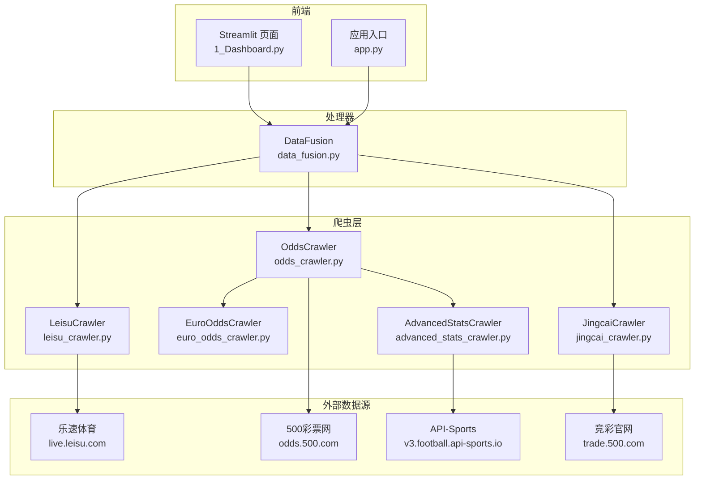
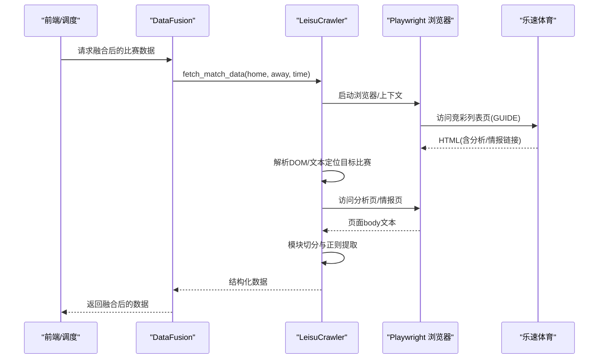
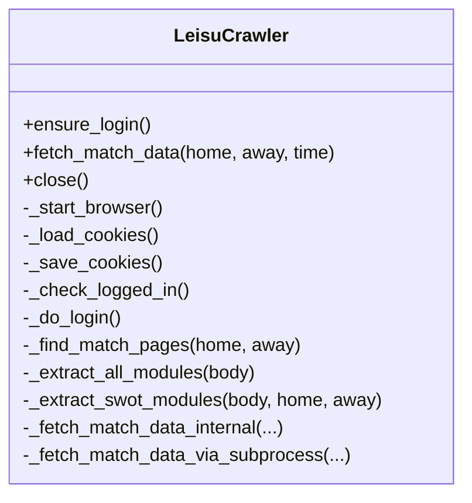
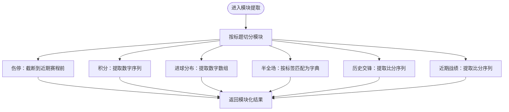
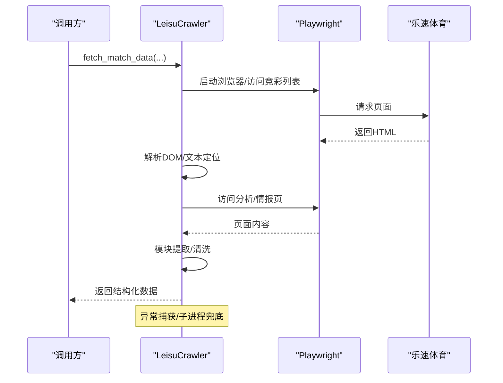
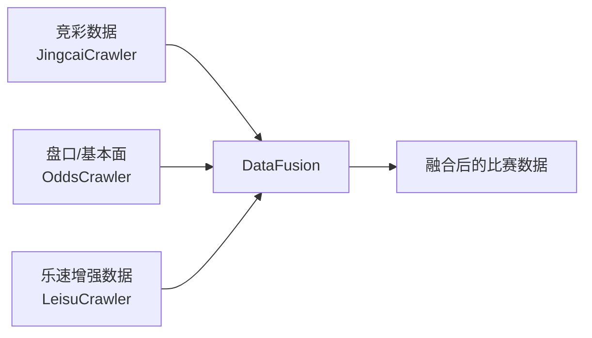
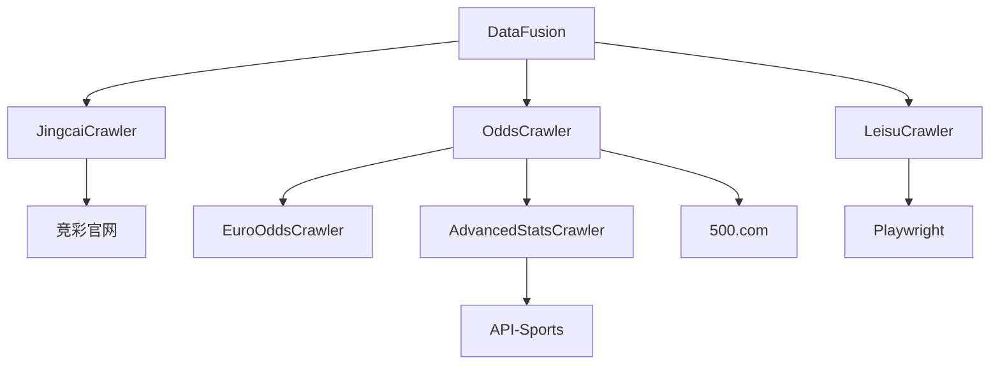

# 乐速数据爬虫

<cite>
**本文引用的文件**
- [leisu_crawler.py](file://src/crawler/leisu_crawler.py)
- [odds_crawler.py](file://src/crawler/odds_crawler.py)
- [euro_odds_crawler.py](file://src/crawler/euro_odds_crawler.py)
- [jingcai_crawler.py](file://src/crawler/jingcai_crawler.py)
- [advanced_stats_crawler.py](file://src/crawler/advanced_stats_crawler.py)
- [data_fusion.py](file://src/processor/data_fusion.py)
- [test_leisu.py](file://scripts/test_leisu.py)
- [test_leisu_bai.py](file://scripts/test_leisu_bai.py)
- [logging_config.py](file://src/logging_config.py)
- [constants.py](file://src/constants.py)
- [1_Dashboard.py](file://src/pages/1_Dashboard.py)
- [app.py](file://src/app.py)
</cite>

## 目录
1. [简介](#简介)
2. [项目结构](#项目结构)
3. [核心组件](#核心组件)
4. [架构总览](#架构总览)
5. [详细组件分析](#详细组件分析)
6. [依赖分析](#依赖分析)
7. [性能考量](#性能考量)
8. [故障排查指南](#故障排查指南)
9. [结论](#结论)
10. [附录](#附录)

## 简介
本文件面向乐速数据爬虫的实现与使用，重点围绕 leisu_crawler 模块展开，系统性阐述其抓取策略、数据结构与解析算法、反爬虫应对、请求头与会话管理、错误处理与重试策略，并结合其他数据源进行对比与融合实践。读者可据此快速理解并安全地集成乐速体育数据到预测与风控体系中。

## 项目结构
本项目采用按职责分层的组织方式：
- crawler 层：封装各数据源的抓取逻辑（乐速、500.com、竞彩等）
- processor 层：负责多源数据融合与注入
- pages/app：前端入口与仪表盘集成
- scripts：测试与调试脚本
- logs：日志输出
- data：临时数据与报告

图表来源
- [leisu_crawler.py:18-212](file://src/crawler/leisu_crawler.py#L18-L212)
- [odds_crawler.py:9-16](file://src/crawler/odds_crawler.py#L9-L16)
- [euro_odds_crawler.py:8-15](file://src/crawler/euro_odds_crawler.py#L8-L15)
- [jingcai_crawler.py:6-11](file://src/crawler/jingcai_crawler.py#L6-L11)
- [advanced_stats_crawler.py:9-23](file://src/crawler/advanced_stats_crawler.py#L9-L23)
- [data_fusion.py:57-107](file://src/processor/data_fusion.py#L57-L107)

章节来源
- [leisu_crawler.py:18-212](file://src/crawler/leisu_crawler.py#L18-L212)
- [odds_crawler.py:9-16](file://src/crawler/odds_crawler.py#L9-L16)
- [euro_odds_crawler.py:8-15](file://src/crawler/euro_odds_crawler.py#L8-L15)
- [jingcai_crawler.py:6-11](file://src/crawler/jingcai_crawler.py#L6-L11)
- [advanced_stats_crawler.py:9-23](file://src/crawler/advanced_stats_crawler.py#L9-L23)
- [data_fusion.py:57-107](file://src/processor/data_fusion.py#L57-L107)

## 核心组件
- LeisuCrawler：基于 Playwright 的浏览器自动化爬虫，负责从乐速体育的“竞彩”列表页定位比赛，进入分析页与情报页，提取伤停、积分、进球分布、半全场胜负、历史交锋、近期战绩等模块化数据，并可选提取 SWOT 情报。
- OddsCrawler：聚合第三方盘口与基本面数据，抓取亚洲盘（亚指）、欧洲盘（欧赔）、近期战绩、积分排名、交锋历史、澳门心水、伤停阵容等。
- EuroOddsCrawler：从 500.com 的 AJAX 接口提取欧赔初盘与即时盘，内置重试与限速策略。
- JingcaiCrawler：抓取竞彩当日胜平负/让球胜平负及半全场赔率，支持历史与赛果抓取。
- AdvancedStatsCrawler：通过 API-Sports 获取高阶统计（如场均进球），并提供缓存与降级能力。
- DataFusion：统一调度与融合多源数据，按需注入乐速数据到竞彩数据中。

章节来源
- [leisu_crawler.py:18-212](file://src/crawler/leisu_crawler.py#L18-L212)
- [odds_crawler.py:9-16](file://src/crawler/odds_crawler.py#L9-L16)
- [euro_odds_crawler.py:8-15](file://src/crawler/euro_odds_crawler.py#L8-L15)
- [jingcai_crawler.py:6-11](file://src/crawler/jingcai_crawler.py#L6-L11)
- [advanced_stats_crawler.py:9-23](file://src/crawler/advanced_stats_crawler.py#L9-L23)
- [data_fusion.py:57-107](file://src/processor/data_fusion.py#L57-L107)

## 架构总览
乐速数据爬虫在整体架构中的位置如下：

图表来源
- [leisu_crawler.py:284-321](file://src/crawler/leisu_crawler.py#L284-L321)
- [leisu_crawler.py:323-408](file://src/crawler/leisu_crawler.py#L323-L408)
- [leisu_crawler.py:410-460](file://src/crawler/leisu_crawler.py#L410-L460)
- [leisu_crawler.py:538-582](file://src/crawler/leisu_crawler.py#L538-L582)
- [data_fusion.py:61-107](file://src/processor/data_fusion.py#L61-L107)

## 详细组件分析

### LeisuCrawler：乐速体育数据抓取与解析
- 登录与会话管理
  - 支持匿名模式与可选 Cookie 登录；若启用登录，自动加载本地 Cookie 并检测登录状态；若失败则回退匿名模式。
  - 通过专用线程池运行 Playwright，避免在 Streamlit 或已有事件循环环境中冲突。
- 页面导航与定位
  - 从竞彩列表页（GUIDE）定位目标比赛，解析 DOM 与 body 文本，构建分析页与情报页 URL 映射。
  - 对队名模糊匹配，兼容不同联赛/轮次文本干扰。
- 数据提取与清洗
  - 模块化切分：历史交锋、近期战绩、联赛积分、进球分布、伤停情况、半全场胜负。
  - 正则清洗：提取数字、比分、标签，限定长度与数量上限，保证下游稳定。
  - 情报页 SWOT：清洗噪声、识别主队/客队标签、拆分“有利/不利/中立”三类要点，限制数量上限。
- 反爬虫与稳定性
  - 无头浏览器、自定义 UA、禁用自动化特征、固定视口尺寸。
  - 异常捕获与降级：找不到 URL、页面超时、情报页失败均记录告警并返回可用数据。
- 子进程兜底
  - 当同步 Playwright 在特定环境下无法启动时，自动切换子进程模式，确保任务可完成。

图表来源
- [leisu_crawler.py:18-212](file://src/crawler/leisu_crawler.py#L18-L212)
- [leisu_crawler.py:284-321](file://src/crawler/leisu_crawler.py#L284-L321)
- [leisu_crawler.py:323-408](file://src/crawler/leisu_crawler.py#L323-L408)
- [leisu_crawler.py:410-460](file://src/crawler/leisu_crawler.py#L410-L460)
- [leisu_crawler.py:538-582](file://src/crawler/leisu_crawler.py#L538-L582)

章节来源
- [leisu_crawler.py:18-212](file://src/crawler/leisu_crawler.py#L18-L212)
- [leisu_crawler.py:284-321](file://src/crawler/leisu_crawler.py#L284-L321)
- [leisu_crawler.py:323-408](file://src/crawler/leisu_crawler.py#L323-L408)
- [leisu_crawler.py:410-460](file://src/crawler/leisu_crawler.py#L410-L460)
- [leisu_crawler.py:538-582](file://src/crawler/leisu_crawler.py#L538-L582)

### 数据结构与解析算法
- 模块切分与字段
  - 伤停情况：截断至“近期赛程”前，限制长度，便于下游拼接。
  - 联赛积分：提取若干数字作为排名序列。
  - 进球分布：提取连续数字作为分布数组。
  - 半全场胜负：按九宫格标签匹配并转为字典。
  - 历史交锋/近期战绩：提取比分序列。
- 情报页 SWOT
  - 清洗噪声段落，按“有利/不利/中立”三段切分。
  - 通过前缀文本与黑名单过滤提取主客队标签。
  - 限制每类要点数量上限，避免冗余。

图表来源
- [leisu_crawler.py:410-460](file://src/crawler/leisu_crawler.py#L410-L460)

章节来源
- [leisu_crawler.py:410-460](file://src/crawler/leisu_crawler.py#L410-L460)

### 反爬虫应对策略、请求头与会话管理
- 反爬虫
  - 无头模式、固定 UA、禁用自动化特征、固定视口，降低被检测概率。
  - 通过专用线程运行 Playwright，避免事件循环冲突导致的异常。
- 会话管理
  - 自动加载/保存 Cookie，维持登录态；若 Cookie 失效则重新登录。
  - 情报页失败时记录警告并继续返回其他模块数据。
- 请求头与编码
  - 乐速页面：Playwright 控制 UA 与上下文。
  - 其他站点：统一设置 User-Agent，必要时设置 Referer。

章节来源
- [leisu_crawler.py:58-87](file://src/crawler/leisu_crawler.py#L58-L87)
- [leisu_crawler.py:169-191](file://src/crawler/leisu_crawler.py#L169-L191)
- [euro_odds_crawler.py:12-15](file://src/crawler/euro_odds_crawler.py#L12-L15)

### 错误处理机制与重试策略
- 乐速爬取
  - 页面加载超时、找不到 URL、情报页异常均捕获并记录日志，返回可用数据。
  - 子进程兜底：当同步 Playwright 无法启动时，切换子进程模式执行。
- 欧赔抓取
  - 内置重试与递增等待（首次 2s、第二次 4s、第三次 6s），遇到限流或空表格自动重试。
- 日志与告警
  - 使用 loguru 输出 INFO/ERROR 级别日志，终端与文件双通道，便于问题追踪。

图表来源
- [leisu_crawler.py:284-321](file://src/crawler/leisu_crawler.py#L284-L321)
- [leisu_crawler.py:248-283](file://src/crawler/leisu_crawler.py#L248-L283)

章节来源
- [leisu_crawler.py:248-283](file://src/crawler/leisu_crawler.py#L248-L283)
- [leisu_crawler.py:284-321](file://src/crawler/leisu_crawler.py#L284-L321)
- [euro_odds_crawler.py:17-111](file://src/crawler/euro_odds_crawler.py#L17-L111)
- [logging_config.py:8-30](file://src/logging_config.py#L8-L30)

### 与其他数据源的对比与数据融合
- 与 500.com 的对比
  - 乐速：模块化文本切分，适合非结构化页面；SWOT 情报更贴近主观判断。
  - 500.com：结构化表格，欧赔/亚指接口稳定，但需处理隐藏公司名与编码问题。
- 与竞彩官网的对比
  - 竞彩：提供胜平负/让球胜平负与半全场赔率；支持历史与赛果抓取。
- 融合策略
  - DataFusion 将竞彩基础数据与第三方盘口/基本面数据合并，并按需注入乐速伤停、交锋、进球分布、半全场、SWOT 等增强信息。
  - 通过环境变量控制是否启用乐速数据，避免在无授权或不稳定环境下阻塞主流程。

图表来源
- [data_fusion.py:61-107](file://src/processor/data_fusion.py#L61-L107)
- [jingcai_crawler.py:13-47](file://src/crawler/jingcai_crawler.py#L13-L47)
- [odds_crawler.py:17-161](file://src/crawler/odds_crawler.py#L17-L161)
- [leisu_crawler.py:237-321](file://src/crawler/leisu_crawler.py#L237-L321)

章节来源
- [data_fusion.py:57-107](file://src/processor/data_fusion.py#L57-L107)
- [jingcai_crawler.py:13-47](file://src/crawler/jingcai_crawler.py#L13-L47)
- [odds_crawler.py:17-161](file://src/crawler/odds_crawler.py#L17-L161)
- [leisu_crawler.py:237-321](file://src/crawler/leisu_crawler.py#L237-L321)

## 依赖分析
- 组件耦合
  - DataFusion 对外仅依赖 JingcaiCrawler 与 OddsCrawler，内部按需注入 LeisuCrawler，降低耦合度。
  - LeisuCrawler 依赖 Playwright，但对外暴露简洁接口，便于上层统一调度。
- 外部依赖
  - 乐速体育：竞彩列表页与分析/情报页
  - 500.com：欧赔 AJAX 接口、亚指/基本面页面
  - API-Sports：高阶统计接口（可选）

图表来源
- [data_fusion.py:61-107](file://src/processor/data_fusion.py#L61-L107)
- [odds_crawler.py:9-16](file://src/crawler/odds_crawler.py#L9-L16)
- [euro_odds_crawler.py:8-15](file://src/crawler/euro_odds_crawler.py#L8-L15)
- [advanced_stats_crawler.py:9-23](file://src/crawler/advanced_stats_crawler.py#L9-L23)
- [leisu_crawler.py:12-16](file://src/crawler/leisu_crawler.py#L12-L16)

章节来源
- [data_fusion.py:61-107](file://src/processor/data_fusion.py#L61-L107)
- [odds_crawler.py:9-16](file://src/crawler/odds_crawler.py#L9-L16)
- [euro_odds_crawler.py:8-15](file://src/crawler/euro_odds_crawler.py#L8-L15)
- [advanced_stats_crawler.py:9-23](file://src/crawler/advanced_stats_crawler.py#L9-L23)
- [leisu_crawler.py:12-16](file://src/crawler/leisu_crawler.py#L12-L16)

## 性能考量
- 浏览器资源
  - 使用线程池隔离 Playwright，避免主线程事件循环冲突；合理复用浏览器上下文，减少启动成本。
- 网络请求
  - 500.com 欧赔抓取内置重试与递增等待，缓解限流；建议在批量任务中增加随机延时。
- 数据清洗
  - 正则与截断限制长度/数量，降低下游处理压力；SWOT 情报限制要点数量，提升稳定性。
- 缓存与降级
  - API-Sports 统计接口使用缓存键（球队名）避免重复搜索；未配置 Key 时自动降级为 500.com 基础数据。

## 故障排查指南
- 登录与 Cookie
  - 若 Cookie 过期或加载失败，检查本地 Cookie 文件是否存在且格式正确；必要时删除旧 Cookie 文件，允许重新登录。
- 页面加载与定位
  - 若“竞彩”标签未出现或 DOM 结构变化，检查 GUIDE 页面是否可正常访问；适当增加等待时间或调整选择器。
- 情报页抓取失败
  - 情报页内容为空或结构变化时，记录警告并返回其他模块数据；可人工核对 URL 是否正确。
- 子进程兜底
  - 当同步 Playwright 启动失败时，系统自动切换子进程模式；若子进程也失败，检查命令行参数与环境变量。
- 日志定位
  - 查看日志文件与终端输出，关注 ERROR/WARNING 级别消息，定位具体失败步骤。

章节来源
- [leisu_crawler.py:70-87](file://src/crawler/leisu_crawler.py#L70-L87)
- [leisu_crawler.py:169-191](file://src/crawler/leisu_crawler.py#L169-L191)
- [leisu_crawler.py:315-317](file://src/crawler/leisu_crawler.py#L315-L317)
- [leisu_crawler.py:248-283](file://src/crawler/leisu_crawler.py#L248-L283)
- [logging_config.py:8-30](file://src/logging_config.py#L8-L30)

## 结论
LeisuCrawler 通过 Playwright 实现对乐速体育竞彩页面的稳健抓取，结合模块化解析与清洗策略，能够稳定产出伤停、积分、进球分布、半全场、SWOT 等高质量数据。配合 DataFusion 的多源融合，可在不牺牲性能的前提下显著提升预测与风控模型的输入质量。建议在生产环境中开启日志监控、合理设置重试与等待策略，并根据页面变化持续维护选择器与解析规则。

## 附录
- 快速测试
  - 使用测试脚本验证乐速爬取流程与数据结构，便于集成与回归。
- 前端集成
  - 仪表盘页面与应用入口通过 DataFusion 获取融合后的数据，支持鉴权与路由守卫。

章节来源
- [test_leisu.py:1-129](file://scripts/test_leisu.py#L1-L129)
- [test_leisu_bai.py:1-28](file://scripts/test_leisu_bai.py#L1-L28)
- [1_Dashboard.py:1-41](file://src/pages/1_Dashboard.py#L1-L41)
- [app.py:56-92](file://src/app.py#L56-L92)
- [constants.py:1-5](file://src/constants.py#L1-L5)