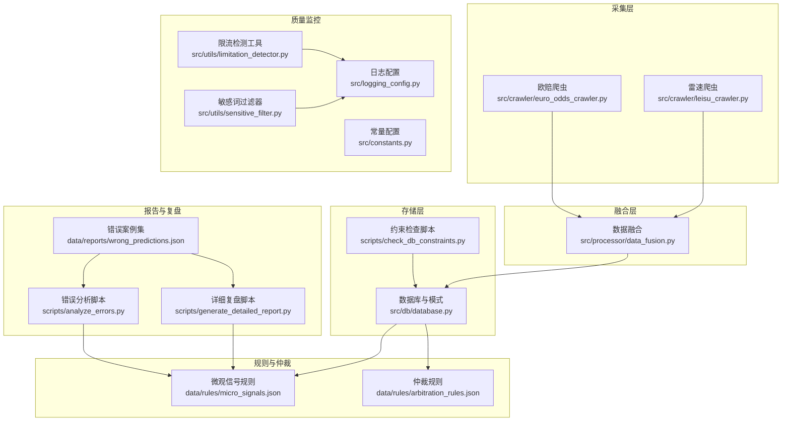
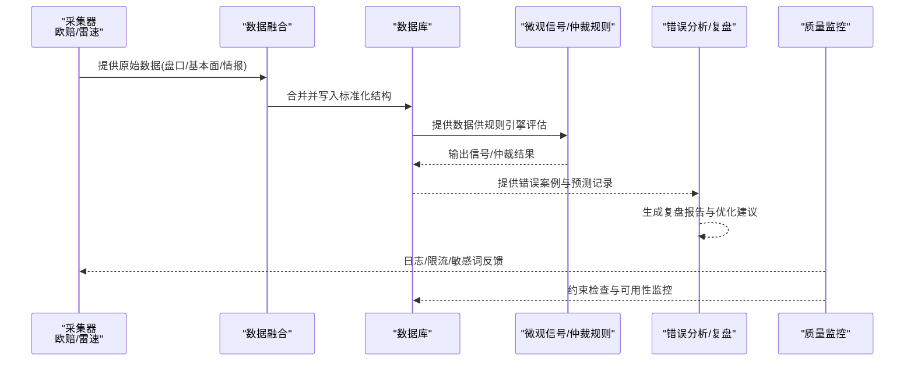
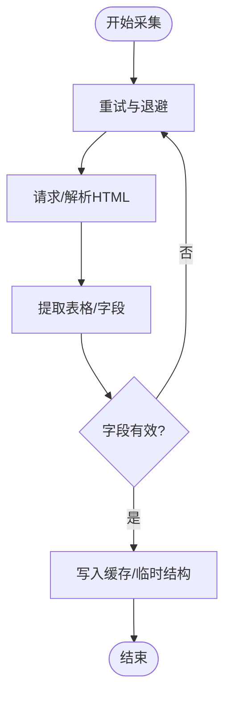
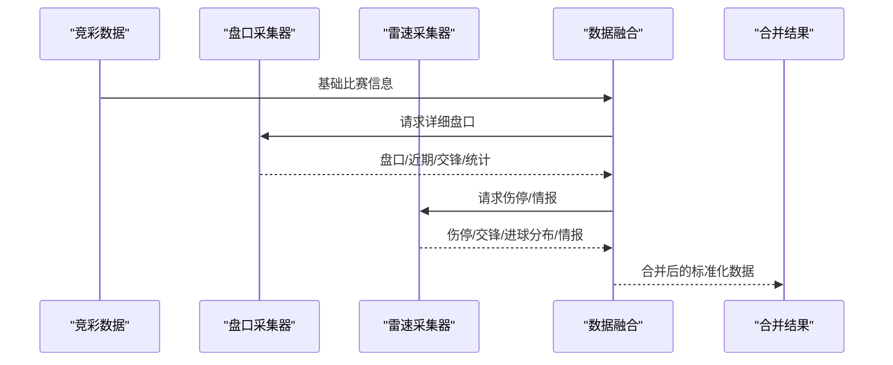
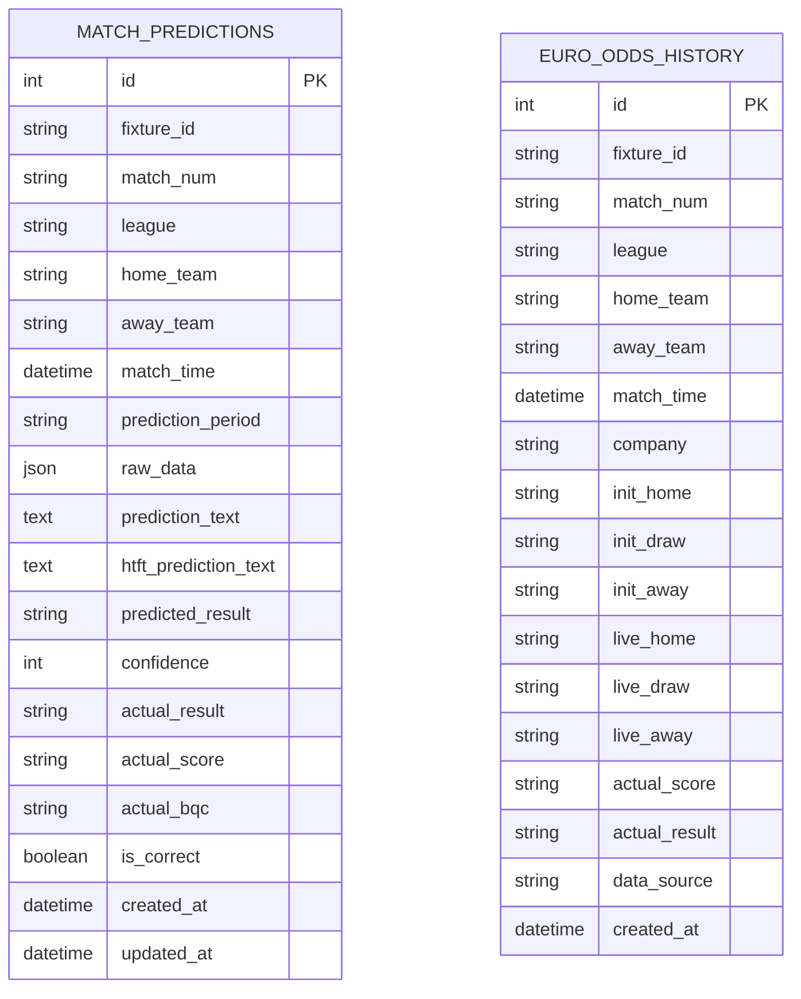
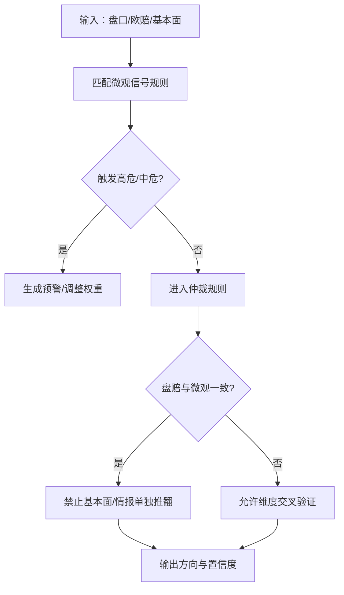
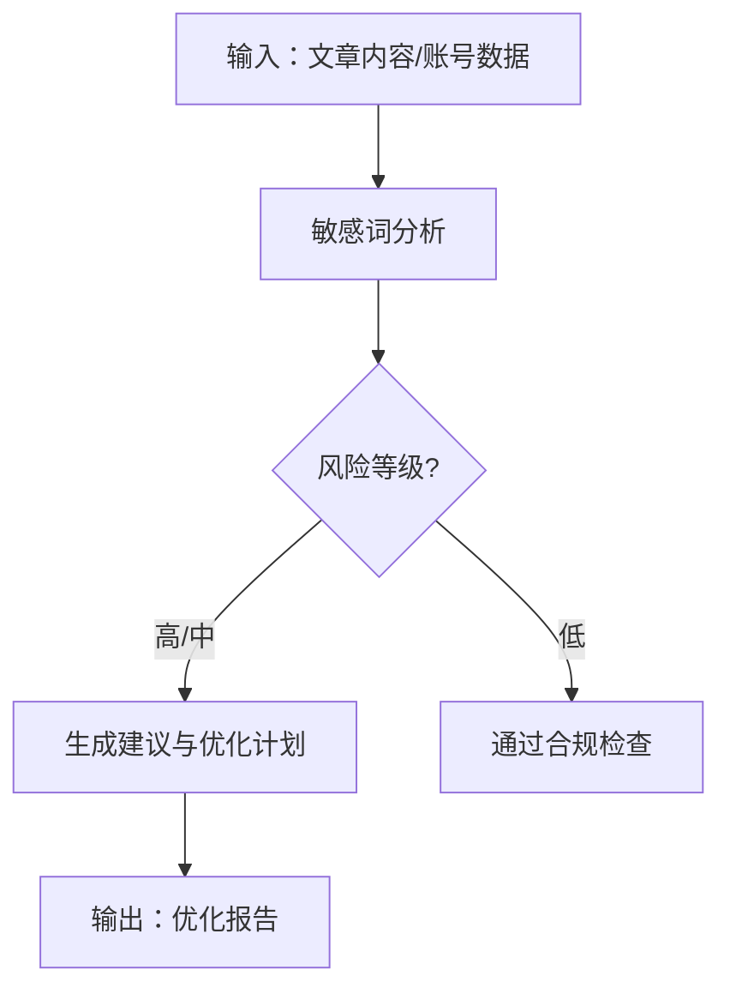
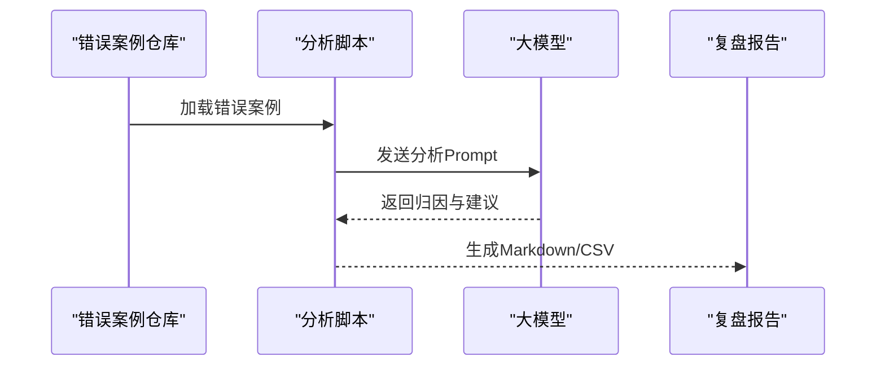
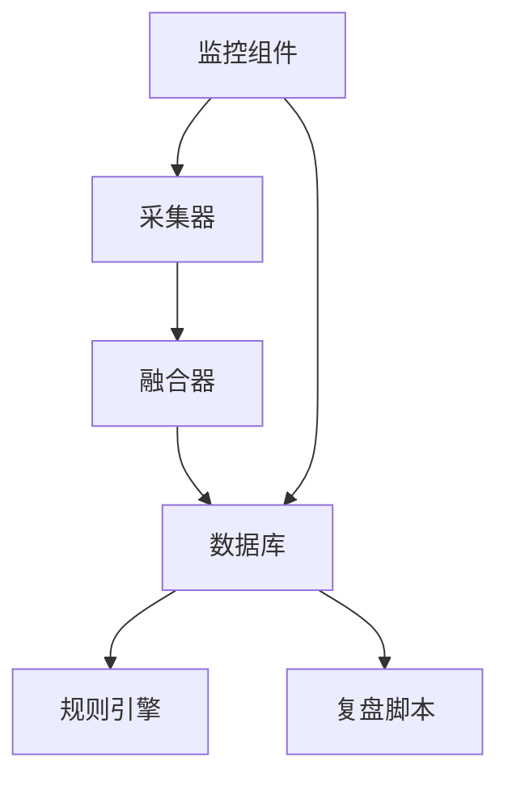

# 数据质量保证

<cite>
**本文引用的文件**
- [src/crawler/euro_odds_crawler.py](file://src/crawler/euro_odds_crawler.py)
- [src/crawler/leisu_crawler.py](file://src/crawler/leisu_crawler.py)
- [src/db/database.py](file://src/db/database.py)
- [src/processor/data_fusion.py](file://src/processor/data_fusion.py)
- [scripts/check_db_constraints.py](file://scripts/check_db_constraints.py)
- [src/utils/limitation_detector.py](file://src/utils/limitation_detector.py)
- [src/utils/sensitive_filter.py](file://src/utils/sensitive_filter.py)
- [scripts/analyze_errors.py](file://scripts/analyze_errors.py)
- [scripts/generate_detailed_report.py](file://scripts/generate_detailed_report.py)
- [data/reports/wrong_predictions.json](file://data/reports/wrong_predictions.json)
- [data/rules/micro_signals.json](file://data/rules/micro_signals.json)
- [data/rules/arbitration_rules.json](file://data/rules/arbitration_rules.json)
- [src/logging_config.py](file://src/logging_config.py)
- [src/constants.py](file://src/constants.py)
</cite>

## 目录
1. [简介](#简介)
2. [项目结构](#项目结构)
3. [核心组件](#核心组件)
4. [架构总览](#架构总览)
5. [详细组件分析](#详细组件分析)
6. [依赖分析](#依赖分析)
7. [性能考量](#性能考量)
8. [故障排查指南](#故障排查指南)
9. [结论](#结论)
10. [附录](#附录)

## 简介
本文件面向多源数据采集与融合场景，构建一套系统化的数据质量保证体系，覆盖数据完整性检查、一致性验证、准确性评估、异常检测、重复处理、清洗策略、数据源可靠性评估、数据时效性监控与可用性保障，并给出指标定义、监控告警机制与自动修复策略，最后提供数据质量改进建议与最佳实践。

## 项目结构
项目围绕“数据采集—数据融合—数据存储—规则与仲裁—报告与复盘—质量监控”闭环展开，关键模块如下：
- 数据采集：欧赔爬虫、雷速体育爬虫
- 数据融合：多源数据合并与增强
- 数据存储：SQLite 模式与约束管理
- 规则与仲裁：微观信号与仲裁规则
- 报告与复盘：错误案例分析与详细复盘
- 质量监控：日志、约束检查、敏感词过滤与限流检测

图表来源
- [src/crawler/euro_odds_crawler.py:1-118](file://src/crawler/euro_odds_crawler.py#L1-118)
- [src/crawler/leisu_crawler.py:1-609](file://src/crawler/leisu_crawler.py#L1-609)
- [src/processor/data_fusion.py:1-108](file://src/processor/data_fusion.py#L1-108)
- [src/db/database.py:1-567](file://src/db/database.py#L1-567)
- [scripts/check_db_constraints.py:1-49](file://scripts/check_db_constraints.py#L1-49)
- [data/rules/micro_signals.json:1-977](file://data/rules/micro_signals.json#L1-977)
- [data/rules/arbitration_rules.json:1-63](file://data/rules/arbitration_rules.json#L1-63)
- [scripts/analyze_errors.py:1-93](file://scripts/analyze_errors.py#L1-93)
- [scripts/generate_detailed_report.py:1-164](file://scripts/generate_detailed_report.py#L1-164)
- [data/reports/wrong_predictions.json:1-238](file://data/reports/wrong_predictions.json#L1-238)
- [src/utils/limitation_detector.py:1-272](file://src/utils/limitation_detector.py#L1-272)
- [src/utils/sensitive_filter.py:1-151](file://src/utils/sensitive_filter.py#L1-151)
- [src/logging_config.py:1-30](file://src/logging_config.py#L1-30)
- [src/constants.py:1-5](file://src/constants.py#L1-5)

章节来源
- [src/crawler/euro_odds_crawler.py:1-118](file://src/crawler/euro_odds_crawler.py#L1-118)
- [src/crawler/leisu_crawler.py:1-609](file://src/crawler/leisu_crawler.py#L1-609)
- [src/processor/data_fusion.py:1-108](file://src/processor/data_fusion.py#L1-108)
- [src/db/database.py:1-567](file://src/db/database.py#L1-567)
- [scripts/check_db_constraints.py:1-49](file://scripts/check_db_constraints.py#L1-49)
- [data/rules/micro_signals.json:1-977](file://data/rules/micro_signals.json#L1-977)
- [data/rules/arbitration_rules.json:1-63](file://data/rules/arbitration_rules.json#L1-63)
- [scripts/analyze_errors.py:1-93](file://scripts/analyze_errors.py#L1-93)
- [scripts/generate_detailed_report.py:1-164](file://scripts/generate_detailed_report.py#L1-164)
- [data/reports/wrong_predictions.json:1-238](file://data/reports/wrong_predictions.json#L1-238)
- [src/utils/limitation_detector.py:1-272](file://src/utils/limitation_detector.py#L1-272)
- [src/utils/sensitive_filter.py:1-151](file://src/utils/sensitive_filter.py#L1-151)
- [src/logging_config.py:1-30](file://src/logging_config.py#L1-30)
- [src/constants.py:1-5](file://src/constants.py#L1-5)

## 核心组件
- 数据采集组件：负责从外部数据源抓取原始数据，包含重试、速率限制应对、异常处理与日志记录。
- 数据融合组件：将多源数据（盘口、基本面、情报）进行合并与增强，确保字段一致性与完整性。
- 数据存储组件：定义数据模型、约束与列兼容性，提供保存、查询与更新接口。
- 规则与仲裁组件：通过微观信号与仲裁规则对预测方向进行纠偏与保护，降低误判风险。
- 报告与复盘组件：基于错误案例进行深度分析，输出复盘报告与优化建议。
- 质量监控组件：日志、约束检查、敏感词过滤与限流检测，保障数据与内容质量。

章节来源
- [src/crawler/euro_odds_crawler.py:17-110](file://src/crawler/euro_odds_crawler.py#L17-110)
- [src/crawler/leisu_crawler.py:284-321](file://src/crawler/leisu_crawler.py#L284-321)
- [src/processor/data_fusion.py:61-107](file://src/processor/data_fusion.py#L61-107)
- [src/db/database.py:200-562](file://src/db/database.py#L200-562)
- [data/rules/micro_signals.json:1-977](file://data/rules/micro_signals.json#L1-977)
- [data/rules/arbitration_rules.json:1-63](file://data/rules/arbitration_rules.json#L1-63)
- [scripts/analyze_errors.py:13-92](file://scripts/analyze_errors.py#L13-92)
- [scripts/generate_detailed_report.py:12-163](file://scripts/generate_detailed_report.py#L12-163)
- [src/utils/limitation_detector.py:17-230](file://src/utils/limitation_detector.py#L17-230)
- [src/utils/sensitive_filter.py:77-110](file://src/utils/sensitive_filter.py#L77-110)
- [src/logging_config.py:8-29](file://src/logging_config.py#L8-29)

## 架构总览
下图展示从采集到存储、规则应用与复盘的端到端流程，强调数据质量控制的关键节点与回路。

图表来源
- [src/crawler/euro_odds_crawler.py:17-110](file://src/crawler/euro_odds_crawler.py#L17-110)
- [src/crawler/leisu_crawler.py:284-321](file://src/crawler/leisu_crawler.py#L284-321)
- [src/processor/data_fusion.py:61-107](file://src/processor/data_fusion.py#L61-107)
- [src/db/database.py:256-539](file://src/db/database.py#L256-539)
- [data/rules/micro_signals.json:1-977](file://data/rules/micro_signals.json#L1-977)
- [data/rules/arbitration_rules.json:1-63](file://data/rules/arbitration_rules.json#L1-63)
- [scripts/analyze_errors.py:28-92](file://scripts/analyze_errors.py#L28-92)
- [src/utils/limitation_detector.py:209-230](file://src/utils/limitation_detector.py#L209-230)
- [src/utils/sensitive_filter.py:93-110](file://src/utils/sensitive_filter.py#L93-110)
- [src/logging_config.py:8-29](file://src/logging_config.py#L8-29)

## 详细组件分析

### 数据采集与质量控制
- 欧赔采集器：具备重试与延迟策略、表格解析与字段校验、异常捕获与日志记录，确保在限流与页面结构变化下仍能稳定产出结构化数据。
- 雷速采集器：采用浏览器自动化，支持匿名/登录模式、验证码检测与人工确认、子进程隔离执行，保障在复杂页面与反爬机制下的稳定性。

图表来源
- [src/crawler/euro_odds_crawler.py:17-110](file://src/crawler/euro_odds_crawler.py#L17-110)
- [src/crawler/leisu_crawler.py:284-321](file://src/crawler/leisu_crawler.py#L284-321)

章节来源
- [src/crawler/euro_odds_crawler.py:17-110](file://src/crawler/euro_odds_crawler.py#L17-110)
- [src/crawler/leisu_crawler.py:284-321](file://src/crawler/leisu_crawler.py#L284-321)

### 数据融合与一致性
- 融合流程：对每场比赛注入盘口、基本面与雷速情报，统一字段命名与数据结构，避免重复字段与冲突。
- 一致性策略：以 fixture_id 为键进行聚合，缺失数据时保留已有字段，新增字段增量合并，保证历史记录不被覆盖。

图表来源
- [src/processor/data_fusion.py:61-107](file://src/processor/data_fusion.py#L61-107)

章节来源
- [src/processor/data_fusion.py:61-107](file://src/processor/data_fusion.py#L61-107)

### 数据存储与完整性
- 模式设计：统一使用 JSON 字段存储原始数据，便于扩展；关键字段如 fixture_id、match_time、raw_data 等确保可追溯与可审计。
- 约束与兼容：运行期自动补齐列，避免因迁移导致的历史数据不一致；提供查询接口按时间段与 fixture_id 精确检索。
- 约束检查：脚本可检查表结构、索引与 SQL 约束，辅助发现潜在问题。

图表来源
- [src/db/database.py:68-198](file://src/db/database.py#L68-198)

章节来源
- [src/db/database.py:200-562](file://src/db/database.py#L200-562)
- [scripts/check_db_constraints.py:1-49](file://scripts/check_db_constraints.py#L1-49)

### 异常检测与重复处理
- 微观信号规则：覆盖升盘升水、降水不升盘、平半退平手低水、深盘硬挺等多种陷阱形态，提供高危/中危/关注三级预警，指导方向纠偏。
- 仲裁规则：在盘赔与微观信号一致时，禁止基本面/情报单独推翻市场方向，避免误判；在信息真空时直接回避预测。
- 重复数据处理：以 fixture_id + prediction_period 为维度进行去重与优先级排序，确保同一场比赛不同时间段的预测有序叠加。

图表来源
- [data/rules/micro_signals.json:1-977](file://data/rules/micro_signals.json#L1-977)
- [data/rules/arbitration_rules.json:1-63](file://data/rules/arbitration_rules.json#L1-63)

章节来源
- [data/rules/micro_signals.json:1-977](file://data/rules/micro_signals.json#L1-977)
- [data/rules/arbitration_rules.json:1-63](file://data/rules/arbitration_rules.json#L1-63)

### 数据清洗与内容合规
- 敏感词过滤：提供长词优先替换策略，支持批量处理与词库导出，避免内容违规。
- 限流检测：对文章内容敏感词、账号健康度、阅读趋势与违规记录进行评估，生成优化建议与监控仪表盘阈值。

图表来源
- [src/utils/sensitive_filter.py:77-110](file://src/utils/sensitive_filter.py#L77-110)
- [src/utils/limitation_detector.py:38-230](file://src/utils/limitation_detector.py#L38-230)

章节来源
- [src/utils/sensitive_filter.py:77-110](file://src/utils/sensitive_filter.py#L77-110)
- [src/utils/limitation_detector.py:38-230](file://src/utils/limitation_detector.py#L38-230)

### 准确性评估与复盘
- 错误案例收集：从报告中抽取错误预测案例，整理为结构化输入。
- 大模型复盘：针对冷门与赢球输盘案例，生成盘口调度致死原因与微观信号修正规则。
- 详细复盘：统计命中率、逐场复盘、导出 Markdown 与 CSV，便于审计与改进。

图表来源
- [scripts/analyze_errors.py:13-92](file://scripts/analyze_errors.py#L13-92)
- [scripts/generate_detailed_report.py:12-163](file://scripts/generate_detailed_report.py#L12-163)
- [data/reports/wrong_predictions.json:1-238](file://data/reports/wrong_predictions.json#L1-238)

章节来源
- [scripts/analyze_errors.py:13-92](file://scripts/analyze_errors.py#L13-92)
- [scripts/generate_detailed_report.py:12-163](file://scripts/generate_detailed_report.py#L12-163)
- [data/reports/wrong_predictions.json:1-238](file://data/reports/wrong_predictions.json#L1-238)

## 依赖分析
- 组件耦合：采集器与融合器松耦合，通过标准化字段对接；存储层为规则与复盘提供统一数据源；监控组件独立于业务流程，提供横切质量保障。
- 外部依赖：日志库、数据库驱动、网络请求库、浏览器自动化库；规则与报告依赖 JSON 配置文件。
- 潜在风险：爬虫对站点结构与反爬策略敏感；规则与仲裁依赖历史复盘数据的质量；日志与监控需持续维护与更新。

图表来源
- [src/crawler/euro_odds_crawler.py:17-110](file://src/crawler/euro_odds_crawler.py#L17-110)
- [src/crawler/leisu_crawler.py:284-321](file://src/crawler/leisu_crawler.py#L284-321)
- [src/processor/data_fusion.py:61-107](file://src/processor/data_fusion.py#L61-107)
- [src/db/database.py:256-539](file://src/db/database.py#L256-539)
- [data/rules/micro_signals.json:1-977](file://data/rules/micro_signals.json#L1-977)
- [data/rules/arbitration_rules.json:1-63](file://data/rules/arbitration_rules.json#L1-63)
- [scripts/analyze_errors.py:28-92](file://scripts/analyze_errors.py#L28-92)
- [scripts/generate_detailed_report.py:29-163](file://scripts/generate_detailed_report.py#L29-163)
- [src/logging_config.py:8-29](file://src/logging_config.py#L8-29)

章节来源
- [src/crawler/euro_odds_crawler.py:17-110](file://src/crawler/euro_odds_crawler.py#L17-110)
- [src/crawler/leisu_crawler.py:284-321](file://src/crawler/leisu_crawler.py#L284-321)
- [src/processor/data_fusion.py:61-107](file://src/processor/data_fusion.py#L61-107)
- [src/db/database.py:256-539](file://src/db/database.py#L256-539)
- [data/rules/micro_signals.json:1-977](file://data/rules/micro_signals.json#L1-977)
- [data/rules/arbitration_rules.json:1-63](file://data/rules/arbitration_rules.json#L1-63)
- [scripts/analyze_errors.py:28-92](file://scripts/analyze_errors.py#L28-92)
- [scripts/generate_detailed_report.py:29-163](file://scripts/generate_detailed_report.py#L29-163)
- [src/logging_config.py:8-29](file://src/logging_config.py#L8-29)

## 性能考量
- 爬虫性能：通过重试与退避、并发与线程池、子进程隔离等方式提升稳定性与吞吐；建议对热点资源设置缓存与限速。
- 数据库性能：为常用查询字段建立索引，避免全表扫描；批量写入减少事务开销；定期清理历史冗余数据。
- 规则评估：将规则预编译为可执行条件，减少运行时计算；对高频规则采用索引字段快速过滤。
- 复盘与报告：对大文件分批处理，避免内存峰值；导出 CSV 时采用追加写入，降低锁竞争。

## 故障排查指南
- 爬虫失败：检查网络与代理、Cookies 有效性、验证码弹窗、页面结构变更；查看日志定位异常。
- 数据库异常：使用约束检查脚本核对表结构与索引；确认列兼容性与数据类型；必要时回滚迁移。
- 规则误判：核对微观信号与仲裁规则的触发条件；结合错误案例复盘，调整阈值与权重。
- 内容合规：使用敏感词过滤器批量处理；根据限流检测报告调整文案与发布策略。
- 日志与监控：检查日志轮转与权限；确认监控阈值与告警通道；定期巡检系统可用性。

章节来源
- [scripts/check_db_constraints.py:1-49](file://scripts/check_db_constraints.py#L1-49)
- [src/utils/limitation_detector.py:209-230](file://src/utils/limitation_detector.py#L209-230)
- [src/utils/sensitive_filter.py:93-110](file://src/utils/sensitive_filter.py#L93-110)
- [src/logging_config.py:8-29](file://src/logging_config.py#L8-29)

## 结论
通过“采集—融合—存储—规则—复盘—监控”的闭环，项目实现了对多源数据的系统化质量控制。微观信号与仲裁规则有效降低了误判风险；错误复盘与报告机制推动持续改进；日志与约束检查保障了系统的可观测性与稳定性。建议进一步完善自动化修复与灰度发布机制，持续迭代规则与阈值，提升整体数据质量与预测准确性。

## 附录

### 数据质量指标定义
- 数据完整性
  - 字段覆盖率：关键字段（fixture_id、match_time、raw_data 等）的非空比例
  - 采集成功率：成功采集条目 / 总请求次数
- 数据一致性
  - 结构一致性：字段类型与命名规范的一致比例
  - 冲突检测：重复键冲突与字段冲突比率
- 数据准确性
  - 命中率：正确预测场次 / 总预测场次
  - 冷门命中率：冷门预测命中场次 / 冷门总场次
- 异常检测
  - 高危信号触发率：触发高危信号的场次 / 总场次
  - 误判率：误判场次 / 总场次
- 可用性与时效性
  - 数据新鲜度：最新数据时间与预期时间差
  - 系统可用性：正常运行时间 / 总时间
  - 规则生效率：规则被触发并影响决策的比例

### 监控告警机制
- 日志监控：统一日志格式与轮转，关键错误与异常告警
- 数据监控：字段覆盖率、采集成功率、命中率、冷门命中率等指标阈值告警
- 规则监控：规则触发频率与误判率统计，异常波动告警
- 内容监控：敏感词命中率、账号健康度、阅读趋势异常告警

### 自动修复策略
- 采集层：自动重试、验证码处理、子进程隔离、降级策略
- 存储层：自动列补齐、索引重建、数据归档与清理
- 规则层：规则版本回滚、阈值动态调整、人工仲裁介入
- 报告层：自动复盘与报告生成、CSV 导出与通知

### 数据质量改进建议与最佳实践
- 建立数据质量门禁：采集前字段校验、结构校验与异常拦截
- 规则持续迭代：基于错误案例与复盘报告定期优化微观信号与仲裁规则
- 多源交叉验证：引入更多数据源与交叉验证机制，降低单一来源偏差
- 自动化修复与灰度发布：对规则与阈值变更进行灰度测试与回滚预案
- 文档化与培训：完善规则文档与操作手册，定期开展质量意识培训