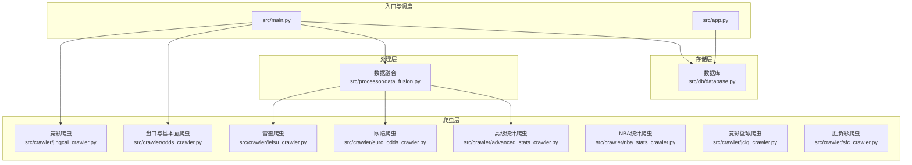
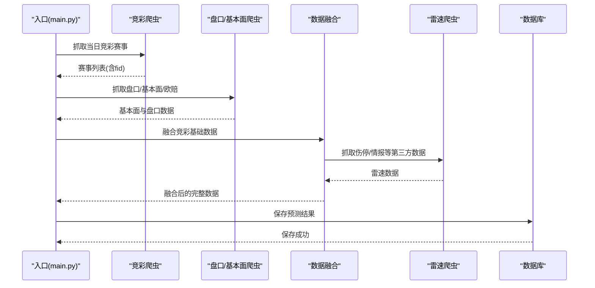
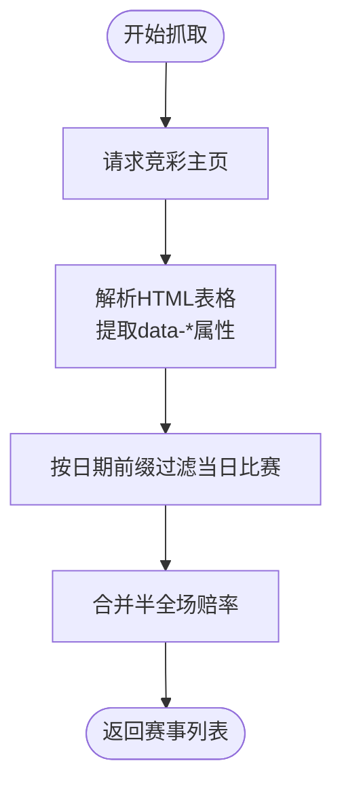
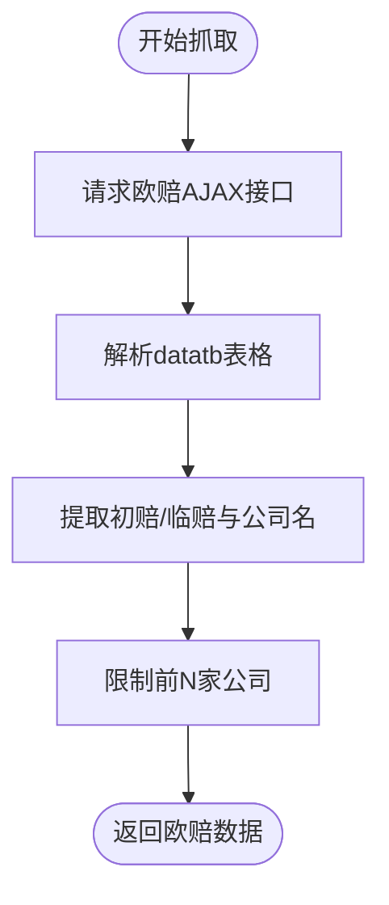
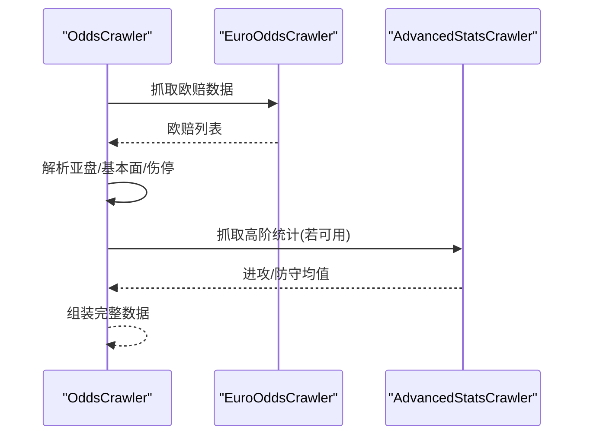
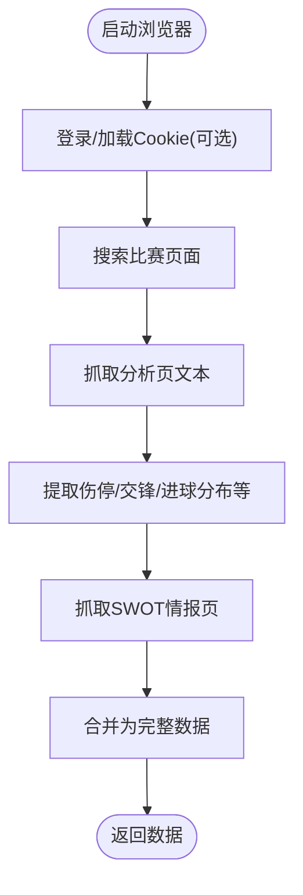
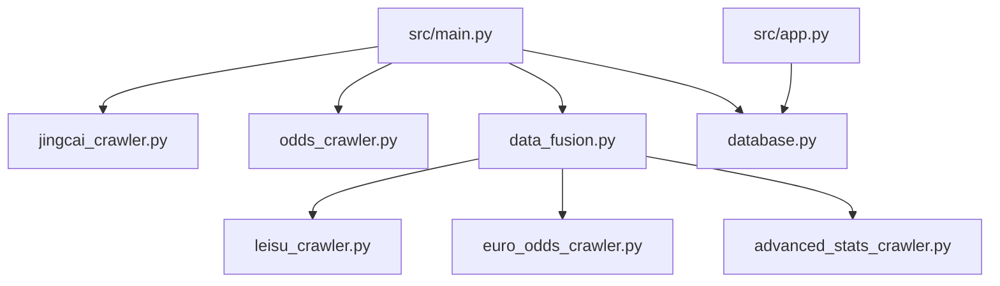

# 数据采集系统

<cite>
**本文档引用的文件**
- [src/main.py](file://src/main.py)
- [src/app.py](file://src/app.py)
- [src/crawler/jingcai_crawler.py](file://src/crawler/jingcai_crawler.py)
- [src/crawler/euro_odds_crawler.py](file://src/crawler/euro_odds_crawler.py)
- [src/crawler/odds_crawler.py](file://src/crawler/odds_crawler.py)
- [src/crawler/leisu_crawler.py](file://src/crawler/leisu_crawler.py)
- [src/crawler/advanced_stats_crawler.py](file://src/crawler/advanced_stats_crawler.py)
- [src/crawler/nba_stats_crawler.py](file://src/crawler/nba_stats_crawler.py)
- [src/crawler/jclq_crawler.py](file://src/crawler/jclq_crawler.py)
- [src/crawler/sfc_crawler.py](file://src/crawler/sfc_crawler.py)
- [src/processor/data_fusion.py](file://src/processor/data_fusion.py)
- [src/db/database.py](file://src/db/database.py)
- [config/.env](file://config/.env)
- [src/constants.py](file://src/constants.py)
</cite>

## 目录
1. [简介](#简介)
2. [项目结构](#项目结构)
3. [核心组件](#核心组件)
4. [架构概览](#架构概览)
5. [详细组件分析](#详细组件分析)
6. [依赖分析](#依赖分析)
7. [性能考虑](#性能考虑)
8. [故障排除指南](#故障排除指南)
9. [结论](#结论)
10. [附录](#附录)

## 简介
本系统是一个多源数据采集与预测平台，专注于竞彩官方数据、第三方盘口、伤停信息与基本面统计的整合。系统通过多个爬虫模块抓取来自竞彩官网、500彩票网、雷速体育、API-Sports 等数据源的信息，经过数据融合与清洗后，驱动大模型进行预测，并将结果持久化到数据库。系统同时支持足球与篮球两大类别的赛事预测，具备良好的扩展性与可维护性。

## 项目结构
系统采用模块化设计，主要分为以下层次：
- 入口与调度层：负责整体流程编排与调度
- 爬虫层：负责从各数据源抓取原始数据
- 处理层：负责数据融合与预处理
- 存储层：负责结构化数据的持久化
- 应用层：提供 Web 界面与登录鉴权

**图表来源**
- [src/main.py:34-136](file://src/main.py#L34-L136)
- [src/processor/data_fusion.py:57-108](file://src/processor/data_fusion.py#L57-L108)
- [src/db/database.py:200-308](file://src/db/database.py#L200-L308)

**章节来源**
- [src/main.py:34-136](file://src/main.py#L34-L136)
- [src/app.py:110-166](file://src/app.py#L110-L166)

## 核心组件
- 竞彩官方数据爬虫：抓取竞彩当日赛事、赔率与历史赛果，支持胜平负、让球胜平负、半全场等玩法。
- 欧赔与亚指爬虫：抓取欧赔初赔与临赔、亚盘盘口与即时盘口，用于盘口变化分析。
- 雷速体育爬虫：基于 Playwright 的浏览器自动化，抓取伤停、交锋、进球分布、半全场等情报。
- 高级统计爬虫：对接 API-Sports 获取高阶技术统计（如场均射门、射正、xG 等），作为基本面补充。
- NBA 统计爬虫：抓取 NAB 球队伤停与战绩，支撑竞彩篮球预测。
- 数据融合器：将多源数据进行结构化融合，形成统一的预测输入。
- 数据库：提供结构化存储、查询与复盘功能，支持足球、篮球、胜负彩等多场景。

**章节来源**
- [src/crawler/jingcai_crawler.py:13-47](file://src/crawler/jingcai_crawler.py#L13-L47)
- [src/crawler/euro_odds_crawler.py:17-111](file://src/crawler/euro_odds_crawler.py#L17-L111)
- [src/crawler/leisu_crawler.py:284-322](file://src/crawler/leisu_crawler.py#L284-L322)
- [src/crawler/advanced_stats_crawler.py:82-114](file://src/crawler/advanced_stats_crawler.py#L82-L114)
- [src/crawler/nba_stats_crawler.py:71-125](file://src/crawler/nba_stats_crawler.py#L71-L125)
- [src/processor/data_fusion.py:57-108](file://src/processor/data_fusion.py#L57-L108)
- [src/db/database.py:68-147](file://src/db/database.py#L68-L147)

## 架构概览
系统采用“入口调度 → 多源爬取 → 数据融合 → 预测分析 → 结果存储”的流水线架构。入口脚本负责协调各模块，爬虫模块分别处理不同数据源，数据融合器统一结构化数据，数据库持久化预测结果与历史数据。

**图表来源**
- [src/main.py:40-70](file://src/main.py#L40-L70)
- [src/processor/data_fusion.py:61-107](file://src/processor/data_fusion.py#L61-L107)
- [src/db/database.py:256-304](file://src/db/database.py#L256-L304)

## 详细组件分析

### 竞彩官方数据爬虫
- 功能：抓取竞彩当日赛事列表（胜平负、让球胜平负、半全场），支持历史赛果与指定日期的历史数据。
- 数据源：500彩票网竞彩板块。
- 特点：解析 HTML 表格，提取 data-* 属性，兼容多玩法赔率与日期筛选。

**图表来源**
- [src/crawler/jingcai_crawler.py:13-47](file://src/crawler/jingcai_crawler.py#L13-L47)
- [src/crawler/jingcai_crawler.py:49-148](file://src/crawler/jingcai_crawler.py#L49-L148)

**章节来源**
- [src/crawler/jingcai_crawler.py:13-47](file://src/crawler/jingcai_crawler.py#L13-L47)
- [src/crawler/jingcai_crawler.py:150-231](file://src/crawler/jingcai_crawler.py#L150-L231)
- [src/crawler/jingcai_crawler.py:233-323](file://src/crawler/jingcai_crawler.py#L233-L323)

### 欧赔与亚指爬虫
- 功能：抓取欧赔初赔与临赔，解析亚盘盘口与即时盘口。
- 数据源：500彩票网欧赔与亚盘分析页。
- 特点：针对竞彩官方/威廉希尔/澳门/立博/bet365 等主流公司进行筛选与解析。

**图表来源**
- [src/crawler/euro_odds_crawler.py:17-111](file://src/crawler/euro_odds_crawler.py#L17-L111)

**章节来源**
- [src/crawler/euro_odds_crawler.py:17-111](file://src/crawler/euro_odds_crawler.py#L17-L111)

### 盘口与基本面爬虫
- 功能：抓取亚洲盘口、基本面（近期战绩、积分排名、交锋历史、伤停阵容）与高阶统计。
- 数据源：500彩票网基本面分析页、API-Sports。
- 特点：组合多个数据源，提供更全面的预测输入。

**图表来源**
- [src/crawler/odds_crawler.py:17-161](file://src/crawler/odds_crawler.py#L17-L161)
- [src/crawler/advanced_stats_crawler.py:82-114](file://src/crawler/advanced_stats_crawler.py#L82-L114)

**章节来源**
- [src/crawler/odds_crawler.py:17-161](file://src/crawler/odds_crawler.py#L17-L161)
- [src/crawler/advanced_stats_crawler.py:82-114](file://src/crawler/advanced_stats_crawler.py#L82-L114)

### 雷速体育爬虫
- 功能：基于 Playwright 的浏览器自动化，抓取伤停、交锋、进球分布、半全场与 SWOT 情报。
- 数据源：雷速体育 guide 与分析页。
- 特点：支持匿名模式与 Cookie 管理，具备验证码检测与降级处理。

**图表来源**
- [src/crawler/leisu_crawler.py:284-322](file://src/crawler/leisu_crawler.py#L284-L322)
- [src/crawler/leisu_crawler.py:410-460](file://src/crawler/leisu_crawler.py#L410-L460)
- [src/crawler/leisu_crawler.py:538-582](file://src/crawler/leisu_crawler.py#L538-L582)

**章节来源**
- [src/crawler/leisu_crawler.py:284-322](file://src/crawler/leisu_crawler.py#L284-L322)
- [src/crawler/leisu_crawler.py:410-460](file://src/crawler/leisu_crawler.py#L410-L460)
- [src/crawler/leisu_crawler.py:538-582](file://src/crawler/leisu_crawler.py#L538-L582)

### NBA 统计爬虫
- 功能：抓取 NBA 球队伤停与战绩，支持中文队名映射。
- 数据源：ESPN API。
- 特点：构建队名到 ID 的映射，提升匹配准确度。

**章节来源**
- [src/crawler/nba_stats_crawler.py:71-125](file://src/crawler/nba_stats_crawler.py#L71-L125)

### 数据融合器
- 功能：将竞彩基础数据与第三方盘口/基本面数据进行融合，支持可选的雷速数据增强。
- 特点：按比赛维度合并字段，避免缺失数据影响整体流程。

**章节来源**
- [src/processor/data_fusion.py:57-108](file://src/processor/data_fusion.py#L57-L108)

### 数据库
- 功能：提供结构化存储、查询与复盘能力，支持足球、篮球、胜负彩等多场景。
- 特点：支持时间段标识（pre_24h、pre_12h、final）、预测结果解析与保存。

**章节来源**
- [src/db/database.py:68-147](file://src/db/database.py#L68-L147)
- [src/db/database.py:256-304](file://src/db/database.py#L256-L304)

## 依赖分析
系统模块间依赖清晰，入口脚本负责编排，爬虫模块相对独立，处理层负责融合，存储层提供统一接口。

**图表来源**
- [src/main.py:25-32](file://src/main.py#L25-L32)
- [src/processor/data_fusion.py:5-16](file://src/processor/data_fusion.py#L5-L16)
- [src/db/database.py:200-217](file://src/db/database.py#L200-L217)

**章节来源**
- [src/main.py:25-32](file://src/main.py#L25-L32)
- [src/processor/data_fusion.py:5-16](file://src/processor/data_fusion.py#L5-L16)
- [src/db/database.py:200-217](file://src/db/database.py#L200-L217)

## 性能考虑
- 爬虫并发与限速：欧赔爬虫内置重试与递增等待，避免被限流；竞彩爬虫解析 HTML 时尽量使用结构化选择器，减少不必要的遍历。
- 浏览器自动化：雷速爬虫使用线程池与专用工作线程，避免与 Streamlit 事件循环冲突；支持子进程隔离执行，降低环境兼容性问题。
- 数据缓存：高级统计爬虫对球队 ID 进行缓存，减少重复搜索；数据库提供列补齐逻辑，避免迁移导致的兼容问题。
- 存储优化：数据库采用 JSON 字段存储原始数据，便于扩展；按时间段标识区分预测版本，支持历史回溯。

**章节来源**
- [src/crawler/euro_odds_crawler.py:28-33](file://src/crawler/euro_odds_crawler.py#L28-L33)
- [src/crawler/leisu_crawler.py:42-56](file://src/crawler/leisu_crawler.py#L42-L56)
- [src/crawler/advanced_stats_crawler.py:25-48](file://src/crawler/advanced_stats_crawler.py#L25-L48)
- [src/db/database.py:219-233](file://src/db/database.py#L219-L233)

## 故障排除指南
- 竞彩数据为空：检查目标日期与页面结构是否发生变化；确认网络请求状态码与编码设置。
- 欧赔解析失败：关注 datatb 表格是否存在、行数与列数是否满足预期；必要时调整选择器或增加容错。
- 雷速验证码：系统检测验证码并提示人工处理；可尝试更换代理或延后重试。
- API-Sports 未配置：若未配置 FOOTBALL_API_KEY，高级统计将返回空数据，系统会自动降级到 500 网基本面数据。
- 数据库连接失败：检查 DATABASE_URL 与 SQLite 文件路径；确保目录存在且有写权限。

**章节来源**
- [src/crawler/jingcai_crawler.py:20-27](file://src/crawler/jingcai_crawler.py#L20-L27)
- [src/crawler/euro_odds_crawler.py:40-46](file://src/crawler/euro_odds_crawler.py#L40-L46)
- [src/crawler/leisu_crawler.py:146-159](file://src/crawler/leisu_crawler.py#L146-L159)
- [src/crawler/advanced_stats_crawler.py:90-92](file://src/crawler/advanced_stats_crawler.py#L90-L92)
- [src/db/database.py:200-217](file://src/db/database.py#L200-L217)

## 结论
本系统通过多源数据采集与融合，构建了从数据获取到预测分析再到结果存储的完整链路。系统具备良好的扩展性与稳定性，能够适应不同数据源的变化与业务需求的增长。建议在生产环境中进一步完善监控与告警机制，并持续优化数据质量与反爬虫策略。

## 附录
- 环境变量配置示例：API 密钥、数据库地址、消息推送等。
- 登录鉴权：基于 URL Token 的短期鉴权，支持角色与有效期控制。
- Web 应用：提供登录界面与预测看板，支持跳转与状态恢复。

**章节来源**
- [config/.env:1-20](file://config/.env#L1-L20)
- [src/constants.py:3-4](file://src/constants.py#L3-L4)
- [src/app.py:64-82](file://src/app.py#L64-L82)
- [src/app.py:110-166](file://src/app.py#L110-L166)