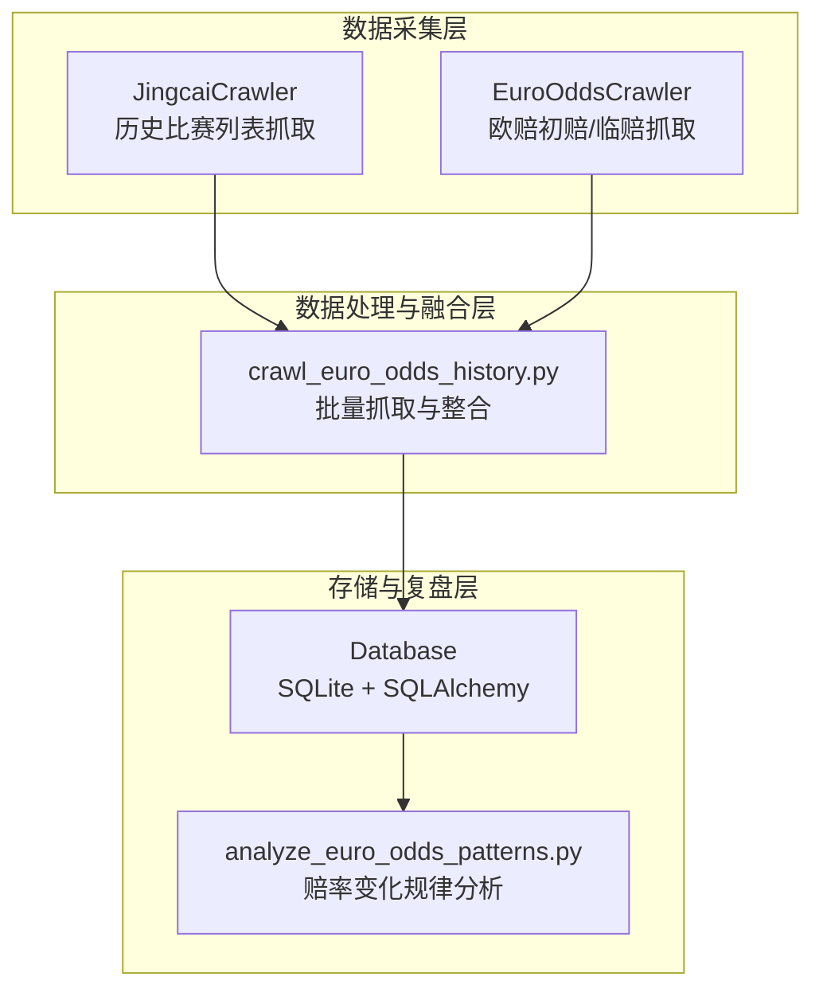
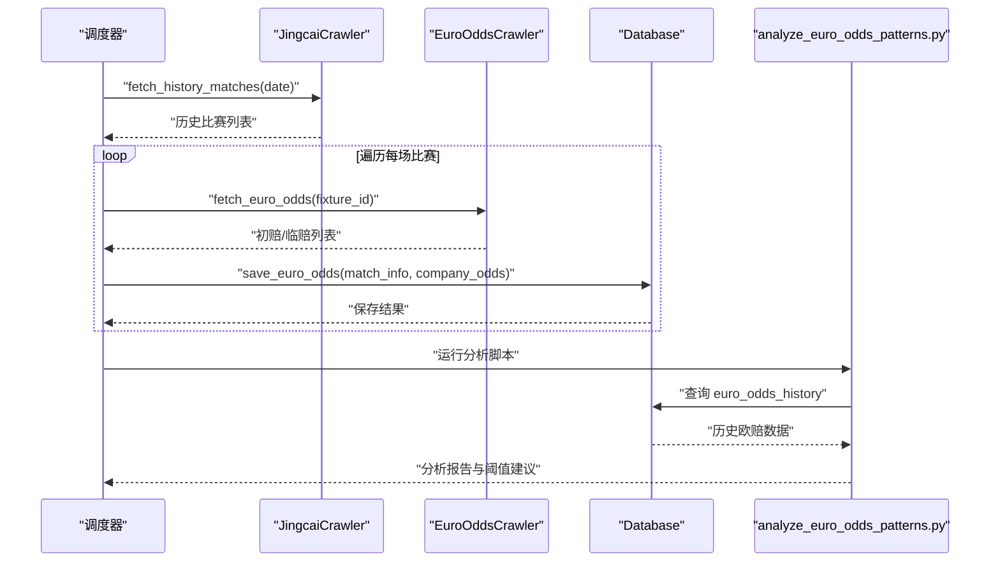
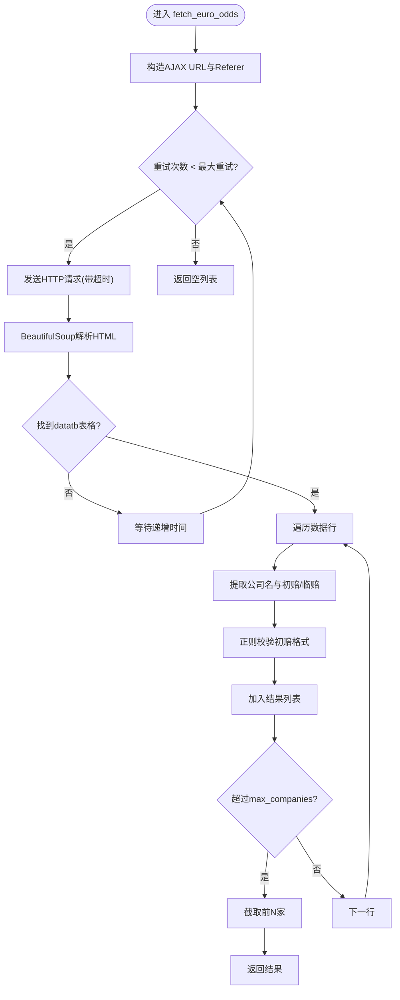
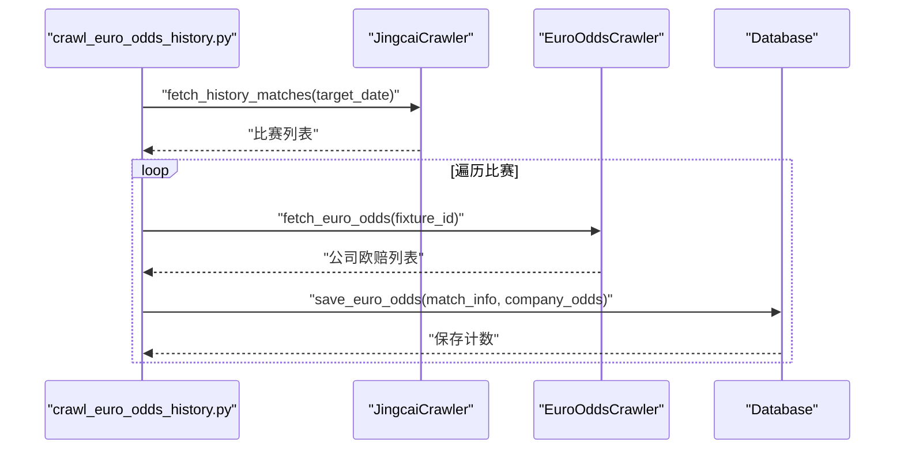
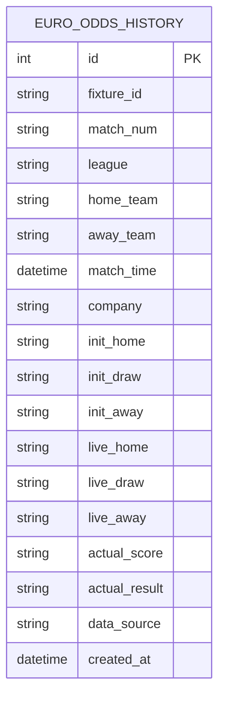
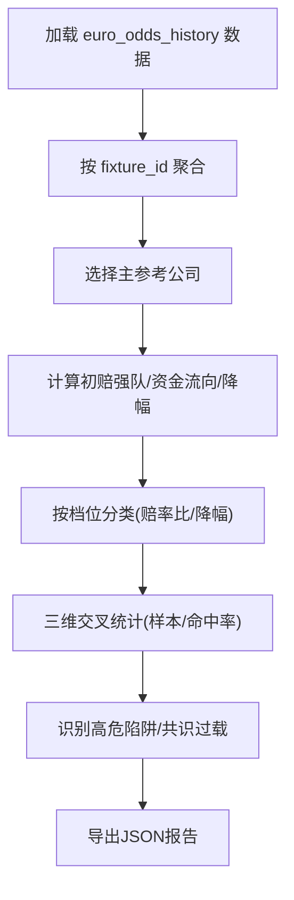
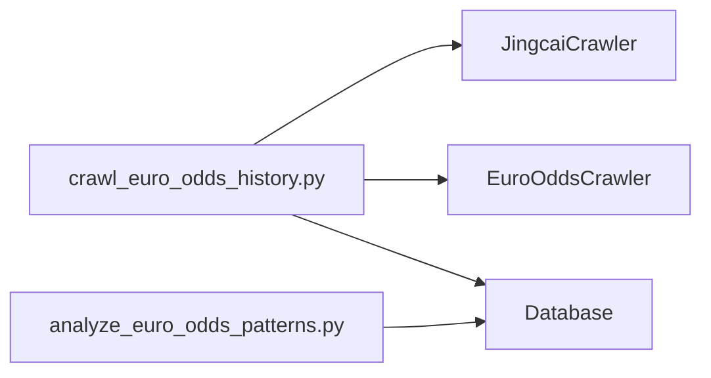
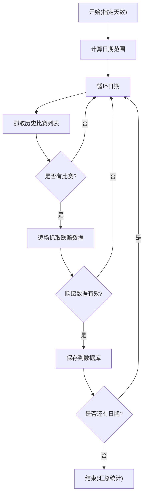

# 欧洲赔率历史爬虫

<cite>
**本文引用的文件**
- [euro_odds_crawler.py](file://src/crawler/euro_odds_crawler.py)
- [crawl_euro_odds_history.py](file://scripts/crawl_euro_odds_history.py)
- [database.py](file://src/db/database.py)
- [analyze_euro_odds_patterns.py](file://scripts/analyze_euro_odds_patterns.py)
- [jingcai_crawler.py](file://src/crawler/jingcai_crawler.py)
- [2026-05-01-euro-odds-history-analysis.md](file://docs/plans/2026-05-01-euro-odds-history-analysis.md)
- [euro_odds_pattern_analysis.json](file://data/reports/euro_odds_pattern_analysis.json)
- [README.md](file://README.md)
</cite>

## 目录
1. [简介](#简介)
2. [项目结构](#项目结构)
3. [核心组件](#核心组件)
4. [架构概览](#架构概览)
5. [详细组件分析](#详细组件分析)
6. [依赖关系分析](#依赖关系分析)
7. [性能考量](#性能考量)
8. [故障排查指南](#故障排查指南)
9. [结论](#结论)
10. [附录](#附录)

## 简介
本文件面向欧洲赔率历史爬虫系统，系统目标是从500.com抓取历史比赛的欧赔初赔与临赔数据，并结合赛果进行赔率变化趋势分析、异常波动检测与数据完整性验证，最终形成可用于模型训练与回测的历史数据集。本文档覆盖历史数据获取机制、数据格式转换、长期存储策略、趋势分析与异常检测、数据完整性校验、模型训练与回测应用，以及数据备份、版本管理与恢复机制。

## 项目结构
系统采用分层架构，主要由数据采集层、数据处理与融合层、存储与复盘层构成。欧洲赔率历史爬虫位于数据采集层，负责从500.com抓取欧赔数据并持久化到SQLite数据库；随后通过分析脚本对历史数据进行多维交叉分析，输出可指导规则制定的洞察。

图表来源
- [jingcai_crawler.py:233-323](file://src/crawler/jingcai_crawler.py#L233-L323)
- [euro_odds_crawler.py:17-111](file://src/crawler/euro_odds_crawler.py#L17-L111)
- [crawl_euro_odds_history.py:43-112](file://scripts/crawl_euro_odds_history.py#L43-L112)
- [database.py:176-198](file://src/db/database.py#L176-L198)
- [analyze_euro_odds_patterns.py:49-80](file://scripts/analyze_euro_odds_patterns.py#L49-L80)

章节来源
- [README.md:1-41](file://README.md#L1-L41)

## 核心组件
- 欧赔爬虫（EuroOddsCrawler）：从500.com欧赔分析页AJAX接口提取初赔与临赔，支持重试与限流控制，返回标准化数据结构。
- 历史数据抓取脚本（crawl_euro_odds_history.py）：按日期范围批量抓取历史比赛列表，逐场抓取欧赔数据并写入数据库。
- 数据库（Database）：定义EuroOddsHistory模型，提供批量保存欧赔历史数据的接口。
- 赔率分析器（analyze_euro_odds_patterns.py）：从数据库读取历史欧赔数据，按赔率比、降幅、资金方向三维交叉分析，输出规律与阈值建议。
- 历史比赛抓取器（JingcaiCrawler）：提供历史比赛列表抓取接口，为批量抓取提供输入。

章节来源
- [euro_odds_crawler.py:8-118](file://src/crawler/euro_odds_crawler.py#L8-L118)
- [crawl_euro_odds_history.py:18-118](file://scripts/crawl_euro_odds_history.py#L18-L118)
- [database.py:176-562](file://src/db/database.py#L176-L562)
- [analyze_euro_odds_patterns.py:20-348](file://scripts/analyze_euro_odds_patterns.py#L20-L348)
- [jingcai_crawler.py:233-323](file://src/crawler/jingcai_crawler.py#L233-L323)

## 架构概览
系统通过历史比赛抓取器获取已完赛比赛列表，再对每场比赛调用欧赔爬虫获取初赔与临赔，最后统一写入数据库。分析脚本从数据库读取数据，进行多维交叉分析，输出可落地的规则建议。

图表来源
- [crawl_euro_odds_history.py:43-112](file://scripts/crawl_euro_odds_history.py#L43-L112)
- [jingcai_crawler.py:233-323](file://src/crawler/jingcai_crawler.py#L233-L323)
- [euro_odds_crawler.py:17-111](file://src/crawler/euro_odds_crawler.py#L17-L111)
- [database.py:502-539](file://src/db/database.py#L502-L539)
- [analyze_euro_odds_patterns.py:49-80](file://scripts/analyze_euro_odds_patterns.py#L49-L80)

## 详细组件分析

### 欧赔爬虫（EuroOddsCrawler）
- 功能职责：从500.com欧赔分析页AJAX接口提取初赔与临赔，解析HTML表格，返回标准化数据结构。
- 关键特性：
  - 支持重试与递增等待，缓解限流。
  - 限定最多N家主流公司（默认5家），优先保留竞彩官方、威廉希尔、澳门、立博、Bet365。
  - 对初赔格式进行正则校验，过滤无效数据。
- 数据结构要点：
  - 每条记录包含公司名、初赔主胜/平局/客胜、临赔主胜/平局/客胜。
  - 返回列表长度受max_companies限制。

图表来源
- [euro_odds_crawler.py:17-111](file://src/crawler/euro_odds_crawler.py#L17-L111)

章节来源
- [euro_odds_crawler.py:8-118](file://src/crawler/euro_odds_crawler.py#L8-L118)

### 历史数据抓取脚本（crawl_euro_odds_history.py）
- 功能职责：按日期范围批量抓取历史比赛列表，逐场抓取欧赔数据并写入数据库。
- 关键流程：
  - 计算日期范围，循环处理每一天。
  - 调用JingcaiCrawler.fetch_history_matches获取当天已完赛比赛列表。
  - 对每场比赛调用EuroOddsCrawler.fetch_euro_odds获取欧赔数据。
  - 调用Database.save_euro_odds批量保存。
  - 间隔0.5秒以降低请求频率，避免限流。
- 数据格式转换：
  - 将比分字符串解析为胜/平/负结果。
  - 将比赛时间字符串解析为datetime对象。
  - 将欧赔字符串转换为浮点数（在分析阶段使用）。

图表来源
- [crawl_euro_odds_history.py:43-112](file://scripts/crawl_euro_odds_history.py#L43-L112)

章节来源
- [crawl_euro_odds_history.py:18-118](file://scripts/crawl_euro_odds_history.py#L18-L118)

### 数据库模型与存储（Database/EuroOddsHistory）
- 模型定义：EuroOddsHistory表包含比赛标识、联赛、球队、时间、公司、初赔/临赔、实际比分与结果、数据来源等字段。
- 存储策略：
  - 批量保存：save_euro_odds逐条创建记录并提交事务。
  - 索引与约束：fixture_id建立索引，便于按比赛检索。
  - 自动创建表：首次连接时自动创建所有表结构。
- 数据完整性：
  - 初赔/临赔字段为空时跳过保存。
  - 事务回滚保护，异常时不破坏数据一致性。

图表来源
- [database.py:176-198](file://src/db/database.py#L176-L198)

章节来源
- [database.py:502-539](file://src/db/database.py#L502-L539)

### 赔率变化规律分析（analyze_euro_odds_patterns.py）
- 数据加载：从euro_odds_history表按fixture_id聚合，读取初赔/临赔与实际结果。
- 特征工程：
  - 赔率比：高赔/低赔比值，分档为“非常接近”、“一方稍优”、“明显优势”、“实力碾压”、“绝对碾压”。
  - 降幅：热门方赔率变化率，分档为“微降<5%”、“小降5-10%”、“中降10-20%”、“骤降>20%”。
  - 资金方向：根据初赔强队与赔率变化方向判断“共识同向/反向背离”。
- 分析流程：
  - 选择主参考公司（澳门>竞彩官方>第一条）。
  - 计算初始强队、资金流向、实际命中情况。
  - 三维交叉统计样本量与命中率，识别“诱盘陷阱”“共识过载”等高危区间。
- 输出：控制台报告与JSON文件，包含总体统计、关键发现与交叉表。

图表来源
- [analyze_euro_odds_patterns.py:49-331](file://scripts/analyze_euro_odds_patterns.py#L49-L331)

章节来源
- [analyze_euro_odds_patterns.py:20-348](file://scripts/analyze_euro_odds_patterns.py#L20-L348)
- [euro_odds_pattern_analysis.json:1-265](file://data/reports/euro_odds_pattern_analysis.json#L1-L265)

### 历史比赛抓取器（JingcaiCrawler）
- 功能职责：从500.com历史页面抓取指定日期的已完赛比赛列表，包含比赛编号、队伍、时间、比分与赔率。
- 关键点：
  - 历史接口URL参数包含playid=269与日期筛选。
  - 解析HTML表格行，提取必要字段并过滤隐藏或停售场次。
  - 为批量抓取提供稳定的输入数据。

章节来源
- [jingcai_crawler.py:233-323](file://src/crawler/jingcai_crawler.py#L233-L323)

## 依赖关系分析
- 组件耦合：
  - crawl_euro_odds_history.py依赖JingcaiCrawler与EuroOddsCrawler，以及Database。
  - analyze_euro_odds_patterns.py依赖Database进行数据读取。
- 外部依赖：
  - requests、BeautifulSoup、loguru、SQLAlchemy。
- 潜在风险：
  - 500.com接口变更可能导致解析失败。
  - 限流与网络波动影响抓取稳定性。

图表来源
- [crawl_euro_odds_history.py:13-15](file://scripts/crawl_euro_odds_history.py#L13-L15)
- [analyze_euro_odds_patterns.py:16-17](file://scripts/analyze_euro_odds_patterns.py#L16-L17)

章节来源
- [crawl_euro_odds_history.py:13-15](file://scripts/crawl_euro_odds_history.py#L13-L15)
- [analyze_euro_odds_patterns.py:16-17](file://scripts/analyze_euro_odds_patterns.py#L16-L17)

## 性能考量
- 抓取频率控制：历史脚本对每场比赛间歇0.5秒，欧赔爬虫内部重试采用递增等待，有效降低被限流概率。
- 数据批处理：Database.save_euro_odds使用批量添加后一次性提交，减少事务开销。
- 解析效率：BeautifulSoup解析HTML表格，建议在大规模抓取时考虑并发与缓存策略（当前脚本为顺序执行）。
- 存储优化：fixture_id建立索引，便于按比赛检索与去重。

章节来源
- [crawl_euro_odds_history.py:92-106](file://scripts/crawl_euro_odds_history.py#L92-L106)
- [euro_odds_crawler.py:28-33](file://src/crawler/euro_odds_crawler.py#L28-L33)
- [database.py:502-539](file://src/db/database.py#L502-L539)

## 故障排查指南
- 抓取失败：
  - 检查网络连通性与500.com接口可用性。
  - 查看日志中重试信息，确认是否因限流导致。
- 数据缺失：
  - 确认JingcaiCrawler.fetch_history_matches返回的日期与场次数量。
  - 检查EuroOddsCrawler返回的公司数量是否为0。
- 存储异常：
  - 检查Database.save_euro_odds是否抛出异常并触发回滚。
  - 确认SQLite数据库路径与权限。
- 分析异常：
  - 确认euro_odds_history表中actual_result非空且可解析。
  - 检查analyze_euro_odds_patterns.py中数值转换与分档逻辑。

章节来源
- [euro_odds_crawler.py:40-46](file://src/crawler/euro_odds_crawler.py#L40-L46)
- [crawl_euro_odds_history.py:95-106](file://scripts/crawl_euro_odds_history.py#L95-L106)
- [database.py:536-539](file://src/db/database.py#L536-L539)
- [analyze_euro_odds_patterns.py:82-87](file://scripts/analyze_euro_odds_patterns.py#L82-L87)

## 结论
欧洲赔率历史爬虫系统通过稳定的数据抓取与存储机制，构建了高质量的历史欧赔数据集，并通过多维交叉分析识别出“诱盘陷阱”“共识过载”等高危区间，为规则制定与模型训练提供了坚实基础。建议持续监控接口稳定性、优化并发策略，并完善数据质量校验与异常处理机制。

## 附录

### 历史数据获取与存储流程图

图表来源
- [crawl_euro_odds_history.py:43-112](file://scripts/crawl_euro_odds_history.py#L43-L112)

### 数据完整性验证清单
- 比赛标识唯一性：fixture_id应唯一且可关联。
- 赔率字段完整性：初赔/临赔必须为有效数值。
- 赛果一致性：actual_result需与比分解析一致。
- 时间字段规范化：match_time需解析为datetime类型。
- 数据来源标注：data_source固定为500.com。

章节来源
- [database.py:502-539](file://src/db/database.py#L502-L539)
- [crawl_euro_odds_history.py:25-41](file://scripts/crawl_euro_odds_history.py#L25-L41)

### 模型训练与回测应用
- 训练数据准备：从euro_odds_history中抽取初赔/临赔、资金流向、赔率比与实际结果作为特征与标签。
- 回测策略：按日期窗口划分训练/验证/测试集，评估不同资金方向与赔率比档位下的命中率。
- 规则固化：将分析脚本输出的阈值与结论固化到规则系统，指导实时交易决策。

章节来源
- [analyze_euro_odds_patterns.py:196-331](file://scripts/analyze_euro_odds_patterns.py#L196-L331)
- [2026-05-01-euro-odds-history-analysis.md:27-43](file://docs/plans/2026-05-01-euro-odds-history-analysis.md#L27-L43)

### 数据备份、版本管理与恢复
- 备份策略：
  - SQLite数据库文件定期复制到独立备份目录。
  - 使用版本化命名（如football_backup_YYYYMMDD.db）。
- 版本管理：
  - 通过Git管理脚本与规则文件，记录每次分析报告的版本。
- 恢复机制：
  - 备份文件损坏时，使用最近一次完整备份恢复。
  - 数据库迁移时，先在测试环境验证，再切换生产。

章节来源
- [database.py:200-217](file://src/db/database.py#L200-L217)