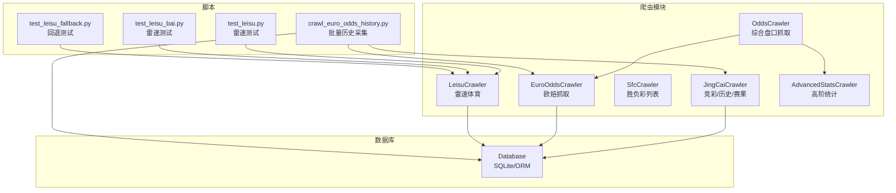
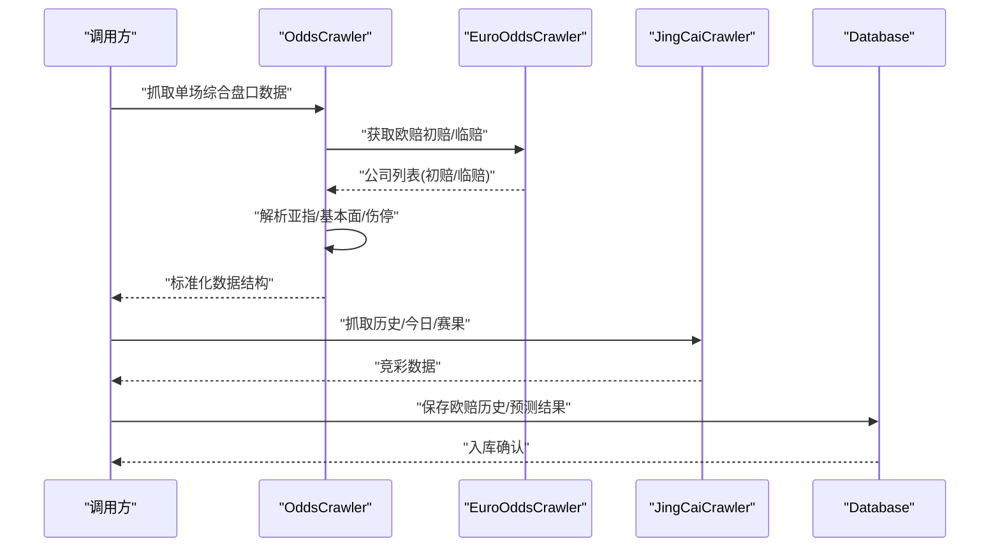
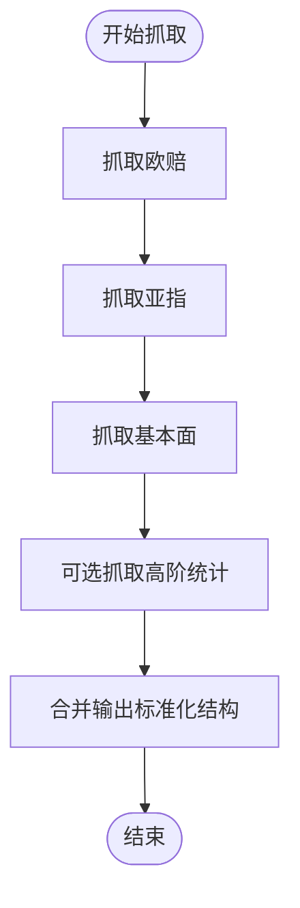
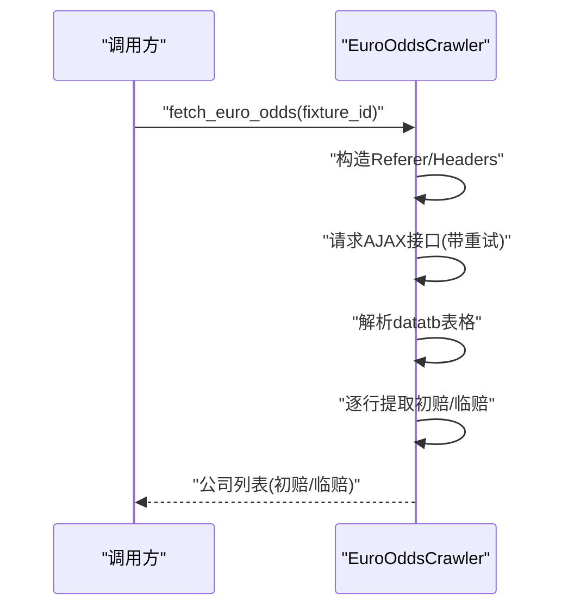
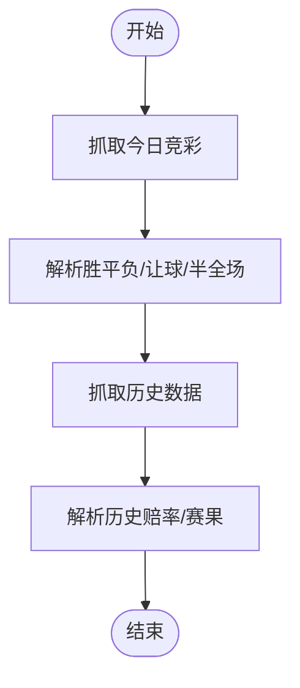
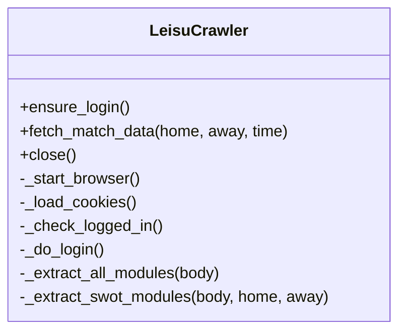
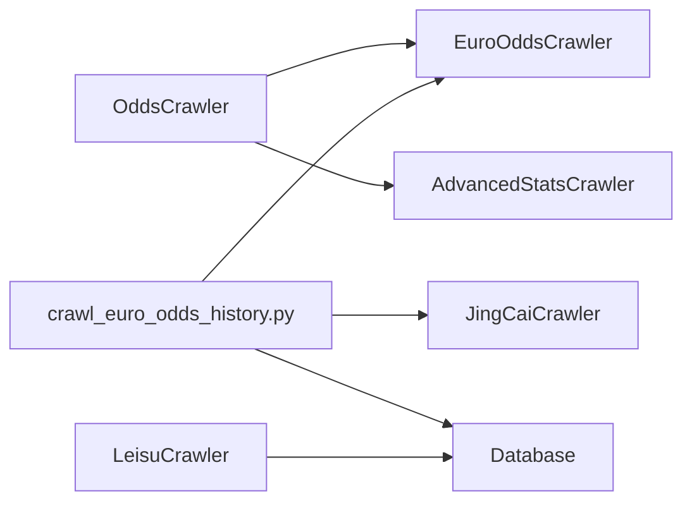

# 盘口数据爬虫

<cite>
**本文引用的文件**
- [odds_crawler.py](file://src/crawler/odds_crawler.py)
- [euro_odds_crawler.py](file://src/crawler/euro_odds_crawler.py)
- [jingcai_crawler.py](file://src/crawler/jingcai_crawler.py)
- [sfc_crawler.py](file://src/crawler/sfc_crawler.py)
- [leisu_crawler.py](file://src/crawler/leisu_crawler.py)
- [advanced_stats_crawler.py](file://src/crawler/advanced_stats_crawler.py)
- [database.py](file://src/db/database.py)
- [.env](file://config/.env)
- [crawl_euro_odds_history.py](file://scripts/crawl_euro_odds_history.py)
- [test_leisu.py](file://scripts/test_leisu.py)
- [test_leisu_bai.py](file://scripts/test_leisu_bai.py)
- [test_leisu_fallback.py](file://scripts/test_leisu_fallback.py)
</cite>

## 目录
1. [简介](#简介)
2. [项目结构](#项目结构)
3. [核心组件](#核心组件)
4. [架构总览](#架构总览)
5. [组件详解](#组件详解)
6. [依赖关系分析](#依赖关系分析)
7. [性能与稳定性](#性能与稳定性)
8. [质量控制与异常处理](#质量控制与异常处理)
9. [盘口变化监测与异常检测](#盘口变化监测与异常检测)
10. [赔率对比分析与应用](#赔率对比分析与应用)
11. [缓存策略与数据更新频率](#缓存策略与数据更新频率)
12. [在预测模型中的应用](#在预测模型中的应用)
13. [故障排查指南](#故障排查指南)
14. [结论](#结论)

## 简介
本技术文档围绕盘口数据爬虫体系，系统阐述如何从多家第三方数据源抓取盘口数据，涵盖数据源差异、抓取流程、清洗与标准化、变化监测、异常检测、质量控制、更新频率与缓存策略，并给出在预测模型中的典型应用场景与使用示例。重点模块包括：
- 综合盘口抓取：整合亚指、欧赔、基本面、伤停等信息
- 欧赔抓取：从500.com AJAX接口稳定提取初赔与临赔
- 竞彩与胜负彩：竞彩今日赛事与历史数据、胜负彩十四场列表
- 雷速体育：基于Playwright的自动化抓取与情报页解析
- 高阶统计：API-Sports高阶技术统计（可选）

## 项目结构
盘口数据相关代码主要位于 src/crawler 与 src/db，配合 scripts 脚本进行历史数据采集与分析。

**图表来源**
- [odds_crawler.py:1-167](file://src/crawler/odds_crawler.py#L1-L167)
- [euro_odds_crawler.py:1-118](file://src/crawler/euro_odds_crawler.py#L1-L118)
- [jingcai_crawler.py:1-330](file://src/crawler/jingcai_crawler.py#L1-L330)
- [sfc_crawler.py:1-145](file://src/crawler/sfc_crawler.py#L1-L145)
- [leisu_crawler.py:1-609](file://src/crawler/leisu_crawler.py#L1-L609)
- [advanced_stats_crawler.py:1-114](file://src/crawler/advanced_stats_crawler.py#L1-L114)
- [database.py:1-567](file://src/db/database.py#L1-L567)
- [crawl_euro_odds_history.py:1-118](file://scripts/crawl_euro_odds_history.py#L1-L118)
- [test_leisu.py:1-129](file://scripts/test_leisu.py#L1-L129)
- [test_leisu_bai.py:1-28](file://scripts/test_leisu_bai.py#L1-L28)
- [test_leisu_fallback.py:1-17](file://scripts/test_leisu_fallback.py#L1-L17)

**章节来源**
- [odds_crawler.py:1-167](file://src/crawler/odds_crawler.py#L1-L167)
- [euro_odds_crawler.py:1-118](file://src/crawler/euro_odds_crawler.py#L1-L118)
- [jingcai_crawler.py:1-330](file://src/crawler/jingcai_crawler.py#L1-L330)
- [sfc_crawler.py:1-145](file://src/crawler/sfc_crawler.py#L1-L145)
- [leisu_crawler.py:1-609](file://src/crawler/leisu_crawler.py#L1-L609)
- [advanced_stats_crawler.py:1-114](file://src/crawler/advanced_stats_crawler.py#L1-L114)
- [database.py:1-567](file://src/db/database.py#L1-L567)
- [crawl_euro_odds_history.py:1-118](file://scripts/crawl_euro_odds_history.py#L1-L118)
- [test_leisu.py:1-129](file://scripts/test_leisu.py#L1-L129)
- [test_leisu_bai.py:1-28](file://scripts/test_leisu_bai.py#L1-L28)
- [test_leisu_fallback.py:1-17](file://scripts/test_leisu_fallback.py#L1-L17)

## 核心组件
- OddsCrawler：聚合亚指、欧赔、基本面、伤停、高阶统计等，统一输出标准化结构
- EuroOddsCrawler：稳定抓取欧赔初赔/临赔，内置重试与限流策略
- JingCaiCrawler：竞彩今日赛事、半全场赔率、历史赛果抓取
- SfcCrawler：胜负彩十四场列表抓取
- LeisuCrawler：基于Playwright的雷速体育自动化抓取，支持匿名与子进程回退
- AdvancedStatsCrawler：可选高阶统计（API-Sports），无Key时自动回退
- Database：SQLite ORM，提供欧赔历史入库、预测结果管理等

**章节来源**
- [odds_crawler.py:9-167](file://src/crawler/odds_crawler.py#L9-L167)
- [euro_odds_crawler.py:8-118](file://src/crawler/euro_odds_crawler.py#L8-L118)
- [jingcai_crawler.py:6-330](file://src/crawler/jingcai_crawler.py#L6-L330)
- [sfc_crawler.py:7-145](file://src/crawler/sfc_crawler.py#L7-L145)
- [leisu_crawler.py:18-609](file://src/crawler/leisu_crawler.py#L18-L609)
- [advanced_stats_crawler.py:9-114](file://src/crawler/advanced_stats_crawler.py#L9-L114)
- [database.py:176-567](file://src/db/database.py#L176-L567)

## 架构总览
整体抓取链路分为“数据源抓取—清洗标准化—入库/使用”三层，其中欧赔与竞彩数据用于历史分析与模型训练，雷速数据用于基本面与情报增强，高级统计作为补充。

**图表来源**
- [odds_crawler.py:17-161](file://src/crawler/odds_crawler.py#L17-L161)
- [euro_odds_crawler.py:17-110](file://src/crawler/euro_odds_crawler.py#L17-L110)
- [jingcai_crawler.py:13-47](file://src/crawler/jingcai_crawler.py#L13-L47)
- [database.py:502-539](file://src/db/database.py#L502-L539)

## 组件详解

### OddsCrawler：综合盘口抓取
- 功能要点
  - 欧赔：委托 EuroOddsCrawler 获取初赔/临赔
  - 亚指：解析500.com亚指页面，提取澳门/贝投等关键公司即时与初盘
  - 基本面：解析500.com基本面页面，提取积分、排名、近期战绩、交锋摘要、澳门推荐、伤停等
  - 高阶统计：可选调用 AdvancedStatsCrawler，若未配置API Key则回退
- 数据标准化
  - 输出统一键位：asian_odds、europe_odds、recent_form、h2h、advanced_stats
  - 亚指与欧赔采用“公司名→初盘/即时”的映射，便于后续对比分析
- 错误处理
  - 对各模块异常捕获并记录日志，保证单场抓取不中断

**图表来源**
- [odds_crawler.py:17-161](file://src/crawler/odds_crawler.py#L17-L161)

**章节来源**
- [odds_crawler.py:17-161](file://src/crawler/odds_crawler.py#L17-L161)

### EuroOddsCrawler：欧赔抓取
- 接口与数据格式
  - 通过AJAX接口获取表格，解析初赔/临赔三值（主胜/平局/客胜）
  - 返回列表，每项包含公司名与初赔/临赔六元组
- 限流与稳定性
  - 内置重试与递增等待，遇到限流自动退避
  - 限定返回公司数量（默认前5家主流公司）
- 数据清洗
  - 正则校验初赔合法性，剔除异常行
  - 严格按行结构解析，避免字段错位

**图表来源**
- [euro_odds_crawler.py:17-110](file://src/crawler/euro_odds_crawler.py#L17-L110)

**章节来源**
- [euro_odds_crawler.py:17-110](file://src/crawler/euro_odds_crawler.py#L17-L110)

### JingCaiCrawler：竞彩与历史数据
- 今日赛事：解析竞彩主页，提取不让球/让球胜平负与半全场赔率
- 历史数据：解析历史页面，提取已完赛比赛的赔率与赛果
- 赛果抓取：按日期抓取赛果，支持半全场结果回补

**图表来源**
- [jingcai_crawler.py:13-330](file://src/crawler/jingcai_crawler.py#L13-L330)

**章节来源**
- [jingcai_crawler.py:13-330](file://src/crawler/jingcai_crawler.py#L13-L330)

### SfcCrawler：胜负彩列表
- 功能：抓取胜负彩十四场列表，解析期号、队伍、时间与fid
- 适用：为预测模型提供期号维度的输入

**章节来源**
- [sfc_crawler.py:14-145](file://src/crawler/sfc_crawler.py#L14-L145)

### LeisuCrawler：雷速体育自动化抓取
- 自动化：使用Playwright启动浏览器，模拟登录态或匿名访问
- 模块化：从“分析页”提取历史交锋、近期战绩、积分、进球分布、伤停、半全场等；从“情报页”提取SWOT主/客有利/不利与中立点
- 容错：支持Cookie加载、验证码检测、匿名模式、子进程回退
- 线程安全：专用线程池执行Playwright，避免与Streamlit事件循环冲突

**图表来源**
- [leisu_crawler.py:18-609](file://src/crawler/leisu_crawler.py#L18-L609)

**章节来源**
- [leisu_crawler.py:18-609](file://src/crawler/leisu_crawler.py#L18-L609)

### AdvancedStatsCrawler：高阶统计
- 功能：通过API-Sports按队名搜索ID并获取高阶统计（场均进球/失球等）
- 回退：未配置Key时返回空，不影响下游流程

**章节来源**
- [advanced_stats_crawler.py:82-114](file://src/crawler/advanced_stats_crawler.py#L82-L114)

## 依赖关系分析
- 模块耦合
  - OddsCrawler 依赖 EuroOddsCrawler 与 AdvancedStatsCrawler
  - crawl_euro_odds_history 脚本串联 JingCaiCrawler 与 EuroOddsCrawler，并写入 Database
  - LeisuCrawler 独立运行，可与其它模块并行使用
- 外部依赖
  - requests、BeautifulSoup、loguru、re、time
  - Playwright（LeisuCrawler）
  - SQLAlchemy（Database）

**图表来源**
- [odds_crawler.py:6-15](file://src/crawler/odds_crawler.py#L6-L15)
- [euro_odds_crawler.py:1-16](file://src/crawler/euro_odds_crawler.py#L1-L16)
- [jingcai_crawler.py:1-11](file://src/crawler/jingcai_crawler.py#L1-L11)
- [crawl_euro_odds_history.py:13-15](file://scripts/crawl_euro_odds_history.py#L13-L15)
- [database.py:1-9](file://src/db/database.py#L1-L9)
- [leisu_crawler.py:1-16](file://src/crawler/leisu_crawler.py#L1-L16)

**章节来源**
- [odds_crawler.py:6-15](file://src/crawler/odds_crawler.py#L6-L15)
- [euro_odds_crawler.py:1-16](file://src/crawler/euro_odds_crawler.py#L1-L16)
- [jingcai_crawler.py:1-11](file://src/crawler/jingcai_crawler.py#L1-L11)
- [crawl_euro_odds_history.py:13-15](file://scripts/crawl_euro_odds_history.py#L13-L15)
- [database.py:1-9](file://src/db/database.py#L1-L9)
- [leisu_crawler.py:1-16](file://src/crawler/leisu_crawler.py#L1-L16)

## 性能与稳定性
- 限流与退避
  - EuroOddsCrawler 使用递增等待与重试，避免500.com限流
  - crawl_euro_odds_history 对欧赔抓取增加固定间隔
- 并发与线程
  - LeisuCrawler 使用线程池隔离Playwright，避免事件循环冲突
- 日志与可观测性
  - 多处记录warning/error，便于定位问题

**章节来源**
- [euro_odds_crawler.py:28-110](file://src/crawler/euro_odds_crawler.py#L28-L110)
- [crawl_euro_odds_history.py:92-106](file://scripts/crawl_euro_odds_history.py#L92-L106)
- [leisu_crawler.py:42-56](file://src/crawler/leisu_crawler.py#L42-L56)

## 质量控制与异常处理
- 数据校验
  - 欧赔初赔正则校验，剔除非法行
  - 亚指/基本面字段长度与结构校验
- 异常捕获
  - 各模块 try/except 包裹，记录错误日志，保证流程不中断
- 数据库入库校验
  - Database.save_euro_odds 对缺失初/临赔的记录进行过滤

**章节来源**
- [euro_odds_crawler.py:85-96](file://src/crawler/euro_odds_crawler.py#L85-L96)
- [odds_crawler.py:44-72](file://src/crawler/odds_crawler.py#L44-L72)
- [database.py:513-514](file://src/db/database.py#L513-L514)

## 盘口变化监测与异常检测
- 变化监测
  - 欧赔历史表记录初赔与临赔，支持按公司与时间序列对比
  - 可结合 scripts/analyze_euro_odds_patterns.py 进行多维交叉分析
- 异常检测
  - 初/临赔为空或格式异常时丢弃该条记录
  - 限流/超时自动重试，避免单次失败影响整体流程

**章节来源**
- [database.py:176-198](file://src/db/database.py#L176-L198)
- [crawl_euro_odds_history.py:25-41](file://scripts/crawl_euro_odds_history.py#L25-L41)

## 赔率对比分析与应用
- 欧赔对比
  - 按公司对比初赔→临赔变化，结合赛果进行命中率分析
- 亚盘对比
  - 关注澳门/贝投等主流公司即时与初盘变化，识别资金流向
- 多源融合
  - 结合雷速情报页SWOT与基本面，构建更全面的盘口解读

**章节来源**
- [euro_odds_crawler.py:88-96](file://src/crawler/euro_odds_crawler.py#L88-L96)
- [odds_crawler.py:54-70](file://src/crawler/odds_crawler.py#L54-L70)
- [leisu_crawler.py:538-582](file://src/crawler/leisu_crawler.py#L538-L582)

## 缓存策略与数据更新频率
- 缓存
  - AdvancedStatsCrawler 内置队名→ID缓存，降低API调用次数
- 更新频率
  - crawl_euro_odds_history 默认按天批量抓取，可按参数调整天数
  - 竞彩/胜负彩数据按日更新，欧赔抓取建议间隔0.5s以上避免限流

**章节来源**
- [advanced_stats_crawler.py:25-48](file://src/crawler/advanced_stats_crawler.py#L25-L48)
- [crawl_euro_odds_history.py:53-106](file://scripts/crawl_euro_odds_history.py#L53-L106)

## 在预测模型中的应用
- 输入特征
  - 欧赔初/临、亚盘初/临、基本面（积分/排名/交锋/伤停）、高阶统计（可选）
- 应用场景
  - 历史回测：使用欧赔历史表进行赔率变化与赛果关联分析
  - 实时预测：OddsCrawler输出作为LLM/规则引擎的输入特征
  - 雷速情报：SWOT与基本面增强盘口解读，辅助微信号提取

**章节来源**
- [database.py:176-198](file://src/db/database.py#L176-L198)
- [odds_crawler.py:17-161](file://src/crawler/odds_crawler.py#L17-L161)
- [leisu_crawler.py:538-582](file://src/crawler/leisu_crawler.py#L538-L582)

## 故障排查指南
- 欧赔抓取失败
  - 检查网络与限流，确认AJAX表格是否存在
  - 查看重试日志与等待间隔
- 亚指解析异常
  - 确认页面结构是否变化，字段索引是否正确
- 雷速登录/验证码
  - 检查Cookie加载与验证码提示，必要时切换匿名模式
  - 使用 test_leisu.py/test_leisu_bai.py/test_leisu_fallback.py 验证流程
- 数据库写入
  - 确认SQLite路径与权限，检查字段完整性

**章节来源**
- [euro_odds_crawler.py:28-110](file://src/crawler/euro_odds_crawler.py#L28-L110)
- [odds_crawler.py:33-160](file://src/crawler/odds_crawler.py#L33-L160)
- [leisu_crawler.py:169-191](file://src/crawler/leisu_crawler.py#L169-L191)
- [test_leisu.py:1-129](file://scripts/test_leisu.py#L1-L129)
- [test_leisu_bai.py:1-28](file://scripts/test_leisu_bai.py#L1-L28)
- [test_leisu_fallback.py:1-17](file://scripts/test_leisu_fallback.py#L1-L17)
- [database.py:200-217](file://src/db/database.py#L200-L217)

## 结论
本盘口数据爬虫体系通过多源抓取与标准化输出，为预测模型提供了高质量的盘口特征。欧赔与亚盘的稳定抓取、竞彩与历史数据的配套、雷速体育的深度情报，以及可选高阶统计，共同构成了完整的盘口数据生态。配合历史回测脚本与数据库Schema，能够支撑持续优化的赔率分析与盘口信号挖掘。