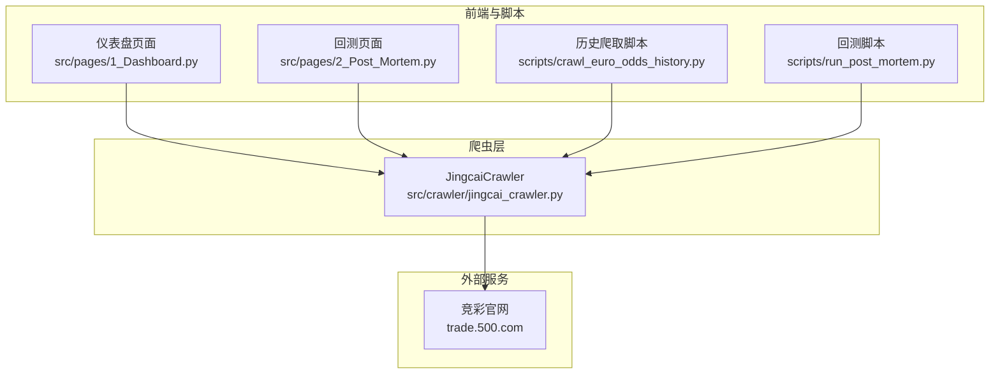
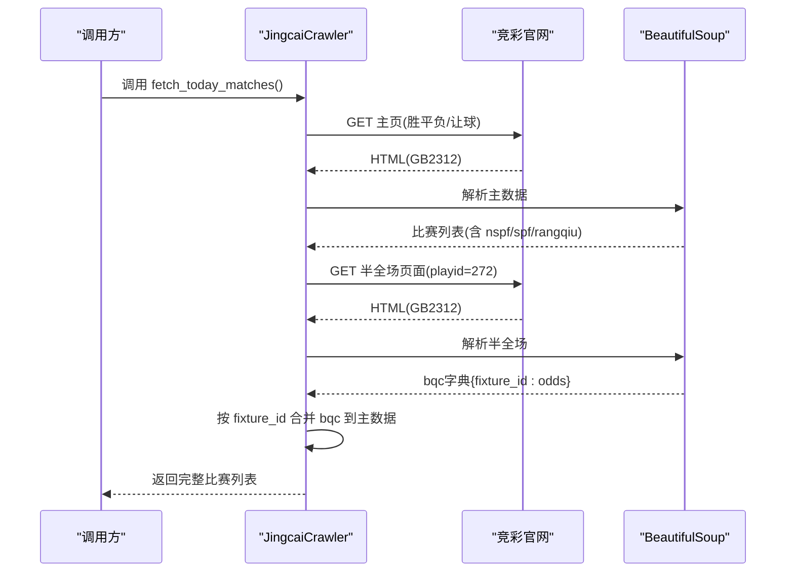
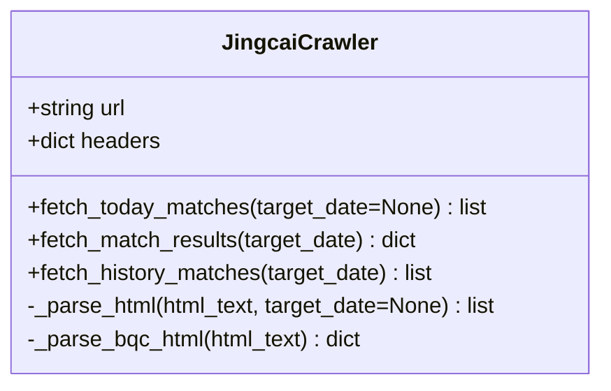
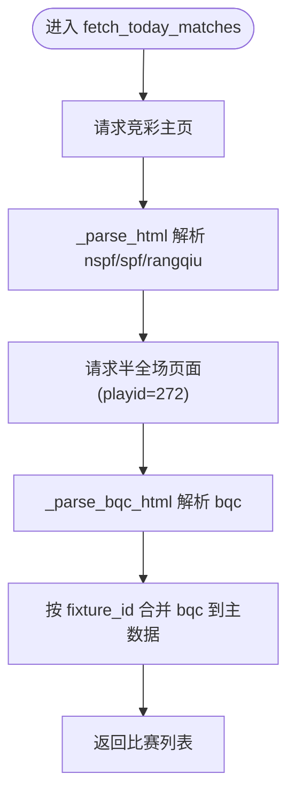
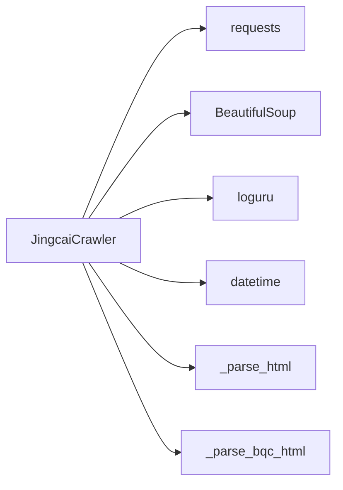

# 竞彩数据爬虫

<cite>
**本文引用的文件**
- [src/crawler/jingcai_crawler.py](file://src/crawler/jingcai_crawler.py)
- [tests/test_jingcai.py](file://tests/test_jingcai.py)
- [src/pages/1_Dashboard.py](file://src/pages/1_Dashboard.py)
- [src/pages/2_Post_Mortem.py](file://src/pages/2_Post_Mortem.py)
- [src/logging_config.py](file://src/logging_config.py)
- [scripts/crawl_euro_odds_history.py](file://scripts/crawl_euro_odds_history.py)
- [scripts/run_post_mortem.py](file://scripts/run_post_mortem.py)
</cite>

## 目录
1. [简介](#简介)
2. [项目结构](#项目结构)
3. [核心组件](#核心组件)
4. [架构总览](#架构总览)
5. [详细组件分析](#详细组件分析)
6. [依赖关系分析](#依赖关系分析)
7. [性能考量](#性能考量)
8. [故障排查指南](#故障排查指南)
9. [结论](#结论)
10. [附录](#附录)

## 简介
本文件面向竞彩数据爬虫的使用者与维护者，系统性阐述 JingcaiCrawler 类的实现原理与使用方式，重点覆盖：
- 竞彩官方网站数据抓取机制与 HTML 解析策略
- fetch_today_matches 如何获取当日比赛信息与赔率数据
- _parse_html 与 _parse_bqc_html 的解析逻辑
- fetch_match_results 与 fetch_history_matches 的不同用途与适用场景
- 竞彩网站数据格式特点（胜平负、让球胜平负、半全场赔率）的提取方式
- 异常处理、超时设置与编码处理的最佳实践
- 实际使用示例与常见问题解决方案

## 项目结构
本项目围绕“数据采集—数据融合—预测—回测”闭环组织，其中竞彩数据爬虫位于 src/crawler/jingcai_crawler.py，负责从竞彩官网抓取足彩数据；前端页面与脚本通过调用该爬虫实现数据拉取、回测与历史补录。

图表来源
- [src/pages/1_Dashboard.py:417](file://src/pages/1_Dashboard.py#L417-L418)
- [src/pages/2_Post_Mortem.py:158](file://src/pages/2_Post_Mortem.py#L158-L160)
- [scripts/crawl_euro_odds_history.py:57](file://scripts/crawl_euro_odds_history.py#L57)
- [scripts/run_post_mortem.py:503](file://scripts/run_post_mortem.py#L503)
- [src/crawler/jingcai_crawler.py:6](file://src/crawler/jingcai_crawler.py#L6-L11)

章节来源
- [src/crawler/jingcai_crawler.py:1-330](file://src/crawler/jingcai_crawler.py#L1-L330)
- [src/pages/1_Dashboard.py:410-609](file://src/pages/1_Dashboard.py#L410-L609)
- [src/pages/2_Post_Mortem.py:155-354](file://src/pages/2_Post_Mortem.py#L155-L354)
- [scripts/crawl_euro_odds_history.py:57](file://scripts/crawl_euro_odds_history.py#L57)
- [scripts/run_post_mortem.py:503](file://scripts/run_post_mortem.py#L503)

## 核心组件
- JingcaiCrawler：封装竞彩官网数据抓取与解析，提供三类接口：
  - fetch_today_matches：抓取当日可售比赛及赔率（含半全场）
  - fetch_match_results：抓取指定日期的赛果（含半全场）
  - fetch_history_matches：抓取历史已完成比赛数据（含赔率与赛果）

章节来源
- [src/crawler/jingcai_crawler.py:6-11](file://src/crawler/jingcai_crawler.py#L6-L11)
- [src/crawler/jingcai_crawler.py:13-47](file://src/crawler/jingcai_crawler.py#L13-L47)
- [src/crawler/jingcai_crawler.py:150-231](file://src/crawler/jingcai_crawler.py#L150-L231)
- [src/crawler/jingcai_crawler.py:233-323](file://src/crawler/jingcai_crawler.py#L233-L323)

## 架构总览
JingcaiCrawler 采用“请求-解析-合并”的三层结构：
- 请求层：使用 requests 发起 GET 请求，设置超时与编码
- 解析层：使用 BeautifulSoup 解析 HTML，提取关键字段
- 合并层：将半全场赔率与主数据按 fixture_id 关联

图表来源
- [src/crawler/jingcai_crawler.py:13-47](file://src/crawler/jingcai_crawler.py#L13-L47)
- [src/crawler/jingcai_crawler.py:122-148](file://src/crawler/jingcai_crawler.py#L122-L148)

## 详细组件分析

### JingcaiCrawler 类设计
- 职责边界清晰：专注竞彩官网数据抓取与解析，不涉及预测逻辑
- 外部依赖：requests、BeautifulSoup、loguru、datetime
- 关键字段：
  - url：竞彩足彩主页
  - headers：包含 User-Agent 的请求头
  - timeout：统一设置为 15 秒
  - 编码：统一设置为 GB2312（适配竞彩页面）

图表来源
- [src/crawler/jingcai_crawler.py:6-11](file://src/crawler/jingcai_crawler.py#L6-L11)
- [src/crawler/jingcai_crawler.py:13-323](file://src/crawler/jingcai_crawler.py#L13-L323)

章节来源
- [src/crawler/jingcai_crawler.py:6-11](file://src/crawler/jingcai_crawler.py#L6-L11)
- [src/crawler/jingcai_crawler.py:13-323](file://src/crawler/jingcai_crawler.py#L13-L323)

### fetch_today_matches：当日可售比赛与赔率抓取
- 功能要点
  - 请求竞彩主页，解析胜平负与让球胜平负赔率
  - 请求半全场页面，解析半全场赔率
  - 将半全场赔率按 fixture_id 合并到主数据
  - 支持按目标日期过滤（自动映射英文星期到中文前缀）
- 数据结构
  - 每场比赛包含：fixture_id、match_num、league、home_team、away_team、match_time、odds（nspf、spf、rangqiu）
  - odds.bqc 为半全场赔率字典，键为“半-全”组合字符串，值为对应赔率

图表来源
- [src/crawler/jingcai_crawler.py:13-47](file://src/crawler/jingcai_crawler.py#L13-L47)
- [src/crawler/jingcai_crawler.py:49-120](file://src/crawler/jingcai_crawler.py#L49-L120)
- [src/crawler/jingcai_crawler.py:122-148](file://src/crawler/jingcai_crawler.py#L122-L148)

章节来源
- [src/crawler/jingcai_crawler.py:13-47](file://src/crawler/jingcai_crawler.py#L13-L47)
- [src/crawler/jingcai_crawler.py:49-120](file://src/crawler/jingcai_crawler.py#L49-L120)
- [src/crawler/jingcai_crawler.py:122-148](file://src/crawler/jingcai_crawler.py#L122-L148)

### _parse_html：HTML 解析策略与数据提取
- 解析入口：BeautifulSoup(html, 'html.parser')
- 选择器：tr.bet-tb-tr
- 过滤逻辑：
  - 跳过 display:none 的行
  - 通过 match_num 前缀过滤目标日期（如“周六”）
- 字段提取：
  - 基础信息：fixture_id、match_num、league、home_team、away_team、match_time、match_date
  - 赔率：
    - 不让球胜平负：nspf_btns[data-type='nspf'] -> data-sp
    - 让球胜平负：spf_btns[data-type='spf'] -> data-sp
    - 让球数：data-rangqiu
- 容错：缺失字段以“-”填充，异常行跳过继续

章节来源
- [src/crawler/jingcai_crawler.py:49-120](file://src/crawler/jingcai_crawler.py#L49-L120)

### _parse_bqc_html：半全场赔率解析
- 页面：竞彩半全场页面（playid=272）
- 解析策略：
  - tr.bet-tb-tr
  - 过滤 display:none
  - 从 p[data-type='bqc'] 提取 data-value（半-全组合）与 data-sp（赔率）
- 输出：字典 {fixture_id: {value: sp}}
- 合并：按 fixture_id 与主数据合并

章节来源
- [src/crawler/jingcai_crawler.py:122-148](file://src/crawler/jingcai_crawler.py#L122-L148)

### fetch_match_results：指定日期赛果抓取
- URL：竞彩官网日期查询接口（?date=YYYY-MM-DD）
- 解析策略：
  - tr.bet-tb-tr
  - 过滤非目标日期前缀
  - 从 a.score 提取比分
  - 附加主队、客队、match_time
- 半全场赛果：额外请求同日期半全场页面，查找带 betbtn-ok 的 p[data-type='bqc']，提取 data-value 作为 bqc_result
- 返回：{match_num: {score, match_time, home_team, away_team, bqc_result?}}

章节来源
- [src/crawler/jingcai_crawler.py:150-231](file://src/crawler/jingcai_crawler.py#L150-L231)

### fetch_history_matches：历史已完成比赛数据
- URL：竞彩历史页面（playid=269&g=2&date=YYYY-MM-DD）
- 解析策略：
  - tr.bet-tb-tr
  - 过滤非目标日期前缀
  - 从 a.score 提取 actual_score
  - 提取 nspf/spf 赔率（不含中奖标记的按钮）
- 返回：每场比赛包含 fixture_id、match_num、league、teams、match_time、actual_score、odds（nspf、spf、rangqiu）

章节来源
- [src/crawler/jingcai_crawler.py:233-323](file://src/crawler/jingcai_crawler.py#L233-L323)

### 竞彩网站数据格式特点与提取方式
- 胜平负（nspf）与让球胜平负（spf）
  - 通过 p[data-type='nspf'|'spf'] 提取 data-sp
  - 不让球胜平负顺序固定为“胜/平/负”，让球胜平负顺序固定为“胜/平/负”
- 让球数（rangqiu）
  - 从 tr 上的 data-rangqiu 提取
- 半全场（bqc）
  - 通过 p[data-type='bqc'] 提取 data-value（如“3-3”）与 data-sp
  - 赛果页面通过 p.betbtn-ok[data-type='bqc'] 提取中奖项
- 日期过滤
  - 自动将目标日期映射为英文星期，再映射为中文前缀（如“Saturday”→“周六”），仅保留 match_num 以该前缀开头的行

章节来源
- [src/crawler/jingcai_crawler.py:91-112](file://src/crawler/jingcai_crawler.py#L91-L112)
- [src/crawler/jingcai_crawler.py:138-141](file://src/crawler/jingcai_crawler.py#L138-L141)
- [src/crawler/jingcai_crawler.py:187-204](file://src/crawler/jingcai_crawler.py#L187-L204)
- [src/crawler/jingcai_crawler.py:280-298](file://src/crawler/jingcai_crawler.py#L280-L298)

### 使用示例与集成点
- 仪表盘页面：调用 fetch_today_matches 拉取当日数据并进行全局预测
- 回测页面：调用 fetch_match_results 获取赛果并更新数据库
- 历史补录脚本：调用 fetch_history_matches 拉取历史数据并融合盘口后入库
- 测试脚本：演示另一种竞彩官方 API 的调用方式（非本爬虫）

章节来源
- [src/pages/1_Dashboard.py:417-418](file://src/pages/1_Dashboard.py#L417-L418)
- [src/pages/2_Post_Mortem.py:158-160](file://src/pages/2_Post_Mortem.py#L158-L160)
- [scripts/crawl_euro_odds_history.py:57](file://scripts/crawl_euro_odds_history.py#L57)
- [tests/test_jingcai.py:3-31](file://tests/test_jingcai.py#L3-L31)

## 依赖关系分析
- 内部依赖
  - fetch_today_matches 依赖 _parse_html 与 _parse_bqc_html
  - fetch_match_results 依赖 BeautifulSoup 解析与二次请求半全场页面
  - fetch_history_matches 依赖 BeautifulSoup 解析与赔率提取
- 外部依赖
  - requests：HTTP 请求
  - BeautifulSoup：HTML 解析
  - loguru：日志记录
  - datetime：日期与星期映射

图表来源
- [src/crawler/jingcai_crawler.py:1-5](file://src/crawler/jingcai_crawler.py#L1-L5)
- [src/crawler/jingcai_crawler.py:49-148](file://src/crawler/jingcai_crawler.py#L49-L148)

章节来源
- [src/crawler/jingcai_crawler.py:1-5](file://src/crawler/jingcai_crawler.py#L1-L5)
- [src/crawler/jingcai_crawler.py:49-148](file://src/crawler/jingcai_crawler.py#L49-L148)

## 性能考量
- 超时设置：统一 15 秒，平衡稳定性与响应速度
- 编码处理：统一设置为 GB2312，避免乱码导致解析失败
- 解析效率：单次请求解析一次 HTML，避免重复解析
- 合并策略：按 fixture_id 合并半全场赔率，减少后续匹配成本
- 日志级别：INFO 级别输出关键事件，便于监控与排障

章节来源
- [src/crawler/jingcai_crawler.py:22](file://src/crawler/jingcai_crawler.py#L22)
- [src/crawler/jingcai_crawler.py:34](file://src/crawler/jingcai_crawler.py#L34)
- [src/crawler/jingcai_crawler.py:160](file://src/crawler/jingcai_crawler.py#L160)
- [src/crawler/jingcai_crawler.py:246](file://src/crawler/jingcai_crawler.py#L246)
- [src/logging_config.py:23-27](file://src/logging_config.py#L23-L27)

## 故障排查指南
- HTTP 状态码非 200
  - 现象：返回空列表或空字典
  - 处理：检查网络连通性与竞彩官网可用性
- HTML 编码错误
  - 现象：中文乱码
  - 处理：确保 response.encoding 设置为 GB2312
- 日期前缀不匹配
  - 现象：未返回任何比赛
  - 处理：确认目标日期与 match_num 前缀映射正确（英文星期→中文前缀）
- 半全场页面无数据
  - 现象：bqc 字段为空
  - 处理：确认 playid=272 页面可访问且存在有效数据
- 解析异常
  - 现象：部分比赛被跳过
  - 处理：查看日志 WARNING，定位异常行并修复解析逻辑

章节来源
- [src/crawler/jingcai_crawler.py:25-27](file://src/crawler/jingcai_crawler.py#L25-L27)
- [src/crawler/jingcai_crawler.py:163-165](file://src/crawler/jingcai_crawler.py#L163-L165)
- [src/crawler/jingcai_crawler.py:248-250](file://src/crawler/jingcai_crawler.py#L248-L250)
- [src/crawler/jingcai_crawler.py:115-117](file://src/crawler/jingcai_crawler.py#L115-L117)

## 结论
JingcaiCrawler 通过简洁的三层架构实现了对竞彩官网数据的稳定抓取与解析，覆盖当日可售、赛果与历史补录三大场景。其关键优势在于：
- 明确的职责划分与清晰的接口设计
- 针对竞彩页面编码与结构的定制化解析策略
- 完整的异常处理与日志记录
建议在生产环境中结合缓存与重试策略进一步提升鲁棒性，并持续关注竞彩官网结构变化以保持解析稳定性。

## 附录

### 实际使用示例路径
- 仪表盘页面拉取当日数据并预测
  - [src/pages/1_Dashboard.py:417-418](file://src/pages/1_Dashboard.py#L417-L418)
- 回测页面获取赛果并更新数据库
  - [src/pages/2_Post_Mortem.py:158-160](file://src/pages/2_Post_Mortem.py#L158-L160)
- 历史补录脚本拉取历史数据
  - [scripts/crawl_euro_odds_history.py:57](file://scripts/crawl_euro_odds_history.py#L57)
- 回测脚本调用赛果接口
  - [scripts/run_post_mortem.py:503](file://scripts/run_post_mortem.py#L503)

### 竞彩官方 API 对比参考
- 测试脚本展示了另一种竞彩官方接口调用方式（非本爬虫实现）
  - [tests/test_jingcai.py:3-31](file://tests/test_jingcai.py#L3-L31)