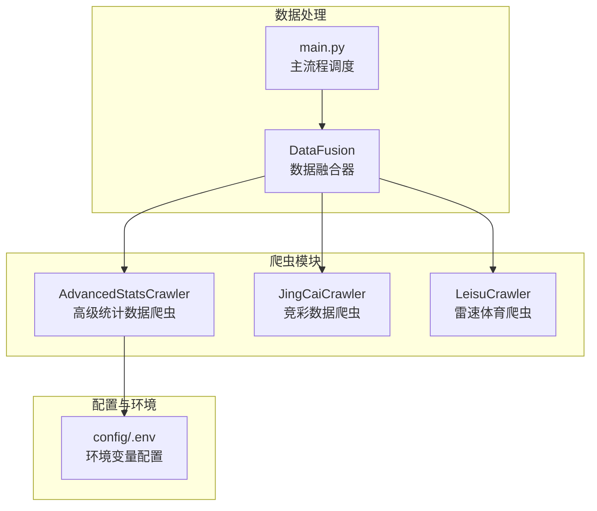
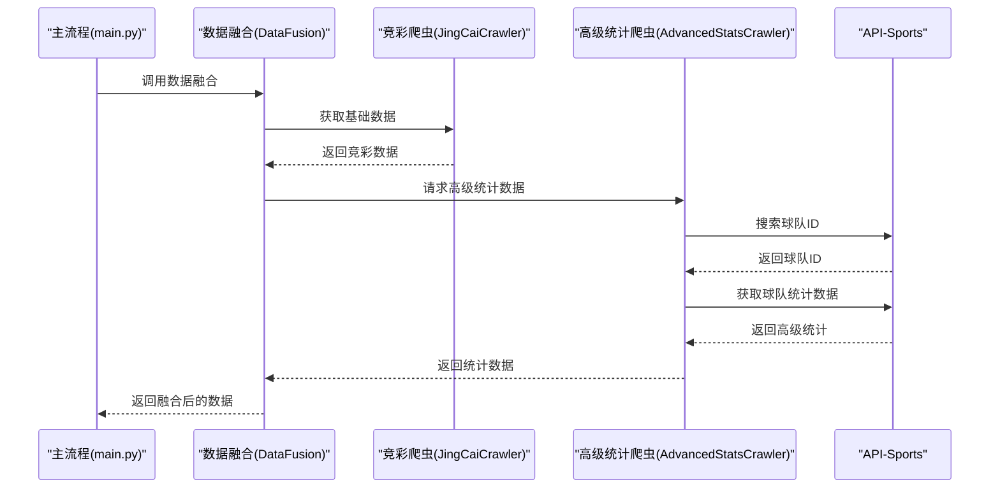
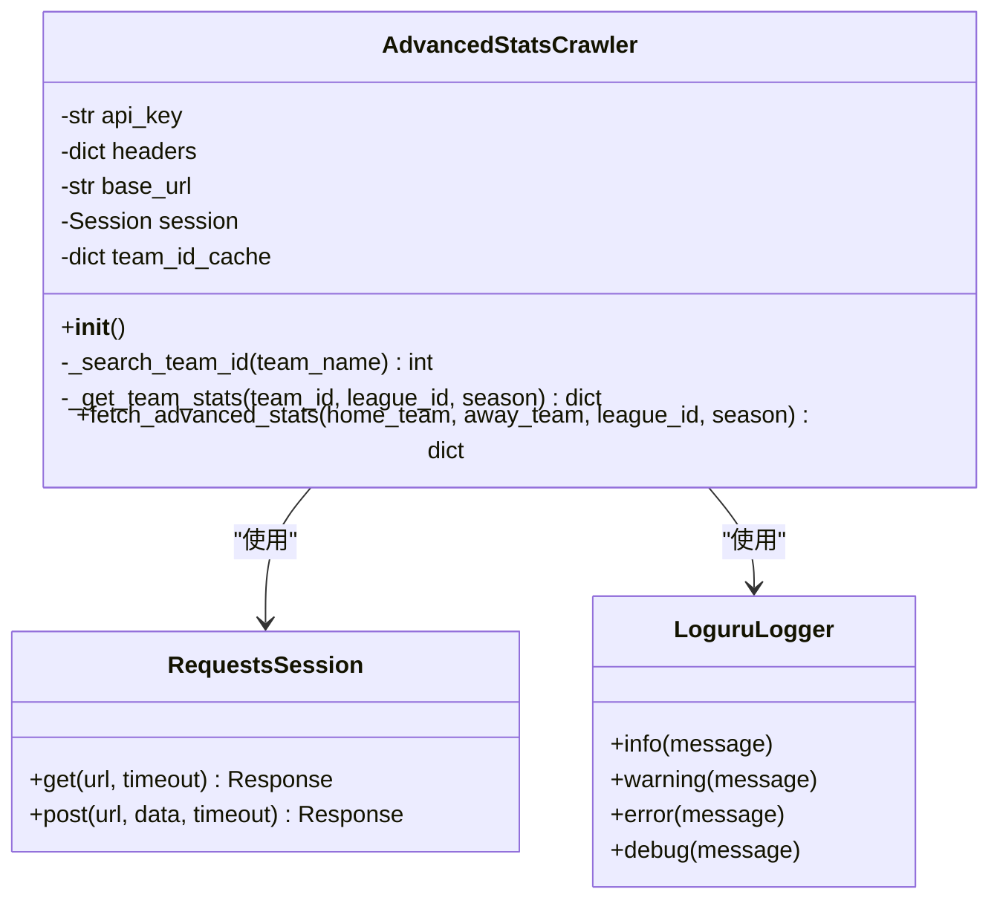
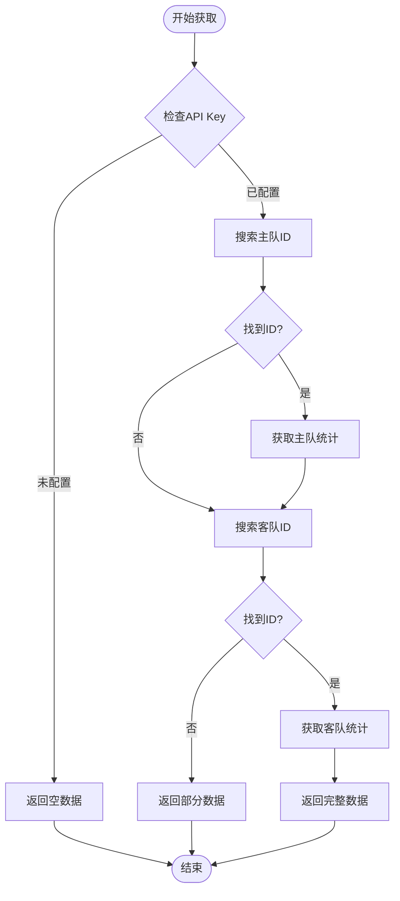
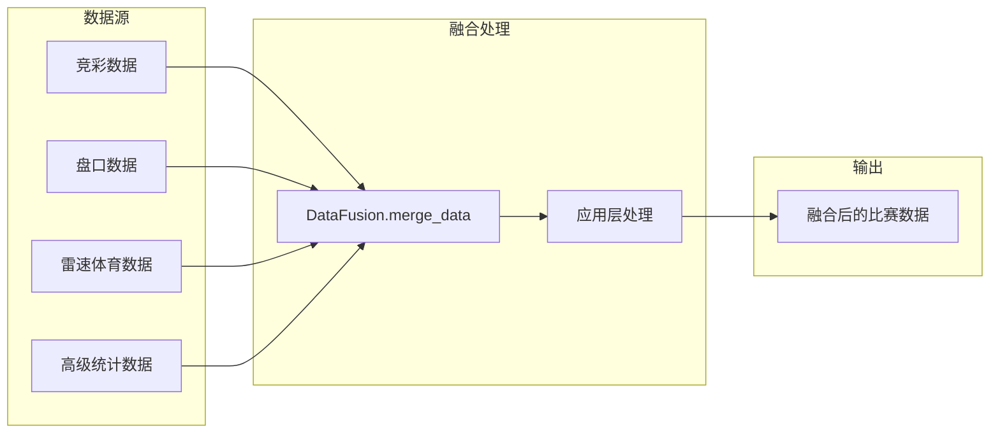
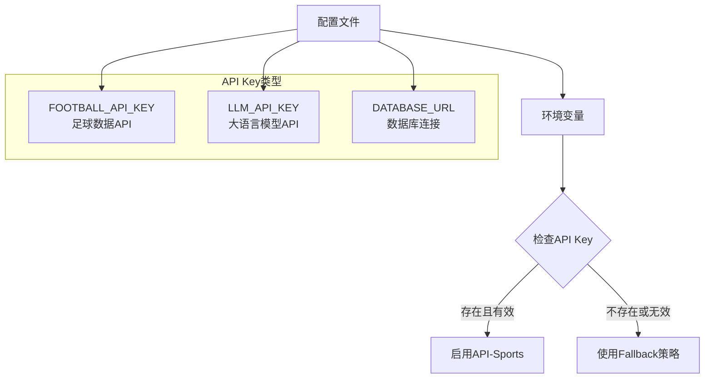
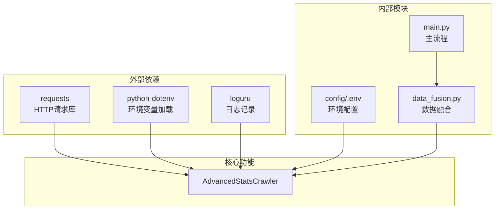

# 高级统计数据爬虫

<cite>
**本文档引用的文件**
- [advanced_stats_crawler.py](file://src/crawler/advanced_stats_crawler.py)
- [config/.env](file://config/.env)
- [data_fusion.py](file://src/processor/data_fusion.py)
- [main.py](file://src/main.py)
- [leisu_crawler.py](file://src/crawler/leisu_crawler.py)
- [jingcai_crawler.py](file://src/crawler/jingcai_crawler.py)
- [三时间点预测对比技术架构.md](file://.trae/documents/三时间点预测对比技术架构.md)
- [2026-05-03-goals-prediction-rebuild.md](file://docs/plans/2026-05-03-goals-prediction-rebuild.md)
- [test_500.py](file://tests/test_500.py)
</cite>

## 目录
1. [简介](#简介)
2. [项目结构](#项目结构)
3. [核心组件](#核心组件)
4. [架构概览](#架构概览)
5. [详细组件分析](#详细组件分析)
6. [依赖关系分析](#依赖关系分析)
7. [性能考虑](#性能考虑)
8. [故障排除指南](#故障排除指南)
9. [结论](#结论)
10. [附录](#附录)

## 简介
本技术文档详细说明了 advanced_stats_crawler 模块的设计与实现，该模块专门用于抓取和处理高级足球统计数据，包括球队表现数据、球员数据和战术统计。文档涵盖以下关键方面：
- 高级统计指标的计算方法与数据来源验证
- 不同联赛和俱乐部的数据差异处理策略
- 数据标准化与归一化处理方案
- 高级统计在预测模型中的应用价值与使用场景
- 数据质量检查、异常值检测与缺失数据处理策略

## 项目结构
该项目采用模块化架构，高级统计数据爬虫位于 crawler 目录下，与其他数据源（如竞彩、盘口、雷速体育）协同工作，通过数据融合模块将多源数据整合到统一的预测流程中。

**图表来源**
- [advanced_stats_crawler.py:1-114](file://src/crawler/advanced_stats_crawler.py#L1-L114)
- [data_fusion.py:57-108](file://src/processor/data_fusion.py#L57-L108)
- [main.py:49-80](file://src/main.py#L49-L80)
- [config/.env:1-20](file://config/.env#L1-L20)

**章节来源**
- [advanced_stats_crawler.py:1-114](file://src/crawler/advanced_stats_crawler.py#L1-L114)
- [data_fusion.py:57-108](file://src/processor/data_fusion.py#L57-L108)
- [main.py:49-80](file://src/main.py#L49-L80)

## 核心组件
AdvancedStatsCrawler 是一个专门用于抓取高阶技术统计的爬虫模块，支持通过 API-Sports (api-football) 获取真实的射门和进球期望数据。当 API Key 未配置或调用失败时，模块会返回空数据，供下游组件进行 Fallback 处理。

主要特性：
- 支持通过 API-Sports 获取高级统计数据
- 内置球队 ID 缓存机制，避免重复搜索
- 提供完整的错误处理和日志记录
- 与数据融合模块无缝集成

**章节来源**
- [advanced_stats_crawler.py:9-27](file://src/crawler/advanced_stats_crawler.py#L9-L27)

## 架构概览
高级统计数据爬虫在整个数据采集和处理流程中扮演着关键角色，负责获取球队的高阶统计数据，并将其与其他数据源进行融合。

**图表来源**
- [main.py:49-80](file://src/main.py#L49-L80)
- [data_fusion.py:61-108](file://src/processor/data_fusion.py#L61-L108)
- [advanced_stats_crawler.py:82-114](file://src/crawler/advanced_stats_crawler.py#L82-L114)

## 详细组件分析

### AdvancedStatsCrawler 类分析
AdvancedStatsCrawler 是一个面向对象的爬虫类，实现了完整的高级统计数据获取流程。

**图表来源**
- [advanced_stats_crawler.py:9-27](file://src/crawler/advanced_stats_crawler.py#L9-L27)
- [advanced_stats_crawler.py:28-48](file://src/crawler/advanced_stats_crawler.py#L28-L48)
- [advanced_stats_crawler.py:50-80](file://src/crawler/advanced_stats_crawler.py#L50-L80)
- [advanced_stats_crawler.py:82-114](file://src/crawler/advanced_stats_crawler.py#L82-L114)

#### 数据获取流程
高级统计数据的获取遵循严格的流程控制：

**图表来源**
- [advanced_stats_crawler.py:82-114](file://src/crawler/advanced_stats_crawler.py#L82-L114)
- [advanced_stats_crawler.py:28-48](file://src/crawler/advanced_stats_crawler.py#L28-L48)
- [advanced_stats_crawler.py:50-80](file://src/crawler/advanced_stats_crawler.py#L50-L80)

#### 高级统计指标说明
根据模块实现，当前支持的高级统计指标包括：

| 指标名称 | 字段名 | 描述 | 数据来源 | 当前可用性 |
|---------|--------|------|----------|------------|
| 场均进球 | avg_goals_for | 主队场均进球数 | API-Sports teams/statistics | ✅ |
| 场均失球 | avg_goals_against | 客队场均失球数 | API-Sports teams/statistics | ✅ |
| 场均射门 | avg_shots | 主队场均射门次数 | API-Sports fixtures/statistics | ⚠️ 预留字段 |
| 场均射正 | avg_shots_on_target | 主队场均射正次数 | API-Sports fixtures/statistics | ⚠️ 预留字段 |
| xG期望值 | avg_xG | 主队场均xG值 | API-Sports fixtures/statistics | ⚠️ 预留字段 |

**章节来源**
- [advanced_stats_crawler.py:65-77](file://src/crawler/advanced_stats_crawler.py#L65-L77)

### 数据融合与集成
高级统计数据通过数据融合模块与其他数据源进行整合：

**图表来源**
- [data_fusion.py:61-108](file://src/processor/data_fusion.py#L61-L108)

**章节来源**
- [data_fusion.py:57-108](file://src/processor/data_fusion.py#L57-L108)

### 环境配置与密钥管理
高级统计数据爬虫依赖于外部 API 密钥进行数据获取：

**图表来源**
- [config/.env:1-20](file://config/.env#L1-L20)

**章节来源**
- [config/.env:1-20](file://config/.env#L1-L20)

## 依赖关系分析
高级统计数据爬虫模块具有清晰的依赖关系，主要依赖于外部 API 服务和内部数据处理模块。

**图表来源**
- [advanced_stats_crawler.py:1-7](file://src/crawler/advanced_stats_crawler.py#L1-L7)
- [data_fusion.py:1-3](file://src/processor/data_fusion.py#L1-L3)
- [main.py:49-80](file://src/main.py#L49-L80)

**章节来源**
- [advanced_stats_crawler.py:1-7](file://src/crawler/advanced_stats_crawler.py#L1-L7)
- [data_fusion.py:1-3](file://src/processor/data_fusion.py#L1-L3)

## 性能考虑
高级统计数据爬虫在设计时充分考虑了性能优化：

### 缓存策略
- **球队ID缓存**：内置字典缓存避免重复的 API 调用
- **会话复用**：使用持久化的 requests Session 减少连接开销
- **超时控制**：设置合理的请求超时时间防止阻塞

### 错误处理与降级
- **优雅降级**：API Key 缺失时自动切换到 Fallback 模式
- **异常捕获**：全面的异常处理确保系统稳定性
- **日志记录**：详细的日志信息便于问题诊断

### 并发处理
虽然当前实现为同步请求，但整体架构支持异步扩展：
- 可扩展为异步客户端减少等待时间
- 支持批量请求优化网络利用率

## 故障排除指南

### 常见问题与解决方案

#### API Key 配置问题
**症状**：爬虫返回空数据且显示跳过信息
**原因**：FOOTBALL_API_KEY 未正确配置
**解决方案**：
1. 检查 config/.env 文件中的 API Key 设置
2. 确认 API Key 具有足够的调用权限
3. 验证网络连接是否正常

#### 数据获取失败
**症状**：获取统计数据时出现异常
**原因**：API 服务不可用或响应格式变化
**解决方案**：
1. 检查 API 服务状态
2. 验证请求参数格式
3. 实施重试机制

#### 性能问题
**症状**：爬取速度慢或内存占用过高
**原因**：缺少缓存或并发控制不当
**解决方案**：
1. 启用并优化缓存策略
2. 实施请求限流
3. 考虑异步处理

**章节来源**
- [advanced_stats_crawler.py:30-48](file://src/crawler/advanced_stats_crawler.py#L30-L48)
- [advanced_stats_crawler.py:78-80](file://src/crawler/advanced_stats_crawler.py#L78-L80)

## 结论
AdvancedStatsCrawler 模块为足球预测系统提供了可靠的高级统计数据获取能力。通过合理的架构设计、完善的错误处理和灵活的配置管理，该模块能够：
- 稳定地获取高质量的高级统计数据
- 与其他数据源无缝集成
- 支持多种联赛和俱乐部的数据需求
- 为预测模型提供有价值的统计特征

未来可以进一步扩展支持更多的统计指标，优化缓存策略，并增强对不同数据源的适配能力。

## 附录

### 高级统计在预测模型中的应用
根据项目文档，高级统计数据在预测模型中有以下应用价值：

#### 多层十维深度融合
- **联赛特征组一致性**：解决当前系统中联赛特征组定义散落的问题
- **球队级数据利用**：充分利用两队近期场均进失球、主客场进球画像等数据
- **统计与LLM融合**：实现统计模型与大语言模型的深度融合

#### 数据质量保证
- **一致性评估**：通过多个时间点的预测结果一致性评估置信度
- **权重平衡**：合理分配统计模型与LLM推理的权重
- **历史验证**：基于历史数据验证预测准确性

**章节来源**
- [2026-05-03-goals-prediction-rebuild.md:1-434](file://docs/plans/2026-05-03-goals-prediction-rebuild.md#L1-L434)
- [.trae/documents/三时间点预测对比技术架构.md:203-227](file://.trae/documents/三时间点预测对比技术架构.md#L203-L227)

### 数据标准化与归一化策略
项目中体现的数据处理原则包括：
- **统一数据格式**：确保来自不同数据源的数据格式一致
- **异常值检测**：建立异常值识别和处理机制
- **缺失数据处理**：制定完整的缺失数据填补策略
- **数据完整性检查**：实施多层次的数据质量验证

**章节来源**
- [三时间点预测对比技术架构.md:1-68](file://.trae/documents/三时间点预测对比技术架构.md#L1-L68)