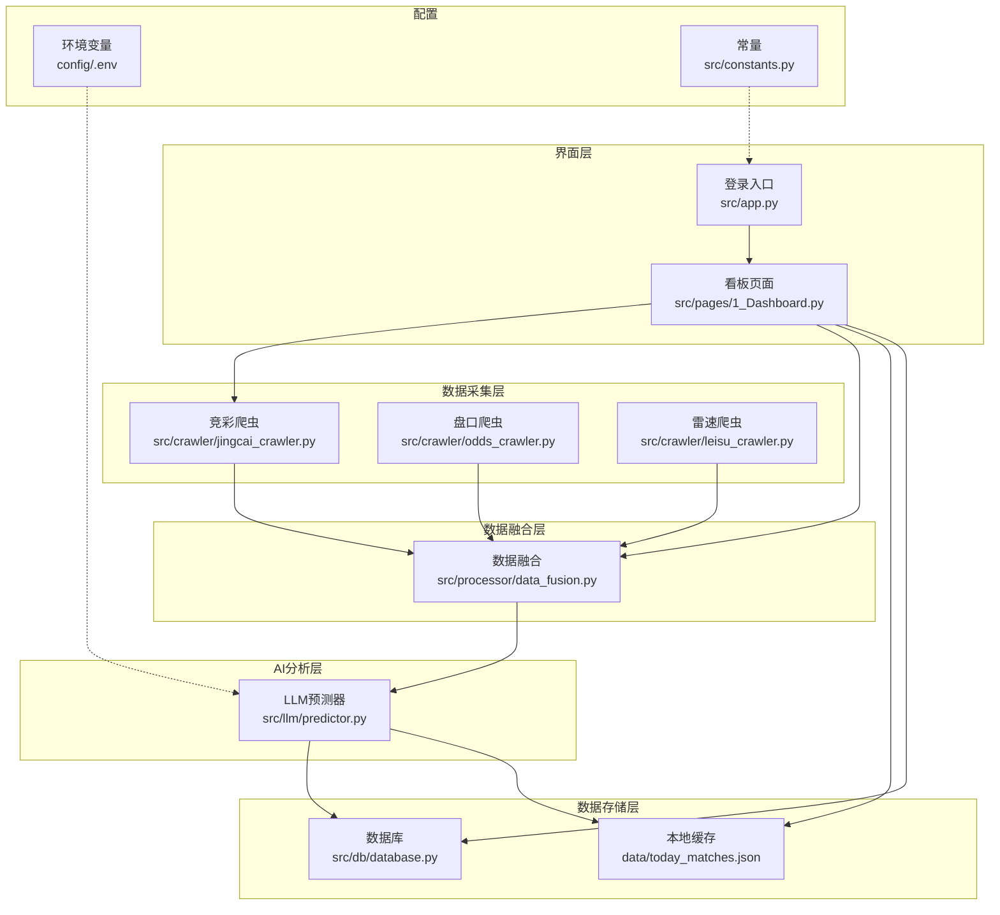
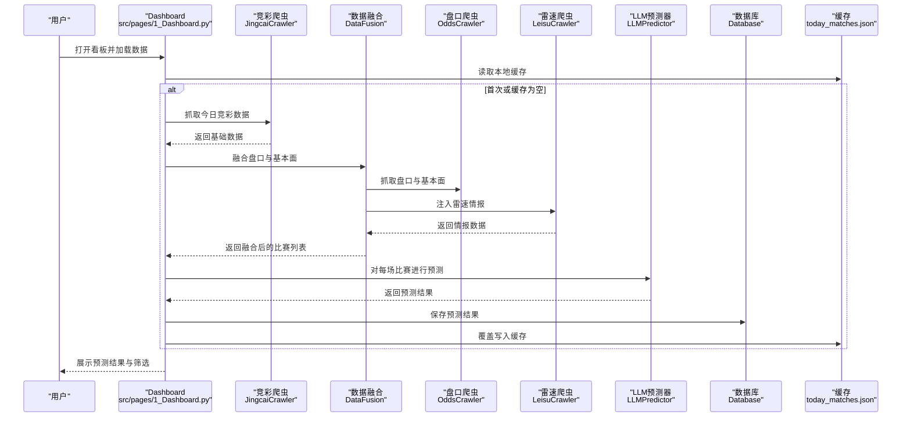
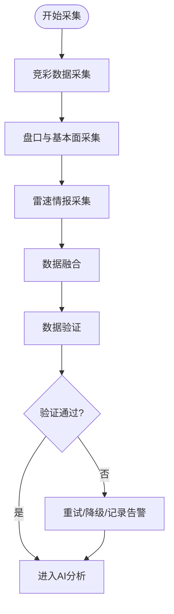
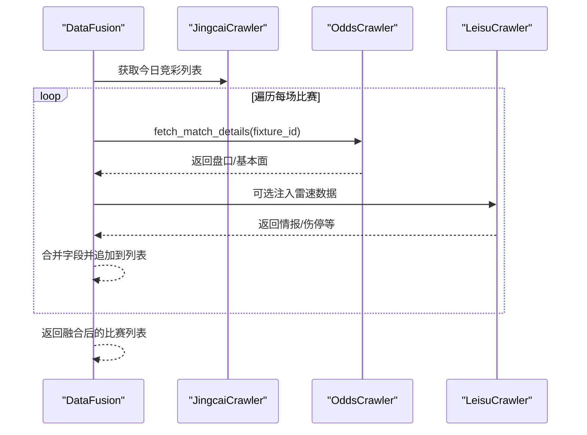
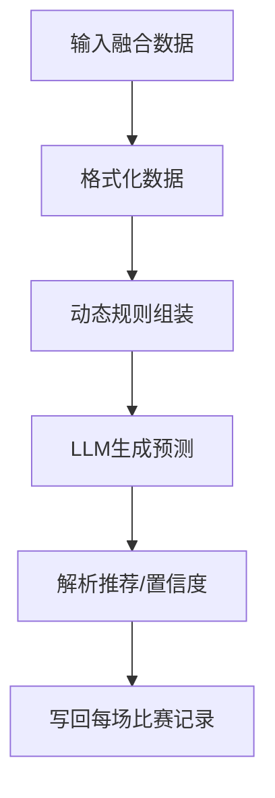
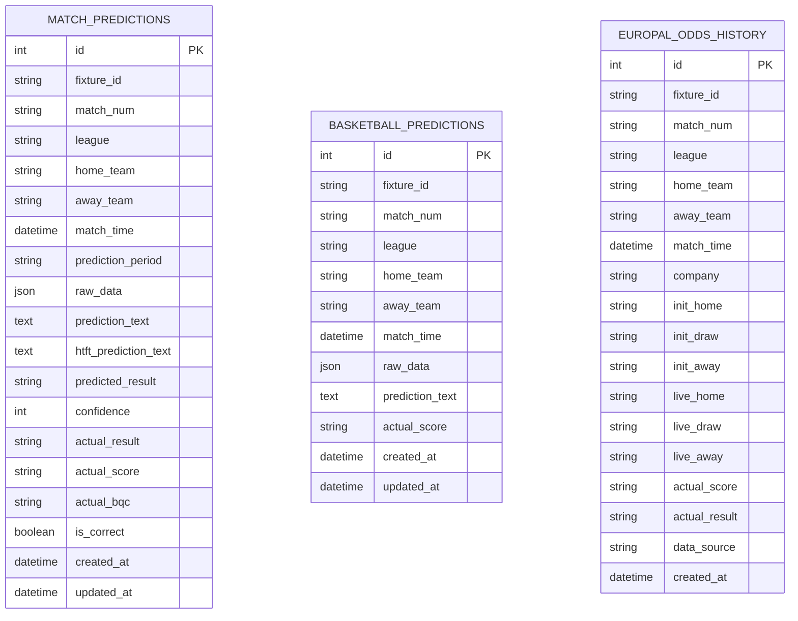
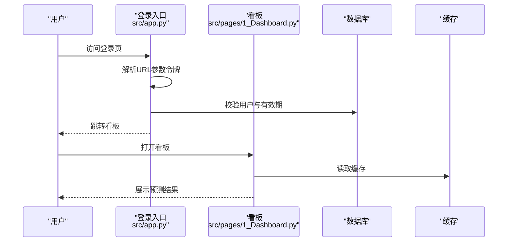
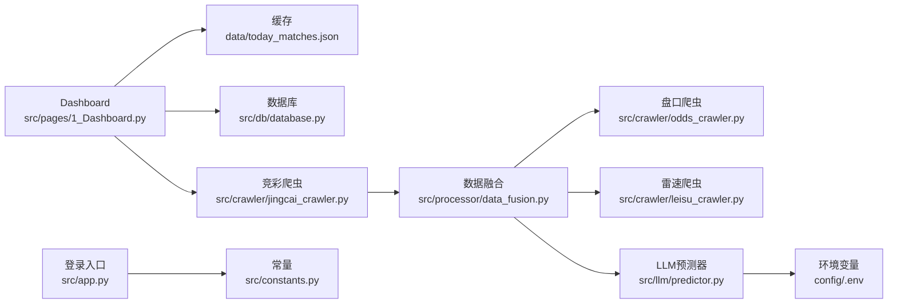

# 数据流设计

<cite>
**本文档引用的文件**
- [src/main.py](file://src/main.py)
- [src/app.py](file://src/app.py)
- [src/pages/1_Dashboard.py](file://src/pages/1_Dashboard.py)
- [src/db/database.py](file://src/db/database.py)
- [src/crawler/jingcai_crawler.py](file://src/crawler/jingcai_crawler.py)
- [src/crawler/odds_crawler.py](file://src/crawler/odds_crawler.py)
- [src/crawler/leisu_crawler.py](file://src/crawler/leisu_crawler.py)
- [src/processor/data_fusion.py](file://src/processor/data_fusion.py)
- [src/llm/predictor.py](file://src/llm/predictor.py)
- [data/today_matches.json](file://data/today_matches.json)
- [config/.env](file://config/.env)
- [src/constants.py](file://src/constants.py)
</cite>

## 目录
1. [简介](#简介)
2. [项目结构](#项目结构)
3. [核心组件](#核心组件)
4. [架构总览](#架构总览)
5. [详细组件分析](#详细组件分析)
6. [依赖关系分析](#依赖关系分析)
7. [性能考虑](#性能考虑)
8. [故障排查指南](#故障排查指南)
9. [结论](#结论)

## 简介
本文件面向足球预测系统，提供从原始数据获取到最终预测结果展示的完整数据流设计文档。系统涵盖数据采集（竞彩、盘口、第三方基本面与情报）、数据融合、AI分析（LLM预测）、数据存储与结果展示等环节。文档详细说明各环节的数据转换与传递机制、数据格式定义、数据验证规则、缓存策略与错误处理机制，并提供数据流图与关键数据节点说明，帮助开发者理解数据在系统中的流转路径与处理逻辑。

## 项目结构
系统采用分层架构，主要模块包括：
- 入口与界面层：Streamlit应用入口与仪表板页面
- 数据采集层：竞彩数据、盘口数据、第三方基本面与情报
- 数据融合层：将多源数据整合为统一结构
- AI分析层：基于规则与LLM的预测引擎
- 数据存储层：SQLite数据库与本地JSON缓存
- 配置与常量：环境变量与共享常量

图表来源
- [src/app.py:1-166](file://src/app.py#L1-L166)
- [src/pages/1_Dashboard.py:1-800](file://src/pages/1_Dashboard.py#L1-L800)
- [src/main.py:1-183](file://src/main.py#L1-L183)
- [src/crawler/jingcai_crawler.py:1-330](file://src/crawler/jingcai_crawler.py#L1-L330)
- [src/crawler/odds_crawler.py:1-167](file://src/crawler/odds_crawler.py#L1-L167)
- [src/crawler/leisu_crawler.py:1-609](file://src/crawler/leisu_crawler.py#L1-L609)
- [src/processor/data_fusion.py:1-108](file://src/processor/data_fusion.py#L1-L108)
- [src/llm/predictor.py:1-800](file://src/llm/predictor.py#L1-L800)
- [src/db/database.py:1-567](file://src/db/database.py#L1-L567)
- [data/today_matches.json:1-851](file://data/today_matches.json#L1-L851)
- [config/.env:1-20](file://config/.env#L1-L20)
- [src/constants.py:1-5](file://src/constants.py#L1-L5)

章节来源
- [src/main.py:34-136](file://src/main.py#L34-L136)
- [src/pages/1_Dashboard.py:86-106](file://src/pages/1_Dashboard.py#L86-L106)

## 核心组件
- 登录与会话管理：基于URL参数的令牌机制，配合数据库用户校验与会话状态维护
- 数据采集：竞彩官方数据、盘口与基本面、第三方情报（雷速体育）
- 数据融合：将多源数据结构化并注入统一字段
- AI预测：基于规则与LLM的综合分析，输出竞彩推荐与置信度
- 数据存储：SQLite持久化与本地JSON缓存
- 结果展示：Streamlit看板，支持筛选、全局重新预测与历史数据回写

章节来源
- [src/app.py:51-108](file://src/app.py#L51-L108)
- [src/db/database.py:200-308](file://src/db/database.py#L200-L308)
- [src/llm/predictor.py:20-46](file://src/llm/predictor.py#L20-L46)

## 架构总览
系统数据流从外部数据源采集开始，经由融合与AI分析，最终落库并以缓存形式供前端展示。关键路径如下：
- 竞彩数据采集 → 盘口与基本面采集 → 雷速情报注入 → 数据融合 → LLM预测 → 写入数据库与缓存 → Streamlit看板展示
- 用户可通过看板进行全局重新预测、历史数据回写与规则管理

图表来源
- [src/pages/1_Dashboard.py:86-106](file://src/pages/1_Dashboard.py#L86-L106)
- [src/crawler/jingcai_crawler.py:13-47](file://src/crawler/jingcai_crawler.py#L13-L47)
- [src/processor/data_fusion.py:61-107](file://src/processor/data_fusion.py#L61-L107)
- [src/crawler/odds_crawler.py:17-161](file://src/crawler/odds_crawler.py#L17-L161)
- [src/crawler/leisu_crawler.py:237-321](file://src/crawler/leisu_crawler.py#L237-L321)
- [src/llm/predictor.py:118-125](file://src/llm/predictor.py#L118-L125)
- [src/db/database.py:256-300](file://src/db/database.py#L256-L300)
- [data/today_matches.json:1-851](file://data/today_matches.json#L1-L851)

## 详细组件分析

### 数据采集层
- 竞彩数据采集（JingcaiCrawler）
  - 功能：抓取竞彩官方赛程与赔率，支持半全场赔率合并
  - 数据格式：包含fixture_id、match_num、league、home_team、away_team、match_time、odds（nspf/spf/rangqiu/bqc）
  - 验证规则：过滤隐藏/停售行，校验match_num前缀与目标日期一致
  - 错误处理：HTTP状态码检查、解析异常捕获与日志记录
- 盘口与基本面采集（OddsCrawler）
  - 功能：抓取亚盘、欧赔、近期战绩、交锋历史、伤停与澳门心水
  - 数据格式：asian_odds（macau/bet365）、europe_odds（公司列表）、recent_form（积分/排名/战绩/伤停/推荐）、h2h_summary
  - 验证规则：表格结构校验、字段长度与类型检查
  - 错误处理：网络异常、解析异常、空数据保护
- 第三方情报采集（LeisuCrawler）
  - 功能：通过Playwright自动化抓取伤停、进球分布、半全场、交锋与近期战绩、情报SWOT
  - 数据格式：injuries、goal_distribution、htft、standings、h2h_scores、recent_scores、match_intelligence
  - 验证规则：文本清洗、结构化抽取、异常字符检测
  - 错误处理：浏览器启动失败、验证码阻断、子进程隔离执行

图表来源
- [src/crawler/jingcai_crawler.py:13-47](file://src/crawler/jingcai_crawler.py#L13-L47)
- [src/crawler/odds_crawler.py:17-161](file://src/crawler/odds_crawler.py#L17-L161)
- [src/crawler/leisu_crawler.py:237-321](file://src/crawler/leisu_crawler.py#L237-L321)
- [src/processor/data_fusion.py:61-107](file://src/processor/data_fusion.py#L61-L107)

章节来源
- [src/crawler/jingcai_crawler.py:13-47](file://src/crawler/jingcai_crawler.py#L13-L47)
- [src/crawler/odds_crawler.py:17-161](file://src/crawler/odds_crawler.py#L17-L161)
- [src/crawler/leisu_crawler.py:237-321](file://src/crawler/leisu_crawler.py#L237-L321)

### 数据融合层
- 功能：将竞彩基础数据与盘口/基本面/情报进行结构化合并
- 关键流程：
  - 为每场比赛调用OddsCrawler.fetch_match_details获取asian_odds、europe_odds、recent_form、h2h_summary、advanced_stats
  - 可选注入LeisuCrawler数据（伤停、进球分布、半全场、情报等）
  - 输出统一的融合数据结构
- 错误处理：单场失败不影响整体流程，记录警告并继续

图表来源
- [src/processor/data_fusion.py:61-107](file://src/processor/data_fusion.py#L61-L107)
- [src/crawler/odds_crawler.py:17-161](file://src/crawler/odds_crawler.py#L17-L161)
- [src/crawler/leisu_crawler.py:237-321](file://src/crawler/leisu_crawler.py#L237-L321)

章节来源
- [src/processor/data_fusion.py:61-107](file://src/processor/data_fusion.py#L61-L107)

### AI分析层
- 功能：基于规则与LLM对融合后的数据进行综合分析，输出竞彩推荐、置信度与比分参考
- 关键流程：
  - 格式化输入数据（基本面、盘口、情报、高级统计等）
  - 动态组装规则（盘型、联赛特性、热点资金等）
  - 调用LLM生成预测报告
  - 解析推荐与置信度，写回每场比赛记录
- 数据格式：llm_prediction（预测文本）、all_predictions（多时间段预测集合）

图表来源
- [src/llm/predictor.py:81-281](file://src/llm/predictor.py#L81-L281)
- [src/llm/predictor.py:256-281](file://src/llm/predictor.py#L256-L281)

章节来源
- [src/llm/predictor.py:81-281](file://src/llm/predictor.py#L81-L281)

### 数据存储层
- 数据库（SQLite）：MatchPrediction、BasketballPrediction、SfcPrediction、DailyParlays、DailyReview、EuroOddsHistory等表
- 缓存（JSON）：data/today_matches.json，保存融合后的比赛数据与预测结果
- 写入策略：
  - 全程预测完成后，逐条保存预测结果（支持时间段标识）
  - 同时覆盖写入缓存文件，保证前端读取一致性

图表来源
- [src/db/database.py:68-198](file://src/db/database.py#L68-L198)

章节来源
- [src/db/database.py:256-300](file://src/db/database.py#L256-L300)
- [data/today_matches.json:1-851](file://data/today_matches.json#L1-L851)

### 结果展示层
- 登录与会话：基于URL参数的令牌（base64编码+时间戳），有效期由AUTH_TOKEN_TTL控制
- 仪表板：加载本地缓存，支持联赛筛选、全局重新预测、历史数据回写、规则管理
- 缓存策略：@st.cache_data(ttl=300)缓存5分钟，减少重复IO

图表来源
- [src/app.py:51-108](file://src/app.py#L51-L108)
- [src/pages/1_Dashboard.py:86-106](file://src/pages/1_Dashboard.py#L86-L106)
- [src/constants.py:3-4](file://src/constants.py#L3-L4)

章节来源
- [src/app.py:51-108](file://src/app.py#L51-L108)
- [src/pages/1_Dashboard.py:86-106](file://src/pages/1_Dashboard.py#L86-L106)
- [src/constants.py:3-4](file://src/constants.py#L3-L4)

## 依赖关系分析
- 组件耦合：
  - Dashboard依赖缓存与数据库，间接依赖采集与预测模块
  - 采集模块相互独立，融合模块集中协调
  - 预测模块依赖规则与LLM配置（环境变量）
- 外部依赖：
  - 竞彩与盘口网站（网络请求）
  - 雷速体育（Playwright浏览器自动化）
  - LLM API（OpenAI兼容接口）
- 配置与常量：
  - config/.env提供API密钥、模型参数、数据库URL等
  - AUTH_TOKEN_TTL控制会话有效期

图表来源
- [src/pages/1_Dashboard.py:86-106](file://src/pages/1_Dashboard.py#L86-L106)
- [src/db/database.py:256-300](file://src/db/database.py#L256-L300)
- [src/crawler/jingcai_crawler.py:13-47](file://src/crawler/jingcai_crawler.py#L13-L47)
- [src/processor/data_fusion.py:61-107](file://src/processor/data_fusion.py#L61-L107)
- [src/crawler/odds_crawler.py:17-161](file://src/crawler/odds_crawler.py#L17-L161)
- [src/crawler/leisu_crawler.py:237-321](file://src/crawler/leisu_crawler.py#L237-L321)
- [src/llm/predictor.py:20-46](file://src/llm/predictor.py#L20-L46)
- [config/.env:1-20](file://config/.env#L1-L20)
- [src/app.py:51-108](file://src/app.py#L51-L108)
- [src/constants.py:3-4](file://src/constants.py#L3-L4)

章节来源
- [config/.env:1-20](file://config/.env#L1-L20)
- [src/app.py:51-108](file://src/app.py#L51-L108)

## 性能考虑
- 缓存策略：前端5分钟缓存、预测过程中增量写入缓存，减少重复IO
- 并发与异步：Windows平台强制设置事件循环策略，避免子进程问题
- 数据库事务：批量写入与事务回滚，保证一致性与原子性
- 爬虫降级：单场失败不影响整体流程，记录日志并继续处理

## 故障排查指南
- 登录失败
  - 检查.env中的LLM_API_KEY与API_BASE
  - 校验AUTH_TOKEN_TTL与URL参数令牌有效性
- 数据采集失败
  - 竞彩/盘口网站状态与编码（gb2312）
  - 雷速体育验证码阻断与浏览器启动失败，必要时使用子进程隔离
- 数据融合异常
  - fixture_id缺失导致跳过抓取，检查竞彩数据字段
  - 雷速注入失败不影响流程，记录警告
- 数据库写入失败
  - 检查SQLite路径与权限，确保data/football.db存在
  - 事务回滚日志，定位具体失败记录
- 前端展示异常
  - 清除缓存或等待5分钟过期
  - 检查缓存文件完整性与JSON格式

章节来源
- [src/app.py:94-108](file://src/app.py#L94-L108)
- [src/crawler/jingcai_crawler.py:20-47](file://src/crawler/jingcai_crawler.py#L20-L47)
- [src/crawler/leisu_crawler.py:169-191](file://src/crawler/leisu_crawler.py#L169-L191)
- [src/db/database.py:256-300](file://src/db/database.py#L256-L300)
- [src/pages/1_Dashboard.py:86-106](file://src/pages/1_Dashboard.py#L86-L106)

## 结论
本数据流设计将多源数据采集、结构化融合、规则与LLM分析、持久化与缓存、前端展示有机结合，形成闭环的预测流水线。通过严格的验证规则、错误处理与缓存策略，系统在复杂外部环境中保持稳定与高效。建议持续优化规则引擎与LLM提示词，提升预测准确性与可解释性。