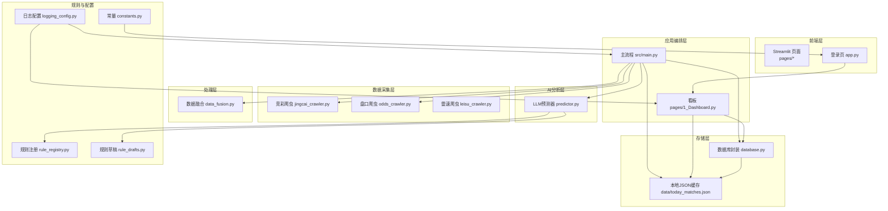
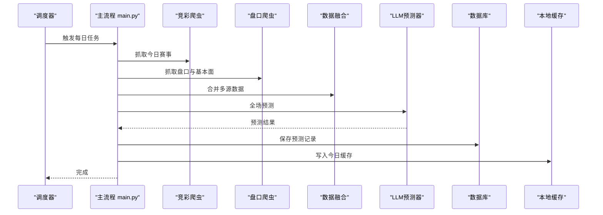
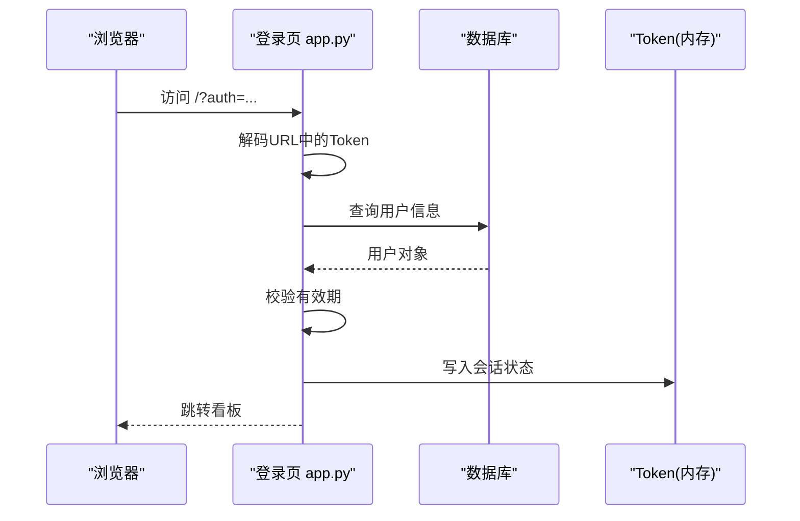
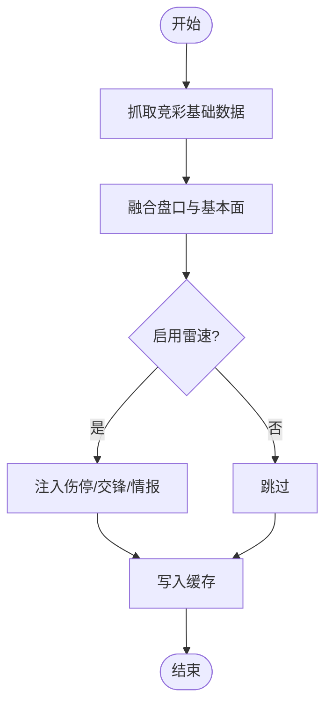
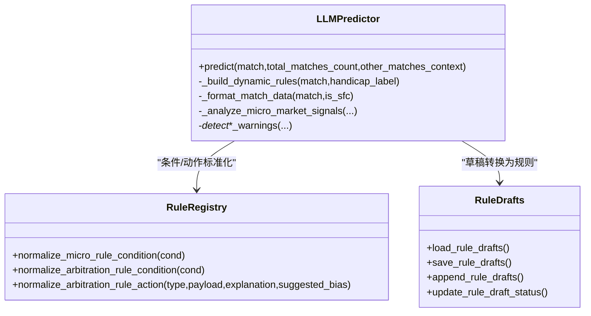
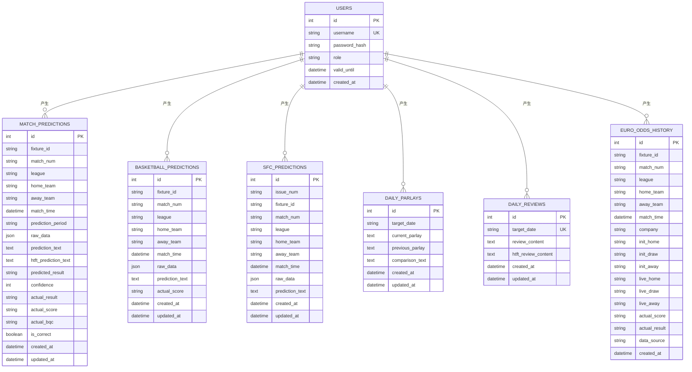
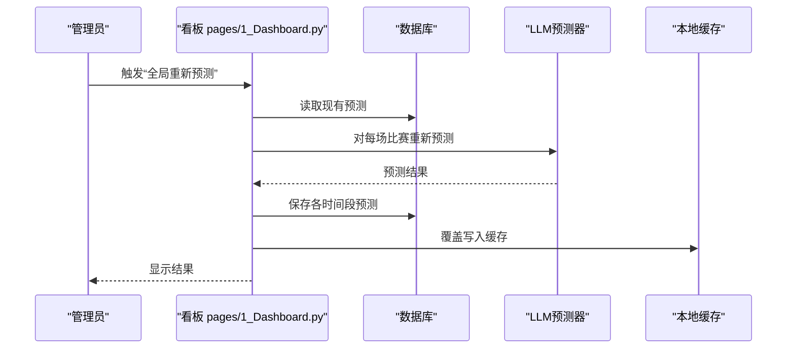
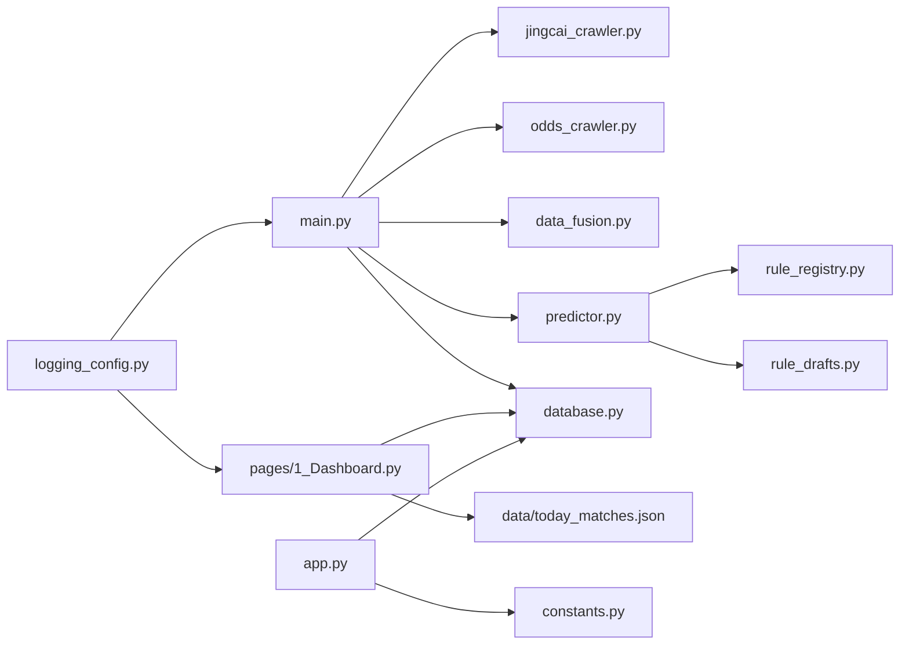

# 整体设计

<cite>
**本文引用的文件**
- [src/app.py](file://src/app.py)
- [src/main.py](file://src/main.py)
- [src/db/database.py](file://src/db/database.py)
- [src/constants.py](file://src/constants.py)
- [src/llm/predictor.py](file://src/llm/predictor.py)
- [src/processor/data_fusion.py](file://src/processor/data_fusion.py)
- [src/crawler/jingcai_crawler.py](file://src/crawler/jingcai_crawler.py)
- [src/pages/1_Dashboard.py](file://src/pages/1_Dashboard.py)
- [src/logging_config.py](file://src/logging_config.py)
- [src/utils/rule_registry.py](file://src/utils/rule_registry.py)
- [src/utils/rule_drafts.py](file://src/utils/rule_drafts.py)
- [data/today_matches.json](file://data/today_matches.json)
</cite>

## 目录
1. [引言](#引言)
2. [项目结构](#项目结构)
3. [核心组件](#核心组件)
4. [架构总览](#架构总览)
5. [详细组件分析](#详细组件分析)
6. [依赖分析](#依赖分析)
7. [性能考量](#性能考量)
8. [故障排查指南](#故障排查指南)
9. [结论](#结论)
10. [附录](#附录)

## 引言
本设计文档面向“足球预测系统”，旨在阐述系统的高层架构理念、核心设计原则与整体技术选型，明确分层架构（数据采集层、处理层、AI分析层、存储层、展示层）的设计动机与边界，给出系统上下文图与关键流程序列图，帮助开发者快速理解系统整体设计思路与实现策略。

## 项目结构
系统采用“分层 + 功能域”混合组织方式：
- 分层视角：数据采集层、处理层、AI分析层、存储层、展示层
- 功能域视角：爬虫模块、数据融合、LLM预测器、数据库、前端看板、规则引擎与草稿管理、日志配置

图表来源
- [src/main.py:34-136](file://src/main.py#L34-L136)
- [src/pages/1_Dashboard.py:86-106](file://src/pages/1_Dashboard.py#L86-L106)
- [src/db/database.py:200-307](file://src/db/database.py#L200-L307)
- [src/processor/data_fusion.py:57-108](file://src/processor/data_fusion.py#L57-L108)
- [src/llm/predictor.py:20-46](file://src/llm/predictor.py#L20-L46)
- [src/crawler/jingcai_crawler.py:6-47](file://src/crawler/jingcai_crawler.py#L6-L47)
- [src/logging_config.py:8-30](file://src/logging_config.py#L8-L30)
- [src/constants.py:1-5](file://src/constants.py#L1-L5)

章节来源
- [src/main.py:34-136](file://src/main.py#L34-L136)
- [src/pages/1_Dashboard.py:86-106](file://src/pages/1_Dashboard.py#L86-L106)
- [src/db/database.py:200-307](file://src/db/database.py#L200-L307)
- [src/processor/data_fusion.py:57-108](file://src/processor/data_fusion.py#L57-L108)
- [src/llm/predictor.py:20-46](file://src/llm/predictor.py#L20-L46)
- [src/crawler/jingcai_crawler.py:6-47](file://src/crawler/jingcai_crawler.py#L6-L47)
- [src/logging_config.py:8-30](file://src/logging_config.py#L8-L30)
- [src/constants.py:1-5](file://src/constants.py#L1-L5)

## 核心组件
- 登录与鉴权：基于URL参数的轻量Token机制，配合数据库用户表校验与有效期控制
- 数据采集：竞彩官网、第三方盘口与雷速体育数据抓取
- 数据融合：将多源数据整合为统一结构，增强伤停、交锋、情报等字段
- AI分析：基于规则与LLM的综合预测，输出竞彩推荐、置信度与进球数参考
- 存储：SQLite持久化与本地JSON缓存，支持多表与多时间段预测记录
- 展示：Streamlit看板，支持筛选、全局重跑、历史回写与日志查看
- 规则引擎：动态加载风控与微观信号规则，支持草稿与标准化转换

章节来源
- [src/app.py:51-108](file://src/app.py#L51-L108)
- [src/db/database.py:58-126](file://src/db/database.py#L58-L126)
- [src/processor/data_fusion.py:57-108](file://src/processor/data_fusion.py#L57-L108)
- [src/llm/predictor.py:20-46](file://src/llm/predictor.py#L20-L46)
- [src/pages/1_Dashboard.py:86-106](file://src/pages/1_Dashboard.py#L86-L106)
- [src/utils/rule_registry.py:102-176](file://src/utils/rule_registry.py#L102-L176)

## 架构总览
系统采用“批处理驱动 + 事件触发”的工作流：
- 批处理：每日定时运行主流程，抓取→融合→预测→入库
- 事件触发：看板支持手动重跑、历史回写、规则管理与日志查看
- 数据边界：本地JSON缓存作为中间态，数据库作为权威存储

图表来源
- [src/main.py:34-136](file://src/main.py#L34-L136)
- [src/processor/data_fusion.py:61-108](file://src/processor/data_fusion.py#L61-L108)
- [src/llm/predictor.py:20-46](file://src/llm/predictor.py#L20-L46)
- [src/db/database.py:256-304](file://src/db/database.py#L256-L304)
- [data/today_matches.json:1-200](file://data/today_matches.json#L1-L200)

## 详细组件分析

### 分层架构与职责
- 数据采集层
  - 负责从竞彩、第三方盘口与雷速体育抓取原始数据
  - 输出结构化数据供融合层使用
- 处理层
  - 融合多源数据，注入伤停、交锋、情报等增强字段
  - 支持可选的雷速爬虫实例，按环境变量开关启用
- AI分析层
  - 基于规则与LLM生成预测报告，提取竞彩推荐、置信度与进球数
  - 支持主观盘口推演开关
- 存储层
  - SQLite数据库持久化预测、复盘、串关方案与欧赔历史
  - 本地JSON缓存作为中间态与看板数据源
- 展示层
  - Streamlit看板，支持筛选、全局重跑、历史回写、日志查看与规则管理

章节来源
- [src/crawler/jingcai_crawler.py:6-47](file://src/crawler/jingcai_crawler.py#L6-L47)
- [src/processor/data_fusion.py:57-108](file://src/processor/data_fusion.py#L57-L108)
- [src/llm/predictor.py:20-46](file://src/llm/predictor.py#L20-L46)
- [src/db/database.py:200-307](file://src/db/database.py#L200-L307)
- [src/pages/1_Dashboard.py:86-106](file://src/pages/1_Dashboard.py#L86-L106)

### 登录与鉴权流程

图表来源
- [src/app.py:65-82](file://src/app.py#L65-L82)
- [src/app.py:94-108](file://src/app.py#L94-L108)
- [src/db/database.py:309-310](file://src/db/database.py#L309-L310)
- [src/constants.py:3-4](file://src/constants.py#L3-L4)

章节来源
- [src/app.py:65-82](file://src/app.py#L65-L82)
- [src/app.py:94-108](file://src/app.py#L94-L108)
- [src/db/database.py:309-310](file://src/db/database.py#L309-L310)
- [src/constants.py:3-4](file://src/constants.py#L3-L4)

### 数据融合与增强

图表来源
- [src/main.py:40-109](file://src/main.py#L40-L109)
- [src/processor/data_fusion.py:61-108](file://src/processor/data_fusion.py#L61-L108)

章节来源
- [src/main.py:40-109](file://src/main.py#L40-L109)
- [src/processor/data_fusion.py:61-108](file://src/processor/data_fusion.py#L61-L108)

### LLM预测与规则引擎

图表来源
- [src/llm/predictor.py:20-46](file://src/llm/predictor.py#L20-L46)
- [src/utils/rule_registry.py:102-176](file://src/utils/rule_registry.py#L102-L176)
- [src/utils/rule_registry.py:179-218](file://src/utils/rule_registry.py#L179-L218)
- [src/utils/rule_drafts.py:10-45](file://src/utils/rule_drafts.py#L10-L45)

章节来源
- [src/llm/predictor.py:20-46](file://src/llm/predictor.py#L20-L46)
- [src/utils/rule_registry.py:102-176](file://src/utils/rule_registry.py#L102-L176)
- [src/utils/rule_registry.py:179-218](file://src/utils/rule_registry.py#L179-L218)
- [src/utils/rule_drafts.py:10-45](file://src/utils/rule_drafts.py#L10-L45)

### 数据库模型与多表设计

图表来源
- [src/db/database.py:58-198](file://src/db/database.py#L58-L198)

章节来源
- [src/db/database.py:58-198](file://src/db/database.py#L58-L198)

### 看板与全局重跑

图表来源
- [src/pages/1_Dashboard.py:410-538](file://src/pages/1_Dashboard.py#L410-L538)
- [src/db/database.py:256-304](file://src/db/database.py#L256-L304)
- [data/today_matches.json:1-200](file://data/today_matches.json#L1-L200)

章节来源
- [src/pages/1_Dashboard.py:410-538](file://src/pages/1_Dashboard.py#L410-L538)
- [src/db/database.py:256-304](file://src/db/database.py#L256-L304)
- [data/today_matches.json:1-200](file://data/today_matches.json#L1-L200)

## 依赖分析
- 组件耦合
  - 主流程对爬虫、融合、预测与数据库有直接依赖
  - 看板对数据库与缓存有直接依赖
  - 预测器依赖规则注册与草稿模块
- 外部依赖
  - 请求库、BeautifulSoup、OpenAI SDK、SQLAlchemy、Loguru、Streamlit
- 潜在循环依赖
  - 通过模块导入顺序与路径修正避免循环引用

图表来源
- [src/main.py:25-32](file://src/main.py#L25-L32)
- [src/pages/1_Dashboard.py:8-13](file://src/pages/1_Dashboard.py#L8-L13)
- [src/app.py:29-30](file://src/app.py#L29-L30)
- [src/logging_config.py:8-30](file://src/logging_config.py#L8-L30)

章节来源
- [src/main.py:25-32](file://src/main.py#L25-L32)
- [src/pages/1_Dashboard.py:8-13](file://src/pages/1_Dashboard.py#L8-L13)
- [src/app.py:29-30](file://src/app.py#L29-L30)
- [src/logging_config.py:8-30](file://src/logging_config.py#L8-L30)

## 性能考量
- IO密集与并发
  - 爬虫与LLM调用为IO瓶颈，建议在独立线程/进程或异步环境下运行，避免阻塞UI
- 缓存策略
  - 本地JSON缓存减少重复抓取与计算成本；数据库按日期窗口查询优化
- 规则评估
  - 规则条件应尽量简洁，避免复杂表达式导致运行时开销增大
- 日志与可观测性
  - 双通道日志输出，按天轮转，保留7天，便于问题定位

## 故障排查指南
- 登录失败
  - 检查Token有效期与用户授权到期时间
  - 核对数据库用户记录与密码哈希
- 数据为空
  - 确认竞彩爬虫返回数据非空
  - 检查融合阶段是否抛出异常
- 预测未入库
  - 查看数据库保存接口返回与事务提交
  - 检查预测字段提取逻辑
- 规则不生效
  - 校验规则条件标准化与动作类型
  - 确认草稿转换为规则后已启用

章节来源
- [src/app.py:94-108](file://src/app.py#L94-L108)
- [src/db/database.py:256-304](file://src/db/database.py#L256-L304)
- [src/utils/rule_registry.py:102-176](file://src/utils/rule_registry.py#L102-L176)

## 结论
系统通过清晰的分层与模块化设计，实现了从数据采集、融合、AI分析到存储与展示的完整闭环。动态规则引擎与看板交互进一步增强了系统的可维护性与可扩展性。建议持续完善规则体系与缓存策略，以应对更高并发与更复杂的业务场景。

## 附录
- 关键流程回顾
  - 每日批处理：抓取→融合→预测→入库→缓存
  - 看板事件：筛选→重跑→回写→复盘
- 建议的扩展点
  - 引入消息队列或定时任务框架
  - 增加LLM调用的重试与熔断
  - 规则版本化与灰度发布