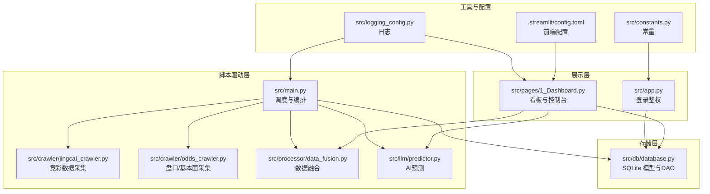
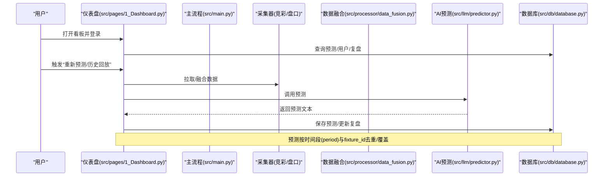
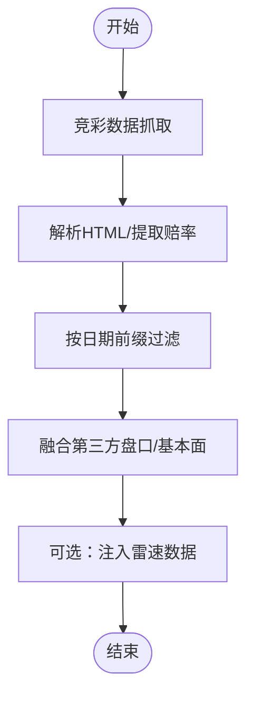
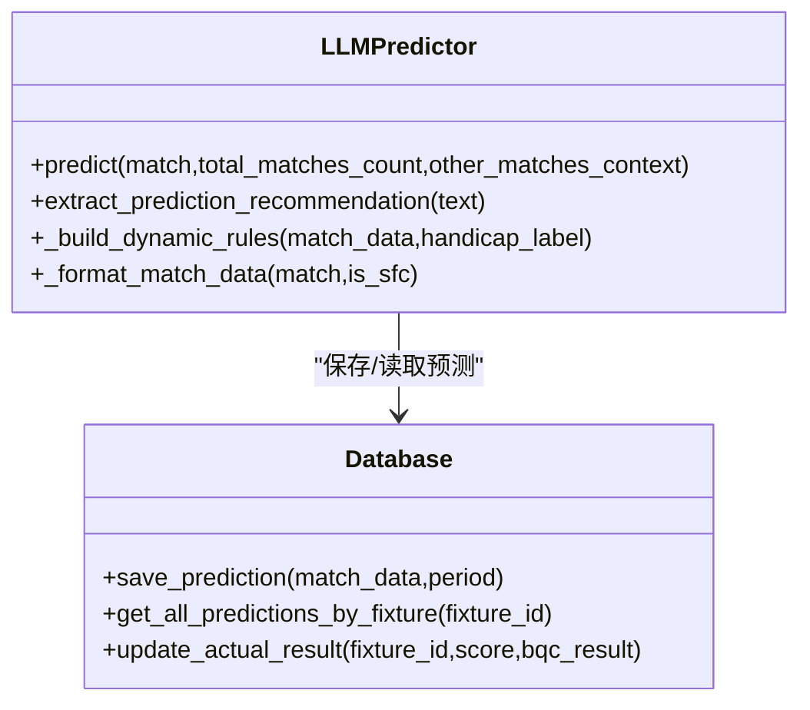
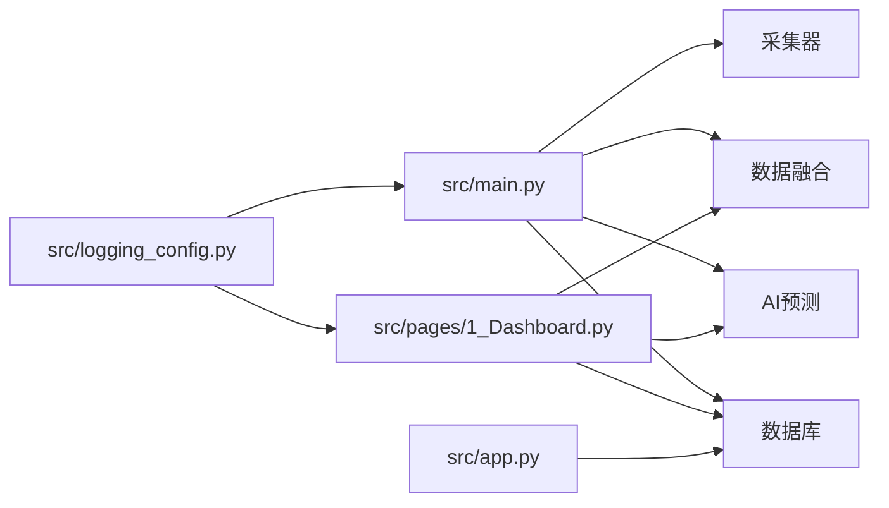

# 系统架构

<cite>
**本文引用的文件**
- [src/app.py](file://src/app.py)
- [src/main.py](file://src/main.py)
- [src/db/database.py](file://src/db/database.py)
- [src/constants.py](file://src/constants.py)
- [src/logging_config.py](file://src/logging_config.py)
- [src/llm/predictor.py](file://src/llm/predictor.py)
- [src/processor/data_fusion.py](file://src/processor/data_fusion.py)
- [src/crawler/jingcai_crawler.py](file://src/crawler/jingcai_crawler.py)
- [src/pages/1_Dashboard.py](file://src/pages/1_Dashboard.py)
- [scripts/batch_predict_goals.py](file://scripts/batch_predict_goals.py)
- [.streamlit/config.toml](file://.streamlit/config.toml)
</cite>

## 目录
1. [简介](#简介)
2. [项目结构](#项目结构)
3. [核心组件](#核心组件)
4. [架构总览](#架构总览)
5. [详细组件分析](#详细组件分析)
6. [依赖关系分析](#依赖关系分析)
7. [性能考虑](#性能考虑)
8. [故障排查指南](#故障排查指南)
9. [结论](#结论)
10. [附录](#附录)

## 简介
本架构文档面向“足球预测系统”，聚焦于系统的高层设计、分层架构与组件交互，涵盖数据采集层、处理层、AI分析层、存储层与展示层。文档同时给出数据流设计、处理流程、系统边界、架构决策的技术考量、性能优化策略与可扩展性设计，并提供系统上下文图与组件分解图，帮助开发者快速理解整体布局。

## 项目结构
系统采用“脚本驱动 + Streamlit 展示 + SQLite 存储”的轻量级分层组织：
- 脚本驱动层：负责定时或手动触发的全量数据采集、融合与预测任务
- 展示层：基于 Streamlit 的仪表盘，提供登录鉴权、数据筛选、预测结果可视化与管理功能
- 存储层：SQLite 数据库存储预测结果、用户信息、历史数据与复盘记录
- 工具与配置：日志、常量、环境变量与前端配置

图表来源
- [src/main.py:34-135](file://src/main.py#L34-L135)
- [src/crawler/jingcai_crawler.py:13-47](file://src/crawler/jingcai_crawler.py#L13-L47)
- [src/processor/data_fusion.py:61-107](file://src/processor/data_fusion.py#L61-L107)
- [src/llm/predictor.py:20-46](file://src/llm/predictor.py#L20-L46)
- [src/db/database.py:200-307](file://src/db/database.py#L200-L307)
- [src/app.py:110-163](file://src/app.py#L110-L163)
- [src/pages/1_Dashboard.py:86-106](file://src/pages/1_Dashboard.py#L86-L106)
- [src/logging_config.py:8-29](file://src/logging_config.py#L8-L29)
- [src/constants.py:1-5](file://src/constants.py#L1-L5)
- [.streamlit/config.toml:1-6](file://.streamlit/config.toml#L1-L6)

章节来源
- [src/main.py:34-135](file://src/main.py#L34-L135)
- [src/pages/1_Dashboard.py:86-106](file://src/pages/1_Dashboard.py#L86-L106)
- [src/db/database.py:200-307](file://src/db/database.py#L200-L307)

## 核心组件
- 登录鉴权与会话管理：基于 URL Token 的短期会话，配合 SQLite 用户表实现访问控制
- 数据采集层：竞彩官方数据抓取、第三方盘口/基本面抓取、可选的雷速体育数据增强
- 数据处理层：数据融合、结构化清洗、伤停/交锋/进球分布等增强
- AI分析层：基于规则与大模型的综合预测，支持全场与半全场、进球数专项
- 存储层：多表模型（预测、用户、复盘、串关、欧赔历史等），支持按时间段与 fixture_id 精确查询
- 展示层：仪表盘、筛选、复盘、规则管理、日志查看等

章节来源
- [src/app.py:51-108](file://src/app.py#L51-L108)
- [src/db/database.py:58-198](file://src/db/database.py#L58-L198)
- [src/llm/predictor.py:20-46](file://src/llm/predictor.py#L20-L46)
- [src/processor/data_fusion.py:57-107](file://src/processor/data_fusion.py#L57-L107)
- [src/crawler/jingcai_crawler.py:13-47](file://src/crawler/jingcai_crawler.py#L13-L47)

## 架构总览
系统采用“批处理 + 事件驱动”的混合模式：
- 批处理：每日定时或手动运行主流程，抓取数据、融合、预测、入库
- 事件驱动：用户在仪表盘发起“重新预测”“历史回放”“规则管理”等操作，触发相应流程

图表来源
- [src/pages/1_Dashboard.py:412-507](file://src/pages/1_Dashboard.py#L412-L507)
- [src/main.py:34-135](file://src/main.py#L34-L135)
- [src/processor/data_fusion.py:61-107](file://src/processor/data_fusion.py#L61-L107)
- [src/llm/predictor.py:20-46](file://src/llm/predictor.py#L20-L46)
- [src/db/database.py:256-304](file://src/db/database.py#L256-L304)

## 详细组件分析

### 数据采集层
- 竞彩官方数据：抓取胜平负/让球胜平负/半全场赔率，解析 HTML 并按日期前缀过滤
- 第三方盘口/基本面：抓取亚盘/欧赔/近期战绩/交锋/高级攻防指标
- 可选增强：雷速体育伤停/交锋/进球分布/情报等

图表来源
- [src/crawler/jingcai_crawler.py:13-47](file://src/crawler/jingcai_crawler.py#L13-L47)
- [src/processor/data_fusion.py:61-107](file://src/processor/data_fusion.py#L61-L107)

章节来源
- [src/crawler/jingcai_crawler.py:13-47](file://src/crawler/jingcai_crawler.py#L13-L47)
- [src/processor/data_fusion.py:61-107](file://src/processor/data_fusion.py#L61-L107)

### 数据处理层
- 融合策略：以 fixture_id 为键合并盘口与基本面，支持可选的雷速增强
- 结构化清洗：标准化时间、比分、伤停文本，抽取场均进球/失球、xG、射门等
- 微观信号：盘口异动、欧亚背离、深盘死水、半球生死盘等预警信号

章节来源
- [src/processor/data_fusion.py:57-107](file://src/processor/data_fusion.py#L57-L107)
- [src/llm/predictor.py:483-585](file://src/llm/predictor.py#L483-L585)

### AI分析层
- 预测器：构建动态规则（盘型/联赛/变化/资金流），格式化输入，调用大模型生成预测文本
- 结果解析：提取“竞彩推荐”“置信度”“预测偏向”等结构化字段
- 进球数专项：基于统计与基本面的独立预测流程，支持回写 Excel

图表来源
- [src/llm/predictor.py:20-46](file://src/llm/predictor.py#L20-L46)
- [src/db/database.py:256-304](file://src/db/database.py#L256-L304)

章节来源
- [src/llm/predictor.py:20-46](file://src/llm/predictor.py#L20-L46)
- [src/db/database.py:256-304](file://src/db/database.py#L256-L304)

### 存储层
- 模型设计：用户、比赛预测、篮球预测、胜负彩预测、每日串关、每日复盘、欧赔历史
- 关键能力：按 fixture_id 与时间段(period)查询、按日期窗口聚合、更新实际赛果
- 兼容性：SQLite 自动建表与列补丁，保证历史库可用

章节来源
- [src/db/database.py:58-198](file://src/db/database.py#L58-L198)
- [src/db/database.py:219-233](file://src/db/database.py#L219-L233)
- [src/db/database.py:451-478](file://src/db/database.py#L451-L478)

### 展示层
- 登录鉴权：URL Token + 会话状态，支持过期校验与角色控制
- 仪表盘：赛事筛选、全局重新预测、历史数据拉取、日志查看、规则管理入口
- 缓存策略：前端数据缓存 5 分钟，减少 IO 压力

章节来源
- [src/app.py:51-108](file://src/app.py#L51-L108)
- [src/pages/1_Dashboard.py:86-106](file://src/pages/1_Dashboard.py#L86-L106)
- [src/pages/1_Dashboard.py:412-507](file://src/pages/1_Dashboard.py#L412-L507)

### 脚本与批处理
- 主流程：按阶段执行采集、融合、预测、入库，支持篮球与足球两条流水
- 进球数专项：读取 Excel 与数据库，批量回写预测结果

章节来源
- [src/main.py:34-135](file://src/main.py#L34-L135)
- [scripts/batch_predict_goals.py:13-239](file://scripts/batch_predict_goals.py#L13-L239)

## 依赖关系分析
- 组件耦合：主流程对采集器、融合器、预测器、数据库强依赖；仪表盘对数据库与预测器弱耦合
- 外部依赖：requests/BeautifulSoup（采集）、OpenAI SDK（预测）、openpyxl（Excel 回写）
- 配置与日志：.env/.streamlit/config.toml、日志统一输出到文件与终端

图表来源
- [src/main.py:25-32](file://src/main.py#L25-L32)
- [src/pages/1_Dashboard.py:8-13](file://src/pages/1_Dashboard.py#L8-L13)
- [src/app.py:29-30](file://src/app.py#L29-L30)
- [src/logging_config.py:8-29](file://src/logging_config.py#L8-L29)

章节来源
- [src/main.py:25-32](file://src/main.py#L25-L32)
- [src/pages/1_Dashboard.py:8-13](file://src/pages/1_Dashboard.py#L8-L13)
- [src/app.py:29-30](file://src/app.py#L29-L30)
- [src/logging_config.py:8-29](file://src/logging_config.py#L8-L29)

## 性能考虑
- I/O 优化
  - 采集阶段：并发抓取与超时控制，失败重试与降级（第三方数据不可用时仍可预测）
  - 融合阶段：按 fixture_id 合并，避免重复抓取
  - 预测阶段：批量预测后增量落库，减少数据库事务次数
- 缓存与复用
  - 前端数据缓存 5 分钟，降低仪表盘渲染压力
  - 雷速爬虫可复用实例，避免重复初始化
- 存储优化
  - 按日期窗口查询与按 fixture_id 去重，减少扫描范围
  - SQLite 日志轮转与保留策略，避免磁盘膨胀
- 可扩展性
  - 模块化：采集/融合/预测/存储解耦，便于替换与扩展
  - 规则引擎：动态规则拼装，支持快速迭代与 A/B 实验
  - 多语言/多模型：预测器支持更换模型与基座地址

## 故障排查指南
- 登录鉴权问题
  - 检查 URL Token 是否过期（常量 TTL）、用户有效期、会话状态
- 数据采集失败
  - 竞彩/第三方站点结构变更导致解析失败，检查 HTML 结构与编码
  - 雷速注入失败时记录警告，不影响主流程
- 预测结果异常
  - 检查 LLM API Key/Base、模型参数、动态规则拼装
  - 核对“竞彩推荐”提取正则与预测文本格式
- 存储异常
  - SQLite 权限/路径问题，确认 data/football.db 存在与可写
  - 历史数据入库使用原生 SQL，避免 ORM 字段缺失
- 前端问题
  - Streamlit headless 模式与浏览器统计关闭，避免外部依赖
  - 日志查看仅 Admin 可见，确认权限

章节来源
- [src/app.py:51-108](file://src/app.py#L51-L108)
- [src/db/database.py:200-217](file://src/db/database.py#L200-L217)
- [src/pages/1_Dashboard.py:292-310](file://src/pages/1_Dashboard.py#L292-L310)
- [.streamlit/config.toml:1-6](file://.streamlit/config.toml#L1-L6)

## 结论
系统通过清晰的分层与模块化设计，在保证可维护性的前提下实现了“采集—融合—预测—存储—展示”的完整闭环。借助动态规则与 SQLite 存储，系统具备良好的可扩展性与可演进性。建议持续完善规则治理、监控告警与自动化回归，进一步提升稳定性与预测质量。

## 附录
- 系统边界
  - 外部系统：竞彩官网、第三方盘口网站、雷速体育、OpenAI API
  - 内部系统：SQLite 数据库、日志系统、前端展示
- 关键流程
  - 全流程：采集 → 融合 → 预测 → 入库 → 展示
  - 专项流程：历史回放 → 盘口融合 → 入库
  - 进球数专项：Excel 读取 → 数据库匹配 → 预测 → 回写 Excel