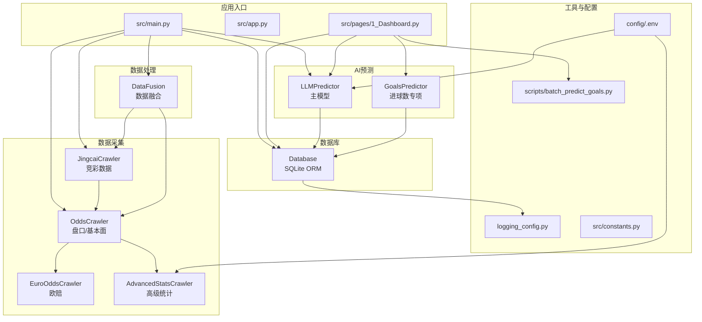
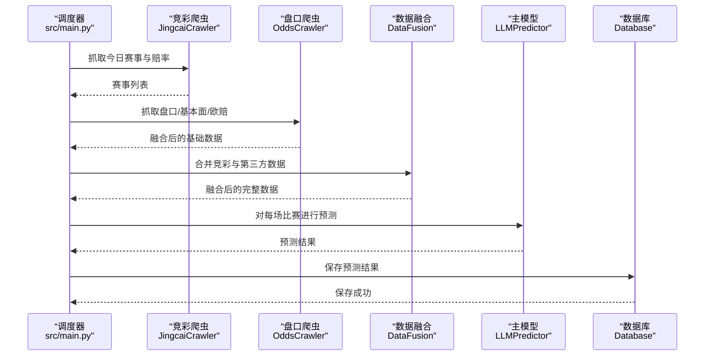
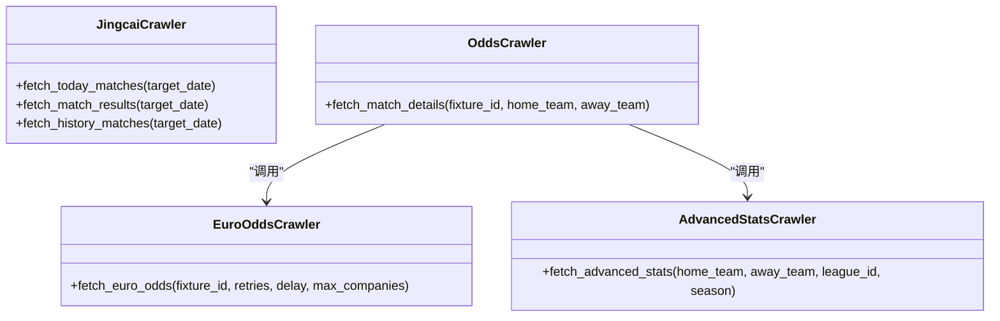
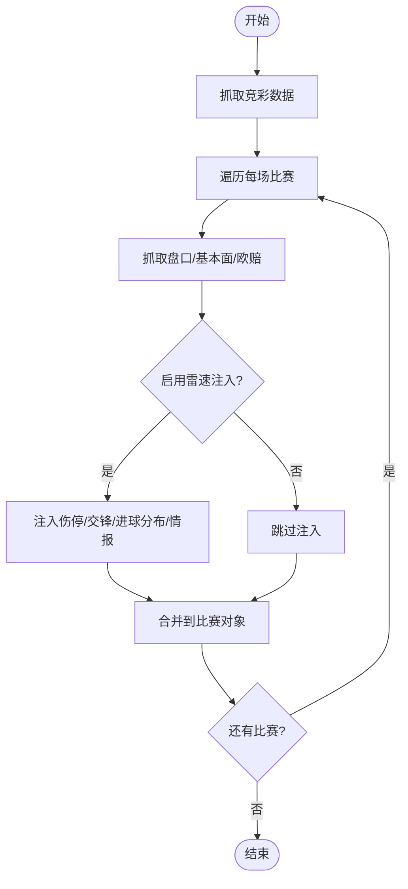
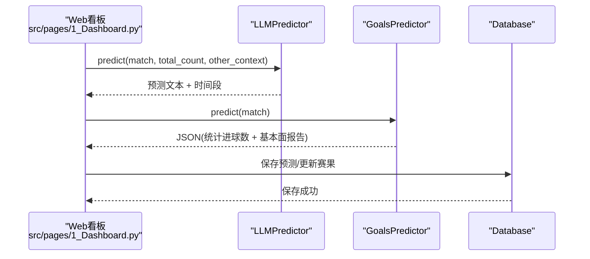
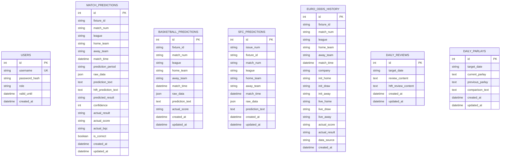
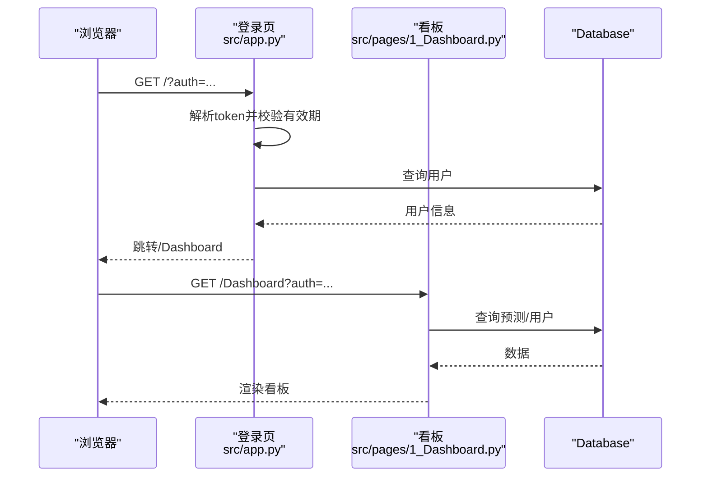
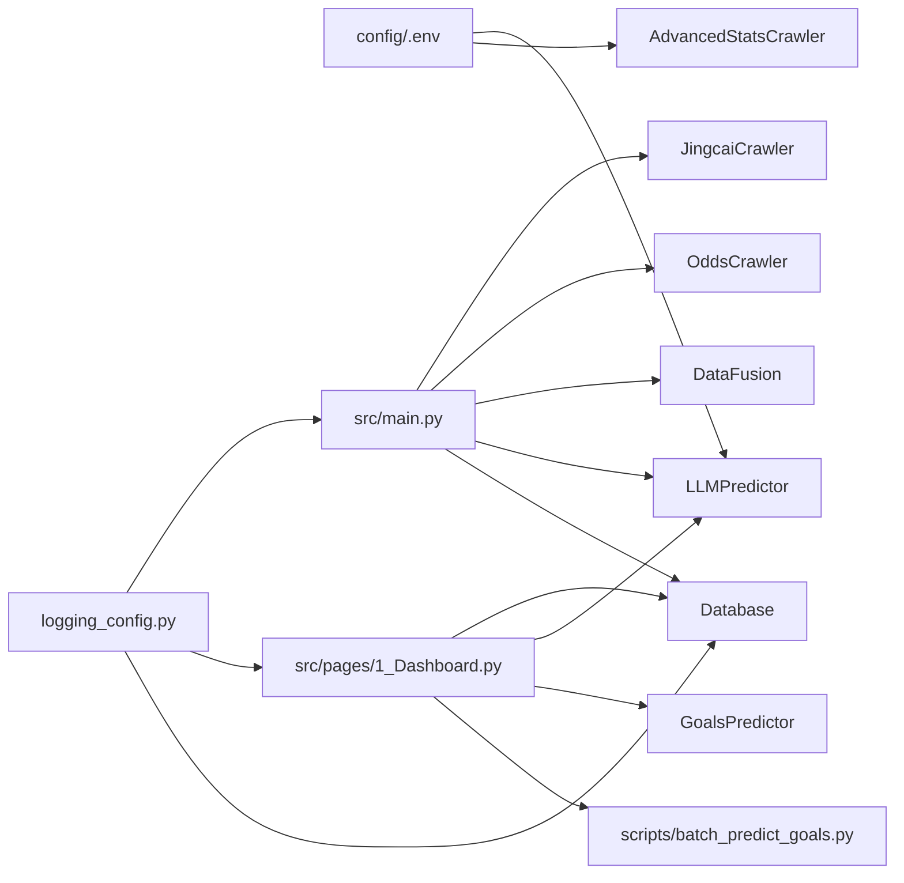

# 组件交互关系

<cite>
**本文引用的文件**
- [src/main.py](file://src/main.py)
- [src/app.py](file://src/app.py)
- [src/pages/1_Dashboard.py](file://src/pages/1_Dashboard.py)
- [src/db/database.py](file://src/db/database.py)
- [src/crawler/jingcai_crawler.py](file://src/crawler/jingcai_crawler.py)
- [src/crawler/odds_crawler.py](file://src/crawler/odds_crawler.py)
- [src/crawler/euro_odds_crawler.py](file://src/crawler/euro_odds_crawler.py)
- [src/crawler/advanced_stats_crawler.py](file://src/crawler/advanced_stats_crawler.py)
- [src/processor/data_fusion.py](file://src/processor/data_fusion.py)
- [src/llm/predictor.py](file://src/llm/predictor.py)
- [src/llm/goals_predictor.py](file://src/llm/goals_predictor.py)
- [src/logging_config.py](file://src/logging_config.py)
- [config/.env](file://config/.env)
- [src/constants.py](file://src/constants.py)
- [scripts/batch_predict_goals.py](file://scripts/batch_predict_goals.py)
</cite>

## 目录
1. [简介](#简介)
2. [项目结构](#项目结构)
3. [核心组件](#核心组件)
4. [架构总览](#架构总览)
5. [详细组件分析](#详细组件分析)
6. [依赖关系分析](#依赖关系分析)
7. [性能考量](#性能考量)
8. [故障排查指南](#故障排查指南)
9. [结论](#结论)
10. [附录](#附录)

## 简介
本文件面向开发者，系统梳理足球预测系统的组件交互关系，涵盖数据采集、处理、AI预测、数据库与Web界面五大模块。文档详细说明模块间调用关系、依赖关系与协作模式，解释接口定义、参数传递与返回值处理，并提供组件交互图与时序图，帮助读者快速理解系统协同工作机制。

## 项目结构
系统采用分层与功能域划分相结合的组织方式：
- 应用入口与调度：src/main.py（批处理）、src/app.py（登录与路由）、src/pages/1_Dashboard.py（Web看板）
- 数据采集：src/crawler/*（竞彩、盘口、高级统计、欧赔）
- 数据处理：src/processor/data_fusion.py（多源数据融合）
- AI预测：src/llm/predictor.py（主模型）、src/llm/goals_predictor.py（进球数专项）
- 数据库：src/db/database.py（SQLite ORM）
- 工具与配置：src/logging_config.py、config/.env、src/constants.py
- 批处理脚本：scripts/batch_predict_goals.py（按日期批量回写）

图表来源
- [src/main.py:34-136](file://src/main.py#L34-L136)
- [src/pages/1_Dashboard.py:86-538](file://src/pages/1_Dashboard.py#L86-L538)
- [src/db/database.py:200-562](file://src/db/database.py#L200-L562)
- [src/crawler/jingcai_crawler.py:13-47](file://src/crawler/jingcai_crawler.py#L13-L47)
- [src/crawler/odds_crawler.py:17-161](file://src/crawler/odds_crawler.py#L17-L161)
- [src/crawler/euro_odds_crawler.py:17-111](file://src/crawler/euro_odds_crawler.py#L17-L111)
- [src/crawler/advanced_stats_crawler.py:82-113](file://src/crawler/advanced_stats_crawler.py#L82-L113)
- [src/processor/data_fusion.py:61-107](file://src/processor/data_fusion.py#L61-L107)
- [src/llm/predictor.py:20-80](file://src/llm/predictor.py#L20-L80)
- [src/llm/goals_predictor.py:13-289](file://src/llm/goals_predictor.py#L13-L289)
- [config/.env:1-20](file://config/.env#L1-L20)
- [src/logging_config.py:8-29](file://src/logging_config.py#L8-L29)

章节来源
- [src/main.py:34-136](file://src/main.py#L34-L136)
- [src/pages/1_Dashboard.py:86-538](file://src/pages/1_Dashboard.py#L86-L538)
- [src/db/database.py:200-562](file://src/db/database.py#L200-L562)

## 核心组件
- 数据采集模块
  - 竞彩数据：抓取今日赛事、赔率与半全场数据
  - 盘口与基本面：抓取亚指、欧赔、近期战绩、交锋、伤停、高级统计
  - 欧赔历史：抓取初赔与临赔对比
- 数据处理模块
  - 融合竞彩基础数据与第三方盘口/基本面数据，注入伤停、交锋、进球分布等
- AI预测模块
  - 主模型：基于规则与上下文进行全场分析与竞彩推荐
  - 进球数专项：基于盘口、历史统计与基本面进行进球数预测
- 数据库模块
  - 预测记录、用户、历史欧赔、复盘、串关方案等表
  - 提供保存/查询/更新接口
- Web界面模块
  - 登录与鉴权（URL参数携带token）
  - 赛事看板、筛选、全局重预测、历史数据入库、Excel回写等

章节来源
- [src/crawler/jingcai_crawler.py:13-47](file://src/crawler/jingcai_crawler.py#L13-L47)
- [src/crawler/odds_crawler.py:17-161](file://src/crawler/odds_crawler.py#L17-L161)
- [src/crawler/euro_odds_crawler.py:17-111](file://src/crawler/euro_odds_crawler.py#L17-L111)
- [src/processor/data_fusion.py:61-107](file://src/processor/data_fusion.py#L61-L107)
- [src/llm/predictor.py:20-80](file://src/llm/predictor.py#L20-L80)
- [src/llm/goals_predictor.py:13-289](file://src/llm/goals_predictor.py#L13-L289)
- [src/db/database.py:200-562](file://src/db/database.py#L200-L562)
- [src/app.py:64-82](file://src/app.py#L64-L82)
- [src/pages/1_Dashboard.py:86-538](file://src/pages/1_Dashboard.py#L86-L538)

## 架构总览
系统采用“批处理调度 + Web看板”的双入口模式：
- 批处理入口（src/main.py）负责每日自动化采集、融合、预测与入库
- Web入口（src/app.py + src/pages/1_Dashboard.py）提供登录、路由与交互式看板
- 数据库统一承载预测结果、用户与历史数据
- 日志集中输出，便于问题定位

图表来源
- [src/main.py:40-136](file://src/main.py#L40-L136)
- [src/crawler/jingcai_crawler.py:13-47](file://src/crawler/jingcai_crawler.py#L13-L47)
- [src/crawler/odds_crawler.py:17-161](file://src/crawler/odds_crawler.py#L17-L161)
- [src/processor/data_fusion.py:61-107](file://src/processor/data_fusion.py#L61-L107)
- [src/llm/predictor.py:20-80](file://src/llm/predictor.py#L20-L80)
- [src/db/database.py:256-304](file://src/db/database.py#L256-L304)

## 详细组件分析

### 数据采集模块
- 竞彩数据采集（JingcaiCrawler）
  - 接口：fetch_today_matches(target_date)
  - 输入：目标日期（可选）
  - 输出：包含赛事编号、联赛、队伍、时间、赔率（不让球/让球/半全场）的列表
  - 关键实现：解析HTML表格，合并半全场赔率
- 盘口与基本面采集（OddsCrawler）
  - 接口：fetch_match_details(fixture_id, home_team, away_team)
  - 输出：亚指、欧赔、近期战绩、交锋、伤停、高级统计等
  - 依赖：EuroOddsCrawler、AdvancedStatsCrawler
- 欧赔历史采集（EuroOddsCrawler）
  - 接口：fetch_euro_odds(fixture_id, retries, delay, max_companies)
  - 输出：初赔与临赔列表（按公司聚合）
- 高级统计采集（AdvancedStatsCrawler）
  - 接口：fetch_advanced_stats(home_team, away_team, league_id, season)
  - 输出：主客队场均进球/失球等（依赖API-Key）

图表来源
- [src/crawler/jingcai_crawler.py:13-47](file://src/crawler/jingcai_crawler.py#L13-L47)
- [src/crawler/odds_crawler.py:17-161](file://src/crawler/odds_crawler.py#L17-L161)
- [src/crawler/euro_odds_crawler.py:17-111](file://src/crawler/euro_odds_crawler.py#L17-L111)
- [src/crawler/advanced_stats_crawler.py:82-113](file://src/crawler/advanced_stats_crawler.py#L82-L113)

章节来源
- [src/crawler/jingcai_crawler.py:13-47](file://src/crawler/jingcai_crawler.py#L13-L47)
- [src/crawler/odds_crawler.py:17-161](file://src/crawler/odds_crawler.py#L17-L161)
- [src/crawler/euro_odds_crawler.py:17-111](file://src/crawler/euro_odds_crawler.py#L17-L111)
- [src/crawler/advanced_stats_crawler.py:82-113](file://src/crawler/advanced_stats_crawler.py#L82-L113)

### 数据处理模块
- 数据融合（DataFusion）
  - 接口：merge_data(jingcai_matches, odds_crawler, leisu_crawler)
  - 流程：为每场比赛抓取盘口/基本面，可选注入雷速数据（伤停、交锋、进球分布、情报等）
  - 输出：融合后的完整比赛数据列表

图表来源
- [src/processor/data_fusion.py:61-107](file://src/processor/data_fusion.py#L61-L107)

章节来源
- [src/processor/data_fusion.py:61-107](file://src/processor/data_fusion.py#L61-L107)

### AI预测模块
- 主模型（LLMPredictor）
  - 接口：predict(match_data, total_matches_count, other_matches_context)
  - 输入：融合后的比赛数据、上下文数量、其他比赛上下文
  - 输出：预测文本与时间段标识（pre_24h/pre_12h/final/repredicted）
  - 规则：动态拼装核心规则、盘型规则、通用变化规则、热点资金规则与联赛特异性提示
- 进球数专项（GoalsPredictor）
  - 接口：predict(match_data, total_matches_count)
  - 输入：包含进球盘口、差异百分比、倾向等机构数据
  - 输出：JSON字符串（包含统计进球数与基本面分析报告）
  - 统计：基于历史数据库按盘口/差异/倾向聚合并返回最高概率进球数

图表来源
- [src/pages/1_Dashboard.py:510-538](file://src/pages/1_Dashboard.py#L510-L538)
- [src/llm/predictor.py:20-80](file://src/llm/predictor.py#L20-L80)
- [src/llm/goals_predictor.py:229-289](file://src/llm/goals_predictor.py#L229-L289)
- [src/db/database.py:256-304](file://src/db/database.py#L256-L304)

章节来源
- [src/llm/predictor.py:20-80](file://src/llm/predictor.py#L20-L80)
- [src/llm/goals_predictor.py:229-289](file://src/llm/goals_predictor.py#L229-L289)
- [src/pages/1_Dashboard.py:510-538](file://src/pages/1_Dashboard.py#L510-L538)

### 数据库模块
- 表结构与职责
  - 用户表：用户凭据与权限
  - 足球预测表：全场预测、半全场预测、竞彩推荐、置信度、实际赛果
  - 篮球预测表：竞彩篮球预测
  - 胜负彩预测表：胜负彩预测
  - 欧赔历史表：初赔/临赔对比与实际结果
  - 日评表：每日复盘总结
  - 串关表：每日串关方案与对比
- 关键接口
  - 保存/更新预测：save_prediction/save_bball_prediction/save_sfc_prediction
  - 查询预测：get_prediction/get_prediction_by_period/get_all_predictions_by_fixture
  - 更新赛果：update_actual_result
  - 保存/查询欧赔历史：save_euro_odds/get_daily_review/save_daily_review

图表来源
- [src/db/database.py:58-198](file://src/db/database.py#L58-L198)

章节来源
- [src/db/database.py:200-562](file://src/db/database.py#L200-L562)

### Web界面模块
- 登录与鉴权
  - URL参数auth携带base64编码的token（用户名|时间戳），校验有效期与用户有效性
  - 登录成功后写入session并跳转看板
- 赛事看板
  - 加载今日数据（缓存5分钟）
  - 提供全局重预测、历史数据入库、Excel回写等功能
  - 展示预测汇总与筛选

图表来源
- [src/app.py:64-82](file://src/app.py#L64-L82)
- [src/pages/1_Dashboard.py:32-49](file://src/pages/1_Dashboard.py#L32-L49)
- [src/db/database.py:309-323](file://src/db/database.py#L309-L323)

章节来源
- [src/app.py:64-82](file://src/app.py#L64-L82)
- [src/pages/1_Dashboard.py:32-49](file://src/pages/1_Dashboard.py#L32-L49)
- [src/db/database.py:309-323](file://src/db/database.py#L309-L323)

## 依赖关系分析
- 外部依赖
  - LLM服务：OpenAI兼容客户端，配置于config/.env
  - 数据库：SQLite（默认），支持迁移与列补全
  - 日志：Loguru，终端+文件轮转
- 内部耦合
  - 批处理与Web共享预测与数据库接口，降低重复逻辑
  - 数据采集模块解耦（OddsCrawler聚合Euro与AdvancedStats），便于扩展
  - Web看板对数据库查询与预测接口依赖较强，需保证接口稳定性

图表来源
- [config/.env:1-20](file://config/.env#L1-L20)
- [src/main.py:25-32](file://src/main.py#L25-L32)
- [src/pages/1_Dashboard.py:8-18](file://src/pages/1_Dashboard.py#L8-L18)
- [src/logging_config.py:8-29](file://src/logging_config.py#L8-L29)

章节来源
- [config/.env:1-20](file://config/.env#L1-L20)
- [src/main.py:25-32](file://src/main.py#L25-L32)
- [src/pages/1_Dashboard.py:8-18](file://src/pages/1_Dashboard.py#L8-L18)
- [src/logging_config.py:8-29](file://src/logging_config.py#L8-L29)

## 性能考量
- 爬虫限流与重试
  - 欧赔爬虫内置递增等待与重试，避免被限流
- 数据缓存
  - Web看板对今日数据缓存5分钟，减少重复IO
- 数据库事务
  - 保存预测使用事务，失败回滚，保证一致性
- 并发与异步
  - 批处理采用顺序流程，避免并发竞争；Web端通过Streamlit组件化降低复杂度

## 故障排查指南
- 登录失败
  - 检查.env中LLM_API_KEY与LLM_API_BASE
  - 确认token有效期（src/constants.py中TTL）
- 数据为空
  - 确认竞彩网站可访问，检查JingcaiCrawler返回
  - 检查OddsCrawler是否正确解析HTML表格
- 预测异常
  - 查看LLM返回格式与规则拼装是否正确
  - 检查GoalsPredictor统计数据库是否可用
- 数据库异常
  - 确认SQLite路径与权限
  - 检查列补全逻辑与表结构

章节来源
- [src/constants.py:3-4](file://src/constants.py#L3-L4)
- [src/crawler/euro_odds_crawler.py:28-111](file://src/crawler/euro_odds_crawler.py#L28-L111)
- [src/pages/1_Dashboard.py:86-98](file://src/pages/1_Dashboard.py#L86-L98)
- [src/db/database.py:219-233](file://src/db/database.py#L219-L233)

## 结论
本系统通过清晰的模块边界与稳定的接口契约，实现了从数据采集、融合、AI推理到持久化的完整闭环。Web看板与批处理入口共享核心能力，既满足日常自动化，又提供交互式探索能力。建议持续完善规则引擎与日志体系，以提升预测质量与可观测性。

## 附录
- 关键接口一览
  - 竞彩：fetch_today_matches, fetch_match_results, fetch_history_matches
  - 盘口：fetch_match_details
  - 欧赔：fetch_euro_odds
  - 高级统计：fetch_advanced_stats
  - 融合：merge_data
  - 预测：predict（LLMPredictor/GoalsPredictor）
  - 数据库：save_*、get_*、update_*、save_euro_odds