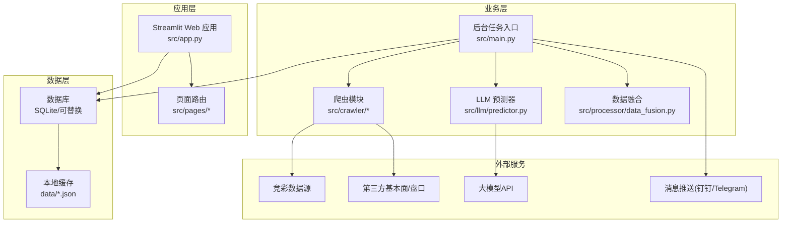
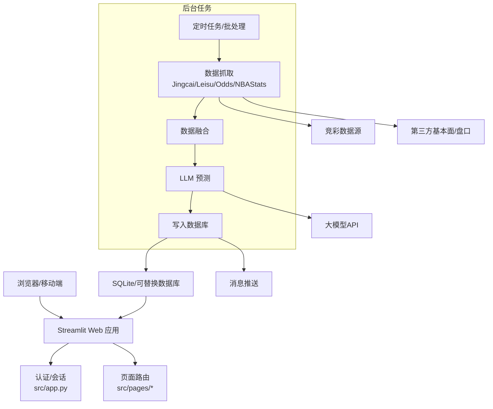
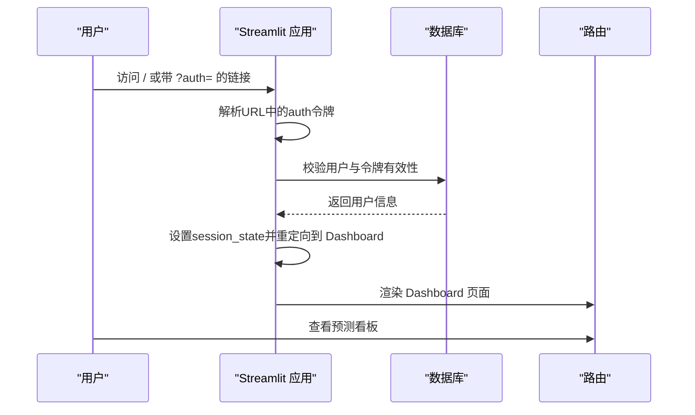
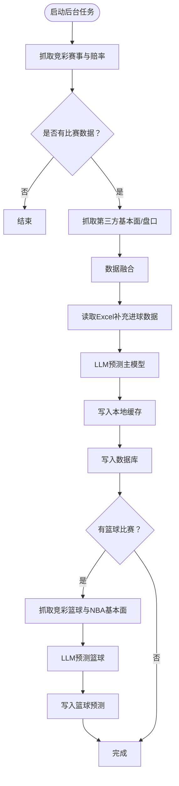
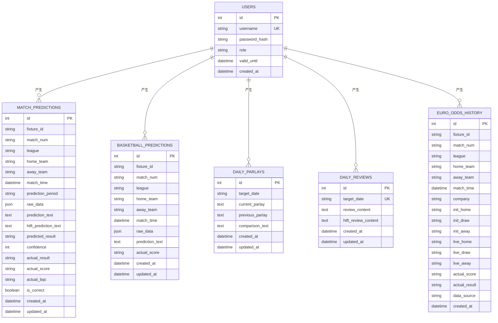
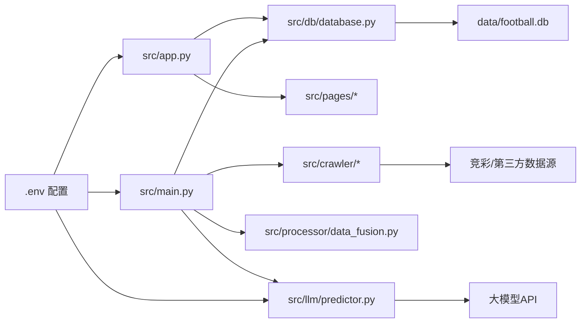

# 部署架构

<cite>
**本文引用的文件**   
- [src/app.py](file://src/app.py)
- [src/main.py](file://src/main.py)
- [src/db/database.py](file://src/db/database.py)
- [src/crawler/jingcai_crawler.py](file://src/crawler/jingcai_crawler.py)
- [src/llm/predictor.py](file://src/llm/predictor.py)
- [scripts/batch_predict_goals.py](file://scripts/batch_predict_goals.py)
- [config/.env](file://config/.env)
- [.streamlit/config.toml](file://.streamlit/config.toml)
- [.streamlit/credentials.toml](file://.streamlit/credentials.toml)
- [vercel.json](file://vercel.json)
- [src/constants.py](file://src/constants.py)
- [src/logging_config.py](file://src/logging_config.py)
</cite>

## 目录
1. [简介](#简介)
2. [项目结构](#项目结构)
3. [核心组件](#核心组件)
4. [架构总览](#架构总览)
5. [详细组件分析](#详细组件分析)
6. [依赖关系分析](#依赖关系分析)
7. [性能考量](#性能考量)
8. [故障排查指南](#故障排查指南)
9. [结论](#结论)
10. [附录](#附录)

## 简介
本部署架构文档面向“足球预测系统”，聚焦于以下目标：
- 明确系统部署拓扑与运行环境要求
- 设计Web应用（Streamlit）部署、后台任务调度、数据库与外部服务集成的架构
- 提供容器化部署方案、负载均衡策略、监控告警与故障恢复机制
- 给出部署架构图与环境配置指南，帮助运维人员快速落地

系统主要由以下部分组成：
- Web前端（Streamlit应用）：提供登录认证、看板展示与交互
- 后台任务（定时/批处理）：抓取数据、融合数据、大模型预测、写入数据库
- 数据库（SQLite/可替换）：持久化预测结果、用户与运营数据
- 外部服务：第三方数据源（竞彩、雷速等）、大模型API、消息推送（钉钉/Telegram）

## 项目结构
系统采用按功能域划分的目录组织方式，核心模块包括：
- src：核心业务代码（爬虫、数据处理、LLM预测、数据库、页面路由）
- scripts：批处理脚本（如历史重预测）
- config：环境变量与密钥配置
- data：本地缓存与SQLite数据库文件
- logs：日志文件
- .streamlit：Streamlit运行配置
- vercel.json：静态站点重写规则（用于前端托管）

图表来源
- [src/app.py:1-166](file://src/app.py#L1-L166)
- [src/main.py:1-183](file://src/main.py#L1-L183)
- [src/db/database.py:1-567](file://src/db/database.py#L1-L567)
- [src/crawler/jingcai_crawler.py:1-200](file://src/crawler/jingcai_crawler.py#L1-L200)
- [src/llm/predictor.py:1-200](file://src/llm/predictor.py#L1-L200)

章节来源
- [src/app.py:1-166](file://src/app.py#L1-L166)
- [src/main.py:1-183](file://src/main.py#L1-L183)
- [src/db/database.py:1-567](file://src/db/database.py#L1-L567)
- [src/crawler/jingcai_crawler.py:1-200](file://src/crawler/jingcai_crawler.py#L1-L200)
- [src/llm/predictor.py:1-200](file://src/llm/predictor.py#L1-L200)

## 核心组件
- Web应用（Streamlit）
  - 登录认证与会话管理
  - 页面路由与权限控制
  - 与数据库交互展示预测结果
- 后台任务（定时/批处理）
  - 抓取竞彩与第三方数据
  - 数据融合与缓存
  - LLM预测与结果入库
- 数据库
  - 用户、预测、复盘、串关方案等表
  - 支持SQLite与可替换后端
- 外部服务
  - 竞彩/基本面/盘口数据源
  - 大模型API（可配置基座地址）
  - 消息推送（钉钉/Telegram）

章节来源
- [src/app.py:1-166](file://src/app.py#L1-L166)
- [src/main.py:1-183](file://src/main.py#L1-L183)
- [src/db/database.py:1-567](file://src/db/database.py#L1-L567)
- [config/.env:1-20](file://config/.env#L1-L20)

## 架构总览
系统采用“Web应用 + 后台任务 + 数据库 + 外部服务”的分层架构。Web应用负责展示与交互；后台任务负责数据采集、融合与预测；数据库持久化；外部服务提供数据与推理能力。

图表来源
- [src/app.py:1-166](file://src/app.py#L1-L166)
- [src/main.py:1-183](file://src/main.py#L1-L183)
- [src/db/database.py:1-567](file://src/db/database.py#L1-L567)
- [src/crawler/jingcai_crawler.py:1-200](file://src/crawler/jingcai_crawler.py#L1-L200)
- [src/llm/predictor.py:1-200](file://src/llm/predictor.py#L1-L200)
- [config/.env:1-20](file://config/.env#L1-L20)

## 详细组件分析

### Web应用（Streamlit）部署
- 运行模式
  - Headless模式运行，适合容器化与无头服务器部署
  - 关闭浏览器使用统计，提升隐私与性能
- 认证与会话
  - 基于URL参数的短期令牌（含时间戳），结合数据库用户校验
  - 登录成功后生成带令牌的路由，避免明文凭据
- 页面路由
  - 通过pages目录实现多页面，文件名前缀会被忽略，路由名为文件名去除前缀后的名称
- 日志与配置
  - 初始化日志（终端+文件轮转），日志目录位于根目录logs
  - Streamlit配置关闭使用统计与headless模式

图表来源
- [src/app.py:64-82](file://src/app.py#L64-L82)
- [src/app.py:94-108](file://src/app.py#L94-L108)
- [src/app.py:110-160](file://src/app.py#L110-L160)
- [src/db/database.py:309-310](file://src/db/database.py#L309-L310)

章节来源
- [.streamlit/config.toml:1-6](file://.streamlit/config.toml#L1-L6)
- [.streamlit/credentials.toml:1-3](file://.streamlit/credentials.toml#L1-L3)
- [src/app.py:1-166](file://src/app.py#L1-L166)
- [src/constants.py:1-5](file://src/constants.py#L1-L5)
- [src/logging_config.py:1-30](file://src/logging_config.py#L1-L30)

### 后台任务调度
- 任务流程
  - 抓取竞彩今日赛事与赔率
  - 抓取第三方基本面与盘口，进行数据融合
  - 读取Excel补充进球盘口、差异与倾向
  - 调用LLM进行预测，逐条写回缓存与数据库
  - 处理篮球赛事与胜负彩预测
- 关键点
  - 支持可选启用雷速体育数据源
  - 缓存到本地JSON文件，便于Web应用读取
  - 数据库采用SQLite，默认路径在data/football.db

图表来源
- [src/main.py:34-136](file://src/main.py#L34-L136)
- [src/main.py:138-177](file://src/main.py#L138-L177)

章节来源
- [src/main.py:1-183](file://src/main.py#L1-L183)
- [src/crawler/jingcai_crawler.py:1-200](file://src/crawler/jingcai_crawler.py#L1-L200)
- [src/llm/predictor.py:1-200](file://src/llm/predictor.py#L1-L200)

### 数据库部署
- 数据库类型
  - 默认SQLite（文件型），路径为data/football.db
  - 支持通过环境变量切换为其他SQL方言（需替换引擎）
- 表结构概览
  - 用户表、足球预测、篮球预测、胜负彩预测、每日串关方案、每日复盘、欧赔历史等
- 运行时增强
  - 启动时自动创建表与必要列（兼容旧库）
- 写入策略
  - 足球预测支持时间段标识（pre_24h/pre_12h/final/repredicted），按fixture_id与period去重更新

图表来源
- [src/db/database.py:58-198](file://src/db/database.py#L58-L198)
- [src/db/database.py:200-308](file://src/db/database.py#L200-L308)
- [src/db/database.py:331-373](file://src/db/database.py#L331-L373)
- [src/db/database.py:374-421](file://src/db/database.py#L374-L421)
- [src/db/database.py:422-449](file://src/db/database.py#L422-L449)
- [src/db/database.py:498-501](file://src/db/database.py#L498-L501)
- [src/db/database.py:502-539](file://src/db/database.py#L502-L539)

章节来源
- [src/db/database.py:1-567](file://src/db/database.py#L1-L567)
- [config/.env:9-10](file://config/.env#L9-L10)

### 外部服务集成
- 第三方数据源
  - 竞彩：抓取赛程与赔率
  - 雷速体育：可选启用（匿名访问）
  - 第三方基本面/盘口：融合提升预测质量
- 大模型API
  - 支持自定义基座地址与模型名称
  - 通过环境变量配置密钥与基座
- 消息推送
  - 钉钉Webhook、Telegram Bot Token/ChatId
  - 用于任务异常与重要事件通知

章节来源
- [src/crawler/jingcai_crawler.py:1-200](file://src/crawler/jingcai_crawler.py#L1-L200)
- [src/main.py:53-68](file://src/main.py#L53-L68)
- [src/llm/predictor.py:21-46](file://src/llm/predictor.py#L21-L46)
- [config/.env:1-20](file://config/.env#L1-L20)

## 依赖关系分析
- 组件耦合
  - Web应用依赖数据库与页面路由
  - 后台任务依赖爬虫、数据融合、LLM与数据库
  - 爬虫依赖外部HTTP接口
  - LLM依赖外部API网关
- 外部依赖
  - Python第三方库（requests、beautifulsoup、openai、sqlalchemy、loguru等）
  - 大模型API（可替换为不同供应商）
- 配置耦合
  - 所有敏感配置集中于config/.env
  - Streamlit运行参数位于.streamlit/config.toml

图表来源
- [src/app.py:1-166](file://src/app.py#L1-L166)
- [src/main.py:1-183](file://src/main.py#L1-L183)
- [src/db/database.py:1-567](file://src/db/database.py#L1-L567)
- [src/crawler/jingcai_crawler.py:1-200](file://src/crawler/jingcai_crawler.py#L1-L200)
- [src/llm/predictor.py:1-200](file://src/llm/predictor.py#L1-L200)
- [config/.env:1-20](file://config/.env#L1-L20)

章节来源
- [src/app.py:1-166](file://src/app.py#L1-L166)
- [src/main.py:1-183](file://src/main.py#L1-L183)
- [src/db/database.py:1-567](file://src/db/database.py#L1-L567)
- [config/.env:1-20](file://config/.env#L1-L20)

## 性能考量
- I/O密集与并发
  - 爬虫与外部API调用较多，建议设置合理超时与重试
  - LLM调用成本高，建议缓存中间结果与限制并发
- 数据库
  - SQLite适合小规模场景；若并发较高，建议迁移到PostgreSQL/MySQL
  - 合理使用索引（fixture_id、match_num、target_date等）
- 缓存
  - 本地JSON缓存减少Web读取压力，注意文件锁与并发写入
- 日志
  - 文件轮转与保留策略降低磁盘占用

## 故障排查指南
- 登录失败
  - 检查用户是否存在、密码哈希是否匹配、授权有效期
  - 校验URL中的auth令牌是否过期
- 数据为空
  - 确认竞彩数据源可访问且返回有效HTML
  - 检查第三方数据源可用性与反爬策略
- LLM调用异常
  - 核对LLM_API_KEY、LLM_API_BASE、LLM_MODEL配置
  - 检查网络连通性与API配额
- 数据库问题
  - 确认SQLite文件路径与权限
  - 启动时自动建表，若字段缺失可查看运行日志
- 消息推送
  - 核对钉钉Webhook与Telegram配置

章节来源
- [src/app.py:94-108](file://src/app.py#L94-L108)
- [src/app.py:64-82](file://src/app.py#L64-L82)
- [src/crawler/jingcai_crawler.py:20-47](file://src/crawler/jingcai_crawler.py#L20-L47)
- [src/llm/predictor.py:21-46](file://src/llm/predictor.py#L21-L46)
- [src/db/database.py:200-217](file://src/db/database.py#L200-L217)
- [config/.env:12-15](file://config/.env#L12-L15)

## 结论
本部署架构以Streamlit为入口、后台任务为核心、SQLite为数据存储，结合外部数据与大模型能力，形成完整的预测闭环。建议在生产环境中引入容器化、负载均衡、数据库迁移与完善的监控告警体系，以提升稳定性与可扩展性。

## 附录

### 容器化部署方案（建议）
- 基础镜像
  - python:3.11-slim 或 alpine
- 工作目录与依赖
  - 复制requirements（如存在）与项目代码
  - 安装Python依赖与系统依赖（如需要）
- 环境变量
  - 通过Docker/Compose挂载config/.env
  - 配置DATABASE_URL、LLM_API_KEY、LLM_API_BASE、LLM_MODEL、DINGTALK_WEBHOOK、TELEGRAM_*等
- 运行命令
  - Streamlit：streamlit run src/app.py
  - 后台任务：python src/main.py
- 存储
  - 将data目录映射为持久卷，避免SQLite文件丢失
- 健康检查
  - Web健康探针：GET /
  - 数据库可用性检查：连接SQLite并执行简单查询

### 负载均衡策略（建议）
- 多实例部署
  - 前端：多副本Streamlit实例，共享同一数据库
  - 后台：单实例定时任务，避免重复执行；如需扩展，使用分布式队列（如Celery/RQ）与锁机制
- 负载均衡器
  - Nginx/HAProxy：基于域名或路径分发到前端实例
  - 后台任务通过Kubernetes CronJob或系统crontab触发

### 监控告警配置（建议）
- 指标
  - 应用日志级别统计、任务执行耗时、数据库连接数、外部API响应时间
- 告警
  - 登录失败率、任务失败、数据库写入异常、LLM调用错误、消息推送失败
- 工具
  - Prometheus + Grafana（指标）、ELK/Fluentd（日志）、Alertmanager（告警）

### 故障恢复机制（建议）
- 数据备份
  - 定期备份SQLite文件与关键缓存
- 降级策略
  - 外部API不可用时，使用缓存数据与最小化功能
- 快速回滚
  - 容器镜像版本化，回滚至上一稳定版本
- 重试与幂等
  - 外部调用与数据库写入具备重试与幂等保障

### 环境配置指南
- 必填项
  - DATABASE_URL：数据库连接字符串（默认SQLite）
  - LLM_API_KEY：大模型API密钥
  - LLM_API_BASE：大模型API基座地址
  - LLM_MODEL：模型名称
  - DINGTALK_WEBHOOK / TELEGRAM_BOT_TOKEN / TELEGRAM_CHAT_ID：消息推送配置
- 可选项
  - ENABLE_LEISU：是否启用雷速体育数据源
  - ENABLE_LLM_SUBJECTIVE_MARKET_ANALYSIS：是否允许LLM主观盘赔推演
- Streamlit运行参数
  - gatherUsageStats=false：关闭使用统计
  - headless=true：无头模式运行

章节来源
- [config/.env:1-20](file://config/.env#L1-L20)
- [.streamlit/config.toml:1-6](file://.streamlit/config.toml#L1-L6)
- [vercel.json:1-1](file://vercel.json#L1-L1)