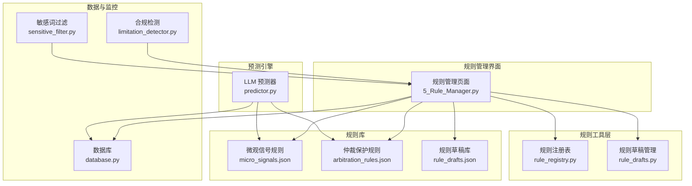
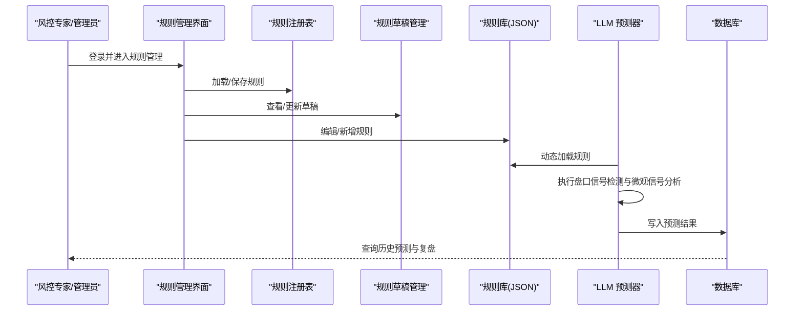
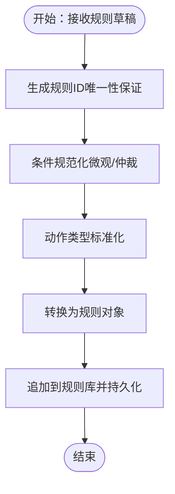
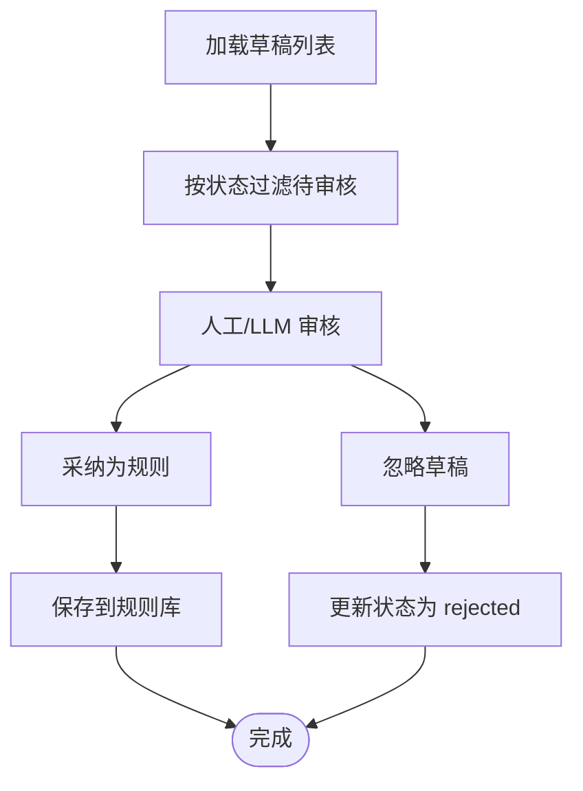
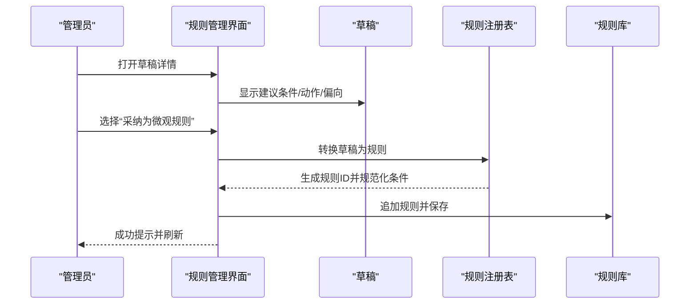
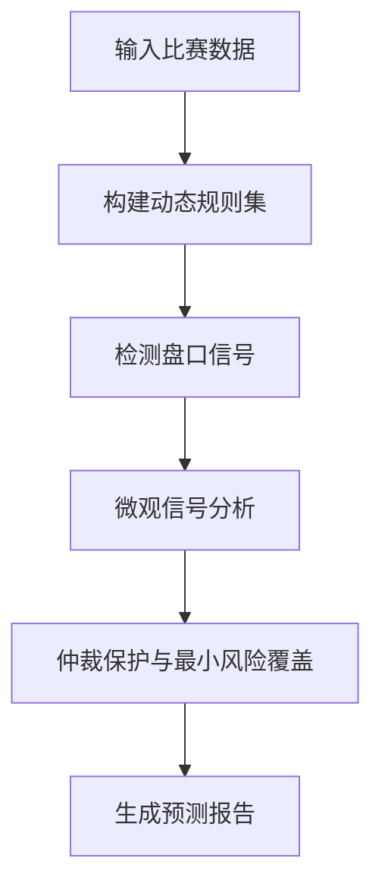
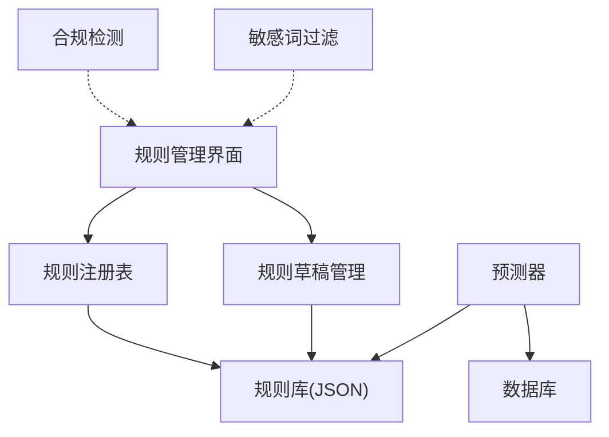

# 规则引擎系统

<cite>
**本文档引用的文件**
- [rule_registry.py](file://src/utils/rule_registry.py)
- [rule_drafts.py](file://src/utils/rule_drafts.py)
- [arbitration_rules.json](file://data/rules/arbitration_rules.json)
- [micro_signals.json](file://data/rules/micro_signals.json)
- [rule_drafts.json](file://data/rules/rule_drafts.json)
- [5_Rule_Manager.py](file://src/pages/5_Rule_Manager.py)
- [predictor.py](file://src/llm/predictor.py)
- [database.py](file://src/db/database.py)
- [app.py](file://src/app.py)
- [test_rule_feedback_loop.py](file://tests/test_rule_feedback_loop.py)
- [limitation_detector.py](file://src/utils/limitation_detector.py)
- [sensitive_filter.py](file://src/utils/sensitive_filter.py)
</cite>

## 目录
1. [引言](#引言)
2. [项目结构](#项目结构)
3. [核心组件](#核心组件)
4. [架构总览](#架构总览)
5. [详细组件分析](#详细组件分析)
6. [依赖分析](#依赖分析)
7. [性能考量](#性能考量)
8. [故障排查指南](#故障排查指南)
9. [结论](#结论)
10. [附录](#附录)

## 引言
本文件面向风控专家与系统管理员，系统性阐述规则引擎的设计与实现，涵盖动态规则管理、盘口信号检测算法、微观信号分析方法、风险控制机制、规则配置管理与实时监控策略。文档同时提供规则模板设计、条件判断逻辑、执行优先级管理、调试工具、性能监控指标与效果评估方法，并解释规则与预测结果的关联机制、动态调整策略与反馈循环。

## 项目结构
规则引擎系统围绕“规则库 + 规则管理界面 + 预测器 + 数据库 + 监控工具”构建，核心文件分布如下：
- 规则库：data/rules 下的微观信号与仲裁规则 JSON 文件
- 规则管理：Streamlit 页面，提供规则编辑、草稿审核与 AI 自动生成
- 规则工具：规则注册表与草稿管理工具，负责规则 ID 生成、条件规范化与持久化
- 预测器：LLM 预测器集成规则引擎，执行盘口信号检测与微观信号分析
- 数据库：预测结果与复盘数据的持久化
- 监控工具：微信公众号合规检测与敏感词过滤

图表来源
- [5_Rule_Manager.py:384-678](file://src/pages/5_Rule_Manager.py#L384-L678)
- [rule_registry.py:1-278](file://src/utils/rule_registry.py#L1-L278)
- [rule_drafts.py:1-91](file://src/utils/rule_drafts.py#L1-L91)
- [micro_signals.json:1-977](file://data/rules/micro_signals.json#L1-L977)
- [arbitration_rules.json:1-63](file://data/rules/arbitration_rules.json#L1-L63)
- [rule_drafts.json:1-229](file://data/rules/rule_drafts.json#L1-L229)
- [predictor.py:1-800](file://src/llm/predictor.py#L1-L800)
- [database.py:200-567](file://src/db/database.py#L200-L567)
- [limitation_detector.py:1-272](file://src/utils/limitation_detector.py#L1-L272)
- [sensitive_filter.py:1-151](file://src/utils/sensitive_filter.py#L1-L151)

章节来源
- [5_Rule_Manager.py:384-678](file://src/pages/5_Rule_Manager.py#L384-L678)
- [rule_registry.py:1-278](file://src/utils/rule_registry.py#L1-L278)
- [rule_drafts.py:1-91](file://src/utils/rule_drafts.py#L1-L91)
- [micro_signals.json:1-977](file://data/rules/micro_signals.json#L1-L977)
- [arbitration_rules.json:1-63](file://data/rules/arbitration_rules.json#L1-L63)
- [rule_drafts.json:1-229](file://data/rules/rule_drafts.json#L1-L229)
- [predictor.py:1-800](file://src/llm/predictor.py#L1-L800)
- [database.py:200-567](file://src/db/database.py#L200-L567)
- [limitation_detector.py:1-272](file://src/utils/limitation_detector.py#L1-L272)
- [sensitive_filter.py:1-151](file://src/utils/sensitive_filter.py#L1-L151)

## 核心组件
- 规则注册表（rule_registry.py）
  - 负责规则 ID 生成与唯一性保证、条件规范化（微观/仲裁）、动作类型标准化、规则追加与持久化
- 规则草稿管理（rule_drafts.py）
  - 草稿加载/保存/去重、按日期替换、状态更新与删除
- 规则库（micro_signals.json、arbitration_rules.json、rule_drafts.json）
  - 存放可执行的规则条件、动作与模板，支持场景剧本（scenario_key）与版本化
- 规则管理界面（5_Rule_Manager.py）
  - 提供规则编辑、草稿审核、AI 自动生成、条件过死风险提示与权限校验
- 预测器（predictor.py）
  - 集成规则引擎，执行盘口信号检测与微观信号分析，支持最小风险覆盖与仲裁保护
- 数据库（database.py）
  - 预测结果与复盘数据持久化，支持按日期窗口查询与更新
- 合规与敏感词工具（limitation_detector.py、sensitive_filter.py）
  - 提供内容合规性分析、账号健康度评估与敏感词一键过滤

章节来源
- [rule_registry.py:1-278](file://src/utils/rule_registry.py#L1-L278)
- [rule_drafts.py:1-91](file://src/utils/rule_drafts.py#L1-L91)
- [micro_signals.json:1-977](file://data/rules/micro_signals.json#L1-L977)
- [arbitration_rules.json:1-63](file://data/rules/arbitration_rules.json#L1-L63)
- [rule_drafts.json:1-229](file://data/rules/rule_drafts.json#L1-L229)
- [5_Rule_Manager.py:1-678](file://src/pages/5_Rule_Manager.py#L1-L678)
- [predictor.py:1-800](file://src/llm/predictor.py#L1-L800)
- [database.py:200-567](file://src/db/database.py#L200-L567)
- [limitation_detector.py:1-272](file://src/utils/limitation_detector.py#L1-L272)
- [sensitive_filter.py:1-151](file://src/utils/sensitive_filter.py#L1-L151)

## 架构总览
规则引擎采用“规则库 + 规则管理 + 预测器 + 数据库 + 监控工具”的分层架构：
- 规则层：规则库与草稿库提供可执行规则与复盘线索
- 管理层：规则管理界面支持可视化编辑、草稿审核与 AI 自动生成
- 执行层：预测器在推理过程中动态加载规则并执行条件判断
- 数据层：数据库持久化预测与复盘结果，支持历史回溯与效果评估
- 监控层：合规检测与敏感词过滤保障内容安全与运营稳定

图表来源
- [5_Rule_Manager.py:384-678](file://src/pages/5_Rule_Manager.py#L384-L678)
- [rule_registry.py:1-278](file://src/utils/rule_registry.py#L1-L278)
- [rule_drafts.py:1-91](file://src/utils/rule_drafts.py#L1-L91)
- [micro_signals.json:1-977](file://data/rules/micro_signals.json#L1-L977)
- [arbitration_rules.json:1-63](file://data/rules/arbitration_rules.json#L1-L63)
- [predictor.py:1-800](file://src/llm/predictor.py#L1-L800)
- [database.py:200-567](file://src/db/database.py#L200-L567)

## 详细组件分析

### 规则注册表（rule_registry.py）
- 规则 ID 生成与唯一性
  - 使用标题/问题类型/触发条件等字段生成 slug，并结合类别前缀确保唯一性
  - 支持现有 ID 集合去重并自动追加数字后缀
- 条件规范化
  - 微观规则：将自然语言别名（如 origin_handicap、initial_line 等）转换为可执行的 Python 表达式
  - 仲裁规则：将条件转换为 ctx['asian'] 访问语法，确保运行时可访问
  - 支持 BETWEEN、AND/OR/NOT 等逻辑运算符标准化
- 动作类型标准化
  - 将自然语言动作映射为标准动作类型（abort_prediction、forbid_override、force_double、cap_confidence、require_override_reason）
- 规则转换
  - 将草稿转换为微观规则或仲裁规则，填充场景剧本、级别/优先级、预测偏向与效果说明

图表来源
- [rule_registry.py:44-278](file://src/utils/rule_registry.py#L44-L278)

章节来源
- [rule_registry.py:1-278](file://src/utils/rule_registry.py#L1-L278)

### 规则草稿管理（rule_drafts.py）
- 草稿生命周期
  - 加载/保存/去重、按日期替换、状态更新（draft/accepted/rejected）、删除
- 关键能力
  - 基于 draft_id 去重，自动生成唯一 ID
  - 支持按日期批量替换，便于复盘后统一纳入规则库
  - 提供待审核草稿查询与状态变更接口

图表来源
- [rule_drafts.py:1-91](file://src/utils/rule_drafts.py#L1-L91)

章节来源
- [rule_drafts.py:1-91](file://src/utils/rule_drafts.py#L1-L91)

### 规则库（micro_signals.json、arbitration_rules.json、rule_drafts.json）
- 微观信号规则
  - 描述盘口与欧赔的微观形态，提供触发条件、风险级别、预测偏向与作用类型
  - 支持场景剧本（scenario_key）与版本化（scenario_version）
- 仲裁保护规则
  - 在特定条件下触发风控动作（如 forbid_override、abort_prediction、force_double 等）
  - 支持优先级与解释模板
- 规则草稿
  - 记录复盘线索与建议条件/动作，支持状态流转与 AI 自动生成

章节来源
- [micro_signals.json:1-977](file://data/rules/micro_signals.json#L1-L977)
- [arbitration_rules.json:1-63](file://data/rules/arbitration_rules.json#L1-L63)
- [rule_drafts.json:1-229](file://data/rules/rule_drafts.json#L1-L229)

### 规则管理界面（5_Rule_Manager.py）
- 功能概览
  - 规则编辑：启用/禁用、条件/模板/偏向/作用类型修改
  - 草稿审核：采纳为微观/仲裁规则、忽略草稿、基于旧规则修旧
  - AI 自动生成：输入复盘报告，AI 提炼微观规则配置
  - 条件过死风险提示：检测历史欧赔点位、精确小数阈值、精确比值等风险项
- 权限与认证
  - 基于 token 的登录态管理，支持 TTL 校验与角色控制

图表来源
- [5_Rule_Manager.py:577-674](file://src/pages/5_Rule_Manager.py#L577-L674)
- [rule_registry.py:221-278](file://src/utils/rule_registry.py#L221-L278)

章节来源
- [5_Rule_Manager.py:1-678](file://src/pages/5_Rule_Manager.py#L1-L678)

### 预测器（predictor.py）
- 规则集成
  - 动态加载微观信号规则与仲裁保护规则，执行条件判断并生成信号
  - 支持最小风险覆盖策略，依据微观信号偏向调整推荐方向
- 盘口信号检测
  - 超深盘死水预警、半球生死盘预警、平手盘水位僵持、赔率方向矛盾、盘水背离、浅盘升水诱下、欧亚背离量化、浅盘示弱诱下等
- 微观信号分析
  - 基于规则库逐条求值，输出命中信号与预测偏向，支持场景剧本清洗与标签化

图表来源
- [predictor.py:51-800](file://src/llm/predictor.py#L51-L800)

章节来源
- [predictor.py:1-800](file://src/llm/predictor.py#L1-L800)

### 数据库（database.py）
- 预测结果存储
  - 支持按 fixture_id 与时间段（pre_24h/pre_12h/final/repredicted）查询与更新
  - 提供提取竞彩推荐文本的辅助方法
- 复盘与历史数据
  - 日周期窗口查询、串关方案保存与对比、每日复盘记录
  - 欧赔历史批量保存，支持按日期范围检索

章节来源
- [database.py:200-567](file://src/db/database.py#L200-L567)

### 合规与敏感词工具（limitation_detector.py、sensitive_filter.py）
- 合规检测
  - 敏感词识别、风险等级评估、账号健康度评分与优化建议
- 敏感词过滤
  - 基于映射表与正则的批量敏感词替换，支持导出/导入自定义词库

章节来源
- [limitation_detector.py:1-272](file://src/utils/limitation_detector.py#L1-L272)
- [sensitive_filter.py:1-151](file://src/utils/sensitive_filter.py#L1-L151)

## 依赖分析
- 组件耦合
  - 规则管理界面依赖规则注册表与草稿管理，间接依赖规则库
  - 预测器直接依赖规则库与数据库
  - 合规与敏感词工具独立，可作为运营辅助
- 外部依赖
  - OpenAI SDK（预测器）
  - Streamlit（规则管理界面）
  - SQLAlchemy（数据库）

图表来源
- [5_Rule_Manager.py:1-678](file://src/pages/5_Rule_Manager.py#L1-L678)
- [rule_registry.py:1-278](file://src/utils/rule_registry.py#L1-L278)
- [rule_drafts.py:1-91](file://src/utils/rule_drafts.py#L1-L91)
- [predictor.py:1-800](file://src/llm/predictor.py#L1-L800)
- [database.py:200-567](file://src/db/database.py#L200-L567)
- [limitation_detector.py:1-272](file://src/utils/limitation_detector.py#L1-L272)
- [sensitive_filter.py:1-151](file://src/utils/sensitive_filter.py#L1-L151)

章节来源
- [5_Rule_Manager.py:1-678](file://src/pages/5_Rule_Manager.py#L1-L678)
- [rule_registry.py:1-278](file://src/utils/rule_registry.py#L1-L278)
- [rule_drafts.py:1-91](file://src/utils/rule_drafts.py#L1-L91)
- [predictor.py:1-800](file://src/llm/predictor.py#L1-L800)
- [database.py:200-567](file://src/db/database.py#L200-L567)
- [limitation_detector.py:1-272](file://src/utils/limitation_detector.py#L1-L272)
- [sensitive_filter.py:1-151](file://src/utils/sensitive_filter.py#L1-L151)

## 性能考量
- 规则求值复杂度
  - 规则数量与条件复杂度直接影响推理耗时，建议：
    - 合理划分场景剧本，减少无关规则参与
    - 使用布尔表达式简化条件，避免高精度阈值与精确比值
- 数据库查询
  - 按日期窗口查询与 fixture_id 索引可提升效率
- UI 交互
  - 草稿审核与 AI 自动生成建议分批处理，避免一次性渲染过多规则

## 故障排查指南
- 规则条件过死
  - 现象：条件包含历史欧赔点位、精确小数阈值或精确比值
  - 处理：使用界面的风险提示功能，改用标签化条件（如 euro['favored_side']、strength_gap_label 等）
- 草稿状态异常
  - 现象：草稿无法采纳或重复
  - 处理：检查 draft_id 唯一性与状态流转，必要时删除后重新生成
- 权限与认证
  - 现象：无法进入规则管理页面
  - 处理：检查 token 有效性与角色权限，确认登录态未过期

章节来源
- [5_Rule_Manager.py:63-82](file://src/pages/5_Rule_Manager.py#L63-L82)
- [test_rule_feedback_loop.py:525-566](file://tests/test_rule_feedback_loop.py#L525-L566)

## 结论
规则引擎系统通过“规则库 + 规则管理 + 预测器 + 数据库 + 监控工具”的协同，实现了动态规则管理、盘口信号检测与微观信号分析、风险控制与仲裁保护、实时监控与合规保障。系统具备良好的扩展性与可维护性，适合风控专家与系统管理员进行专业规则管理与优化。

## 附录
- 规则模板设计要点
  - 条件：使用标签化变量与布尔表达式，避免精确阈值
  - 动作：明确标准动作类型与 payload
  - 偏向：与预测结果一致，避免歧义
- 效果评估方法
  - 基于数据库的历史预测与实际结果对比，计算命中率与置信度校准
  - 利用场景剧本统计命中频次与误判案例，持续迭代规则