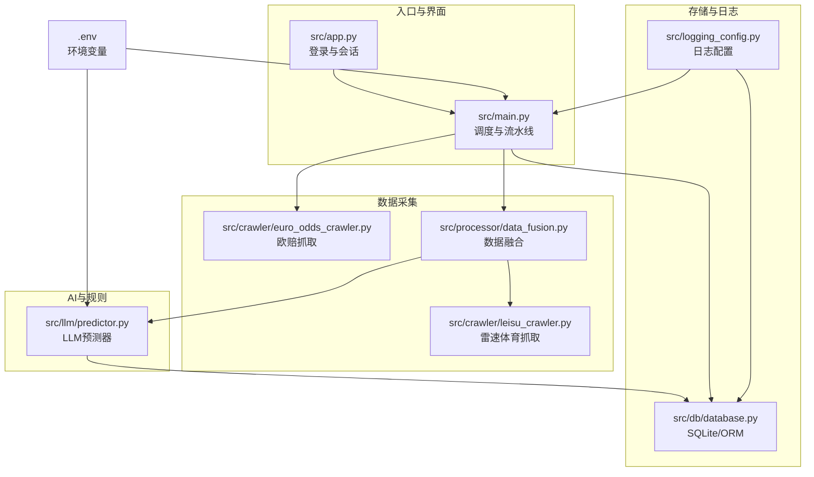
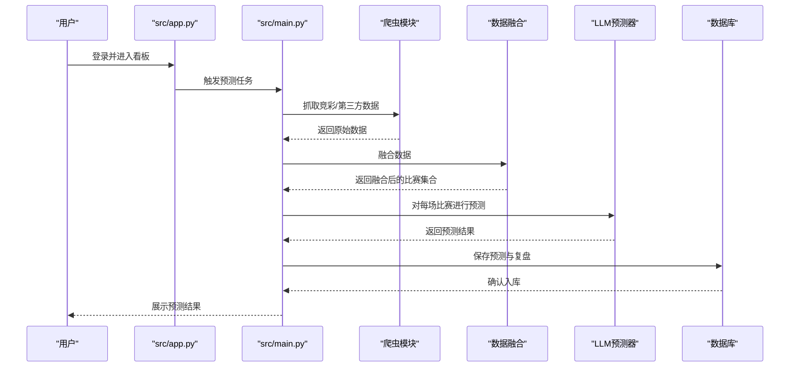
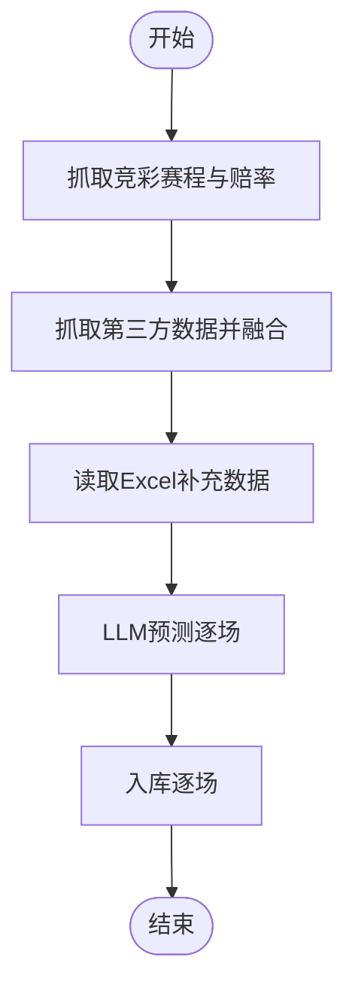
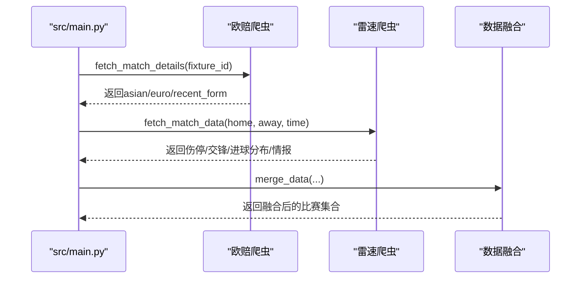
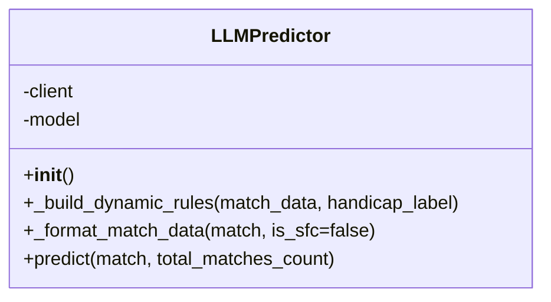
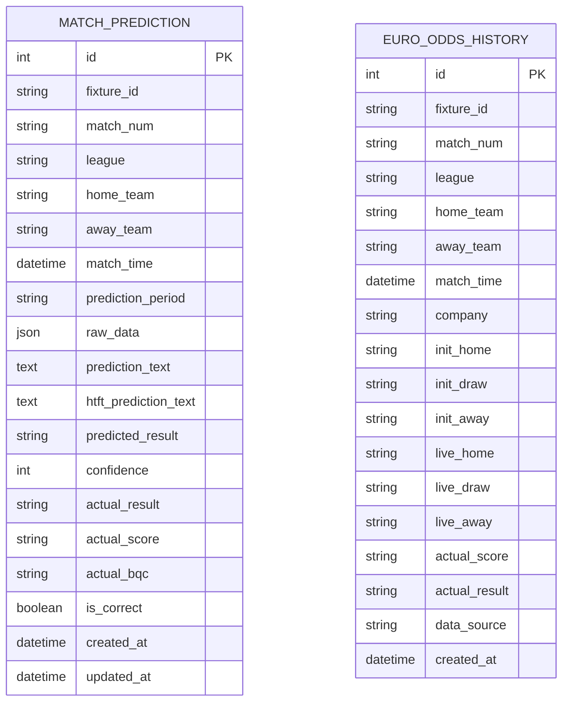
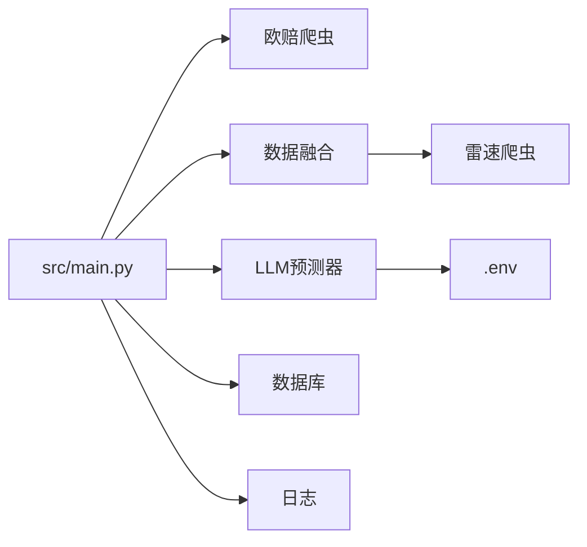

# 性能监控

<cite>
**本文引用的文件**   
- [src/main.py](file://src/main.py)
- [src/app.py](file://src/app.py)
- [src/db/database.py](file://src/db/database.py)
- [src/logging_config.py](file://src/logging_config.py)
- [src/crawler/euro_odds_crawler.py](file://src/crawler/euro_odds_crawler.py)
- [src/crawler/leisu_crawler.py](file://src/crawler/leisu_crawler.py)
- [src/processor/data_fusion.py](file://src/processor/data_fusion.py)
- [src/llm/predictor.py](file://src/llm/predictor.py)
- [src/constants.py](file://src/constants.py)
- [config/.env](file://config/.env)
- [docs/model_optimization_plan_v2.md](file://docs/model_optimization_plan_v2.md)
- [scripts/test_streamlit_loop.py](file://scripts/test_streamlit_loop.py)
</cite>

## 目录
1. [简介](#简介)
2. [项目结构](#项目结构)
3. [核心组件](#核心组件)
4. [架构总览](#架构总览)
5. [详细组件分析](#详细组件分析)
6. [依赖分析](#依赖分析)
7. [性能考量](#性能考量)
8. [故障排查指南](#故障排查指南)
9. [结论](#结论)
10. [附录](#附录)

## 简介
本文件面向“性能监控系统”的设计与落地，结合仓库现有代码，系统化阐述如何采集与分析系统性能指标（响应时间、吞吐量、资源利用率）、数据库性能监控、爬虫效率监控、AI预测模型性能评估，并给出性能瓶颈识别、负载测试与容量规划策略、优化建议、缓存策略、并发控制方案、监控告警机制、性能基线设定与趋势分析方法。文档兼顾工程实践与非技术读者的理解需求，提供可视化图示与可操作建议。

## 项目结构
项目采用功能域分层组织：入口与UI、数据采集（爬虫）、数据融合、AI预测、数据库持久化、日志与配置等模块协同工作。整体流程从定时/手动触发的任务调度开始，依次完成数据抓取、融合、AI预测、入库与展示。

图表来源
- [src/app.py:110-166](file://src/app.py#L110-L166)
- [src/main.py:34-136](file://src/main.py#L34-L136)
- [src/crawler/euro_odds_crawler.py:17-111](file://src/crawler/euro_odds_crawler.py#L17-L111)
- [src/crawler/leisu_crawler.py:284-322](file://src/crawler/leisu_crawler.py#L284-L322)
- [src/processor/data_fusion.py:61-107](file://src/processor/data_fusion.py#L61-L107)
- [src/llm/predictor.py:20-46](file://src/llm/predictor.py#L20-L46)
- [src/db/database.py:200-308](file://src/db/database.py#L200-L308)
- [src/logging_config.py:8-30](file://src/logging_config.py#L8-L30)
- [config/.env:1-20](file://config/.env#L1-L20)

章节来源
- [src/main.py:34-136](file://src/main.py#L34-L136)
- [src/app.py:110-166](file://src/app.py#L110-L166)
- [src/db/database.py:200-308](file://src/db/database.py#L200-L308)
- [src/logging_config.py:8-30](file://src/logging_config.py#L8-L30)
- [config/.env:1-20](file://config/.env#L1-L20)

## 核心组件
- 任务调度与流水线：负责抓取竞彩赛程与赔率、抓取第三方数据、数据融合、AI预测、入库与篮球预测的完整编排。
- 爬虫体系：欧赔抓取与雷速体育抓取，分别承担盘口与基本面数据的采集。
- 数据融合：将竞彩基础数据与第三方盘口/基本面数据整合，并可选注入雷速体育数据。
- AI预测器：基于LLM与规则引擎，输出预测结果与推荐。
- 数据库：SQLite + SQLAlchemy ORM，承载预测、复盘、串关方案、欧赔历史等数据。
- 日志系统：统一INFO级别及以上日志输出，终端与文件轮转。
- 配置管理：通过.env集中管理API密钥、模型参数、数据库连接等。

章节来源
- [src/main.py:34-136](file://src/main.py#L34-L136)
- [src/processor/data_fusion.py:61-107](file://src/processor/data_fusion.py#L61-L107)
- [src/llm/predictor.py:20-46](file://src/llm/predictor.py#L20-L46)
- [src/db/database.py:200-308](file://src/db/database.py#L200-L308)
- [src/logging_config.py:8-30](file://src/logging_config.py#L8-L30)
- [config/.env:1-20](file://config/.env#L1-L20)

## 架构总览
系统采用“批处理驱动 + LLM推理 + ORM入库”的架构。前端入口负责登录与会话，后台任务负责数据采集与预测，数据库统一承载业务数据。日志贯穿全流程，便于性能观测与问题定位。

图表来源
- [src/app.py:110-166](file://src/app.py#L110-L166)
- [src/main.py:34-136](file://src/main.py#L34-L136)
- [src/processor/data_fusion.py:61-107](file://src/processor/data_fusion.py#L61-L107)
- [src/llm/predictor.py:20-46](file://src/llm/predictor.py#L20-L46)
- [src/db/database.py:256-304](file://src/db/database.py#L256-L304)

## 详细组件分析

### 任务调度与流水线（src/main.py）
- 阶段划分清晰：抓取竞彩赛程与赔率、抓取第三方数据与融合、Excel补充、LLM预测、入库。
- 关键性能点：
  - IO密集：网络请求与文件IO，适合并发与重试策略。
  - 预测阶段遍历所有比赛并落盘，存在多次写入，建议批量提交或减少落盘频率。
  - 篮球预测与入库流程与足球一致，注意并发与锁竞争。

图表来源
- [src/main.py:40-136](file://src/main.py#L40-L136)

章节来源
- [src/main.py:34-136](file://src/main.py#L34-L136)

### 登录与会话（src/app.py）
- 会话状态与认证令牌：基于URL参数携带的base64编码token，含时间戳与有效期校验。
- 性能关注：
  - 令牌有效期（8小时）与会话重建逻辑，避免频繁登录带来的UI抖动。
  - 事件循环策略在Windows平台的兼容处理，保证子进程/异步环境稳定。

章节来源
- [src/app.py:51-82](file://src/app.py#L51-L82)
- [src/app.py:110-166](file://src/app.py#L110-L166)
- [src/constants.py:3-4](file://src/constants.py#L3-L4)

### 数据采集（爬虫）
- 欧赔抓取（src/crawler/euro_odds_crawler.py）
  - 速率限制与重试：内置重试次数与递增等待，避免被限流。
  - 数据解析：HTML表格解析，提取初赔与临赔。
  - 性能建议：设置合理超时、并发控制、失败重试指数回退。
- 雷速体育抓取（src/crawler/leisu_crawler.py）
  - Playwright自动化，支持无头模式与Cookie复用。
  - 线程池隔离与子进程兜底，适配Streamlit事件循环。
  - 性能建议：浏览器上下文复用、页面等待策略、验证码处理与人工干预预案。

图表来源
- [src/main.py:50-63](file://src/main.py#L50-L63)
- [src/crawler/euro_odds_crawler.py:17-111](file://src/crawler/euro_odds_crawler.py#L17-L111)
- [src/crawler/leisu_crawler.py:284-322](file://src/crawler/leisu_crawler.py#L284-L322)
- [src/processor/data_fusion.py:61-107](file://src/processor/data_fusion.py#L61-L107)

章节来源
- [src/crawler/euro_odds_crawler.py:17-111](file://src/crawler/euro_odds_crawler.py#L17-L111)
- [src/crawler/leisu_crawler.py:284-322](file://src/crawler/leisu_crawler.py#L284-L322)
- [src/processor/data_fusion.py:61-107](file://src/processor/data_fusion.py#L61-L107)

### 数据融合（src/processor/data_fusion.py）
- 融合策略：将竞彩基础数据与第三方盘口/基本面数据合并，并可选注入雷速体育数据。
- 性能建议：对每个比赛逐一抓取与合并，建议在上游并发抓取、下游批量写入。

章节来源
- [src/processor/data_fusion.py:61-107](file://src/processor/data_fusion.py#L61-L107)

### AI预测器（src/llm/predictor.py）
- 模型配置：从.env读取API密钥、基础地址与模型名称，构造OpenAI客户端。
- 预测流程：构建动态规则、格式化数据、调用LLM、解析输出、提取推荐。
- 性能建议：
  - 上下文压缩与规则拆分，避免单次对话过长。
  - 批量预测时控制并发，避免API限流。
  - 输出解析与推荐提取可缓存热点规则。

图表来源
- [src/llm/predictor.py:20-46](file://src/llm/predictor.py#L20-L46)
- [src/llm/predictor.py:81-281](file://src/llm/predictor.py#L81-L281)

章节来源
- [src/llm/predictor.py:20-46](file://src/llm/predictor.py#L20-L46)
- [src/llm/predictor.py:81-281](file://src/llm/predictor.py#L81-L281)

### 数据库（src/db/database.py）
- ORM模型：MatchPrediction、BasketballPrediction、DailyParlays、DailyReview、EuroOddsHistory等。
- 关键接口：保存预测、保存篮球预测、保存胜负彩预测、保存欧赔历史、查询日期窗口预测、更新实际赛果等。
- 性能建议：
  - 批量插入/更新（如欧赔历史批量保存）。
  - 合理索引（fixture_id、match_time、target_date等）。
  - 事务边界控制，避免长事务锁表。

图表来源
- [src/db/database.py:68-103](file://src/db/database.py#L68-L103)
- [src/db/database.py:176-198](file://src/db/database.py#L176-L198)

章节来源
- [src/db/database.py:256-304](file://src/db/database.py#L256-L304)
- [src/db/database.py:502-539](file://src/db/database.py#L502-L539)

### 日志系统（src/logging_config.py）
- 统一日志：INFO及以上级别输出到stderr，文件按天轮转，保留7天。
- 性能建议：生产环境可调整级别与格式，避免过多I/O；关键路径埋点统计耗时。

章节来源
- [src/logging_config.py:8-30](file://src/logging_config.py#L8-L30)

### 配置管理（config/.env）
- 关键配置：LLM_API_KEY、LLM_API_BASE、LLM_MODEL、DATABASE_URL、消息推送等。
- 性能建议：敏感信息集中管理，避免硬编码；不同环境区分配置。

章节来源
- [config/.env:1-20](file://config/.env#L1-L20)

## 依赖分析
- 组件耦合：
  - main.py依赖爬虫、融合、LLM与数据库模块，耦合度较高但职责清晰。
  - LLM预测器依赖规则与环境变量，规则可热更新。
  - 数据库ORM封装了具体表结构，便于扩展与迁移。
- 外部依赖：
  - requests、BeautifulSoup（网页解析）、Playwright（自动化）、SQLAlchemy（ORM）、loguru（日志）。
- 并发与事件循环：
  - Windows平台事件循环策略与nest_asyncio应用，保障子进程与异步环境兼容。

图表来源
- [src/main.py:25-32](file://src/main.py#L25-L32)
- [src/llm/predictor.py:21-42](file://src/llm/predictor.py#L21-L42)
- [src/db/database.py:200-217](file://src/db/database.py#L200-L217)
- [src/logging_config.py:8-30](file://src/logging_config.py#L8-L30)

章节来源
- [src/main.py:25-32](file://src/main.py#L25-L32)
- [src/llm/predictor.py:21-42](file://src/llm/predictor.py#L21-L42)
- [src/db/database.py:200-217](file://src/db/database.py#L200-L217)
- [src/logging_config.py:8-30](file://src/logging_config.py#L8-L30)

## 性能考量

### 响应时间监控
- 建议埋点位置：
  - 登录与会话：token生成、解码与校验耗时。
  - 数据采集：欧赔抓取与雷速抓取的请求耗时、解析耗时。
  - 数据融合：每场比赛的抓取与合并耗时。
  - AI预测：LLM调用前后计时、输出解析耗时。
  - 数据库：每批次写入耗时、事务提交耗时。
- 指标定义：
  - P50/P90/P99响应时间、成功率、平均响应时间。
  - 以日/小时粒度聚合，观察趋势。

章节来源
- [src/app.py:51-82](file://src/app.py#L51-L82)
- [src/crawler/euro_odds_crawler.py:17-111](file://src/crawler/euro_odds_crawler.py#L17-L111)
- [src/crawler/leisu_crawler.py:284-322](file://src/crawler/leisu_crawler.py#L284-L322)
- [src/processor/data_fusion.py:61-107](file://src/processor/data_fusion.py#L61-L107)
- [src/llm/predictor.py:20-46](file://src/llm/predictor.py#L20-L46)
- [src/db/database.py:256-304](file://src/db/database.py#L256-L304)

### 吞吐量监控
- 指标：单位时间内处理的比赛数量、请求次数、入库条目数。
- 建议：
  - 并发抓取与预测，控制最大并发数，避免API限流与数据库锁竞争。
  - 批量写入数据库，减少事务次数。

章节来源
- [src/main.py:118-125](file://src/main.py#L118-L125)
- [src/db/database.py:502-539](file://src/db/database.py#L502-L539)

### 资源利用率监控
- CPU：LLM推理与规则解析占用较高，建议在高并发时评估CPU瓶颈。
- 内存：爬虫与解析过程中的临时对象与缓存，建议定期清理。
- 磁盘：日志轮转与数据库文件增长，建议监控磁盘空间与I/O。
- 网络：外部API调用与网页抓取，建议监控带宽与丢包率。

章节来源
- [src/llm/predictor.py:20-46](file://src/llm/predictor.py#L20-L46)
- [src/logging_config.py:8-30](file://src/logging_config.py#L8-L30)
- [src/db/database.py:200-217](file://src/db/database.py#L200-L217)

### 数据库性能监控
- 指标：慢查询、锁等待、连接数、事务持续时间、表大小与索引命中率。
- 建议：
  - 为高频查询字段建立索引（fixture_id、match_time、target_date）。
  - 批量写入（如欧赔历史）减少事务次数。
  - 定期维护与备份，监控数据库文件大小。

章节来源
- [src/db/database.py:256-304](file://src/db/database.py#L256-L304)
- [src/db/database.py:502-539](file://src/db/database.py#L502-L539)

### 爬虫效率监控
- 指标：请求成功率、平均响应时间、重试次数、解析失败率。
- 建议：
  - 欧赔抓取：指数回退与随机抖动，避免被限流。
  - 雷速抓取：浏览器上下文复用、页面等待策略、验证码处理预案。

章节来源
- [src/crawler/euro_odds_crawler.py:17-111](file://src/crawler/euro_odds_crawler.py#L17-L111)
- [src/crawler/leisu_crawler.py:284-322](file://src/crawler/leisu_crawler.py#L284-L322)

### AI预测模型性能评估
- 指标：预测准确率、召回率、置信度分布、推荐命中率、复盘一致性。
- 建议：
  - 引入“战意系数”与多维量化评估，打破静态标签局限。
  - 针对不同联赛制定末期预测策略，避免滥用“平胜”等玩法。
  - 增加“冷门背离”高赔预警，提升高风险高回报场景的识别能力。

章节来源
- [docs/model_optimization_plan_v2.md:14-47](file://docs/model_optimization_plan_v2.md#L14-L47)
- [src/llm/predictor.py:20-46](file://src/llm/predictor.py#L20-L46)

### 性能瓶颈识别
- 方法：分层埋点、火焰图、慢查询分析、并发度压测。
- 关注点：网络请求、HTML解析、LLM调用、数据库写入、文件IO。

章节来源
- [src/crawler/euro_odds_crawler.py:17-111](file://src/crawler/euro_odds_crawler.py#L17-L111)
- [src/crawler/leisu_crawler.py:284-322](file://src/crawler/leisu_crawler.py#L284-L322)
- [src/llm/predictor.py:20-46](file://src/llm/predictor.py#L20-L46)
- [src/db/database.py:256-304](file://src/db/database.py#L256-L304)

### 负载测试与容量规划
- 负载测试：模拟并发爬取、预测与入库，观察P95/P99延迟与错误率。
- 容量规划：根据峰值QPS与资源使用率，预留CPU/内存/网络/存储冗余。

章节来源
- [src/main.py:118-125](file://src/main.py#L118-L125)
- [src/db/database.py:502-539](file://src/db/database.py#L502-L539)

### 性能优化建议
- 缓存策略：
  - 雷速数据短期缓存（伤停、交锋、进球分布）。
  - 规则与模板缓存，减少重复解析。
- 并发控制：
  - 爬虫并发池与全局速率限制，避免被封禁。
  - LLM调用并发控制，结合队列与限流。
- 写入优化：
  - 批量写入数据库，减少事务次数。
  - 写入前去重与幂等处理。
- 事件循环与线程：
  - Windows平台事件循环策略与nest_asyncio应用，避免异步冲突。

章节来源
- [src/crawler/leisu_crawler.py:42-56](file://src/crawler/leisu_crawler.py#L42-L56)
- [src/db/database.py:502-539](file://src/db/database.py#L502-L539)

### 监控告警机制
- 告警维度：响应时间超阈、成功率骤降、错误率上升、数据库慢查询、磁盘空间不足。
- 告警渠道：钉钉Webhook、Telegram Bot等。
- 建议：分级告警、收敛与抑制，避免告警风暴。

章节来源
- [config/.env:12-15](file://config/.env#L12-L15)

### 性能基线设定与趋势分析
- 基线：以历史P50/P90/P99为基准，结合业务SLA设定阈值。
- 趋势：按日/小时/分钟聚合指标，绘制趋势图，识别异常波动。

章节来源
- [src/logging_config.py:8-30](file://src/logging_config.py#L8-L30)

## 故障排查指南
- 登录与会话问题：
  - 检查token有效期与解码逻辑，确认会话状态重建。
- 爬虫失败：
  - 欧赔抓取：检查重试与等待策略、网络连通性、目标站点结构变更。
  - 雷速抓取：检查浏览器上下文、Cookie有效性、验证码处理。
- 数据库异常：
  - 检查事务回滚、索引缺失、慢查询、连接池耗尽。
- LLM调用失败：
  - 检查API密钥、基础地址、模型名称、并发与限流。
- 事件循环冲突：
  - 确认Windows平台事件循环策略与nest_asyncio应用。

章节来源
- [src/app.py:51-82](file://src/app.py#L51-L82)
- [src/crawler/euro_odds_crawler.py:17-111](file://src/crawler/euro_odds_crawler.py#L17-L111)
- [src/crawler/leisu_crawler.py:284-322](file://src/crawler/leisu_crawler.py#L284-L322)
- [src/db/database.py:256-304](file://src/db/database.py#L256-L304)
- [src/llm/predictor.py:20-46](file://src/llm/predictor.py#L20-L46)
- [scripts/test_streamlit_loop.py:7-34](file://scripts/test_streamlit_loop.py#L7-L34)

## 结论
本项目已具备完整的数据采集、融合、预测与入库链路，性能监控可通过埋点与日志实现闭环。建议在现有基础上完善并发控制、缓存策略与数据库优化，建立基线与告警机制，持续迭代AI规则与预测策略，以应对业务增长与复杂场景。

## 附录
- 术语说明：
  - 响应时间：从请求发起到收到响应的总耗时。
  - 吞吐量：单位时间内处理的请求数或记录数。
  - 资源利用率：CPU、内存、磁盘、网络的实际使用占比。
- 参考文档：
  - 模型优化方案（docs/model_optimization_plan_v2.md）