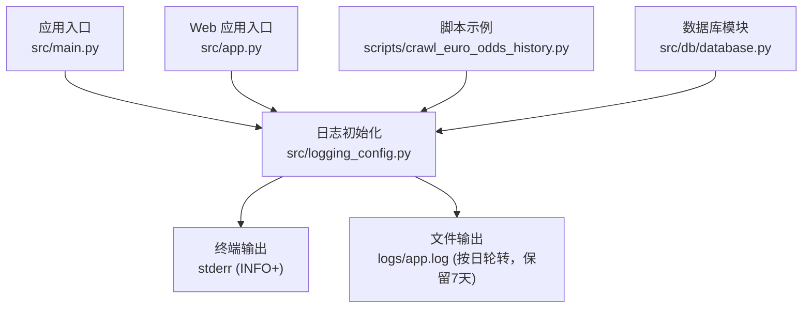
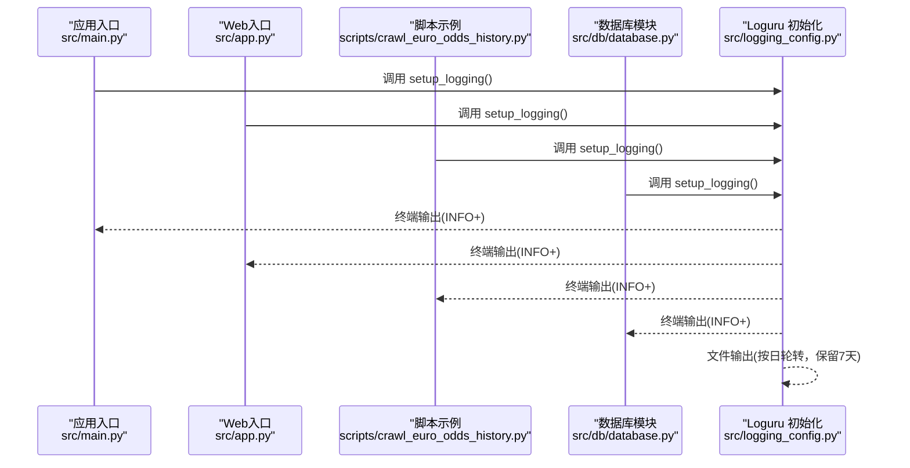
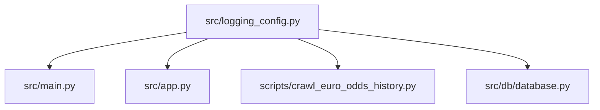

# 日志管理

<cite>
**本文引用的文件**
- [src/logging_config.py](file://src/logging_config.py)
- [src/main.py](file://src/main.py)
- [src/app.py](file://src/app.py)
- [scripts/crawl_euro_odds_history.py](file://scripts/crawl_euro_odds_history.py)
- [src/db/database.py](file://src/db/database.py)
- [config/.env](file://config/.env)
</cite>

## 目录
1. [简介](#简介)
2. [项目结构](#项目结构)
3. [核心组件](#核心组件)
4. [架构总览](#架构总览)
5. [组件详解](#组件详解)
6. [依赖关系分析](#依赖关系分析)
7. [性能与容量考量](#性能与容量考量)
8. [故障排查指南](#故障排查指南)
9. [结论](#结论)
10. [附录](#附录)

## 简介
本文件面向“日志管理系统”的设计与使用，基于项目中采用的 Loguru 框架，系统性阐述以下主题：
- 日志级别设置与输出策略
- 终端输出与文件输出的配置差异
- 日志文件轮转与保留策略
- 日志收集、分类与检索最佳实践
- 日志分析工具与调试技巧
- 生产环境中的日志运维要点

## 项目结构
该项目的日志体系围绕统一的初始化模块展开，应用入口在主程序与 Web 应用入口均调用同一初始化函数，确保全局一致的日志行为。

图表来源
- [src/main.py:21-23](file://src/main.py#L21-L23)
- [src/app.py:25-26](file://src/app.py#L25-L26)
- [scripts/crawl_euro_odds_history.py:10](file://scripts/crawl_euro_odds_history.py#L10)
- [src/db/database.py:7](file://src/db/database.py#L7)
- [src/logging_config.py:19-27](file://src/logging_config.py#L19-L27)

章节来源
- [src/logging_config.py:1-30](file://src/logging_config.py#L1-L30)
- [src/main.py:21-23](file://src/main.py#L21-L23)
- [src/app.py:25-26](file://src/app.py#L25-L26)
- [scripts/crawl_euro_odds_history.py:10](file://scripts/crawl_euro_odds_history.py#L10)
- [src/db/database.py:7](file://src/db/database.py#L7)

## 核心组件
- 日志初始化模块：负责创建日志目录、移除默认处理器、添加终端与文件处理器，并设置级别与格式。
- 应用入口：主程序与 Web 应用入口在启动时调用初始化，保证全局日志一致性。
- 脚本与业务模块：通过统一的 logger 接口输出 INFO/WARNING/ERROR 等级别的日志信息。

章节来源
- [src/logging_config.py:8-29](file://src/logging_config.py#L8-L29)
- [src/main.py:21-23](file://src/main.py#L21-L23)
- [src/app.py:25-26](file://src/app.py#L25-L26)
- [scripts/crawl_euro_odds_history.py:10](file://scripts/crawl_euro_odds_history.py#L10)
- [src/db/database.py:7](file://src/db/database.py#L7)

## 架构总览
Loguru 初始化后，系统同时向终端与文件输出日志。终端输出用于开发调试与实时监控；文件输出用于长期留存与离线分析。文件按天轮转，保留最近7天。

图表来源
- [src/main.py:21-23](file://src/main.py#L21-L23)
- [src/app.py:25-26](file://src/app.py#L25-L26)
- [scripts/crawl_euro_odds_history.py:10](file://scripts/crawl_euro_odds_history.py#L10)
- [src/db/database.py:7](file://src/db/database.py#L7)
- [src/logging_config.py:19-27](file://src/logging_config.py#L19-L27)

## 组件详解

### 日志初始化与配置
- 目录与文件路径：在项目根目录创建 logs 子目录，文件名为 app.log。
- 移除默认处理器：避免重复输出到 stderr。
- 终端输出：级别为 INFO，启用颜色输出，格式包含时间、级别、来源模块与行号、消息。
- 文件输出：级别为 INFO，按“1 day”轮转，保留“7 days”，编码为 utf-8。

章节来源
- [src/logging_config.py:14-29](file://src/logging_config.py#L14-L29)

### 终端输出与文件输出的差异
- 终端输出（INFO 级别及以上）：便于交互式开发与实时观察流程进展，适合本地调试与短期运行监控。
- 文件输出（INFO 级别及以上）：持久化记录，支持离线分析与审计，按日轮转避免单文件过大。

章节来源
- [src/logging_config.py:22-27](file://src/logging_config.py#L22-L27)

### 日志轮转与保留策略
- 轮转策略：按“1 day”轮转，即每天生成一个新文件。
- 保留策略：保留“7 days”，超出保留期的旧文件会被清理。
- 编码：UTF-8，确保多语言字符正确写入。

章节来源
- [src/logging_config.py:26-27](file://src/logging_config.py#L26-L27)

### 日志级别与使用建议
- INFO：常规流程与阶段性结果，如“启动系统”、“阶段完成”等。
- WARNING：可恢复异常或潜在风险，如“今日无比赛或抓取失败”。
- ERROR：不可恢复错误，如“解析预测文本失败”、“查询数据失败”。

章节来源
- [src/main.py:45-47](file://src/main.py#L45-L47)
- [scripts/crawl_euro_odds_history.py:59](file://scripts/crawl_euro_odds_history.py#L59)
- [scripts/run_bball_post_mortem.py:119](file://scripts/run_bball_post_mortem.py#L119)

### 日志格式化输出
- 终端格式包含时间、级别、模块名、函数名、行号与消息，便于快速定位。
- 文件格式与终端一致，但不包含颜色控制符，适合文本编辑器与日志分析工具阅读。

章节来源
- [src/logging_config.py:23-24](file://src/logging_config.py#L23-L24)

### 应用入口中的日志集成
- 主程序入口：在启动时调用初始化，随后输出阶段性的流程日志。
- Web 应用入口：同样在启动时调用初始化，确保 Web 流程与后台任务的日志一致性。

章节来源
- [src/main.py:21-23](file://src/main.py#L21-L23)
- [src/app.py:25-26](file://src/app.py#L25-L26)

### 脚本与业务模块中的日志使用
- 脚本示例：在数据抓取与入库过程中输出关键节点日志，便于追踪执行状态与异常。
- 数据库模块：在业务操作前后输出日志，便于审计与问题定位。

章节来源
- [scripts/crawl_euro_odds_history.py:55](file://scripts/crawl_euro_odds_history.py#L55)
- [src/db/database.py:7](file://src/db/database.py#L7)

### 日志收集、分类与检索最佳实践
- 分类维度建议：
  - 按模块：前端、爬虫、预测、数据库、脚本。
  - 按级别：ERROR/WARNING/INFO。
  - 按时间：按日切分的文件，便于按日期检索。
- 检索技巧：
  - 使用正则表达式过滤关键字段（如日期、模块、函数、行号）。
  - 结合时间范围与关键字进行组合检索。
- 输出格式：
  - 终端输出用于实时观察，文件输出用于离线分析与归档。

章节来源
- [src/logging_config.py:23-24](file://src/logging_config.py#L23-L24)

### 日志分析工具与调试技巧
- 常用工具：
  - 文本编辑器：VS Code/PyCharm 的日志文件高亮与搜索。
  - 命令行：grep/awk/sed 进行关键字过滤与统计。
  - 日志分析平台：ELK/Fluentd 等（可选）。
- 调试技巧：
  - 临时提升日志级别（如 DEBUG）以获取更细粒度信息（需谨慎，避免性能影响）。
  - 关注时间戳与模块/函数信息，快速定位问题发生位置。
  - 对异常分支增加 ERROR 日志，记录上下文与关键变量。

章节来源
- [src/logging_config.py:23-24](file://src/logging_config.py#L23-L24)

### 生产环境中的日志运维要点
- 轮转与保留：按日轮转、保留7天，平衡磁盘占用与历史可追溯性。
- 编码与稳定性：UTF-8 编码确保多语言内容正确写入。
- 性能影响：INFO 级别输出对性能影响较小，避免在高频循环中输出大量日志。
- 安全与合规：避免在日志中记录敏感信息（如密钥、令牌），必要时脱敏处理。
- 监控与告警：结合 ERROR/WARNING 日志建立告警，及时发现异常。

章节来源
- [src/logging_config.py:26-27](file://src/logging_config.py#L26-L27)

## 依赖关系分析
- 初始化模块被多个入口与业务模块依赖，形成统一的日志出口。
- 脚本与数据库模块通过统一的 logger 接口输出日志，确保一致性。

图表来源
- [src/logging_config.py:8-29](file://src/logging_config.py#L8-L29)
- [src/main.py:21-23](file://src/main.py#L21-L23)
- [src/app.py:25-26](file://src/app.py#L25-L26)
- [scripts/crawl_euro_odds_history.py:10](file://scripts/crawl_euro_odds_history.py#L10)
- [src/db/database.py:7](file://src/db/database.py#L7)

章节来源
- [src/logging_config.py:8-29](file://src/logging_config.py#L8-L29)
- [src/main.py:21-23](file://src/main.py#L21-L23)
- [src/app.py:25-26](file://src/app.py#L25-L26)
- [scripts/crawl_euro_odds_history.py:10](file://scripts/crawl_euro_odds_history.py#L10)
- [src/db/database.py:7](file://src/db/database.py#L7)

## 性能与容量考量
- 日志级别：INFO 级别对性能影响较小，适合生产环境。
- 轮转频率：按日轮转，避免单文件过大导致读写性能下降。
- 保留周期：7 天适中，兼顾历史分析与磁盘空间。
- 编码：UTF-8 减少乱码风险，提高可读性。

章节来源
- [src/logging_config.py:26-27](file://src/logging_config.py#L26-L27)

## 故障排查指南
- 未看到日志输出：
  - 确认是否调用了初始化函数。
  - 检查日志级别是否高于当前输出级别。
- 日志重复输出：
  - 确认是否多次初始化或未移除默认处理器。
- 日志文件未轮转：
  - 检查系统时间与时钟同步，确认按日轮转触发条件。
- 磁盘空间不足：
  - 调整保留周期或清理旧日志。

章节来源
- [src/logging_config.py:19-27](file://src/logging_config.py#L19-L27)

## 结论
本项目通过 Loguru 提供了简洁、高效且一致的日志体系：统一初始化、终端与文件双通道输出、按日轮转与保留策略，满足开发调试与生产运维的双重需求。配合合理的日志级别与格式化输出，能够有效支撑日志收集、分类与检索，并为问题定位与系统优化提供可靠依据。

## 附录
- 环境变量参考：项目使用 .env 文件集中管理 API 密钥与数据库连接等配置，日志系统独立于这些配置，但可在日志中安全地记录非敏感信息。
  
章节来源
- [config/.env:1-20](file://config/.env#L1-L20)