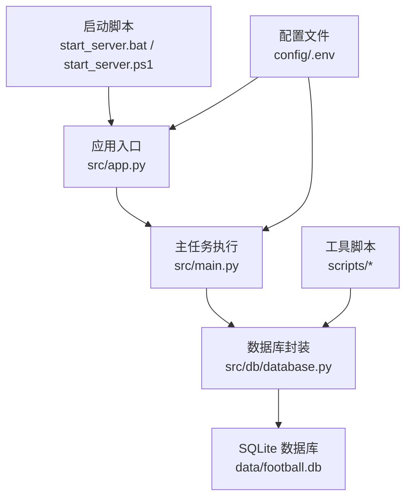
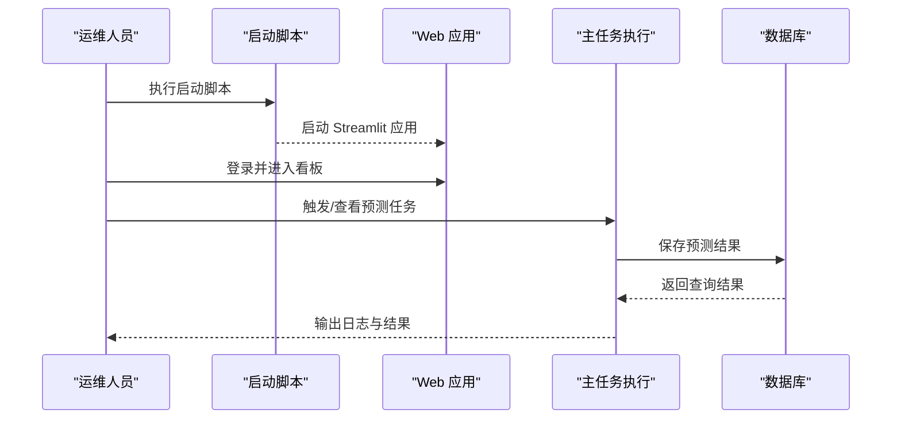
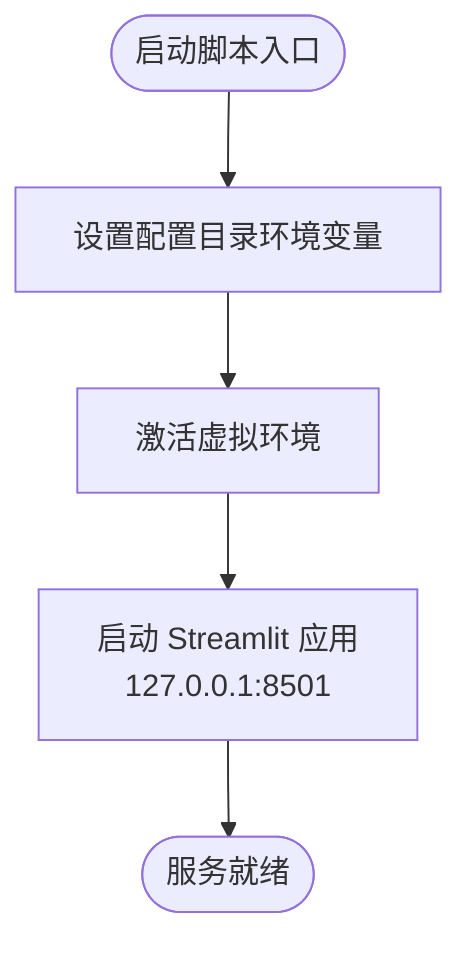
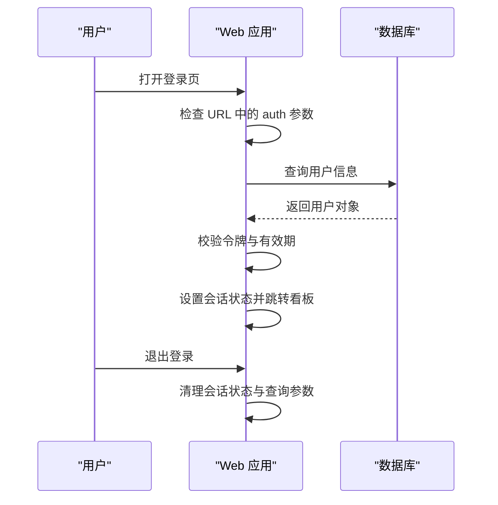
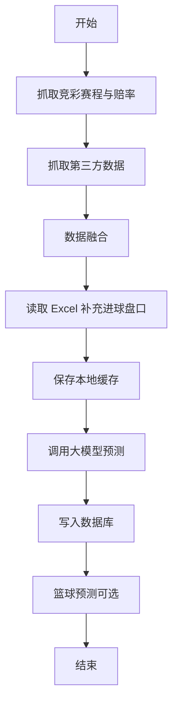
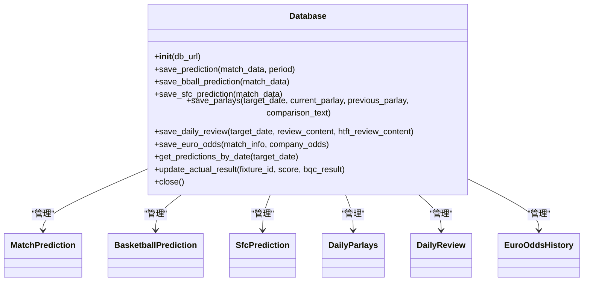
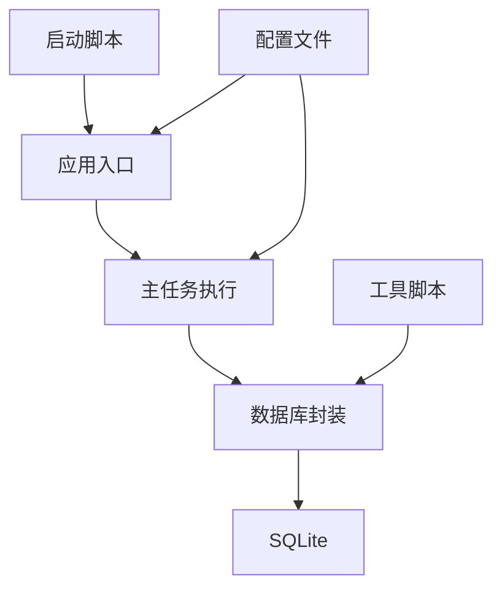

# 系统维护

<cite>
**本文引用的文件**
- [start_server.bat](file://start_server.bat)
- [start_server.ps1](file://start_server.ps1)
- [src/main.py](file://src/main.py)
- [src/app.py](file://src/app.py)
- [src/db/database.py](file://src/db/database.py)
- [src/logging_config.py](file://src/logging_config.py)
- [config/.env](file://config/.env)
- [supabase/migrations/20240326_add_prediction_period.sql](file://supabase/migrations/20240326_add_prediction_period.sql)
- [scripts/check_db_constraints.py](file://scripts/check_db_constraints.py)
- [scripts/test_db.py](file://scripts/test_db.py)
- [scripts/generate_detailed_report.py](file://scripts/generate_detailed_report.py)
- [scripts/run_post_mortem.py](file://scripts/run_post_mortem.py)
- [scripts/batch_predict_goals.py](file://scripts/batch_predict_goals.py)
</cite>

## 目录
1. [简介](#简介)
2. [项目结构](#项目结构)
3. [核心组件](#核心组件)
4. [架构总览](#架构总览)
5. [详细组件分析](#详细组件分析)
6. [依赖分析](#依赖分析)
7. [性能考虑](#性能考虑)
8. [故障排查指南](#故障排查指南)
9. [结论](#结论)
10. [附录](#附录)

## 简介
本文件面向运维团队，提供系统维护的标准化流程与操作指南。内容涵盖定期维护任务（数据库维护、缓存清理、系统优化）、服务器启动脚本使用、备份策略、数据迁移与系统升级、维护窗口规划与变更管理、风险控制、维护自动化与批量任务调度、以及系统健康检查方法。文档基于仓库中的实际代码与脚本进行梳理，确保可落地、可执行。

## 项目结构
系统主要由以下层次构成：
- 启动层：Windows 批处理与 PowerShell 启动脚本，负责启动 Streamlit 应用。
- 应用层：Streamlit Web 应用入口与登录认证流程。
- 业务层：主任务执行脚本，负责抓取数据、融合数据、调用大模型预测、落库。
- 数据层：SQLite 数据库封装与迁移脚本。
- 工具与脚本层：数据库约束检查、复盘与报告生成、批量进球预测、数据库测试等。
- 配置层：环境变量配置文件，集中存放密钥与外部服务参数。

图表来源
- [start_server.bat:1-13](file://start_server.bat#L1-L13)
- [start_server.ps1:1-10](file://start_server.ps1#L1-L10)
- [src/app.py:1-166](file://src/app.py#L1-L166)
- [src/main.py:1-183](file://src/main.py#L1-L183)
- [src/db/database.py:1-567](file://src/db/database.py#L1-L567)
- [config/.env:1-20](file://config/.env#L1-L20)

章节来源
- [start_server.bat:1-13](file://start_server.bat#L1-L13)
- [start_server.ps1:1-10](file://start_server.ps1#L1-L10)
- [src/app.py:1-166](file://src/app.py#L1-L166)
- [src/main.py:1-183](file://src/main.py#L1-L183)
- [src/db/database.py:1-567](file://src/db/database.py#L1-L567)
- [config/.env:1-20](file://config/.env#L1-L20)

## 核心组件
- 启动脚本：提供一键启动 Web 应用的能力，设置必要的环境变量并启动 Streamlit。
- 应用入口：实现登录认证、会话状态管理与页面路由，支撑前端交互。
- 主任务执行：整合抓取、数据融合、模型预测与入库流程，支持足球与篮球两类预测。
- 数据库封装：统一的 ORM 模型与数据库操作接口，支持多表、多字段与事务。
- 工具脚本：提供数据库约束检查、复盘与报告生成、批量进球预测、数据库测试等维护能力。
- 配置文件：集中管理外部 API 密钥、数据库连接、消息推送等。

章节来源
- [src/app.py:110-166](file://src/app.py#L110-L166)
- [src/main.py:34-183](file://src/main.py#L34-L183)
- [src/db/database.py:200-567](file://src/db/database.py#L200-L567)
- [scripts/check_db_constraints.py:1-49](file://scripts/check_db_constraints.py#L1-L49)
- [scripts/run_post_mortem.py:1-824](file://scripts/run_post_mortem.py#L1-L824)
- [scripts/generate_detailed_report.py:1-164](file://scripts/generate_detailed_report.py#L1-L164)
- [scripts/batch_predict_goals.py:1-248](file://scripts/batch_predict_goals.py#L1-L248)
- [config/.env:1-20](file://config/.env#L1-L20)

## 架构总览
系统采用“启动脚本 → Web 应用 → 主任务执行 → 数据库”的链路。Web 应用负责用户登录与页面跳转；主任务执行负责数据采集、融合与预测；数据库负责持久化与查询；工具脚本提供维护与诊断能力。

图表来源
- [start_server.bat:10-12](file://start_server.bat#L10-L12)
- [start_server.ps1:7-9](file://start_server.ps1#L7-L9)
- [src/app.py:110-166](file://src/app.py#L110-L166)
- [src/main.py:128-135](file://src/main.py#L128-L135)
- [src/db/database.py:256-305](file://src/db/database.py#L256-L305)

## 详细组件分析

### 启动脚本与服务器启动流程
- Windows 批处理脚本：设置配置目录环境变量，激活虚拟环境，启动 Streamlit 应用。
- PowerShell 脚本：设置严格模式与错误偏好，设置配置目录环境变量，启动 Streamlit 应用。
- 启动端口与地址：固定为 127.0.0.1:8501，便于本地开发与测试。

图表来源
- [start_server.bat:10-12](file://start_server.bat#L10-L12)
- [start_server.ps1:7-9](file://start_server.ps1#L7-L9)

章节来源
- [start_server.bat:1-13](file://start_server.bat#L1-L13)
- [start_server.ps1:1-10](file://start_server.ps1#L1-L10)

### Web 应用与登录认证
- 页面配置：隐藏默认侧边栏导航，设置页面标题与布局。
- 登录流程：从 URL 查询参数恢复登录状态，校验令牌与有效期，连接数据库校验用户有效性后跳转看板。
- 密码校验：SHA256 哈希比对，支持授权有效期检查。
- 会话状态：维护登录态、用户名、角色与令牌，提供退出登录功能。

图表来源
- [src/app.py:64-82](file://src/app.py#L64-L82)
- [src/app.py:94-108](file://src/app.py#L94-L108)
- [src/app.py:110-166](file://src/app.py#L110-L166)
- [src/db/database.py:309-310](file://src/db/database.py#L309-L310)

章节来源
- [src/app.py:1-166](file://src/app.py#L1-L166)
- [src/db/database.py:309-310](file://src/db/database.py#L309-L310)

### 主任务执行与预测流程
- 足球预测：抓取竞彩赛程与赔率 → 抓取第三方数据 → 数据融合 → 读取 Excel 补充进球盘口 → 保存本地缓存 → 调用大模型预测 → 保存预测结果至数据库。
- 篮球预测：抓取竞彩篮球 → 保存缓存 → 拉取 NBA 基本面 → 调用大模型预测 → 保存预测结果至数据库。
- 缓存策略：本地 JSON 文件缓存，便于前端展示与离线复用。
- 数据库写入：按时间段标识（如预估、最终）保存预测结果，支持更新与去重。

图表来源
- [src/main.py:40-135](file://src/main.py#L40-L135)
- [src/main.py:138-177](file://src/main.py#L138-L177)

章节来源
- [src/main.py:1-183](file://src/main.py#L1-L183)

### 数据库封装与迁移
- ORM 模型：定义用户、比赛预测、篮球预测、胜负彩、每日串关、每日复盘、欧赔历史等表结构。
- 数据库初始化：自动创建表与必要列，确保 SQLite 数据库存储路径存在。
- 写入与更新：支持按 fixture_id 与时间段标识的更新与插入，自动解析时间与比分，计算实际结果。
- 查询接口：按日期窗口查询、按日期聚合、按日期范围查询、按日期获取预测集等。
- 迁移脚本：添加 prediction_period 列并重建索引，兼容历史数据。

图表来源
- [src/db/database.py:200-567](file://src/db/database.py#L200-L567)

章节来源
- [src/db/database.py:1-567](file://src/db/database.py#L1-L567)
- [supabase/migrations/20240326_add_prediction_period.sql:1-51](file://supabase/migrations/20240326_add_prediction_period.sql#L1-L51)

### 日志与健康检查
- 日志配置：终端 INFO 级别输出与文件轮转（按日轮转、保留 7 天），统一日志格式。
- 健康检查建议：启动后检查日志文件是否存在、数据库连接是否可用、缓存文件是否生成、Web 服务端口是否可达。

章节来源
- [src/logging_config.py:1-30](file://src/logging_config.py#L1-L30)

### 工具脚本与维护自动化
- 数据库约束检查：检查表结构、索引与 SQL 约束，辅助迁移与修复。
- 数据库测试：列出预测日期集合，辅助定位数据问题。
- 复盘与报告：计算命中率、按联赛与盘型统计、生成 Markdown 与 CSV 报告。
- 批量进球预测：从 Excel 读取盘口与趋势，结合数据库原始数据调用预测器，回写预测结果。

章节来源
- [scripts/check_db_constraints.py:1-49](file://scripts/check_db_constraints.py#L1-L49)
- [scripts/test_db.py:1-9](file://scripts/test_db.py#L1-L9)
- [scripts/run_post_mortem.py:253-492](file://scripts/run_post_mortem.py#L253-L492)
- [scripts/generate_detailed_report.py:12-164](file://scripts/generate_detailed_report.py#L12-L164)
- [scripts/batch_predict_goals.py:13-248](file://scripts/batch_predict_goals.py#L13-L248)

## 依赖分析
- 启动脚本依赖虚拟环境与 Streamlit 可执行文件，确保端口与地址正确。
- 应用入口依赖数据库模块与环境变量，确保用户认证与路由正常。
- 主任务执行依赖爬虫模块、数据融合模块、LLM 预测模块与数据库模块。
- 数据库封装依赖 SQLAlchemy 与 SQLite，迁移脚本依赖历史表结构。
- 工具脚本依赖数据库模块与预测模块，部分脚本依赖 Excel 读写库。

图表来源
- [src/app.py:19-21](file://src/app.py#L19-L21)
- [src/main.py:25-32](file://src/main.py#L25-L32)
- [src/db/database.py:1-8](file://src/db/database.py#L1-L8)
- [config/.env:1-20](file://config/.env#L1-L20)

章节来源
- [src/app.py:1-166](file://src/app.py#L1-L166)
- [src/main.py:1-183](file://src/main.py#L1-L183)
- [src/db/database.py:1-567](file://src/db/database.py#L1-L567)
- [config/.env:1-20](file://config/.env#L1-L20)

## 性能考虑
- 数据库写入：批量写入与事务提交，减少频繁 IO；按 fixture_id 与时间段标识更新，避免重复写入。
- 缓存策略：本地 JSON 缓存减少前端请求压力，建议定期清理过期缓存。
- 日志轮转：按日轮转与保留策略，避免日志无限增长。
- 爬虫与网络：合理设置超时与重试，避免阻塞主线程。
- 预测模型：异步调用与并发控制，避免资源争用。

## 故障排查指南
- 启动失败：检查虚拟环境路径、端口占用与权限；确认配置目录环境变量设置。
- 登录异常：核对用户是否存在、密码哈希是否匹配、授权有效期是否过期；检查数据库连接。
- 预测未入库：检查数据库连接、表结构与列是否存在；查看日志输出定位错误。
- 缓存缺失：确认缓存文件路径与权限；检查主任务执行是否成功写入。
- 复盘报告为空：确认数据库中有可比对的预测与赛果；检查日期窗口与过滤条件。
- 数据库约束问题：使用约束检查脚本核对表结构与索引；必要时执行迁移脚本。

章节来源
- [start_server.bat:10-12](file://start_server.bat#L10-L12)
- [start_server.ps1:7-9](file://start_server.ps1#L7-L9)
- [src/app.py:94-108](file://src/app.py#L94-L108)
- [src/db/database.py:256-305](file://src/db/database.py#L256-L305)
- [scripts/check_db_constraints.py:13-47](file://scripts/check_db_constraints.py#L13-L47)
- [scripts/run_post_mortem.py:494-824](file://scripts/run_post_mortem.py#L494-L824)

## 结论
本维护文档基于仓库中的实际代码与脚本，提供了从启动、认证、预测、落库到工具脚本与迁移的全链路维护指南。建议运维团队遵循标准化流程，结合日志与工具脚本进行健康检查与问题定位，确保系统稳定运行与持续优化。

## 附录

### 维护窗口规划与变更管理
- 维护窗口：选择业务低峰时段（如凌晨），预留缓冲时间。
- 变更管理：变更前备份数据库与配置文件，变更后进行健康检查与回归测试。
- 风险控制：限制单点故障影响范围，准备回滚方案与应急响应流程。

### 备份策略
- 数据库备份：定期导出 SQLite 文件，保留多个版本，异地存储。
- 配置备份：备份 .env 文件与启动脚本，确保可快速恢复。
- 日志备份：保留日志轮转文件，便于审计与问题追踪。

### 数据迁移与系统升级
- 迁移脚本：使用提供的 SQL 脚本添加列与重建索引，确保历史数据兼容。
- 升级流程：先在测试环境验证，再在生产环境执行，记录变更日志与回滚点。

### 维护自动化与批量任务调度
- 自动化：将常用维护脚本封装为定时任务或批处理，减少人工干预。
- 批量任务：复盘与报告生成、批量进球预测等脚本可按日期批量执行。
- 健康检查：定期检查日志、缓存与数据库状态，及时发现异常。