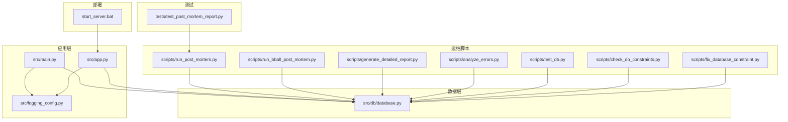
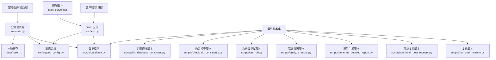
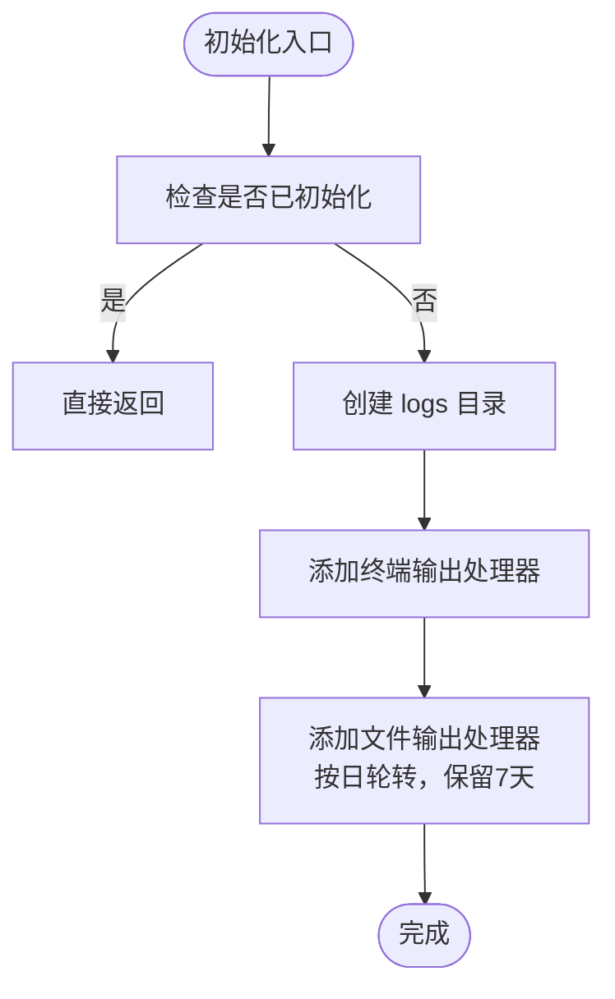
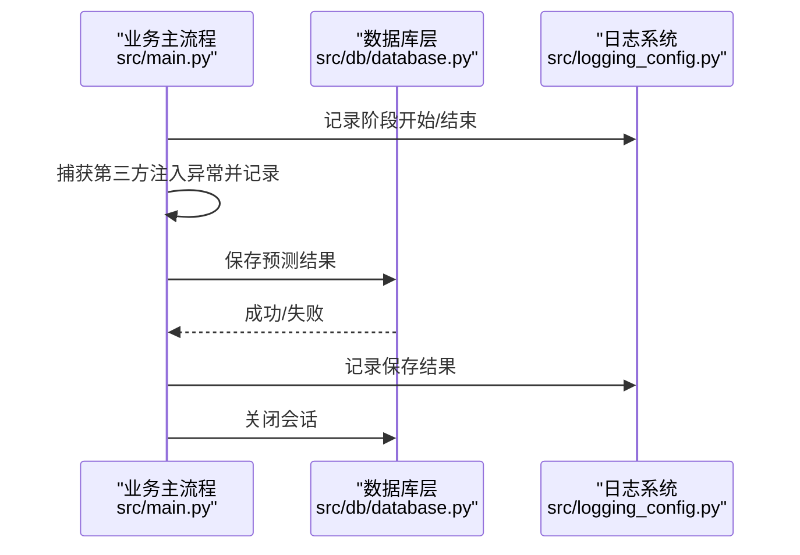
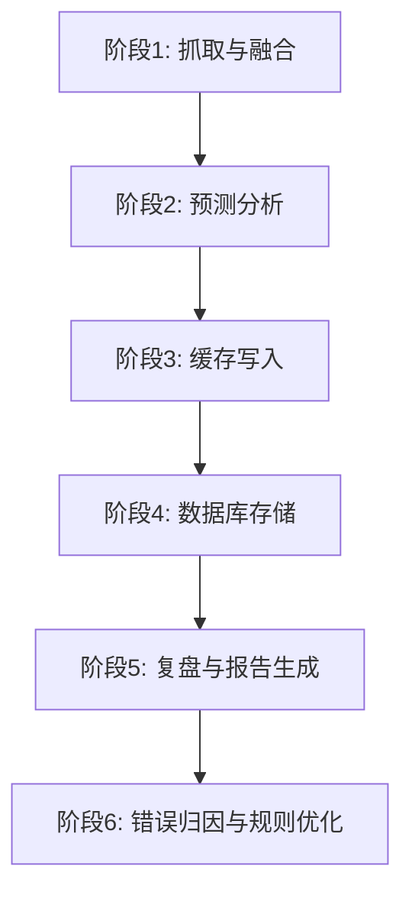
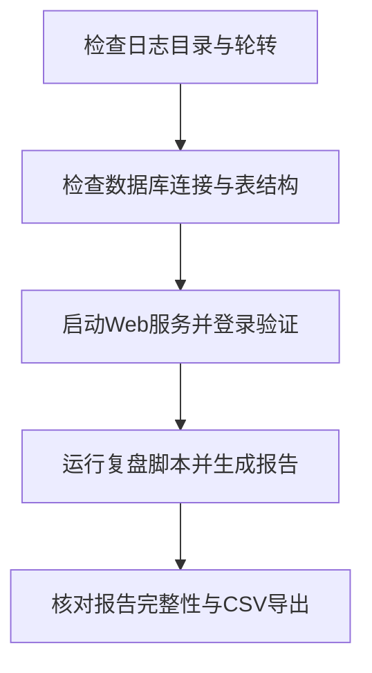
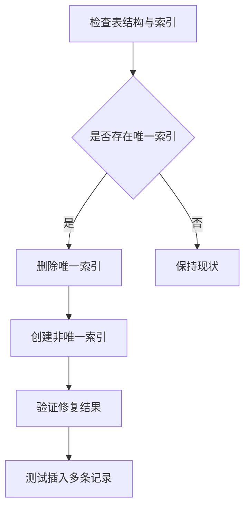
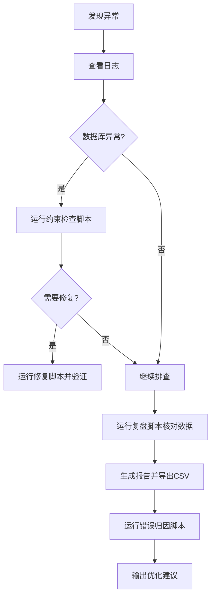
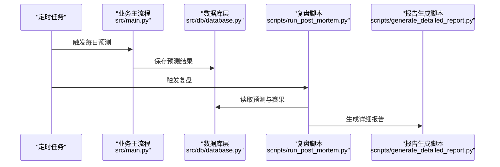

# 运维监控

<cite>
**本文引用的文件**
- [src/logging_config.py](file://src/logging_config.py)
- [src/main.py](file://src/main.py)
- [src/app.py](file://src/app.py)
- [src/db/database.py](file://src/db/database.py)
- [scripts/test_db.py](file://scripts/test_db.py)
- [scripts/check_db_constraints.py](file://scripts/check_db_constraints.py)
- [scripts/fix_database_constraint.py](file://scripts/fix_database_constraint.py)
- [scripts/run_post_mortem.py](file://scripts/run_post_mortem.py)
- [scripts/run_bball_post_mortem.py](file://scripts/run_bball_post_mortem.py)
- [scripts/generate_detailed_report.py](file://scripts/generate_detailed_report.py)
- [scripts/analyze_errors.py](file://scripts/analyze_errors.py)
- [start_server.bat](file://start_server.bat)
- [tests/test_post_mortem_report.py](file://tests/test_post_mortem_report.py)
</cite>

## 目录
1. [简介](#简介)
2. [项目结构](#项目结构)
3. [核心组件](#核心组件)
4. [架构总览](#架构总览)
5. [详细组件分析](#详细组件分析)
6. [依赖分析](#依赖分析)
7. [性能考虑](#性能考虑)
8. [故障排查指南](#故障排查指南)
9. [结论](#结论)
10. [附录](#附录)

## 简介
本文件面向运维工程师，系统化梳理该足球/篮球预测系统的运维监控体系，涵盖日志管理、错误处理、性能监控、健康检查、资源使用、告警机制、数据库维护、缓存与存储管理、故障诊断与应急响应、自动化与批量任务调度、以及系统优化实践。文档以仓库现有实现为依据，结合脚本与模块的职责边界，提供可操作的运维指导。

## 项目结构
系统采用“应用层 + 数据层 + 运维脚本 + 测试”的组织方式：
- 应用层：入口脚本负责日志初始化、业务流程编排、数据库持久化与缓存写入。
- 数据层：SQLite + SQLAlchemy ORM，统一抽象用户、预测、复盘、串关等实体。
- 运维脚本：数据库约束检查与修复、复盘与报告生成、错误归因分析、测试辅助工具。
- 测试：单元测试覆盖复盘流程的关键函数，保障逻辑正确性与提示词质量。



**图表来源**
- [src/main.py:1-183](file://src/main.py#L1-L183)
- [src/app.py:1-166](file://src/app.py#L1-L166)
- [src/logging_config.py:1-30](file://src/logging_config.py#L1-L30)
- [src/db/database.py:1-567](file://src/db/database.py#L1-L567)
- [scripts/run_post_mortem.py:1-824](file://scripts/run_post_mortem.py#L1-L824)
- [scripts/run_bball_post_mortem.py:1-267](file://scripts/run_bball_post_mortem.py#L1-L267)
- [scripts/generate_detailed_report.py:1-164](file://scripts/generate_detailed_report.py#L1-L164)
- [scripts/analyze_errors.py:1-93](file://scripts/analyze_errors.py#L1-L93)
- [scripts/test_db.py:1-9](file://scripts/test_db.py#L1-L9)
- [scripts/check_db_constraints.py:1-49](file://scripts/check_db_constraints.py#L1-L49)
- [scripts/fix_database_constraint.py:1-104](file://scripts/fix_database_constraint.py#L1-L104)
- [start_server.bat:1-13](file://start_server.bat#L1-L13)
- [tests/test_post_mortem_report.py:1-338](file://tests/test_post_mortem_report.py#L1-L338)

**章节来源**
- [src/main.py:1-183](file://src/main.py#L1-L183)
- [src/app.py:1-166](file://src/app.py#L1-L166)
- [src/logging_config.py:1-30](file://src/logging_config.py#L1-L30)
- [src/db/database.py:1-567](file://src/db/database.py#L1-L567)
- [scripts/run_post_mortem.py:1-824](file://scripts/run_post_mortem.py#L1-L824)
- [scripts/run_bball_post_mortem.py:1-267](file://scripts/run_bball_post_mortem.py#L1-L267)
- [scripts/generate_detailed_report.py:1-164](file://scripts/generate_detailed_report.py#L1-L164)
- [scripts/analyze_errors.py:1-93](file://scripts/analyze_errors.py#L1-L93)
- [scripts/test_db.py:1-9](file://scripts/test_db.py#L1-L9)
- [scripts/check_db_constraints.py:1-49](file://scripts/check_db_constraints.py#L1-L49)
- [scripts/fix_database_constraint.py:1-104](file://scripts/fix_database_constraint.py#L1-L104)
- [start_server.bat:1-13](file://start_server.bat#L1-L13)
- [tests/test_post_mortem_report.py:1-338](file://tests/test_post_mortem_report.py#L1-L338)

## 核心组件
- 日志系统：集中初始化，终端与文件双输出，按日轮转与保留策略，便于线上问题定位。
- 业务主流程：抓取数据、数据融合、预测、缓存落地、数据库持久化，分阶段记录关键事件。
- Web 应用：登录鉴权、会话状态、页面路由，集成日志初始化与数据库访问。
- 数据库层：统一 ORM 抽象，提供预测、复盘、串关、欧赔历史等表的增删改查与聚合查询。
- 运维脚本：数据库约束检查与修复、复盘与报告生成、错误归因、测试辅助。
- 测试：对复盘流程关键函数进行断言，保障提示词与输出稳定性。

**章节来源**
- [src/logging_config.py:8-30](file://src/logging_config.py#L8-L30)
- [src/main.py:34-136](file://src/main.py#L34-L136)
- [src/app.py:51-109](file://src/app.py#L51-L109)
- [src/db/database.py:200-562](file://src/db/database.py#L200-L562)
- [scripts/run_post_mortem.py:253-492](file://scripts/run_post_mortem.py#L253-L492)
- [scripts/run_bball_post_mortem.py:79-262](file://scripts/run_bball_post_mortem.py#L79-L262)
- [scripts/generate_detailed_report.py:12-164](file://scripts/generate_detailed_report.py#L12-L164)
- [scripts/analyze_errors.py:13-93](file://scripts/analyze_errors.py#L13-L93)
- [tests/test_post_mortem_report.py:116-290](file://tests/test_post_mortem_report.py#L116-L290)

## 架构总览
系统采用“脚本驱动 + Web 应用 + 数据库”的三层架构。日志贯穿所有组件，业务主流程与 Web 应用均依赖数据库层进行数据持久化。运维脚本独立于主流程，用于离线复盘、报告生成与数据库维护。



**图表来源**
- [src/app.py:110-166](file://src/app.py#L110-L166)
- [src/main.py:34-177](file://src/main.py#L34-L177)
- [src/db/database.py:200-562](file://src/db/database.py#L200-L562)
- [src/logging_config.py:8-30](file://src/logging_config.py#L8-L30)
- [scripts/run_post_mortem.py:494-824](file://scripts/run_post_mortem.py#L494-L824)
- [scripts/run_bball_post_mortem.py:79-267](file://scripts/run_bball_post_mortem.py#L79-L267)
- [scripts/generate_detailed_report.py:12-164](file://scripts/generate_detailed_report.py#L12-L164)
- [scripts/analyze_errors.py:13-93](file://scripts/analyze_errors.py#L13-L93)
- [scripts/test_db.py:1-9](file://scripts/test_db.py#L1-L9)
- [scripts/check_db_constraints.py:1-49](file://scripts/check_db_constraints.py#L1-L49)
- [scripts/fix_database_constraint.py:1-104](file://scripts/fix_database_constraint.py#L1-L104)
- [start_server.bat:10-12](file://start_server.bat#L10-L12)

## 详细组件分析

### 日志管理系统
- 初始化策略：移除默认 stderr 输出，避免重复；同时输出到终端与文件。
- 文件轮转：按日轮转，保留7天，适合生产环境长期留存与滚动清理。
- 使用方式：应用入口与脚本均调用初始化函数，保证一致性。



**图表来源**
- [src/logging_config.py:8-30](file://src/logging_config.py#L8-L30)

**章节来源**
- [src/logging_config.py:8-30](file://src/logging_config.py#L8-L30)

### 错误处理机制
- 业务主流程：对第三方数据源注入异常进行捕获与记录，避免中断主流程；Excel 数据补充失败记录警告。
- 数据库层：保存/更新预测时捕获异常并回滚，打印失败信息；提供统一 close() 关闭会话。
- Web 应用：登录鉴权解码失败与异常捕获，避免前端异常传播；会话状态初始化与令牌有效期校验。
- 运维脚本：数据库约束检查/修复脚本对异常进行 try/catch 与回滚，保证修复过程可控。



**图表来源**
- [src/main.py:54-68](file://src/main.py#L54-L68)
- [src/main.py:107-126](file://src/main.py#L107-L126)
- [src/db/database.py:256-304](file://src/db/database.py#L256-L304)
- [src/db/database.py:306-307](file://src/db/database.py#L306-L307)
- [src/logging_config.py:8-30](file://src/logging_config.py#L8-L30)

**章节来源**
- [src/main.py:54-68](file://src/main.py#L54-L68)
- [src/main.py:99-100](file://src/main.py#L99-L100)
- [src/db/database.py:256-304](file://src/db/database.py#L256-L304)
- [src/db/database.py:306-307](file://src/db/database.py#L306-L307)
- [src/app.py:64-82](file://src/app.py#L64-L82)

### 性能监控策略
- 业务主流程：按阶段记录日志，便于评估抓取、融合、预测、存储各环节耗时与吞吐。
- 数据库层：提供日期窗口查询、按 fixture_id/period 聚合、批量保存欧赔历史等接口，减少重复查询与事务开销。
- Web 应用：登录鉴权与会话状态管理，避免重复鉴权开销；页面路由与静态资源加载优化。
- 运维脚本：复盘脚本按日期窗口查询，减少全表扫描；报告生成脚本追加 CSV，避免重复构建全文。



**图表来源**
- [src/main.py:40-136](file://src/main.py#L40-L136)
- [src/db/database.py:451-478](file://src/db/database.py#L451-L478)
- [scripts/run_post_mortem.py:278-492](file://scripts/run_post_mortem.py#L278-L492)
- [scripts/generate_detailed_report.py:12-164](file://scripts/generate_detailed_report.py#L12-L164)

**章节来源**
- [src/main.py:40-136](file://src/main.py#L40-L136)
- [src/db/database.py:451-478](file://src/db/database.py#L451-L478)
- [scripts/run_post_mortem.py:278-492](file://scripts/run_post_mortem.py#L278-L492)
- [scripts/generate_detailed_report.py:12-164](file://scripts/generate_detailed_report.py#L12-L164)

### 系统健康检查
- 日志可用性：确认 logs 目录存在、文件轮转正常、终端输出可见。
- 数据库可用性：连接字符串指向 data/football.db，首次访问自动创建表与必要列。
- Web 应用可用性：部署脚本启动 Streamlit，监听本地端口；登录鉴权流程可验证会话与令牌有效性。
- 复盘与报告：复盘脚本与报告生成脚本可独立运行，验证数据完整性与输出格式。



**图表来源**
- [src/logging_config.py:14-27](file://src/logging_config.py#L14-L27)
- [src/db/database.py:200-217](file://src/db/database.py#L200-L217)
- [start_server.bat:10-12](file://start_server.bat#L10-L12)
- [scripts/run_post_mortem.py:494-824](file://scripts/run_post_mortem.py#L494-L824)
- [scripts/generate_detailed_report.py:125-160](file://scripts/generate_detailed_report.py#L125-L160)

**章节来源**
- [src/logging_config.py:14-27](file://src/logging_config.py#L14-L27)
- [src/db/database.py:200-217](file://src/db/database.py#L200-L217)
- [start_server.bat:10-12](file://start_server.bat#L10-L12)
- [scripts/run_post_mortem.py:494-824](file://scripts/run_post_mortem.py#L494-L824)
- [scripts/generate_detailed_report.py:125-160](file://scripts/generate_detailed_report.py#L125-L160)

### 资源使用监控
- CPU/内存：通过日志记录关键阶段耗时，结合系统监控工具观察峰值时段（如定时任务执行期间）。
- IO：缓存写入 data/ 目录，定期清理过期 JSON；数据库文件位于 data/football.db，建议定期备份与空间监控。
- 网络：抓取第三方数据源时关注超时与重试策略，日志中记录失败次数与原因。

**章节来源**
- [src/main.py:102-126](file://src/main.py#L102-L126)
- [src/db/database.py:502-539](file://src/db/database.py#L502-L539)

### 告警机制
- 日志级别：INFO 及以上输出到终端与文件，便于告警平台采集；错误与异常通过日志关键字触发。
- 告警建议：对“抓取失败”、“预测保存失败”、“数据库约束修复”等关键事件建立告警规则；对日志轮转失败与文件损坏进行告警。

**章节来源**
- [src/logging_config.py:23-27](file://src/logging_config.py#L23-L27)
- [src/main.py:59-62](file://src/main.py#L59-L62)
- [src/db/database.py:301-304](file://src/db/database.py#L301-L304)

### 数据库维护
- 自动建表与列补齐：首次访问自动创建表并补齐运行期需要的列。
- 约束检查与修复：提供约束检查脚本与修复脚本，支持删除唯一索引、创建非唯一索引并验证修复结果。
- 数据清理：按日期窗口查询与聚合，避免全表扫描；定期清理过期数据与报告文件。



**图表来源**
- [scripts/check_db_constraints.py:13-45](file://scripts/check_db_constraints.py#L13-L45)
- [scripts/fix_database_constraint.py:31-100](file://scripts/fix_database_constraint.py#L31-L100)

**章节来源**
- [src/db/database.py:219-233](file://src/db/database.py#L219-L233)
- [scripts/check_db_constraints.py:13-45](file://scripts/check_db_constraints.py#L13-L45)
- [scripts/fix_database_constraint.py:31-100](file://scripts/fix_database_constraint.py#L31-L100)

### 缓存清理与存储管理
- 本地缓存：每日预测结果写入 data/today_matches.json 与 data/today_bball_matches.json，便于前端与报告读取。
- 报告存储：data/reports 下生成各类 JSON 与 CSV，建议定期清理过期报告文件。
- 日志轮转：按日轮转，保留7天，避免磁盘占用过大。

**章节来源**
- [src/main.py:102-126](file://src/main.py#L102-L126)
- [scripts/run_bball_post_mortem.py:246-248](file://scripts/run_bball_post_mortem.py#L246-L248)
- [src/logging_config.py:26-27](file://src/logging_config.py#L26-L27)

### 故障诊断流程
- 快速定位：查看 logs/app.log，确认最近日志与错误堆栈；检查 data/football.db 是否存在。
- 数据库问题：运行约束检查脚本，定位索引与约束问题；必要时执行修复脚本。
- 复盘与报告：运行复盘脚本，核对 all_compared_matches.json；生成详细报告与 CSV。
- 错误归因：运行错误归因脚本，获取 LLM 深度分析建议。



**图表来源**
- [src/logging_config.py:26-27](file://src/logging_config.py#L26-L27)
- [scripts/check_db_constraints.py:9-49](file://scripts/check_db_constraints.py#L9-L49)
- [scripts/fix_database_constraint.py:10-104](file://scripts/fix_database_constraint.py#L10-L104)
- [scripts/run_post_mortem.py:494-824](file://scripts/run_post_mortem.py#L494-L824)
- [scripts/generate_detailed_report.py:125-160](file://scripts/generate_detailed_report.py#L125-L160)
- [scripts/analyze_errors.py:63-90](file://scripts/analyze_errors.py#L63-L90)

**章节来源**
- [src/logging_config.py:26-27](file://src/logging_config.py#L26-L27)
- [scripts/check_db_constraints.py:9-49](file://scripts/check_db_constraints.py#L9-L49)
- [scripts/fix_database_constraint.py:10-104](file://scripts/fix_database_constraint.py#L10-L104)
- [scripts/run_post_mortem.py:494-824](file://scripts/run_post_mortem.py#L494-L824)
- [scripts/generate_detailed_report.py:125-160](file://scripts/generate_detailed_report.py#L125-L160)
- [scripts/analyze_errors.py:63-90](file://scripts/analyze_errors.py#L63-L90)

### 应急响应预案
- 短时中断：暂停定时任务，优先修复日志与数据库问题；通过 Web 应用手动登录验证。
- 数据库不可用：切换到只读模式，停止写入；修复后恢复写入并重新执行失败批次。
- 大模型接口异常：降级为最小化预测流程，仅输出基础推荐；恢复后补齐规则优化。

**章节来源**
- [src/app.py:64-82](file://src/app.py#L64-L82)
- [src/db/database.py:301-304](file://src/db/database.py#L301-L304)

### 恢复演练方法
- 复盘演练：按日期窗口执行复盘脚本，核对 is_correct 字段回写；生成报告并导出 CSV。
- 规则演练：基于错误归因脚本输出的规则建议，在测试环境中验证后再上线。
- 数据恢复：备份 data/football.db，演练恢复流程；确保日志与缓存文件可重建。

**章节来源**
- [scripts/run_post_mortem.py:456-474](file://scripts/run_post_mortem.py#L456-L474)
- [scripts/analyze_errors.py:63-90](file://scripts/analyze_errors.py#L63-L90)
- [src/db/database.py:536-562](file://src/db/database.py#L536-L562)

### 运维自动化与批量任务调度
- 定时任务：建议使用系统计划任务或容器编排工具，按日执行业务主流程与复盘脚本。
- 部署脚本：start_server.bat 启动 Web 应用，设置环境变量与端口。
- 测试与验证：tests/test_post_mortem_report.py 验证复盘流程关键函数，保障提示词与输出稳定性。



**图表来源**
- [src/main.py:34-136](file://src/main.py#L34-L136)
- [src/db/database.py:256-304](file://src/db/database.py#L256-L304)
- [scripts/run_post_mortem.py:494-824](file://scripts/run_post_mortem.py#L494-L824)
- [scripts/generate_detailed_report.py:12-164](file://scripts/generate_detailed_report.py#L12-L164)

**章节来源**
- [src/main.py:34-136](file://src/main.py#L34-L136)
- [scripts/run_post_mortem.py:494-824](file://scripts/run_post_mortem.py#L494-L824)
- [scripts/generate_detailed_report.py:12-164](file://scripts/generate_detailed_report.py#L12-L164)
- [start_server.bat:10-12](file://start_server.bat#L10-L12)
- [tests/test_post_mortem_report.py:116-290](file://tests/test_post_mortem_report.py#L116-L290)

### 系统优化技巧
- 日志优化：合理设置日志级别与输出格式，避免高频 INFO 导致 IO 压力。
- 数据库优化：为常用查询字段建立合适索引；批量写入时合并事务提交。
- 缓存优化：按日期切分缓存文件，定期清理过期文件；压缩报告输出。
- 复盘优化：按日期窗口查询，避免全表扫描；将复杂计算拆分为多个脚本，提升可维护性。

**章节来源**
- [src/logging_config.py:23-27](file://src/logging_config.py#L23-L27)
- [src/db/database.py:451-478](file://src/db/database.py#L451-L478)
- [scripts/run_post_mortem.py:278-492](file://scripts/run_post_mortem.py#L278-L492)

## 依赖分析
- 组件耦合：应用层与数据库层通过 ORM 直接交互；运维脚本与数据库层通过 SQL/ORM 交互；日志系统被所有组件依赖。
- 外部依赖：Streamlit（Web 应用）、SQLAlchemy（数据库 ORM）、Loguru（日志）、第三方数据源（抓取模块）。
- 潜在风险：数据库约束修复脚本依赖 SQLite 特性；Web 应用依赖 .env 环境变量；定时任务依赖系统时钟与网络连通性。

```mermaid
graph LR
Log["日志系统"] --> Main["业务主流程"]
Log --> App["Web 应用"]
Log --> Scripts["运维脚本"]
DB["数据库层"] <- --> Main
DB <- --> App
DB <- --> Scripts
App --> Streamlit["Streamlit"]
Main --> Crawlers["抓取模块"]
```

**图表来源**
- [src/logging_config.py:8-30](file://src/logging_config.py#L8-L30)
- [src/main.py:25-32](file://src/main.py#L25-L32)
- [src/app.py:19-21](file://src/app.py#L19-L21)
- [src/db/database.py:1-9](file://src/db/database.py#L1-L9)

**章节来源**
- [src/logging_config.py:8-30](file://src/logging_config.py#L8-L30)
- [src/main.py:25-32](file://src/main.py#L25-L32)
- [src/app.py:19-21](file://src/app.py#L19-L21)
- [src/db/database.py:1-9](file://src/db/database.py#L1-L9)

## 性能考虑
- I/O 优化：缓存与报告文件写入 data/ 目录，建议使用 SSD；日志按日轮转，避免单文件过大。
- 数据库优化：按日期窗口查询，减少全表扫描；批量写入时合并事务提交；索引设计兼顾查询与写入性能。
- 网络优化：抓取第三方数据源时设置超时与重试；对失败请求记录日志并限流。
- 内存优化：分批处理预测结果，避免一次性加载过多数据；及时释放临时对象。

**章节来源**
- [src/main.py:102-126](file://src/main.py#L102-L126)
- [src/db/database.py:451-478](file://src/db/database.py#L451-L478)
- [scripts/run_post_mortem.py:278-492](file://scripts/run_post_mortem.py#L278-L492)

## 故障排查指南
- 日志排查：检查 logs/app.log，定位异常发生阶段；确认日志轮转是否正常。
- 数据库排查：使用 scripts/test_db.py 查看日期集合；运行 scripts/check_db_constraints.py 检查索引与约束；必要时执行 scripts/fix_database_constraint.py 修复。
- 复盘排查：运行 scripts/run_post_mortem.py 与 scripts/run_bball_post_mortem.py，核对 all_compared_matches.json 与 bball_all_compared_matches.json；生成 CSV 并核对字段。
- 错误归因：运行 scripts/analyze_errors.py，获取 LLM 深度分析建议；结合 tests/test_post_mortem_report.py 断言验证流程正确性。

**章节来源**
- [src/logging_config.py:26-27](file://src/logging_config.py#L26-L27)
- [scripts/test_db.py:1-9](file://scripts/test_db.py#L1-L9)
- [scripts/check_db_constraints.py:9-49](file://scripts/check_db_constraints.py#L9-L49)
- [scripts/fix_database_constraint.py:10-104](file://scripts/fix_database_constraint.py#L10-L104)
- [scripts/run_post_mortem.py:494-824](file://scripts/run_post_mortem.py#L494-L824)
- [scripts/run_bball_post_mortem.py:79-262](file://scripts/run_bball_post_mortem.py#L79-L262)
- [scripts/analyze_errors.py:63-90](file://scripts/analyze_errors.py#L63-L90)
- [tests/test_post_mortem_report.py:116-290](file://tests/test_post_mortem_report.py#L116-L290)

## 结论
该系统通过统一的日志初始化、清晰的业务主流程、完善的数据库 ORM 抽象与丰富的运维脚本，形成了可运维、可监控、可扩展的预测系统。建议在生产环境中持续完善告警机制、定期进行数据库维护与缓存清理，并通过自动化与批量任务调度保障稳定产出。

## 附录
- 部署与启动：使用 start_server.bat 启动 Web 应用，确保 .env 配置正确。
- 复盘与报告：按日运行复盘脚本与报告生成脚本，核对 CSV 导出与 Markdown 报告。
- 测试与验证：运行 tests/test_post_mortem_report.py，确保复盘流程关键函数行为稳定。

**章节来源**
- [start_server.bat:10-12](file://start_server.bat#L10-L12)
- [scripts/run_post_mortem.py:494-824](file://scripts/run_post_mortem.py#L494-L824)
- [scripts/generate_detailed_report.py:12-164](file://scripts/generate_detailed_report.py#L12-L164)
- [tests/test_post_mortem_report.py:116-290](file://tests/test_post_mortem_report.py#L116-L290)