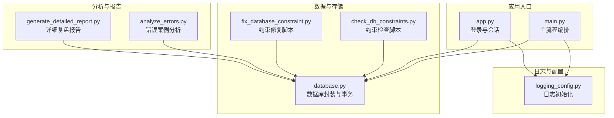
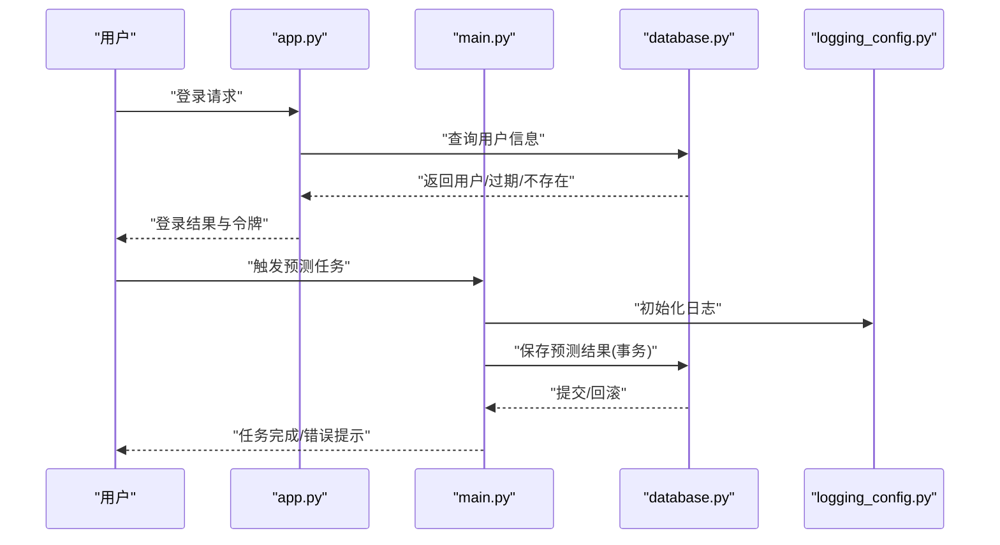
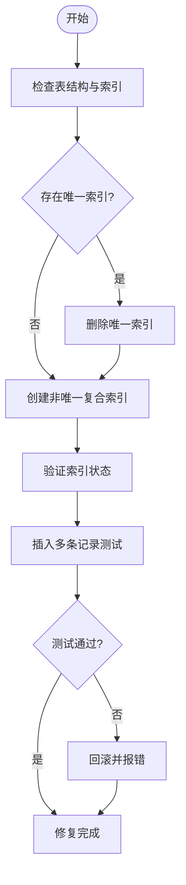
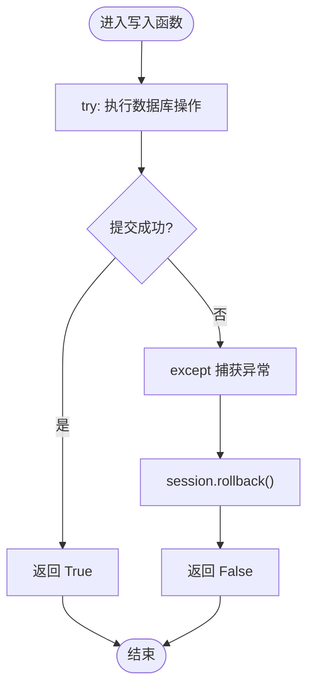
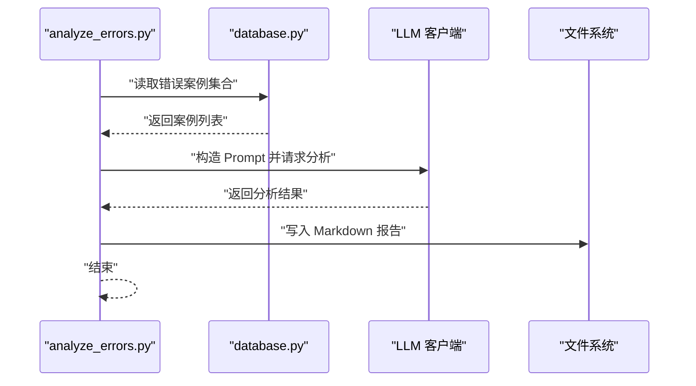
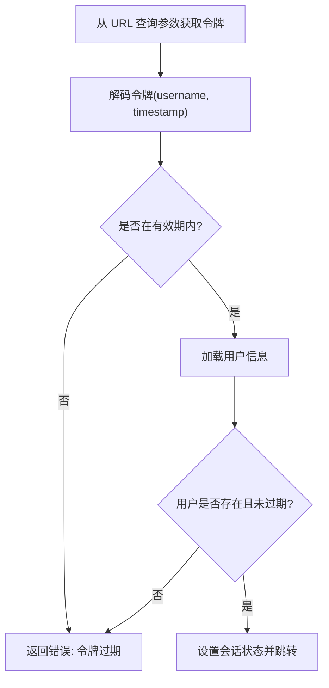
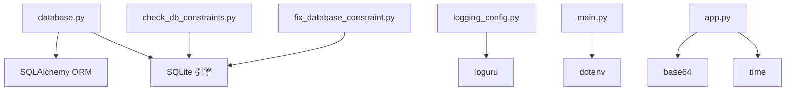

# 错误处理

<cite>
**本文引用的文件**
- [database.py](file://src/db/database.py)
- [check_db_constraints.py](file://scripts/check_db_constraints.py)
- [fix_database_constraint.py](file://scripts/fix_database_constraint.py)
- [logging_config.py](file://src/logging_config.py)
- [main.py](file://src/main.py)
- [app.py](file://src/app.py)
- [analyze_errors.py](file://scripts/analyze_errors.py)
- [generate_detailed_report.py](file://scripts/generate_detailed_report.py)
- [test_db.py](file://scripts/test_db.py)
- [README.md](file://README.md)
</cite>

## 目录
1. [简介](#简介)
2. [项目结构](#项目结构)
3. [核心组件](#核心组件)
4. [架构总览](#架构总览)
5. [组件详解](#组件详解)
6. [依赖关系分析](#依赖关系分析)
7. [性能考量](#性能考量)
8. [故障排查指南](#故障排查指南)
9. [结论](#结论)
10. [附录](#附录)

## 简介
本文件聚焦于本项目的错误处理体系，围绕数据库约束检查机制与错误检测策略展开，系统性阐述常见数据库错误类型、成因与修复方法；提供错误预防、异常捕获与优雅降级策略；给出错误监控、告警与自动修复方案；解释错误日志记录、报告生成与问题追踪流程，并为运维人员提供可执行的问题排查步骤。

## 项目结构
项目采用分层架构：数据采集层、数据处理与融合层、LLM 预测层、存储与复盘层、展示与推送层。数据库位于存储与复盘层，负责预测结果与复盘数据的持久化；日志系统负责统一记录；脚本工具负责约束检查与修复、错误分析与报告生成。

图表来源
- [main.py:34-135](file://src/main.py#L34-L135)
- [app.py:25-27](file://src/app.py#L25-L27)
- [database.py:200-562](file://src/db/database.py#L200-L562)
- [check_db_constraints.py:1-49](file://scripts/check_db_constraints.py#L1-L49)
- [fix_database_constraint.py:1-104](file://scripts/fix_database_constraint.py#L1-L104)
- [analyze_errors.py:13-93](file://scripts/analyze_errors.py#L13-L93)
- [generate_detailed_report.py:12-164](file://scripts/generate_detailed_report.py#L12-L164)

章节来源
- [README.md:24-40](file://README.md#L24-L40)
- [main.py:34-135](file://src/main.py#L34-L135)
- [app.py:25-27](file://src/app.py#L25-L27)

## 核心组件
- 数据库封装与事务控制：提供统一的 ORM 表定义、连接管理、事务提交/回滚、常用查询与批量写入接口。
- 约束检查与修复脚本：用于诊断 SQLite 表结构、索引与唯一性约束，定位并修复多时间段记录冲突问题。
- 日志系统：统一终端与文件输出，按天轮转，保留 7 天，便于问题追溯。
- 错误分析与报告：基于错误案例集合，调用 LLM 生成复盘报告与优化建议，并导出 Markdown 与 CSV。
- 应用入口与登录：主流程编排与前端登录态校验，贯穿日志与数据库访问。

章节来源
- [database.py:200-562](file://src/db/database.py#L200-L562)
- [check_db_constraints.py:1-49](file://scripts/check_db_constraints.py#L1-L49)
- [fix_database_constraint.py:1-104](file://scripts/fix_database_constraint.py#L1-L104)
- [logging_config.py:8-30](file://src/logging_config.py#L8-L30)
- [analyze_errors.py:13-93](file://scripts/analyze_errors.py#L13-L93)
- [generate_detailed_report.py:12-164](file://scripts/generate_detailed_report.py#L12-L164)
- [main.py:34-135](file://src/main.py#L34-L135)
- [app.py:64-82](file://src/app.py#L64-L82)

## 架构总览
系统在主流程中完成数据抓取、融合、LLM 预测与数据库写入；在登录态中完成用户认证与权限校验；日志系统贯穿所有关键路径。数据库层通过事务保证一致性，异常时回滚并返回失败状态，供上层进行降级处理。

图表来源
- [app.py:64-82](file://src/app.py#L64-L82)
- [main.py:34-135](file://src/main.py#L34-L135)
- [database.py:256-304](file://src/db/database.py#L256-L304)
- [logging_config.py:8-30](file://src/logging_config.py#L8-L30)

## 组件详解

### 数据库约束检查与修复机制
- 约束检查脚本用于读取 SQLite 表结构、索引与唯一性约束，输出当前索引列表与列信息，辅助定位唯一索引导致的插入冲突。
- 修复脚本在确认唯一索引冲突后，删除现有唯一索引，创建非唯一复合索引（fixture_id + prediction_period），并进行插入测试，验证多时间段记录能力。

图表来源
- [check_db_constraints.py:13-47](file://scripts/check_db_constraints.py#L13-L47)
- [fix_database_constraint.py:31-94](file://scripts/fix_database_constraint.py#L31-L94)

章节来源
- [check_db_constraints.py:1-49](file://scripts/check_db_constraints.py#L1-L49)
- [fix_database_constraint.py:1-104](file://scripts/fix_database_constraint.py#L1-L104)

### 数据库事务与异常捕获
- 保存预测、篮球预测、胜负彩预测、串关方案、复盘等写入操作均包裹在 try-except 中，异常时执行 session.rollback() 并返回 False，避免脏数据。
- 关键写入函数包括：保存/更新预测、保存篮球预测、保存胜负彩预测、保存串关方案、保存复盘、批量保存欧赔历史等。

图表来源
- [database.py:256-304](file://src/db/database.py#L256-L304)
- [database.py:331-366](file://src/db/database.py#L331-L366)
- [database.py:374-413](file://src/db/database.py#L374-L413)
- [database.py:426-449](file://src/db/database.py#L426-L449)
- [database.py:541-562](file://src/db/database.py#L541-L562)

章节来源
- [database.py:256-304](file://src/db/database.py#L256-L304)
- [database.py:331-366](file://src/db/database.py#L331-L366)
- [database.py:374-413](file://src/db/database.py#L374-L413)
- [database.py:426-449](file://src/db/database.py#L426-L449)
- [database.py:541-562](file://src/db/database.py#L541-L562)

### 错误分析与报告生成
- 错误分析脚本读取错误案例集合，构造 LLM Prompt，调用大模型进行深度归因分析，生成复盘报告并保存为 Markdown。
- 详细报告脚本读取全量比对结果，计算命中率，对错误案例单独调用 LLM 进行盘口与微观信号规则优化建议生成，并导出 CSV。

图表来源
- [analyze_errors.py:13-93](file://scripts/analyze_errors.py#L13-L93)
- [generate_detailed_report.py:12-164](file://scripts/generate_detailed_report.py#L12-L164)

章节来源
- [analyze_errors.py:13-93](file://scripts/analyze_errors.py#L13-L93)
- [generate_detailed_report.py:12-164](file://scripts/generate_detailed_report.py#L12-L164)

### 登录态与异常降级
- 登录态校验包含令牌解码、有效期判断与用户授权到期校验；若任一步骤失败，返回错误信息，避免进入业务流程。
- 应用入口在异常时打印堆栈信息并记录日志，保证问题可追溯。

图表来源
- [app.py:64-82](file://src/app.py#L64-L82)

章节来源
- [app.py:64-82](file://src/app.py#L64-L82)
- [main.py:54-68](file://src/main.py#L54-L68)

## 依赖关系分析
- 数据库封装依赖 SQLAlchemy ORM 与 SQLite；日志系统依赖 loguru；主流程依赖 dotenv 读取环境变量；登录态依赖 base64 编解码与时间戳。
- 约束检查与修复脚本直接操作 SQLite 文件，依赖 PRAGMA 语句读取表结构与索引信息。

图表来源
- [database.py:1-9](file://src/db/database.py#L1-L9)
- [logging_config.py:3](file://src/logging_config.py#L3)
- [main.py:6](file://src/main.py#L6)
- [app.py:51-62](file://src/app.py#L51-L62)
- [check_db_constraints.py:1-6](file://scripts/check_db_constraints.py#L1-L6)
- [fix_database_constraint.py:1-6](file://scripts/fix_database_constraint.py#L1-L6)

章节来源
- [database.py:1-9](file://src/db/database.py#L1-L9)
- [logging_config.py:3](file://src/logging_config.py#L3)
- [main.py:6](file://src/main.py#L6)
- [app.py:51-62](file://src/app.py#L51-L62)
- [check_db_constraints.py:1-6](file://scripts/check_db_constraints.py#L1-L6)
- [fix_database_constraint.py:1-6](file://scripts/fix_database_constraint.py#L1-L6)

## 性能考量
- 事务粒度：写入操作均以单条记录或批量记录为事务单元，异常即回滚，避免长事务锁表影响。
- 索引策略：修复脚本将唯一索引改为非唯一复合索引，提升多时间段记录场景下的并发写入能力。
- 日志轮转：按天轮转并保留 7 天，避免日志文件无限增长。
- I/O 优化：主流程将中间结果缓存到本地 JSON，减少重复抓取与计算成本。

## 故障排查指南

### 常见数据库错误类型与成因
- 唯一索引冲突：fixture_id 唯一索引导致同一场比赛多时间段记录无法插入。
- 日期窗口查询异常：日期解析或时间范围边界导致查询为空。
- 写入失败：字段类型不匹配、空值约束违反、JSON 字段序列化异常。
- 批量写入失败：部分记录校验失败导致整体回滚。

章节来源
- [check_db_constraints.py:37-47](file://scripts/check_db_constraints.py#L37-L47)
- [fix_database_constraint.py:31-40](file://scripts/fix_database_constraint.py#L31-L40)
- [database.py:451-467](file://src/db/database.py#L451-L467)
- [database.py:502-539](file://src/db/database.py#L502-L539)

### 修复方法
- 使用约束检查脚本查看当前索引与表结构，确认唯一索引位置。
- 使用约束修复脚本删除唯一索引并创建非唯一复合索引，随后进行插入测试。
- 对日期窗口查询异常，检查输入日期格式与边界条件，必要时在上层进行容错处理。
- 对写入失败，检查字段类型与空值约束，确保 JSON 正确序列化。

章节来源
- [check_db_constraints.py:13-47](file://scripts/check_db_constraints.py#L13-L47)
- [fix_database_constraint.py:31-94](file://scripts/fix_database_constraint.py#L31-L94)
- [database.py:451-467](file://src/db/database.py#L451-L467)
- [database.py:502-539](file://src/db/database.py#L502-L539)

### 错误预防措施
- 在新增/迁移表结构时，先在测试数据库验证索引与约束，再应用到生产。
- 对外数据源字段进行显式校验与转换，避免空值与类型不一致。
- 对批量写入设置分批提交与重试策略，避免单点失败拖垮整体。

### 异常捕获与优雅降级
- 写入失败返回 False，上层可根据返回值决定是否重试或记录错误日志。
- 登录态异常时返回明确错误信息，避免继续执行业务逻辑。
- 主流程中对可选模块（如第三方数据源）失败进行降级处理，保证核心链路可用。

章节来源
- [database.py:256-304](file://src/db/database.py#L256-L304)
- [app.py:94-108](file://src/app.py#L94-L108)
- [main.py:54-68](file://src/main.py#L54-L68)

### 错误监控、告警与自动修复
- 监控：通过日志轮转与错误返回值进行监控；可扩展指标埋点（成功率、耗时、错误码）。
- 告警：对关键写入失败与登录态异常进行告警通知。
- 自动修复：对已知的约束问题，可在 CI/CD 中集成修复脚本，自动执行检查与修复。

章节来源
- [logging_config.py:19-27](file://src/logging_config.py#L19-L27)
- [check_db_constraints.py:13-47](file://scripts/check_db_constraints.py#L13-L47)
- [fix_database_constraint.py:31-94](file://scripts/fix_database_constraint.py#L31-L94)

### 错误日志记录与报告生成
- 日志系统统一输出到终端与文件，按天轮转，保留 7 天，便于问题定位。
- 错误分析与报告脚本基于错误案例集合生成复盘报告与优化建议，并导出 Markdown 与 CSV。

章节来源
- [logging_config.py:19-27](file://src/logging_config.py#L19-L27)
- [analyze_errors.py:13-93](file://scripts/analyze_errors.py#L13-L93)
- [generate_detailed_report.py:12-164](file://scripts/generate_detailed_report.py#L12-L164)

### 问题追踪流程
- 发现异常 → 查看日志 → 定位调用栈 → 检查数据库约束与事务状态 → 执行修复脚本 → 验证修复效果 → 回归测试 → 归档报告。

章节来源
- [main.py:54-68](file://src/main.py#L54-L68)
- [fix_database_constraint.py:56-94](file://scripts/fix_database_constraint.py#L56-L94)

## 结论
本项目通过严格的事务控制、完善的日志系统、可执行的约束检查与修复脚本，以及基于 LLM 的错误分析与报告生成，构建了可运维、可自愈的错误处理体系。建议在生产环境中持续完善监控与告警，固化自动修复流程，并加强输入校验与降级策略，进一步提升系统的稳定性与可维护性。

## 附录

### 数据库表与字段概览
- 用户表：用户名、密码哈希、角色、有效期、创建时间。
- 足球预测表：fixture_id、match_num、league、teams、match_time、prediction_period、原始数据、预测文本、竞彩推荐、实际结果、创建/更新时间。
- 篮球预测表：fixture_id、match_num、league、teams、match_time、原始数据、预测文本、实际比分。
- 胜负彩预测表：issue_num、fixture_id、match_num、league、teams、match_time、原始数据、预测文本。
- 每日串关表：target_date、current_parlay、previous_parlay、comparison_text、创建/更新时间。
- 每日复盘表：target_date、review_content、htft_review_content、创建/更新时间。
- 欧赔历史表：fixture_id、match_num、league、teams、match_time、公司、初赔/临赔、实际比分/结果、数据来源、创建时间。

章节来源
- [database.py:58-198](file://src/db/database.py#L58-L198)