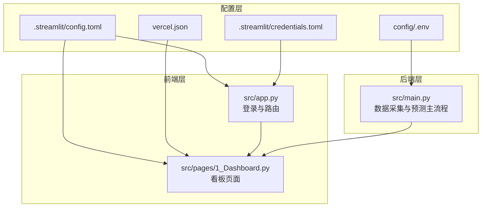
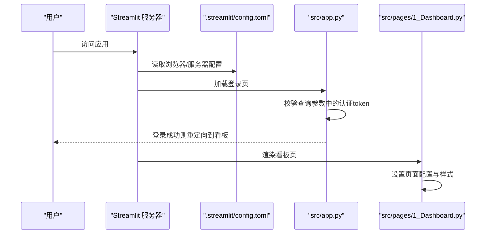
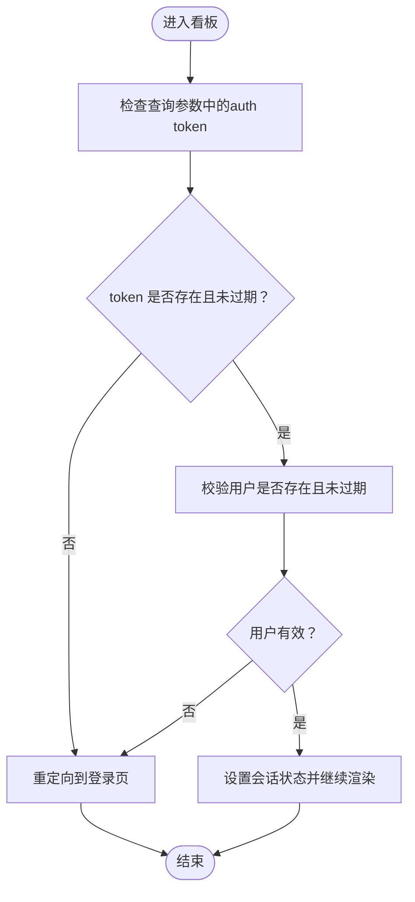
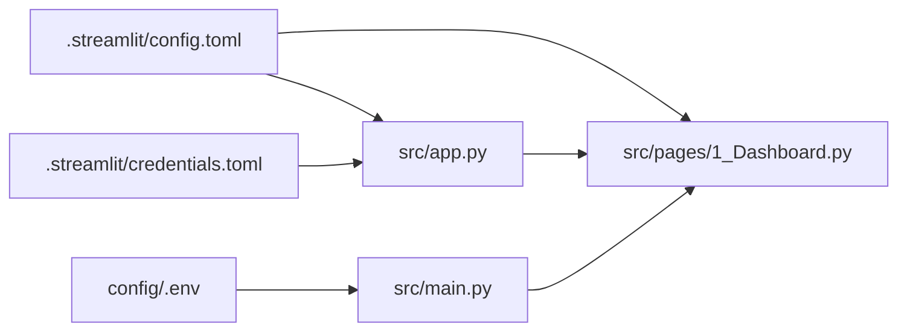

# Web界面配置

<cite>
**本文引用的文件**
- [.streamlit/config.toml](file://.streamlit/config.toml)
- [.streamlit/credentials.toml](file://.streamlit/credentials.toml)
- [src/app.py](file://src/app.py)
- [src/pages/1_Dashboard.py](file://src/pages/1_Dashboard.py)
- [src/constants.py](file://src/constants.py)
- [config/.env](file://config/.env)
- [start_server.bat](file://start_server.bat)
- [start_server.ps1](file://start_server.ps1)
- [vercel.json](file://vercel.json)
- [src/main.py](file://src/main.py)
</cite>

## 目录
1. [简介](#简介)
2. [项目结构](#项目结构)
3. [核心组件](#核心组件)
4. [架构总览](#架构总览)
5. [详细组件分析](#详细组件分析)
6. [依赖分析](#依赖分析)
7. [性能考虑](#性能考虑)
8. [故障排查指南](#故障排查指南)
9. [结论](#结论)
10. [附录](#附录)

## 简介
本文件面向前端开发者与运维人员，提供该 Streamlit Web 界面的完整配置说明与最佳实践。重点涵盖以下方面：
- .streamlit/config.toml 中浏览器与服务器配置项的作用与影响
- headless 模式与 gatherUsageStats 关键设置
- credentials.toml 用户认证配置方法
- 主题与页面外观定制建议
- 性能优化与安全加固策略
- 部署与运行时环境变量配置

## 项目结构
该项目采用“Streamlit 应用 + 后端脚本 + 配置文件”的组织方式，.streamlit 目录存放应用级配置；src 目录包含前端页面与业务逻辑；config 目录存放环境变量；脚本与批处理文件用于本地开发与部署。

图表来源
- [.streamlit/config.toml:1-6](file://.streamlit/config.toml#L1-L6)
- [.streamlit/credentials.toml:1-3](file://.streamlit/credentials.toml#L1-L3)
- [src/app.py:32-83](file://src/app.py#L32-L83)
- [src/pages/1_Dashboard.py:70-76](file://src/pages/1_Dashboard.py#L70-L76)
- [config/.env:1-20](file://config/.env#L1-L20)
- [src/main.py:1-183](file://src/main.py#L1-L183)
- [vercel.json:1-1](file://vercel.json#L1-L1)

章节来源
- [.streamlit/config.toml:1-6](file://.streamlit/config.toml#L1-L6)
- [.streamlit/credentials.toml:1-3](file://.streamlit/credentials.toml#L1-L3)
- [src/app.py:32-83](file://src/app.py#L32-L83)
- [src/pages/1_Dashboard.py:70-76](file://src/pages/1_Dashboard.py#L70-L76)
- [config/.env:1-20](file://config/.env#L1-L20)
- [src/main.py:1-183](file://src/main.py#L1-L183)
- [vercel.json:1-1](file://vercel.json#L1-L1)

## 核心组件
- 浏览器与服务器配置
  - 浏览器设置：gatherUsageStats 控制是否收集使用统计，建议在生产环境关闭以保护隐私。
  - 服务器设置：headless 控制是否以无头模式启动，建议在容器/CI 环境启用以避免 GUI 依赖。
- 认证与会话
  - credentials.toml 提供通用字段占位，实际认证逻辑在应用内实现（基于数据库用户表）。
  - 登录态通过 URL 查询参数携带的自定义 token 维持，结合会话状态与过期控制。
- 页面配置
  - 登录页与看板页分别设置页面标题、图标、布局与侧边栏状态，确保一致的品牌体验。
- 环境变量
  - LLM、数据库、消息推送等关键配置集中于 .env，便于多环境切换与密钥管理。

章节来源
- [.streamlit/config.toml:1-6](file://.streamlit/config.toml#L1-L6)
- [.streamlit/credentials.toml:1-3](file://.streamlit/credentials.toml#L1-L3)
- [src/app.py:64-82](file://src/app.py#L64-L82)
- [src/pages/1_Dashboard.py:70-76](file://src/pages/1_Dashboard.py#L70-L76)
- [config/.env:1-20](file://config/.env#L1-L20)

## 架构总览
下图展示了配置对运行时行为的影响路径：.streamlit/config.toml 影响浏览器与服务器行为；src/app.py 与 src/pages/1_Dashboard.py 决定页面外观与认证流程；config/.env 提供后端能力所需的外部依赖配置。

图表来源
- [.streamlit/config.toml:1-6](file://.streamlit/config.toml#L1-L6)
- [src/app.py:64-82](file://src/app.py#L64-L82)
- [src/pages/1_Dashboard.py:70-76](file://src/pages/1_Dashboard.py#L70-L76)

## 详细组件分析

### 浏览器与服务器配置（config.toml）
- 浏览器段落
  - gatherUsageStats：是否上报使用统计。关闭可降低数据外泄风险，适合生产环境。
- 服务器段落
  - headless：是否以无头模式启动浏览器实例。在容器/CI 环境推荐开启，避免图形界面依赖。

章节来源
- [.streamlit/config.toml:1-6](file://.streamlit/config.toml#L1-L6)

### 认证与会话（credentials.toml 与应用内逻辑）
- credentials.toml
  - 提供通用字段占位，实际认证采用应用内数据库用户校验与 token 管理。
- 应用内认证流程
  - 登录页：接收用户名/密码，校验用户存在性、密码哈希与有效期。
  - 会话保持：生成包含用户名与时间戳的 base64 token，写入会话状态并通过 URL 查询参数传递。
  - 过期控制：基于常量 AUTH_TOKEN_TTL（单位秒）限制 token 有效期。
  - 页面守卫：看板页在未登录时提示并返回登录页，防止未授权访问。

图表来源
- [src/pages/1_Dashboard.py:32-49](file://src/pages/1_Dashboard.py#L32-L49)
- [src/app.py:64-82](file://src/app.py#L64-L82)
- [src/constants.py:3-4](file://src/constants.py#L3-L4)

章节来源
- [.streamlit/credentials.toml:1-3](file://.streamlit/credentials.toml#L1-L3)
- [src/app.py:64-82](file://src/app.py#L64-L82)
- [src/pages/1_Dashboard.py:32-49](file://src/pages/1_Dashboard.py#L32-L49)
- [src/constants.py:3-4](file://src/constants.py#L3-L4)

### 页面配置与主题定制
- 登录页与看板页均通过 set_page_config 设置页面标题、图标、布局与侧边栏状态，保证品牌一致性。
- 侧边栏导航可通过内联样式隐藏，减少页面干扰。
- 建议在公共样式中统一字体、颜色与间距，避免在每个页面重复定义。

章节来源
- [src/app.py:32-46](file://src/app.py#L32-L46)
- [src/pages/1_Dashboard.py:70-84](file://src/pages/1_Dashboard.py#L70-L84)

### 环境变量与外部依赖
- LLM 配置：API 密钥、基础地址与模型名称集中管理，便于切换不同供应商或版本。
- 数据库：默认 SQLite，支持通过环境变量调整连接串。
- 消息推送：钉钉与 Telegram 的 webhook/token 可按需启用。
- 其他：第三方数据 API 密钥与可选的雷速体育匿名访问配置。

章节来源
- [config/.env:1-20](file://config/.env#L1-L20)

### 部署与运行时配置
- 本地启动
  - Windows 批处理：设置配置目录并以指定端口与地址启动。
  - PowerShell 脚本：同上，便于在 CI 环境中执行。
- 静态化与路由
  - Vercel 重写规则将所有路径指向 index.html，适配单页应用路由。

章节来源
- [start_server.bat:10-11](file://start_server.bat#L10-L11)
- [start_server.ps1:7-9](file://start_server.ps1#L7-L9)
- [vercel.json:1-1](file://vercel.json#L1-L1)

## 依赖分析
- 配置依赖
  - .streamlit/config.toml 为浏览器与服务器行为提供全局开关。
  - .streamlit/credentials.toml 作为认证配置占位，实际逻辑在应用内实现。
  - config/.env 为后端能力提供密钥与连接串。
- 运行时依赖
  - src/app.py 与 src/pages/1_Dashboard.py 共同决定页面外观与认证流程。
  - src/main.py 依赖 .env 中的 LLM 与数据库配置，负责数据采集与预测主流程。

图表来源
- [.streamlit/config.toml:1-6](file://.streamlit/config.toml#L1-L6)
- [.streamlit/credentials.toml:1-3](file://.streamlit/credentials.toml#L1-L3)
- [src/app.py:32-83](file://src/app.py#L32-L83)
- [src/pages/1_Dashboard.py:70-76](file://src/pages/1_Dashboard.py#L70-L76)
- [config/.env:1-20](file://config/.env#L1-L20)
- [src/main.py:1-183](file://src/main.py#L1-L183)

章节来源
- [.streamlit/config.toml:1-6](file://.streamlit/config.toml#L1-L6)
- [.streamlit/credentials.toml:1-3](file://.streamlit/credentials.toml#L1-L3)
- [src/app.py:32-83](file://src/app.py#L32-L83)
- [src/pages/1_Dashboard.py:70-76](file://src/pages/1_Dashboard.py#L70-L76)
- [config/.env:1-20](file://config/.env#L1-L20)
- [src/main.py:1-183](file://src/main.py#L1-L183)

## 性能考虑
- 缓存策略
  - 看板页对数据加载使用缓存装饰器，建议合理设置 TTL，平衡实时性与性能。
- 无头模式
  - headless=true 可避免图形界面开销，适合容器与 CI 环境。
- 会话与 token
  - 合理设置 AUTH_TOKEN_TTL，避免频繁重新登录，同时降低长期暴露风险。
- 静态资源与路由
  - 单页应用路由与静态化部署可减少不必要的请求与重定向。

章节来源
- [src/pages/1_Dashboard.py:86-87](file://src/pages/1_Dashboard.py#L86-L87)
- [.streamlit/config.toml:5-6](file://.streamlit/config.toml#L5-L6)
- [src/constants.py:3-4](file://src/constants.py#L3-L4)
- [vercel.json:1-1](file://vercel.json#L1-L1)

## 故障排查指南
- 登录失败
  - 检查用户名是否存在、密码哈希是否匹配、用户有效期是否过期。
- token 过期
  - 确认 AUTH_TOKEN_TTL 设置是否合理，必要时缩短以提升安全性。
- 无头模式问题
  - 在容器/CI 环境确认 headless=true 已生效，避免 GUI 依赖导致的启动失败。
- 环境变量缺失
  - 确保 .env 中 LLM、数据库与消息推送配置正确，避免运行时报错。
- 部署路由异常
  - 检查 vercel.json 的重写规则是否正确，确保 SPA 路由正常工作。

章节来源
- [src/app.py:94-108](file://src/app.py#L94-L108)
- [src/pages/1_Dashboard.py:32-49](file://src/pages/1_Dashboard.py#L32-L49)
- [.streamlit/config.toml:5-6](file://.streamlit/config.toml#L5-L6)
- [config/.env:1-20](file://config/.env#L1-L20)
- [vercel.json:1-1](file://vercel.json#L1-L1)

## 结论
本配置文档梳理了 .streamlit/config.toml、credentials.toml、应用内认证与页面配置、环境变量以及部署脚本之间的关系。遵循本文档的设置与最佳实践，可在保障安全与性能的前提下，稳定地运行该 Streamlit Web 界面。

## 附录
- 关键配置清单
  - 浏览器：gatherUsageStats=false（建议）
  - 服务器：headless=true（建议用于容器/CI）
  - 认证：基于 token 的会话机制，配合 AUTH_TOKEN_TTL 控制有效期
  - 主题：通过 set_page_config 与内联样式统一页面外观
  - 部署：Windows 批处理与 PowerShell 脚本设置配置目录与监听地址；Vercel 重写规则适配 SPA 路由