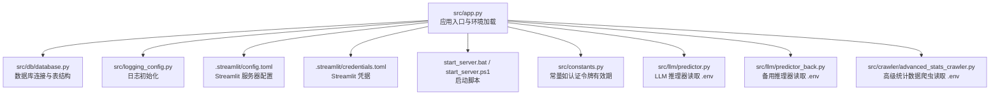
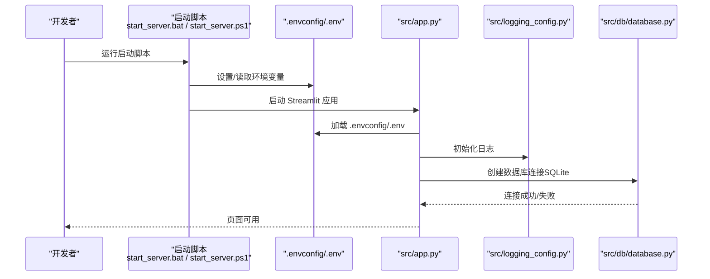
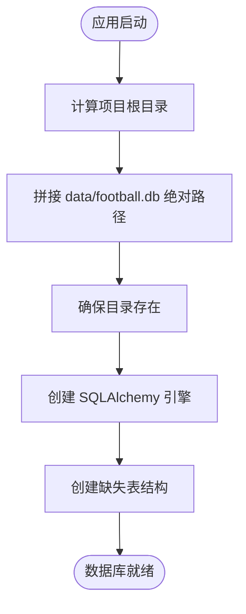
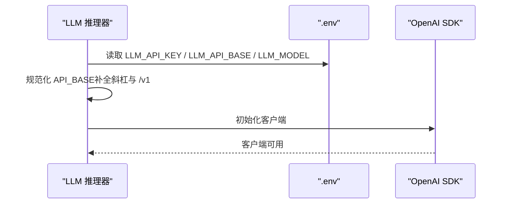
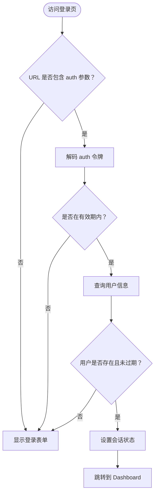
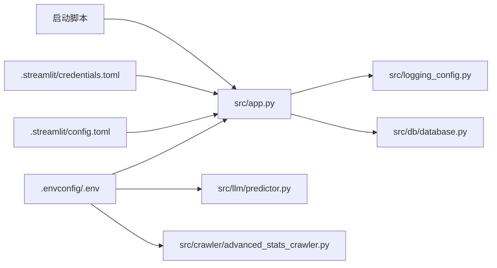

# 环境配置

<cite>
**本文引用的文件**
- [src/app.py](file://src/app.py)
- [src/db/database.py](file://src/db/database.py)
- [src/logging_config.py](file://src/logging_config.py)
- [.streamlit/config.toml](file://.streamlit/config.toml)
- [.streamlit/credentials.toml](file://.streamlit/credentials.toml)
- [start_server.bat](file://start_server.bat)
- [start_server.ps1](file://start_server.ps1)
- [src/constants.py](file://src/constants.py)
- [src/llm/predictor.py](file://src/llm/predictor.py)
- [src/llm/predictor_back.py](file://src/llm/predictor_back.py)
- [src/crawler/advanced_stats_crawler.py](file://src/crawler/advanced_stats_crawler.py)
</cite>

## 目录
1. [简介](#简介)
2. [项目结构](#项目结构)
3. [核心组件](#核心组件)
4. [架构总览](#架构总览)
5. [详细组件分析](#详细组件分析)
6. [依赖关系分析](#依赖关系分析)
7. [性能考虑](#性能考虑)
8. [故障排查指南](#故障排查指南)
9. [结论](#结论)
10. [附录](#附录)

## 简介
本指南面向开发者，提供本项目环境配置的完整说明，涵盖以下方面：
- .env 文件中关键配置项的作用与设置方法（数据库连接、API 密钥、爬虫代理等）
- 不同环境（开发、测试、生产）的配置模板与最佳实践
- 环境变量的优先级与覆盖机制
- 启动脚本的使用方法与参数说明
- 完整的环境搭建步骤与常见问题排查

## 项目结构
项目采用分层组织方式，前端入口位于 src/app.py，数据库与日志配置分别在对应模块中定义；.streamlit 目录存放 Streamlit 的配置与凭据；启动脚本位于仓库根目录。

图表来源
- [src/app.py:19-21](file://src/app.py#L19-L21)
- [src/db/database.py:200-217](file://src/db/database.py#L200-L217)
- [.streamlit/config.toml:1-5](file://.streamlit/config.toml#L1-L5)
- [.streamlit/credentials.toml:1-2](file://.streamlit/credentials.toml#L1-L2)
- [start_server.bat:10-11](file://start_server.bat#L10-L11)
- [start_server.ps1:7-9](file://start_server.ps1#L7-L9)
- [src/constants.py:3-4](file://src/constants.py#L3-L4)
- [src/llm/predictor.py:20-39](file://src/llm/predictor.py#L20-L39)
- [src/llm/predictor_back.py:10-35](file://src/llm/predictor_back.py#L10-L35)
- [src/crawler/advanced_stats_crawler.py:7-26](file://src/crawler/advanced_stats_crawler.py#L7-L26)

章节来源
- [src/app.py:19-21](file://src/app.py#L19-L21)
- [src/db/database.py:200-217](file://src/db/database.py#L200-L217)
- [.streamlit/config.toml:1-5](file://.streamlit/config.toml#L1-L5)
- [.streamlit/credentials.toml:1-2](file://.streamlit/credentials.toml#L1-L2)
- [start_server.bat:10-11](file://start_server.bat#L10-L11)
- [start_server.ps1:7-9](file://start_server.ps1#L7-L9)
- [src/constants.py:3-4](file://src/constants.py#L3-L4)
- [src/llm/predictor.py:20-39](file://src/llm/predictor.py#L20-L39)
- [src/llm/predictor_back.py:10-35](file://src/llm/predictor_back.py#L10-L35)
- [src/crawler/advanced_stats_crawler.py:7-26](file://src/crawler/advanced_stats_crawler.py#L7-L26)

## 核心组件
- 应用入口与环境加载：应用入口在 src/app.py 中加载 .env 并初始化日志与数据库。
- 数据库连接：数据库类负责根据项目根目录定位 SQLite 文件，并创建表结构。
- 日志系统：日志模块负责日志目录创建、终端与文件输出配置。
- Streamlit 配置：.streamlit/config.toml 控制浏览器与服务器行为；.streamlit/credentials.toml 存放邮箱凭据占位。
- 启动脚本：Windows 批处理与 PowerShell 脚本分别设置配置目录并启动 Streamlit。
- 常量：认证令牌有效期等全局常量。
- LLM 推理器：从 .env 读取 LLM API 密钥、基础地址与模型名称。
- 爬虫：高级统计数据爬虫从 .env 读取外部 API 密钥。

章节来源
- [src/app.py:19-21](file://src/app.py#L19-L21)
- [src/db/database.py:200-217](file://src/db/database.py#L200-L217)
- [src/logging_config.py:8-29](file://src/logging_config.py#L8-L29)
- [.streamlit/config.toml:1-5](file://.streamlit/config.toml#L1-L5)
- [.streamlit/credentials.toml:1-2](file://.streamlit/credentials.toml#L1-L2)
- [start_server.bat:10-11](file://start_server.bat#L10-L11)
- [start_server.ps1:7-9](file://start_server.ps1#L7-L9)
- [src/constants.py:3-4](file://src/constants.py#L3-L4)
- [src/llm/predictor.py:20-39](file://src/llm/predictor.py#L20-L39)
- [src/llm/predictor_back.py:10-35](file://src/llm/predictor_back.py#L10-L35)
- [src/crawler/advanced_stats_crawler.py:7-26](file://src/crawler/advanced_stats_crawler.py#L7-L26)

## 架构总览
下图展示应用启动时环境变量加载、日志初始化、数据库连接与各组件交互的关系。

图表来源
- [start_server.bat:10-11](file://start_server.bat#L10-L11)
- [start_server.ps1:7-9](file://start_server.ps1#L7-L9)
- [src/app.py:19-21](file://src/app.py#L19-L21)
- [src/logging_config.py:8-29](file://src/logging_config.py#L8-L29)
- [src/db/database.py:200-217](file://src/db/database.py#L200-L217)

## 详细组件分析

### .env 文件关键配置项与设置方法
- LLM_API_KEY：用于 LLM 推理器（OpenAI SDK）的身份认证。若缺失，推理器会记录错误并抛出异常。
- LLM_API_BASE：可选，LLM 服务的基础地址，默认指向官方服务；脚本会自动补全路径后缀。
- LLM_MODEL：可选，使用的模型名称，默认 gpt-4o。
- FOOTBALL_API_KEY：高级统计数据爬虫用于访问外部 API 的密钥。
- 其他通用建议：可在此放置数据库连接字符串（如使用 PostgreSQL）、缓存地址、第三方服务密钥等。

设置要点
- 将 .env 放置于 config/ 目录下，应用启动时会从该位置加载。
- 在不同环境中使用不同的 .env 文件，或通过 CI/CD 注入环境变量覆盖本地值。
- 对于敏感信息，优先使用环境变量注入而非硬编码。

章节来源
- [src/llm/predictor.py:20-39](file://src/llm/predictor.py#L20-L39)
- [src/llm/predictor_back.py:10-35](file://src/llm/predictor_back.py#L10-L35)
- [src/crawler/advanced_stats_crawler.py:7-26](file://src/crawler/advanced_stats_crawler.py#L7-L26)
- [src/app.py:19-21](file://src/app.py#L19-L21)

### 数据库连接字符串与 SQLite 路径
- 数据库类型：SQLite
- 连接方式：应用通过 SQLAlchemy 创建引擎，数据库文件位于项目根目录下的 data/football.db。
- 路径策略：应用在初始化时动态计算绝对路径，确保无论从哪个目录启动，均能正确找到数据库文件。
- 表结构：首次连接时自动创建表（如 users、match_predictions、basketball_predictions、sfc_predictions、daily_parlays、daily_reviews、euro_odds_history 等）。

图表来源
- [src/db/database.py:200-217](file://src/db/database.py#L200-L217)
- [src/db/database.py:219-233](file://src/db/database.py#L219-L233)

章节来源
- [src/db/database.py:200-217](file://src/db/database.py#L200-L217)
- [src/db/database.py:219-233](file://src/db/database.py#L219-L233)

### API 密钥与 LLM 推理器
- 加载逻辑：推理器在初始化时加载 .env，并读取 LLM_API_KEY、LLM_API_BASE、LLM_MODEL。
- 基础地址处理：脚本会确保基础地址以斜杠结尾且以 /v1 结尾，保证与 OpenAI SDK 的兼容性。
- 错误处理：若缺少 LLM_API_KEY，会记录错误并抛出异常，防止静默失败。

图表来源
- [src/llm/predictor.py:20-39](file://src/llm/predictor.py#L20-L39)
- [src/llm/predictor_back.py:10-35](file://src/llm/predictor_back.py#L10-L35)

章节来源
- [src/llm/predictor.py:20-39](file://src/llm/predictor.py#L20-L39)
- [src/llm/predictor_back.py:10-35](file://src/llm/predictor_back.py#L10-L35)

### 爬虫代理与外部 API 密钥
- 高级统计数据爬虫：从 .env 读取 FOOTBALL_API_KEY，并通过请求头传递给外部 API。
- 代理设置：当前实现未直接体现代理参数；如需代理，可在请求会话中增加代理配置或通过系统环境变量注入（例如 HTTP_PROXY/HTTPS_PROXY）。

章节来源
- [src/crawler/advanced_stats_crawler.py:7-26](file://src/crawler/advanced_stats_crawler.py#L7-L26)

### 认证令牌有效期与登录流程
- 认证令牌 TTL：全局常量定义了 URL 中携带的认证令牌有效期（秒）。
- 登录流程：应用尝试从 URL 查询参数恢复登录状态，校验令牌时间戳与用户有效性后，写入会话状态并跳转看板。

图表来源
- [src/app.py:64-82](file://src/app.py#L64-L82)
- [src/constants.py:3-4](file://src/constants.py#L3-L4)

章节来源
- [src/app.py:64-82](file://src/app.py#L64-L82)
- [src/constants.py:3-4](file://src/constants.py#L3-L4)

### 日志系统与输出
- 日志目录：应用启动时在项目根目录创建 logs/ 目录。
- 输出策略：终端输出 INFO 级别以上；文件输出按天轮转，保留 7 天。
- 初始化：日志模块仅初始化一次，避免重复输出。

章节来源
- [src/logging_config.py:8-29](file://src/logging_config.py#L8-L29)

### Streamlit 配置与凭据
- 浏览器设置：禁用使用统计收集，减少隐私风险。
- 服务器设置：headless 模式运行，适合非图形环境。
- 凭据：credentials.toml 中 email 为空，可按需填写。

章节来源
- [.streamlit/config.toml:1-5](file://.streamlit/config.toml#L1-L5)
- [.streamlit/credentials.toml:1-2](file://.streamlit/credentials.toml#L1-L2)

### 启动脚本使用方法与参数
- Windows 批处理脚本：设置 STREAMLIT_CONFIG_DIR，启动 Streamlit 应用，监听 127.0.0.1:8501。
- PowerShell 脚本：与批处理功能一致，同时显式输出启动信息。
- 参数说明：脚本固定监听地址与端口，如需自定义可在脚本中调整相应参数。

章节来源
- [start_server.bat:10-11](file://start_server.bat#L10-L11)
- [start_server.ps1:7-9](file://start_server.ps1#L7-L9)

## 依赖关系分析
- 应用入口依赖 .env 加载、日志初始化与数据库连接。
- LLM 推理器与爬虫依赖 .env 中的 API 密钥与基础地址。
- Streamlit 配置影响服务器行为与用户体验。
- 启动脚本决定 .env 与配置目录的可见性。

图表来源
- [src/app.py:19-21](file://src/app.py#L19-L21)
- [src/logging_config.py:8-29](file://src/logging_config.py#L8-L29)
- [src/db/database.py:200-217](file://src/db/database.py#L200-L217)
- [src/llm/predictor.py:20-39](file://src/llm/predictor.py#L20-L39)
- [src/crawler/advanced_stats_crawler.py:7-26](file://src/crawler/advanced_stats_crawler.py#L7-L26)
- [.streamlit/config.toml:1-5](file://.streamlit/config.toml#L1-L5)
- [.streamlit/credentials.toml:1-2](file://.streamlit/credentials.toml#L1-L2)
- [start_server.bat:10-11](file://start_server.bat#L10-L11)
- [start_server.ps1:7-9](file://start_server.ps1#L7-L9)

章节来源
- [src/app.py:19-21](file://src/app.py#L19-L21)
- [src/db/database.py:200-217](file://src/db/database.py#L200-L217)
- [src/llm/predictor.py:20-39](file://src/llm/predictor.py#L20-L39)
- [src/crawler/advanced_stats_crawler.py:7-26](file://src/crawler/advanced_stats_crawler.py#L7-L26)
- [.streamlit/config.toml:1-5](file://.streamlit/config.toml#L1-L5)
- [.streamlit/credentials.toml:1-2](file://.streamlit/credentials.toml#L1-L2)
- [start_server.bat:10-11](file://start_server.bat#L10-L11)
- [start_server.ps1:7-9](file://start_server.ps1#L7-L9)

## 性能考虑
- 日志轮转：按天轮转与保留策略降低磁盘占用。
- 数据库连接：首次连接自动创建表，避免运行时频繁迁移开销。
- LLM 请求：合理设置模型与基础地址，避免不必要的网络往返。
- 爬虫请求：外部 API 需要配额控制，建议在 .env 中配置合适的密钥与速率限制策略。

## 故障排查指南
- LLM_API_KEY 未设置：推理器会记录错误并抛出异常。请在 .env 中补充密钥。
- 数据库文件无法创建：确认项目根目录权限与 data/ 目录可写。
- 日志文件未生成：检查 logs/ 目录创建与写入权限。
- 登录失败：确认用户存在、密码正确且未过期；检查认证令牌有效期与 URL 参数。
- 启动脚本无效：确认虚拟环境路径与 .streamlit 目录设置正确。

章节来源
- [src/llm/predictor.py:35-37](file://src/llm/predictor.py#L35-L37)
- [src/db/database.py:209-211](file://src/db/database.py#L209-L211)
- [src/logging_config.py:14-17](file://src/logging_config.py#L14-L17)
- [src/app.py:94-108](file://src/app.py#L94-L108)
- [start_server.bat:10-11](file://start_server.bat#L10-L11)
- [start_server.ps1:7-9](file://start_server.ps1#L7-L9)

## 结论
本指南提供了从 .env 配置、数据库连接、日志与 Streamlit 配置到启动脚本与登录流程的完整环境搭建说明。遵循本文的最佳实践，可在不同环境中稳定运行本项目，并快速定位与解决问题。

## 附录

### 不同环境的配置模板与最佳实践
- 开发环境
  - 使用本地 SQLite（无需额外数据库服务）
  - .env 中配置 LLM_API_KEY 与 LLM_API_BASE（可指向本地或第三方服务）
  - 可开启更详细的日志级别以便调试
- 测试环境
  - 使用独立的 .env 文件，避免污染开发配置
  - 通过 CI/CD 注入环境变量覆盖 .env 中的敏感值
- 生产环境
  - 使用只读文件系统与最小权限的 data/ 目录
  - 通过平台环境变量注入 .env 内容，不将 .env 提交到版本控制
  - 禁用 headless 模式（如需可视化）并启用 HTTPS

### 环境变量优先级与覆盖机制
- 启动脚本会设置 STREAMLIT_CONFIG_DIR，使 Streamlit 读取 .streamlit 目录中的配置。
- 应用入口在启动时加载 config/.env，随后可被系统环境变量覆盖。
- 建议：CI/CD 环境中的变量优先级高于本地 .env，确保生产安全。

章节来源
- [start_server.bat:10](file://start_server.bat#L10)
- [start_server.ps1:7](file://start_server.ps1#L7)
- [src/app.py:19-21](file://src/app.py#L19-L21)