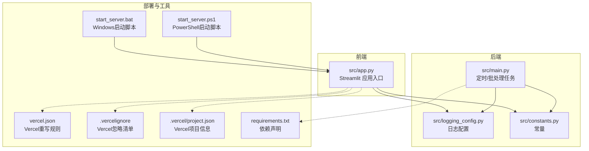
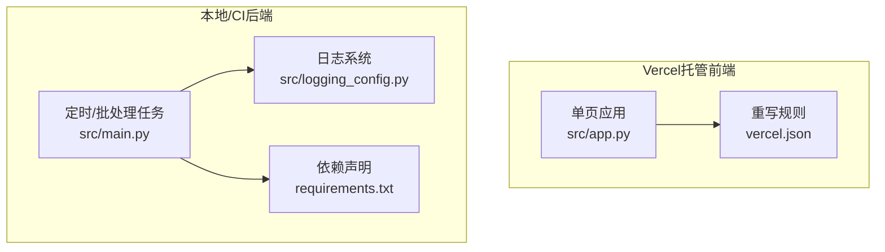
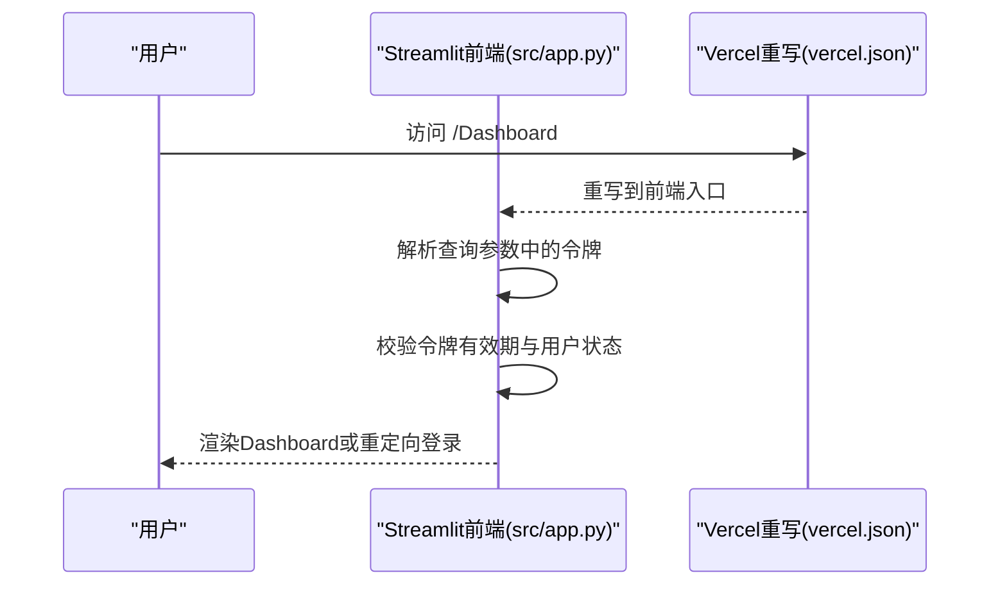
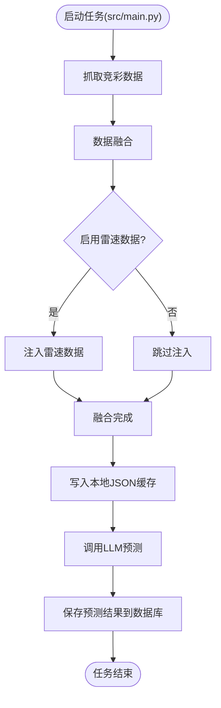
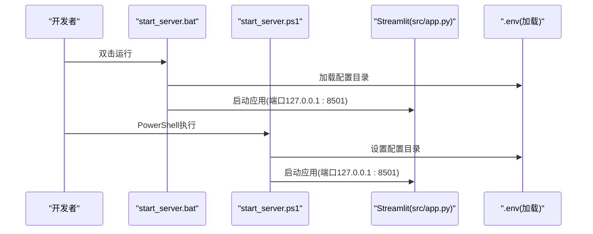
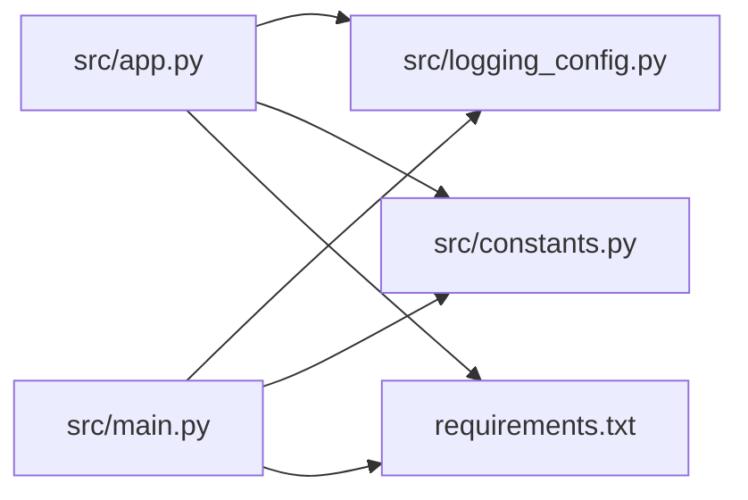

# 部署策略

<cite>
**本文引用的文件**
- [vercel.json](file://vercel.json)
- [.vercel/project.json](file://.vercel/project.json)
- [.vercelignore](file://.vercelignore)
- [start_server.bat](file://start_server.bat)
- [start_server.ps1](file://start_server.ps1)
- [src/app.py](file://src/app.py)
- [src/main.py](file://src/main.py)
- [src/logging_config.py](file://src/logging_config.py)
- [src/constants.py](file://src/constants.py)
- [requirements.txt](file://requirements.txt)
</cite>

## 目录
1. [简介](#简介)
2. [项目结构](#项目结构)
3. [核心组件](#核心组件)
4. [架构总览](#架构总览)
5. [详细组件分析](#详细组件分析)
6. [依赖分析](#依赖分析)
7. [性能考虑](#性能考虑)
8. [故障排查指南](#故障排查指南)
9. [结论](#结论)
10. [附录](#附录)

## 简介
本指南面向DevOps工程师，提供该足球预测系统的完整部署策略，涵盖以下主题：
- Vercel云部署配置与最佳实践（vercel.json、构建设置、环境变量）
- 静态资源优化、CDN与缓存策略
- 本地部署、Docker容器化部署与传统服务器部署方案
- 负载均衡、高可用性与灾难恢复策略
- 与现有代码库的对接点与注意事项

该系统前端基于Streamlit，后端包含定时任务与数据爬取流程，同时具备本地开发脚本与日志配置。

## 项目结构
该项目采用“前端应用 + 后端脚本 + 工具脚本”的组织方式：
- 前端应用入口位于 src/app.py，使用Streamlit作为UI框架
- 定时/批处理任务入口位于 src/main.py，负责数据抓取、融合、预测与入库
- 开发与本地运行提供 Windows 批处理与PowerShell脚本
- 日志系统集中配置于 src/logging_config.py
- 关键常量定义于 src/constants.py
- 依赖声明于 requirements.txt
- Vercel部署相关配置文件：vercel.json、.vercelignore、.vercel/project.json

图表来源
- [src/app.py:1-166](file://src/app.py#L1-L166)
- [src/main.py:1-183](file://src/main.py#L1-L183)
- [src/logging_config.py:1-30](file://src/logging_config.py#L1-L30)
- [src/constants.py:1-5](file://src/constants.py#L1-L5)
- [vercel.json:1-1](file://vercel.json#L1-L1)
- [.vercelignore:1-7](file://.vercelignore#L1-L7)
- [.vercel/project.json:1-1](file://.vercel/project.json#L1-L1)
- [start_server.bat:1-13](file://start_server.bat#L1-L13)
- [start_server.ps1:1-10](file://start_server.ps1#L1-L10)
- [requirements.txt:1-16](file://requirements.txt#L1-L16)

章节来源
- [src/app.py:1-166](file://src/app.py#L1-L166)
- [src/main.py:1-183](file://src/main.py#L1-L183)
- [src/logging_config.py:1-30](file://src/logging_config.py#L1-L30)
- [src/constants.py:1-5](file://src/constants.py#L1-L5)
- [vercel.json:1-1](file://vercel.json#L1-L1)
- [.vercelignore:1-7](file://.vercelignore#L1-L7)
- [.vercel/project.json:1-1](file://.vercel/project.json#L1-L1)
- [start_server.bat:1-13](file://start_server.bat#L1-L13)
- [start_server.ps1:1-10](file://start_server.ps1#L1-L10)
- [requirements.txt:1-16](file://requirements.txt#L1-L16)

## 核心组件
- Streamlit前端应用：负责登录认证、页面导航与展示，入口为 src/app.py
- 定时/批处理任务：负责数据抓取、融合、LLM预测与数据库存储，入口为 src/main.py
- 日志系统：集中配置日志输出到控制台与文件，支持按日轮转与保留周期
- 常量配置：如认证Token有效期等
- 本地启动脚本：Windows平台提供批处理与PowerShell两种启动方式
- Vercel部署配置：重写规则、忽略清单与项目信息

章节来源
- [src/app.py:1-166](file://src/app.py#L1-L166)
- [src/main.py:1-183](file://src/main.py#L1-L183)
- [src/logging_config.py:1-30](file://src/logging_config.py#L1-L30)
- [src/constants.py:1-5](file://src/constants.py#L1-L5)
- [start_server.bat:1-13](file://start_server.bat#L1-L13)
- [start_server.ps1:1-10](file://start_server.ps1#L1-L10)
- [vercel.json:1-1](file://vercel.json#L1-L1)
- [.vercelignore:1-7](file://.vercelignore#L1-L7)
- [.vercel/project.json:1-1](file://.vercel/project.json#L1-L1)

## 架构总览
系统可视为“前端Web应用 + 后端任务调度”的组合：
- 前端通过Vercel托管，利用重写规则支持单页应用路由
- 后端任务通过定时器或手动触发执行，负责数据采集与预测
- 本地开发通过脚本启动Streamlit应用，便于调试与演示

图表来源
- [src/app.py:1-166](file://src/app.py#L1-L166)
- [src/main.py:1-183](file://src/main.py#L1-L183)
- [src/logging_config.py:1-30](file://src/logging_config.py#L1-L30)
- [requirements.txt:1-16](file://requirements.txt#L1-L16)
- [vercel.json:1-1](file://vercel.json#L1-L1)

## 详细组件分析

### Vercel部署配置与最佳实践
- 重写规则：通过vercel.json将所有路径重写到前端入口，确保单页应用路由正常工作
- 忽略清单：.vercelignore用于排除node_modules、构建产物、Git目录等，减少上传体积
- 项目信息：.vercel/project.json记录项目名称，便于Vercel面板识别
- 构建与环境变量：建议在Vercel仪表板中设置环境变量（如数据库连接、第三方API密钥），避免硬编码
- 静态资源优化：将图片、样式等静态资源放入前端可访问目录；启用CDN加速
- 缓存策略：合理设置浏览器缓存与CDN缓存头，结合版本化文件名提升缓存命中率

章节来源
- [vercel.json:1-1](file://vercel.json#L1-L1)
- [.vercelignore:1-7](file://.vercelignore#L1-L7)
- [.vercel/project.json:1-1](file://.vercel/project.json#L1-L1)

### 前端应用（Streamlit）与路由
- 登录与认证：前端实现基于查询参数的轻量认证令牌，结合会话状态控制页面跳转
- 页面导航：通过URL参数携带令牌，避免刷新丢失状态
- 单页应用重写：配合Vercel重写规则，确保前端路由在CDN环境下正常工作

图表来源
- [src/app.py:64-82](file://src/app.py#L64-L82)
- [src/app.py:110-160](file://src/app.py#L110-L160)
- [vercel.json:1-1](file://vercel.json#L1-L1)

章节来源
- [src/app.py:1-166](file://src/app.py#L1-L166)
- [vercel.json:1-1](file://vercel.json#L1-L1)

### 后端任务与数据流
- 数据采集：抓取竞彩、第三方数据源，融合基本面与盘口数据
- LLM预测：对足球与篮球比赛分别进行预测，并回写缓存
- 数据入库：将预测结果保存至数据库
- 日志与异常：集中日志输出，异常信息记录便于排障

图表来源
- [src/main.py:34-135](file://src/main.py#L34-L135)
- [src/main.py:137-176](file://src/main.py#L137-L176)

章节来源
- [src/main.py:1-183](file://src/main.py#L1-L183)

### 本地部署与开发
- Windows启动脚本：提供批处理与PowerShell两种方式启动Streamlit应用，设置配置目录与端口
- 依赖安装：通过requirements.txt安装所需包
- 日志输出：本地运行时日志同时输出到控制台与文件，便于调试

图表来源
- [start_server.bat:10-11](file://start_server.bat#L10-L11)
- [start_server.ps1:7-9](file://start_server.ps1#L7-L9)
- [src/app.py:19-21](file://src/app.py#L19-L21)

章节来源
- [start_server.bat:1-13](file://start_server.bat#L1-L13)
- [start_server.ps1:1-10](file://start_server.ps1#L1-L10)
- [src/app.py:19-21](file://src/app.py#L19-L21)
- [requirements.txt:1-16](file://requirements.txt#L1-L16)

### Docker容器化部署（通用方案）
- 基础镜像：选择Python官方镜像作为基础
- 依赖安装：复制requirements.txt并安装
- 工作目录：设置应用根目录，复制源码
- 环境变量：在镜像构建或运行时注入必要的环境变量
- 健康检查：添加健康检查端点，便于编排系统探测
- 端口暴露：根据实际需要暴露HTTP端口（如8501）
- 日志：将日志输出到标准输出，便于容器日志收集

章节来源
- [requirements.txt:1-16](file://requirements.txt#L1-L16)

### 传统服务器部署（通用方案）
- 系统要求：Python 3.x、pip、系统包（如libGL、libSM等）
- 用户与权限：为应用创建独立用户，限制权限
- 运行方式：使用Supervisor或systemd管理进程
- 环境变量：通过环境文件或系统服务配置注入
- Nginx反向代理：将域名指向应用端口，开启gzip与缓存
- 备份与监控：定期备份数据库与日志，配置告警

## 依赖分析
- 前端与部署：Streamlit作为前端框架，Vercel负责托管与重写
- 后端与数据：依赖requests、pandas、openai、sqlalchemy、playwright等
- 日志与异步：loguru用于日志，nest_asyncio与asyncio用于事件循环兼容
- 定时任务：schedule用于定时执行

图表来源
- [src/app.py:1-166](file://src/app.py#L1-L166)
- [src/main.py:1-183](file://src/main.py#L1-L183)
- [src/logging_config.py:1-30](file://src/logging_config.py#L1-L30)
- [src/constants.py:1-5](file://src/constants.py#L1-L5)
- [requirements.txt:1-16](file://requirements.txt#L1-L16)

章节来源
- [src/app.py:1-166](file://src/app.py#L1-L166)
- [src/main.py:1-183](file://src/main.py#L1-L183)
- [src/logging_config.py:1-30](file://src/logging_config.py#L1-L30)
- [src/constants.py:1-5](file://src/constants.py#L1-L5)
- [requirements.txt:1-16](file://requirements.txt#L1-L16)

## 性能考虑
- 前端性能
  - 静态资源：将图片、CSS、JS放入前端可访问目录，启用CDN与缓存
  - 路由优化：通过vercel.json重写规则减少404与重定向
- 后端性能
  - 数据缓存：本地JSON缓存减少重复计算与网络请求
  - 并发与事件循环：使用nest_asyncio与合适的事件循环策略
  - 日志轮转：按日轮转与保留周期控制磁盘占用
- 部署性能
  - 依赖精简：移除不必要的依赖，缩短构建时间
  - 构建缓存：利用Vercel缓存机制提升二次部署速度

章节来源
- [src/main.py:102-109](file://src/main.py#L102-L109)
- [src/logging_config.py:26-27](file://src/logging_config.py#L26-L27)
- [vercel.json:1-1](file://vercel.json#L1-L1)

## 故障排查指南
- 登录与认证问题
  - 检查查询参数中的令牌是否有效，确认有效期常量与解码逻辑
  - 确认会话状态初始化与路由跳转逻辑
- 日志定位
  - 查看日志文件路径与轮转策略，确认日志级别与输出格式
- 本地启动
  - 确认虚拟环境路径与端口设置，检查配置目录环境变量
- 依赖缺失
  - 对照requirements.txt逐项核对，确保安装完整

章节来源
- [src/app.py:64-82](file://src/app.py#L64-L82)
- [src/app.py:84-89](file://src/app.py#L84-L89)
- [src/logging_config.py:14-29](file://src/logging_config.py#L14-L29)
- [start_server.bat:10-11](file://start_server.bat#L10-L11)
- [start_server.ps1:7-9](file://start_server.ps1#L7-L9)
- [requirements.txt:1-16](file://requirements.txt#L1-L16)

## 结论
本指南提供了从Vercel云端到本地与传统服务器的全栈部署方案，并结合现有代码库的关键点（前端路由、认证、日志、任务流程）给出落地建议。建议在生产环境中进一步完善环境变量管理、监控与告警体系，并持续优化静态资源与缓存策略以提升用户体验与系统稳定性。

## 附录
- 关键配置文件与职责
  - vercel.json：前端路由重写
  - .vercelignore：上传过滤
  - .vercel/project.json：项目标识
  - start_server.bat / start_server.ps1：本地启动
  - src/app.py：前端入口与认证
  - src/main.py：后端任务与数据流
  - src/logging_config.py：日志配置
  - src/constants.py：常量定义
  - requirements.txt：依赖声明

章节来源
- [vercel.json:1-1](file://vercel.json#L1-L1)
- [.vercelignore:1-7](file://.vercelignore#L1-L7)
- [.vercel/project.json:1-1](file://.vercel/project.json#L1-L1)
- [start_server.bat:1-13](file://start_server.bat#L1-L13)
- [start_server.ps1:1-10](file://start_server.ps1#L1-L10)
- [src/app.py:1-166](file://src/app.py#L1-L166)
- [src/main.py:1-183](file://src/main.py#L1-L183)
- [src/logging_config.py:1-30](file://src/logging_config.py#L1-L30)
- [src/constants.py:1-5](file://src/constants.py#L1-L5)
- [requirements.txt:1-16](file://requirements.txt#L1-L16)