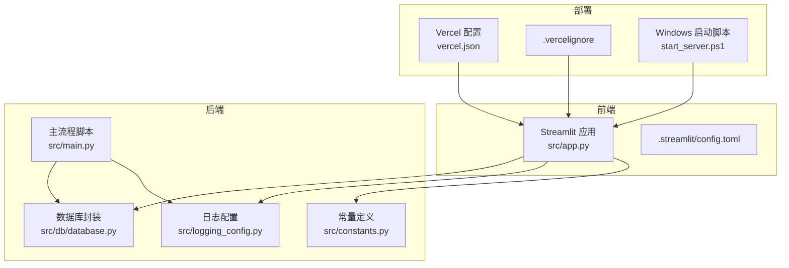
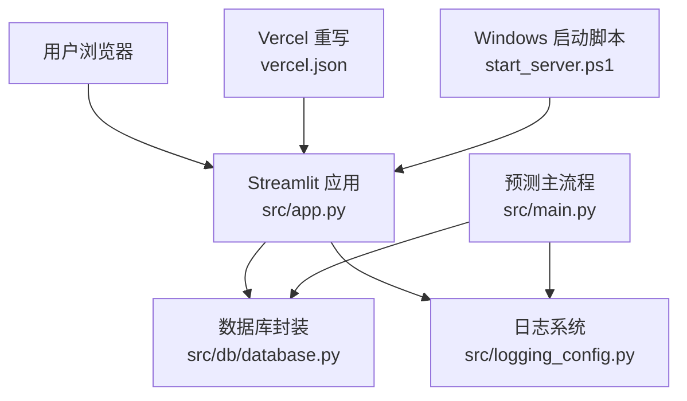
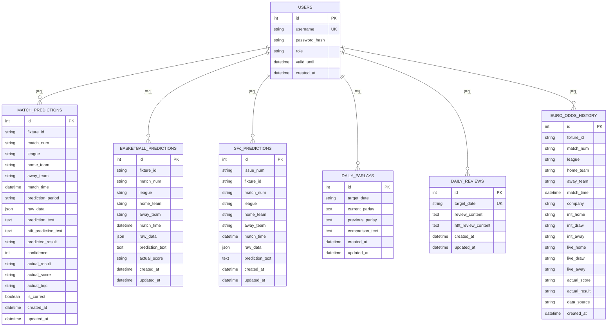
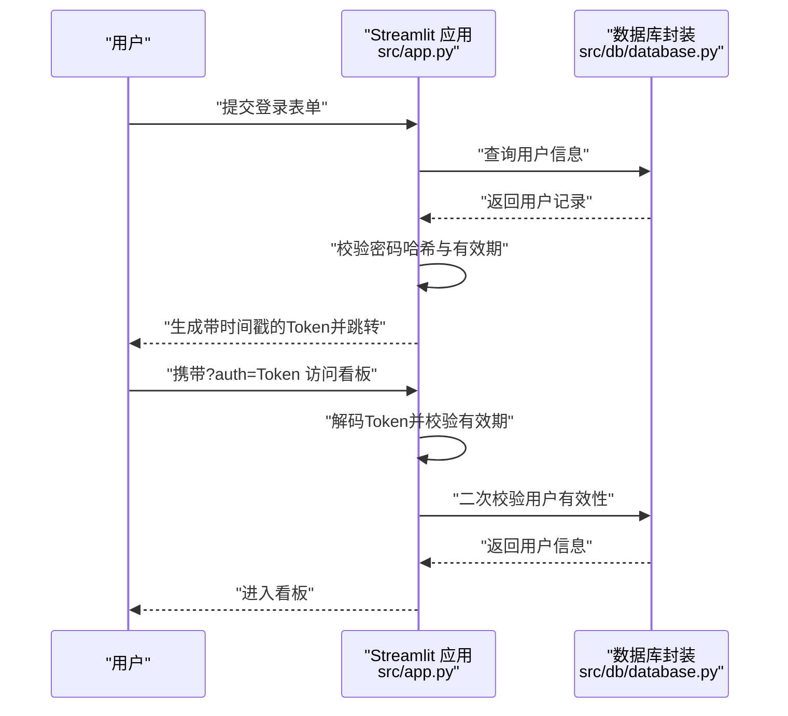
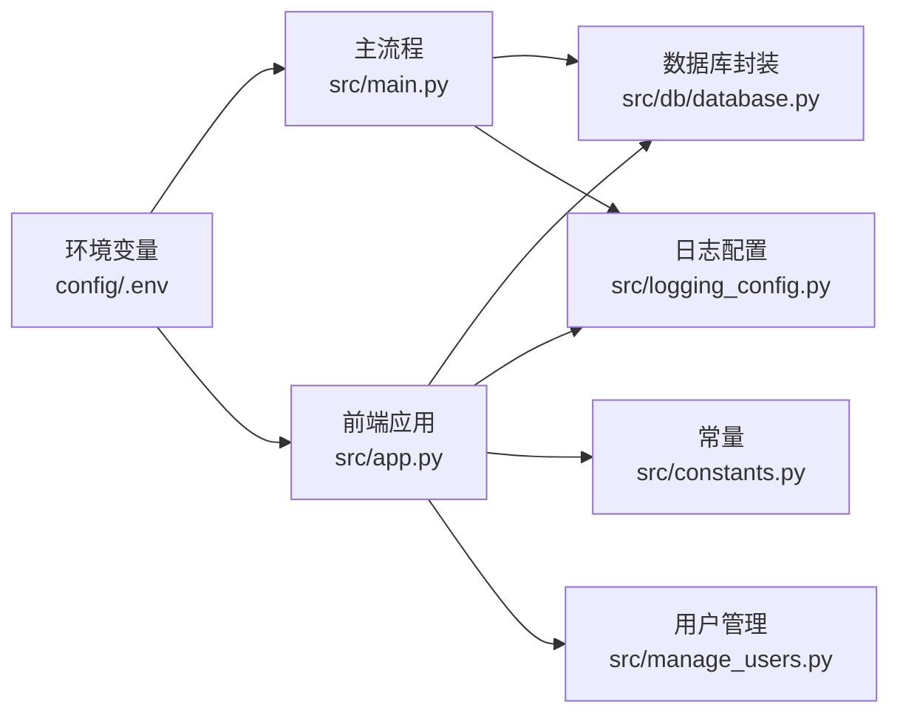

# 配置与部署

<cite>
**本文引用的文件**
- [src/main.py](file://src/main.py)
- [src/app.py](file://src/app.py)
- [src/db/database.py](file://src/db/database.py)
- [src/logging_config.py](file://src/logging_config.py)
- [src/constants.py](file://src/constants.py)
- [src/manage_users.py](file://src/manage_users.py)
- [vercel.json](file://vercel.json)
- [.streamlit/config.toml](file://.streamlit/config.toml)
- [.vercelignore](file://.vercelignore)
- [start_server.ps1](file://start_server.ps1)
</cite>

## 目录
1. [简介](#简介)
2. [项目结构](#项目结构)
3. [核心组件](#核心组件)
4. [架构总览](#架构总览)
5. [详细组件分析](#详细组件分析)
6. [依赖关系分析](#依赖关系分析)
7. [性能考量](#性能考量)
8. [故障排查指南](#故障排查指南)
9. [结论](#结论)
10. [附录](#附录)

## 简介
本指南面向 DevOps 工程师与系统管理员，提供该足球预测系统的配置与部署全栈指导。内容涵盖：
- 环境变量与配置文件设置、参数说明与最佳实践
- 数据库配置、API 密钥与安全设置
- 本地开发、生产与云部署方案
- Docker 容器化部署、CI/CD 流水线与监控告警建议
- 负载均衡、高可用与灾难恢复策略
- 面向不同角色的可操作步骤与排障要点

## 项目结构
该项目采用“前端应用 + 后端脚本 + 数据库 + 日志 + 配置”的分层组织方式：
- 前端应用：基于 Streamlit 的登录与看板界面
- 后端脚本：定时/一次性执行的预测与数据处理流程
- 数据库：SQLite（默认），支持扩展为外部数据库
- 日志：统一通过 Loguru 输出到控制台与文件
- 配置：.env 环境变量、Streamlit 配置、Vercel 部署重写规则

图表来源
- [src/app.py:1-166](file://src/app.py#L1-L166)
- [src/main.py:1-183](file://src/main.py#L1-L183)
- [src/db/database.py:1-567](file://src/db/database.py#L1-L567)
- [src/logging_config.py:1-30](file://src/logging_config.py#L1-L30)
- [src/constants.py:1-5](file://src/constants.py#L1-L5)
- [vercel.json:1-1](file://vercel.json#L1-L1)
- [.vercelignore:1-7](file://.vercelignore#L1-L7)
- [start_server.ps1:1-9](file://start_server.ps1#L1-L9)

章节来源
- [src/app.py:1-166](file://src/app.py#L1-L166)
- [src/main.py:1-183](file://src/main.py#L1-L183)
- [src/db/database.py:1-567](file://src/db/database.py#L1-L567)
- [src/logging_config.py:1-30](file://src/logging_config.py#L1-L30)
- [src/constants.py:1-5](file://src/constants.py#L1-L5)
- [vercel.json:1-1](file://vercel.json#L1-L1)
- [.vercelignore:1-7](file://.vercelignore#L1-L7)
- [start_server.ps1:1-9](file://start_server.ps1#L1-L9)

## 核心组件
- 环境变量加载与路径解析：主流程与前端应用均通过 dotenv 加载 config/.env，确保跨平台与相对路径一致性。
- 数据库：默认使用 SQLite（data/football.db），支持扩展为外部数据库；提供多表模型与预测数据的增删改查。
- 日志：统一初始化，控制台 INFO 级别输出与按日轮转的日志文件。
- 认证与会话：基于 URL Token 的轻量认证，结合数据库用户信息校验与有效期控制。
- 部署：Streamlit 前端，Vercel 重写规则支持 SPA；Windows 启动脚本设置配置目录。

章节来源
- [src/main.py:178-183](file://src/main.py#L178-L183)
- [src/app.py:19-21](file://src/app.py#L19-L21)
- [src/db/database.py:200-218](file://src/db/database.py#L200-L218)
- [src/logging_config.py:8-30](file://src/logging_config.py#L8-L30)
- [src/constants.py:3-4](file://src/constants.py#L3-L4)

## 架构总览
系统由“前端登录/看板 + 后端预测与数据处理 + 数据库存储 + 日志输出 + 部署配置”构成。前端与后端共享环境变量与日志配置，数据库作为唯一持久化存储。

图表来源
- [src/app.py:1-166](file://src/app.py#L1-L166)
- [src/main.py:1-183](file://src/main.py#L1-L183)
- [src/db/database.py:1-567](file://src/db/database.py#L1-L567)
- [src/logging_config.py:1-30](file://src/logging_config.py#L1-L30)
- [vercel.json:1-1](file://vercel.json#L1-L1)
- [start_server.ps1:1-9](file://start_server.ps1#L1-L9)

## 详细组件分析

### 环境配置与参数说明
- 环境变量位置：config/.env（由主流程与前端应用显式加载）
- 关键参数（示例说明，具体值需在 .env 中配置）：
  - ENABLE_LEISU：启用/禁用第三方数据源注入（字符串布尔值）
  - 数据库连接：可通过环境变量传入自定义数据库 URL（如 MySQL/PostgreSQL），否则使用 SQLite
- 最佳实践：
  - 将敏感信息（如数据库密码、第三方 API 密钥）放入 .env 并加入 .vercelignore 排除
  - 使用版本控制忽略 .env，仅提交 .env.example 作为模板
  - 不同环境（开发/生产）使用不同 .env 文件并通过 CI 注入

章节来源
- [src/main.py:55-55](file://src/main.py#L55-L55)
- [src/main.py:181-181](file://src/main.py#L181-L181)
- [src/app.py:20-21](file://src/app.py#L20-L21)
- [src/db/database.py:200-207](file://src/db/database.py#L200-L207)

### 数据库配置与迁移
- 默认 SQLite：首次访问自动创建 data/football.db 与所需表；支持动态补齐列
- 外部数据库：通过环境变量传入数据库 URL，引擎初始化时自动创建表
- 表结构概览（核心表）：
  - users：用户与权限
  - match_predictions：足球预测记录（含时间段标识）
  - basketball_predictions：篮球预测记录
  - sfc_predictions：胜负彩预测记录
  - daily_parlays：每日串关方案
  - daily_reviews：每日复盘
  - euro_odds_history：欧赔历史数据
- 迁移与兼容：运行时检测并补齐必要列，保证旧库兼容

图表来源
- [src/db/database.py:58-198](file://src/db/database.py#L58-L198)

章节来源
- [src/db/database.py:200-233](file://src/db/database.py#L200-L233)
- [src/db/database.py:256-305](file://src/db/database.py#L256-L305)
- [src/db/database.py:331-373](file://src/db/database.py#L331-L373)
- [src/db/database.py:374-421](file://src/db/database.py#L374-L421)
- [src/db/database.py:422-478](file://src/db/database.py#L422-L478)
- [src/db/database.py:480-496](file://src/db/database.py#L480-L496)
- [src/db/database.py:498-501](file://src/db/database.py#L498-L501)
- [src/db/database.py:502-539](file://src/db/database.py#L502-L539)
- [src/db/database.py:541-562](file://src/db/database.py#L541-L562)

### 认证与安全设置
- URL Token：登录成功后生成 base64 编码的 token，包含用户名与时间戳；前端路由携带该 token，后端解码并校验有效期
- 密码哈希：SHA-256 存储，配合数据库用户有效期字段
- 会话状态：前端使用 session_state 维护登录态，退出登录时清理查询参数与状态
- 安全建议：
  - 限制 token 有效期（当前常量为 8 小时）
  - HTTPS 传输与 Cookie SameSite 策略（如部署于反向代理）
  - 对外暴露的接口应增加鉴权与速率限制

图表来源
- [src/app.py:51-108](file://src/app.py#L51-L108)
- [src/db/database.py:309-311](file://src/db/database.py#L309-L311)
- [src/constants.py:3-4](file://src/constants.py#L3-L4)

章节来源
- [src/app.py:51-108](file://src/app.py#L51-L108)
- [src/db/database.py:309-311](file://src/db/database.py#L309-L311)
- [src/constants.py:3-4](file://src/constants.py#L3-L4)

### 日志与监控
- 日志初始化：移除默认 handler，分别输出到控制台与按日轮转的文件，保留 7 天
- 建议：
  - 生产环境开启更细粒度级别（如 DEBUG），并接入集中式日志（如 ELK/Sentry）
  - 结合业务关键点打点，异常捕获与重试策略

章节来源
- [src/logging_config.py:8-30](file://src/logging_config.py#L8-L30)

### 部署与运行
- Streamlit 前端：通过 .streamlit/config.toml 关闭使用统计与 headless 模式
- Vercel 部署：vercel.json 将所有路由重写到 index.html，适配 SPA
- Windows 启动：start_server.ps1 设置 STREAMLIT_CONFIG_DIR 并启动应用
- 建议：
  - 使用 .vercelignore 排除构建无关目录
  - 生产环境使用反向代理（Nginx/Traefik）统一入口与 TLS

章节来源
- [.streamlit/config.toml:1-5](file://.streamlit/config.toml#L1-L5)
- [vercel.json:1-1](file://vercel.json#L1-L1)
- [.vercelignore:1-7](file://.vercelignore#L1-L7)
- [start_server.ps1:1-9](file://start_server.ps1#L1-L9)

## 依赖关系分析
- 组件耦合：
  - 前端与后端共享环境变量与日志配置
  - 主流程与前端均依赖数据库封装
  - 认证逻辑依赖用户表与常量配置
- 外部依赖：
  - Python 包：dotenv、loguru、SQLAlchemy、pandas（Excel 读取）、streamlit 等
  - 部署：Vercel SPA 重写、Windows 启动脚本

图表来源
- [src/main.py:181-181](file://src/main.py#L181-L181)
- [src/app.py:20-21](file://src/app.py#L20-L21)
- [src/db/database.py:1-567](file://src/db/database.py#L1-L567)
- [src/logging_config.py:1-30](file://src/logging_config.py#L1-L30)
- [src/constants.py:1-5](file://src/constants.py#L1-L5)
- [src/manage_users.py:1-44](file://src/manage_users.py#L1-L44)

章节来源
- [src/main.py:181-181](file://src/main.py#L181-L181)
- [src/app.py:20-21](file://src/app.py#L20-L21)
- [src/db/database.py:1-567](file://src/db/database.py#L1-L567)
- [src/logging_config.py:1-30](file://src/logging_config.py#L1-L30)
- [src/constants.py:1-5](file://src/constants.py#L1-L5)
- [src/manage_users.py:1-44](file://src/manage_users.py#L1-L44)

## 性能考量
- I/O 优化：
  - SQLite 写入批量合并（预测完成后统一落库）
  - 日志按日轮转，避免单文件过大
- 并发与事件循环：
  - Windows 平台强制事件循环策略，避免子进程异常
  - Streamlit 会话状态与前端渲染开销控制
- 可扩展性：
  - 数据库可替换为 MySQL/PostgreSQL，提升并发与可靠性
  - 前端与后端分离部署，独立扩缩容

章节来源
- [src/main.py:9-16](file://src/main.py#L9-L16)
- [src/app.py:9-17](file://src/app.py#L9-L17)
- [src/db/database.py:200-218](file://src/db/database.py#L200-L218)

## 故障排查指南
- 登录失败：
  - 检查用户是否存在、密码哈希是否一致、有效期是否过期
  - 核对 token 是否在有效期内
- 数据库问题：
  - 确认 SQLite 文件路径与权限；首次运行自动创建
  - 如更换数据库，确认连接 URL 与驱动可用
- 日志定位：
  - 查看 logs/app.log，关注 ERROR/CRITICAL 级别
- 前端无法访问：
  - 确认 .streamlit/config.toml 与 Vercel 重写规则
  - Windows 启动脚本是否正确设置配置目录

章节来源
- [src/app.py:94-108](file://src/app.py#L94-L108)
- [src/db/database.py:200-218](file://src/db/database.py#L200-L218)
- [src/logging_config.py:14-29](file://src/logging_config.py#L14-L29)
- [vercel.json:1-1](file://vercel.json#L1-L1)
- [start_server.ps1:7-9](file://start_server.ps1#L7-L9)

## 结论
本指南提供了从环境变量、数据库、认证与安全到部署与运维的完整路径。建议在生产环境中引入外部数据库、反向代理与集中式日志，完善 CI/CD 与监控告警体系，确保高可用与可追溯性。

## 附录

### A. 环境变量与配置清单
- 必填项（示例）：
  - ENABLE_LEISU：启用第三方数据源注入
  - 数据库 URL：支持 SQLite/MySQL/PostgreSQL
- 建议项：
  - 日志级别与输出目标
  - 第三方 API 密钥（如适用）

章节来源
- [src/main.py:55-55](file://src/main.py#L55-L55)
- [src/db/database.py:200-207](file://src/db/database.py#L200-L207)

### B. 本地开发环境
- 步骤：
  - 创建虚拟环境并安装依赖
  - 准备 config/.env（参考 .env.example）
  - 运行 start_server.ps1 启动前端
  - 执行 src/main.py 触发预测流程
- 建议：
  - 使用 VS Code/PyCharm 的 Python 解释器指向 venv
  - 在 .streamlit/config.toml 中关闭 gatherUsageStats

章节来源
- [start_server.ps1:1-9](file://start_server.ps1#L1-L9)
- [src/main.py:178-183](file://src/main.py#L178-L183)
- [.streamlit/config.toml:1-5](file://.streamlit/config.toml#L1-L5)

### C. 生产环境与云部署
- 方案一：Vercel + 本地服务
  - 前端部署于 Vercel，SPA 路由重写
  - 后端服务独立部署（云服务器/容器集群）
- 方案二：容器化部署（Docker）
  - 前端镜像：Nginx + Streamlit
  - 后端镜像：Python + 预装依赖 + 启动脚本
  - 数据库：外部托管（RDS/Managed DB）
- 建议：
  - 使用反向代理统一入口与 TLS
  - 配置健康检查与自动重启策略

章节来源
- [vercel.json:1-1](file://vercel.json#L1-L1)
- [.vercelignore:1-7](file://.vercelignore#L1-L7)

### D. CI/CD 流水线建议
- 触发条件：push 到 main 分支或发布标签
- 步骤：
  - 安装依赖与静态检查
  - 单元测试与集成测试
  - 构建镜像并推送仓库
  - 发布到生产环境（蓝绿/滚动）
- 建议：
  - 使用 secrets 管理 .env 与证书
  - 配置失败回滚与通知

[本节为通用实践建议，不直接分析具体文件]

### E. 负载均衡、高可用与灾备
- 负载均衡：反向代理分发请求至多个前端实例
- 高可用：数据库主从复制、只读副本；前端/后端多副本部署
- 灾难恢复：定期备份 SQLite/外部数据库；配置异地容灾与切换预案

[本节为通用实践建议，不直接分析具体文件]