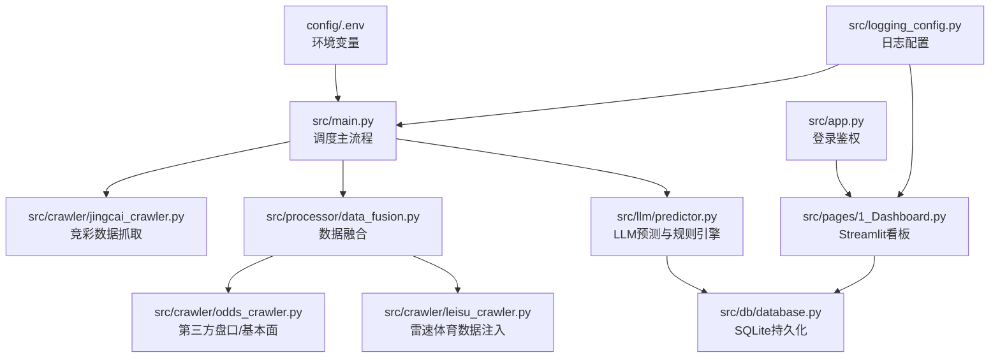
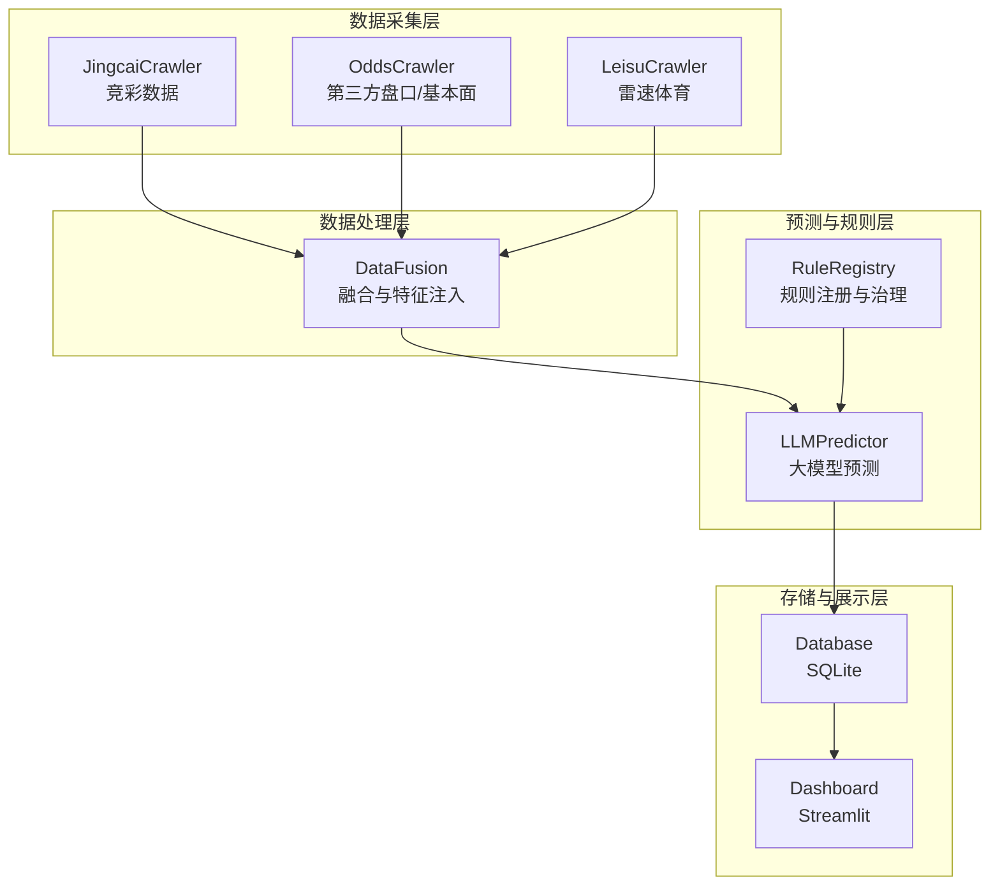
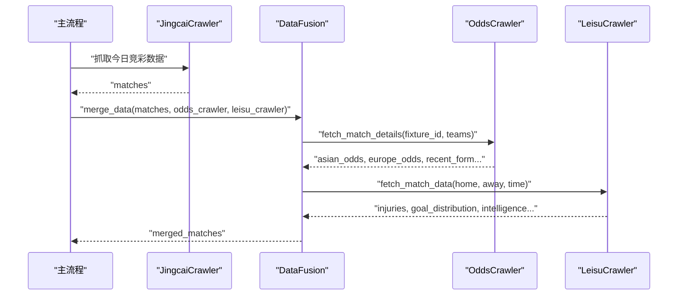
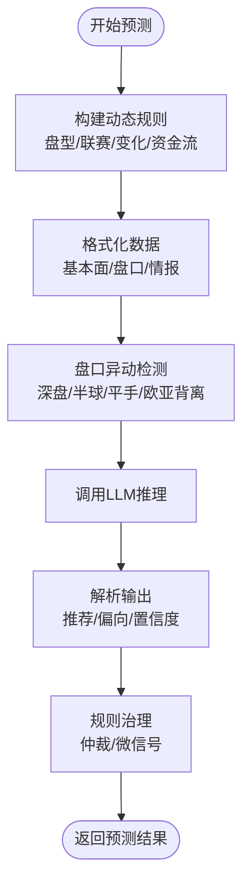
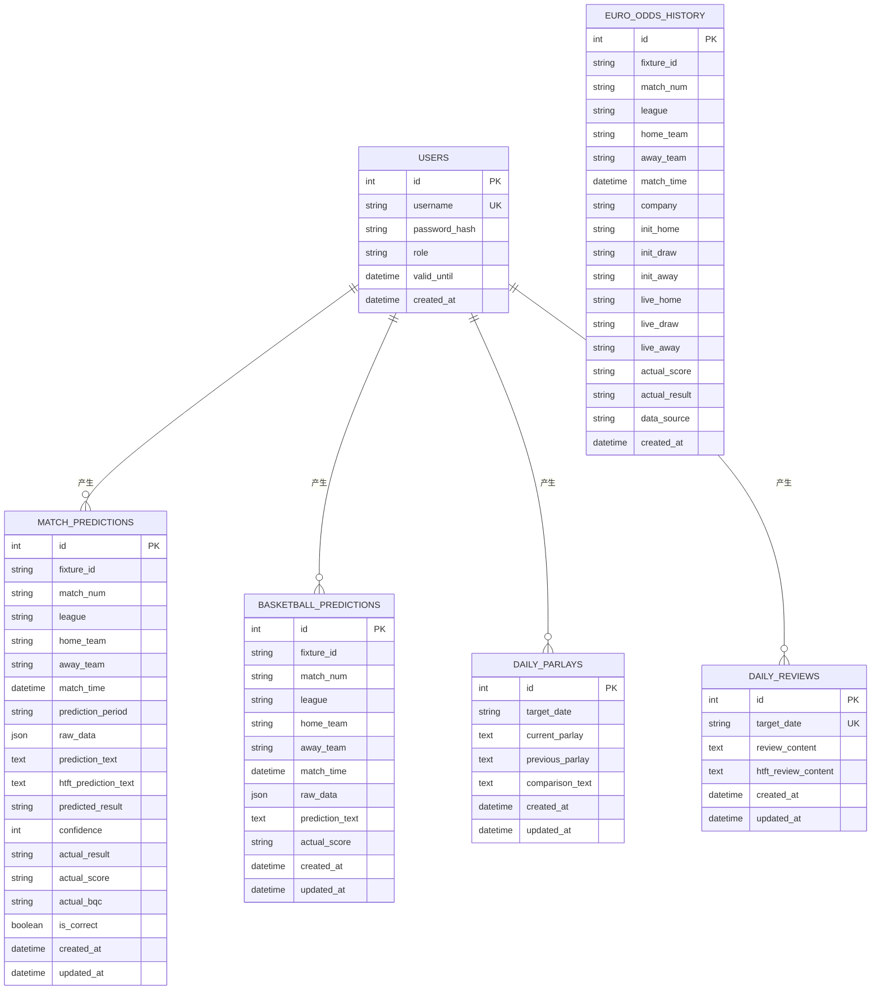
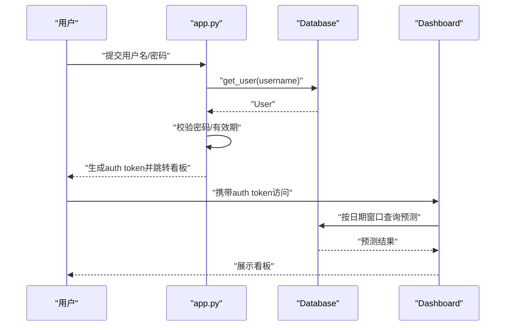
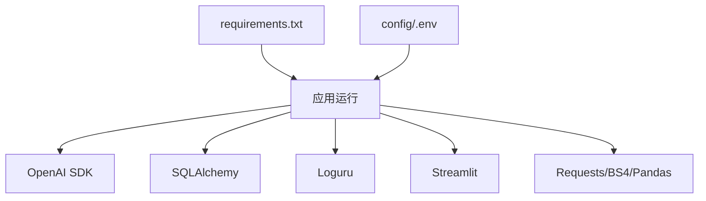

# 项目概述

<cite>
**本文档引用的文件**
- [README.md](file://README.md)
- [requirements.txt](file://requirements.txt)
- [config/.env](file://config/.env)
- [src/app.py](file://src/app.py)
- [src/main.py](file://src/main.py)
- [src/db/database.py](file://src/db/database.py)
- [src/crawler/jingcai_crawler.py](file://src/crawler/jingcai_crawler.py)
- [src/processor/data_fusion.py](file://src/processor/data_fusion.py)
- [src/llm/predictor.py](file://src/llm/predictor.py)
- [src/pages/1_Dashboard.py](file://src/pages/1_Dashboard.py)
- [src/logging_config.py](file://src/logging_config.py)
- [src/utils/rule_registry.py](file://src/utils/rule_registry.py)
</cite>

## 目录
1. [引言](#引言)
2. [项目结构](#项目结构)
3. [核心组件](#核心组件)
4. [架构总览](#架构总览)
5. [详细组件分析](#详细组件分析)
6. [依赖分析](#依赖分析)
7. [性能考量](#性能考量)
8. [故障排查指南](#故障排查指南)
9. [结论](#结论)
10. [附录](#附录)

## 引言
本项目是一个面向竞彩足球与篮球赛事的专业预测系统，围绕“多源数据采集—AI智能预测—实时监控预警—可视化看板—数据库持久化—规则引擎治理”的闭环设计，提供从数据抓取、特征融合、大模型推理到结果存储与复盘的完整能力。系统支持：
- 足球：竞彩官方赛程与赔率、第三方基本面与盘口数据融合、全场/半全场预测、进球数专项分析
- 篮球：竞彩篮球赛事、NBA基础数据、全场预测
- 实时监控：盘口异动、欧亚背离、深盘死水、半球生死盘等微观信号预警
- 可视化与运营：Streamlit 看板、用户权限管理、规则动态治理、历史复盘与模型优化

系统旨在为体育博彩与研究用户提供稳定、可追溯、可解释的预测服务，同时通过规则引擎与复盘机制持续优化模型表现。

## 项目结构
项目采用“分层+功能域”组织方式，核心目录与职责如下：
- config：环境变量与密钥配置
- data：本地缓存（JSON）、知识库与规则、临时中间产物
- docs：策略文档、计划与分析报告
- logs：应用日志
- scripts：批处理与分析脚本
- src：核心业务代码
  - crawler：数据抓取模块（竞彩、第三方盘口、NBA等）
  - processor：数据融合与特征注入
  - llm：大语言模型预测与规则引擎
  - db：数据库建模与持久化
  - pages：Streamlit 页面与看板
  - utils：规则注册与治理工具
  - main.py：调度主流程
  - app.py：登录与鉴权入口

图表来源
- [src/main.py:34-135](file://src/main.py#L34-L135)
- [src/processor/data_fusion.py:61-107](file://src/processor/data_fusion.py#L61-L107)
- [src/db/database.py:200-307](file://src/db/database.py#L200-L307)
- [src/pages/1_Dashboard.py:86-106](file://src/pages/1_Dashboard.py#L86-L106)
- [src/app.py:110-163](file://src/app.py#L110-L163)
- [src/logging_config.py:8-29](file://src/logging_config.py#L8-L29)

章节来源
- [README.md:24-40](file://README.md#L24-L40)
- [src/main.py:34-135](file://src/main.py#L34-L135)
- [src/processor/data_fusion.py:61-107](file://src/processor/data_fusion.py#L61-L107)
- [src/db/database.py:200-307](file://src/db/database.py#L200-L307)
- [src/pages/1_Dashboard.py:86-106](file://src/pages/1_Dashboard.py#L86-L106)
- [src/app.py:110-163](file://src/app.py#L110-L163)
- [src/logging_config.py:8-29](file://src/logging_config.py#L8-L29)

## 核心组件
- 数据采集层
  - 竞彩官方：赛程、赔率、半全场
  - 第三方盘口与基本面：亚盘、欧赔、伤停、交锋、近况、高级统计
  - 雷速体育：伤停明细、进球分布、半全场、积分榜、情报
- 数据处理与融合层
  - 队名对齐、字段标准化、结构化组装、特征注入
- LLM预测与规则引擎
  - Prompt 模板、动态规则拼装、盘口异动与微观信号检测、预测偏向与置信度
- 存储与复盘层
  - SQLite 模型：用户、预测、复盘、串关、历史欧赔等
  - 日周期窗口聚合、历史回放、命中率统计
- 可视化与运营
  - Streamlit 看板、登录鉴权、管理员面板、日志查看、规则管理

章节来源
- [README.md:5-22](file://README.md#L5-L22)
- [src/crawler/jingcai_crawler.py:13-47](file://src/crawler/jingcai_crawler.py#L13-L47)
- [src/processor/data_fusion.py:61-107](file://src/processor/data_fusion.py#L61-L107)
- [src/llm/predictor.py:20-80](file://src/llm/predictor.py#L20-L80)
- [src/db/database.py:68-198](file://src/db/database.py#L68-L198)
- [src/pages/1_Dashboard.py:179-278](file://src/pages/1_Dashboard.py#L179-L278)

## 架构总览
系统采用“主流程驱动 + 模块化插件”的架构模式：
- 主流程负责调度与编排（抓取→融合→预测→入库）
- 各模块职责清晰、解耦良好，便于扩展第三方数据源与规则
- 数据库作为唯一事实来源，支撑看板、复盘与规则治理

图表来源
- [src/main.py:40-135](file://src/main.py#L40-L135)
- [src/processor/data_fusion.py:61-107](file://src/processor/data_fusion.py#L61-L107)
- [src/llm/predictor.py:20-80](file://src/llm/predictor.py#L20-L80)
- [src/db/database.py:200-307](file://src/db/database.py#L200-L307)
- [src/pages/1_Dashboard.py:86-106](file://src/pages/1_Dashboard.py#L86-L106)

## 详细组件分析

### 数据采集与融合
- 竞彩抓取：支持今日/历史/指定日期拉取，解析胜平负、让球、半全场赔率
- 第三方融合：亚盘、欧赔、伤停、交锋、高级统计、情报等
- 雷速注入：伤停明细结构化、进球分布、半全场、积分榜、情报锚点

图表来源
- [src/main.py:40-135](file://src/main.py#L40-L135)
- [src/processor/data_fusion.py:61-107](file://src/processor/data_fusion.py#L61-L107)
- [src/crawler/jingcai_crawler.py:13-47](file://src/crawler/jingcai_crawler.py#L13-L47)

章节来源
- [src/crawler/jingcai_crawler.py:13-47](file://src/crawler/jingcai_crawler.py#L13-L47)
- [src/processor/data_fusion.py:61-107](file://src/processor/data_fusion.py#L61-L107)

### LLM预测与规则引擎
- 动态规则：盘型、联赛、变化与资金流规则组合，降低上下文负担
- 盘口异动检测：深盘死水、半球生死盘、平手僵持、欧亚背离、浅盘诱盘等
- 预测输出：竞彩推荐、信心指数、预测偏向、半全场专项
- 规则治理：微信号与仲裁规则的注册、归一化、执行与反馈

图表来源
- [src/llm/predictor.py:51-80](file://src/llm/predictor.py#L51-L80)
- [src/llm/predictor.py:81-281](file://src/llm/predictor.py#L81-L281)
- [src/llm/predictor.py:282-5886](file://src/llm/predictor.py#L282-L5886)
- [src/utils/rule_registry.py:102-176](file://src/utils/rule_registry.py#L102-L176)

章节来源
- [src/llm/predictor.py:20-80](file://src/llm/predictor.py#L20-L80)
- [src/llm/predictor.py:81-281](file://src/llm/predictor.py#L81-L281)
- [src/utils/rule_registry.py:102-176](file://src/utils/rule_registry.py#L102-L176)

### 数据库与持久化
- 模型覆盖：用户、足球预测、篮球预测、胜负彩、每日串关、每日复盘、欧赔历史
- 关键能力：按日期窗口聚合、历史回放、实际赛果回写、复盘保存
- 一致性：同一 fixture_id 下按时间段优先级覆盖

图表来源
- [src/db/database.py:68-198](file://src/db/database.py#L68-L198)

章节来源
- [src/db/database.py:200-307](file://src/db/database.py#L200-L307)
- [src/db/database.py:451-478](file://src/db/database.py#L451-L478)

### 登录鉴权与看板
- 登录鉴权：URL token 有效期、SHA256 密码校验、角色与到期时间
- 看板：赛事筛选、预测汇总、全局重新预测、历史数据拉取、日志查看、规则管理入口

图表来源
- [src/app.py:94-108](file://src/app.py#L94-L108)
- [src/app.py:110-163](file://src/app.py#L110-L163)
- [src/pages/1_Dashboard.py:32-49](file://src/pages/1_Dashboard.py#L32-L49)
- [src/pages/1_Dashboard.py:86-106](file://src/pages/1_Dashboard.py#L86-L106)

章节来源
- [src/app.py:94-108](file://src/app.py#L94-L108)
- [src/pages/1_Dashboard.py:179-278](file://src/pages/1_Dashboard.py#L179-L278)

## 依赖分析
- 运行时依赖：requests、beautifulsoup4、pandas、openai、sqlalchemy、python-dotenv、streamlit、schedule、loguru、playwright、nest_asyncio、simpleeval、openpyxl
- 环境变量：LLM API 密钥、模型、第三方数据 API 密钥、数据库 URL、消息推送配置、雷速匿名访问

图表来源
- [requirements.txt:1-16](file://requirements.txt#L1-L16)
- [config/.env:1-20](file://config/.env#L1-L20)

章节来源
- [requirements.txt:1-16](file://requirements.txt#L1-L16)
- [config/.env:1-20](file://config/.env#L1-L20)

## 性能考量
- 异步与事件循环：Windows 平台强制设置事件循环策略，避免子进程异常
- 缓存与增量：看板数据缓存 5 分钟，减少 IO 压力
- 数据库事务：批量写入与回滚保护，保证一致性
- 规则评估：简单表达式求值，避免复杂函数导致的运行时开销
- 日志轮转：按天轮转与保留 7 天，平衡可观测性与磁盘占用

章节来源
- [src/main.py:8-16](file://src/main.py#L8-L16)
- [src/pages/1_Dashboard.py:87](file://src/pages/1_Dashboard.py#L87)
- [src/db/database.py:231-304](file://src/db/database.py#L231-L304)
- [src/logging_config.py:26-27](file://src/logging_config.py#L26-L27)

## 故障排查指南
- 登录失败
  - 检查用户名是否存在、密码是否正确、账号是否过期
  - 查看日志文件定位异常
- 数据抓取失败
  - 竞彩接口状态码非 200 或解析异常
  - 第三方数据源网络超时或字段缺失
- 预测结果为空
  - 确认已成功融合数据并保存至缓存 JSON
  - 检查 LLM API 密钥与模型配置
- 数据库写入异常
  - 检查 SQLite 路径与权限，确认表结构与列存在
  - 关注回滚日志与异常堆栈
- 规则治理报错
  - 条件表达式非法或包含不支持的伪代码
  - 使用归一化工具修正条件与动作

章节来源
- [src/app.py:94-108](file://src/app.py#L94-L108)
- [src/crawler/jingcai_crawler.py:25-47](file://src/crawler/jingcai_crawler.py#L25-L47)
- [src/db/database.py:231-304](file://src/db/database.py#L231-L304)
- [src/utils/rule_registry.py:102-176](file://src/utils/rule_registry.py#L102-L176)

## 结论
本系统通过“数据融合 + 动态规则 + LLM 推理 + 数据库持久化 + 规则治理”的一体化设计，实现了从多源数据采集到可视化看板的全链路自动化。其核心价值在于：
- 可解释性：盘口异动与微观信号检测，辅助决策
- 可追溯性：预测与实际赛果入库，支持日周期复盘
- 可治理性：规则注册与归一化，支持动态风控与反馈闭环
- 可扩展性：模块化设计，便于接入新数据源与新模型

在体育博彩领域，系统可作为专业预测与风控工具，服务于内部研究与运营团队，亦可作为教学与复盘的实践范例。

## 附录
- 技术栈
  - 后端：Python（requests、beautifulsoup4、pandas、sqlalchemy、loguru、schedule、nest_asyncio、simpleeval、openpyxl）
  - 推理：OpenAI SDK（可替换为其他模型）
  - 前端：Streamlit
  - 数据库：SQLite（SQLAlchemy ORM）
  - 工具：dotenv、playwright（可选）
- 部署方式概览
  - 本地开发：安装依赖后运行主流程与看板
  - 环境变量：配置 LLM API 密钥、数据库 URL、消息推送等
  - 日志：logs 目录按天轮转
  - 可选：通过 .vercel/* 与 .vercelignore 配合 Vercel 部署前端（需适配后端）

章节来源
- [requirements.txt:1-16](file://requirements.txt#L1-L16)
- [config/.env:1-20](file://config/.env#L1-L20)
- [src/logging_config.py:14-29](file://src/logging_config.py#L14-L29)