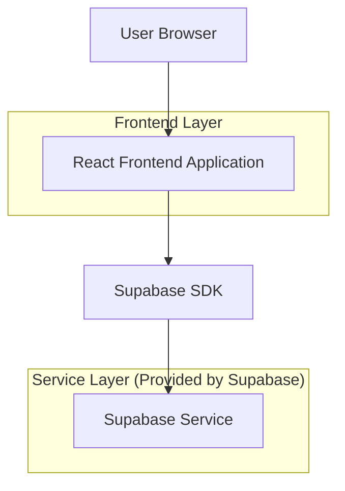
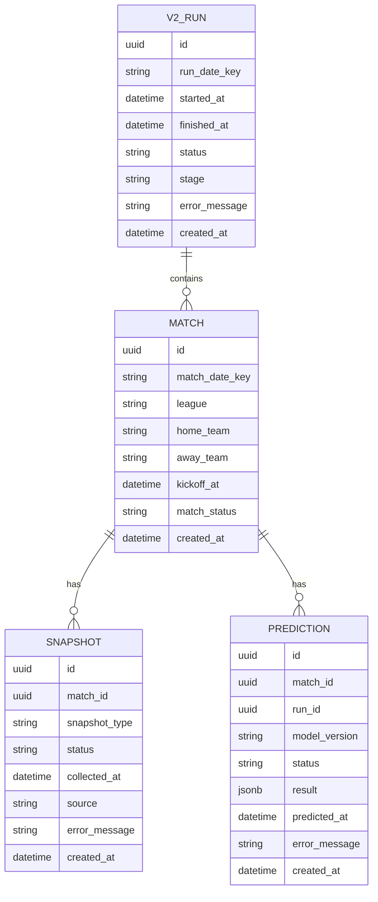

## 1.Architecture design


## 2.Technology Description
- Frontend: React@18 + TypeScript + vite + tailwindcss@3
- Backend: Supabase（Auth 可选；PostgreSQL + Storage 可选）

## 3.Route definitions
| Route | Purpose |
|---|---|
| / | 首页：今日概览与 v2 状态摘要、入口 |
| /v2 | v2 执行过程与结果页：当天比赛/快照状态/最终预测 |

## 6.Data model(if applicable)

### 6.1 Data model definition


说明：
- match_date_key / run_date_key：以“比赛日”维度的日期键（按 12:00~次日 12:00 归一）；用于页面按天查询。
- 逻辑外键：match_id、run_id 不强制物理外键约束（应用层保证一致性）。

### 6.2 Data Definition Language
V2 运行表（v2_runs）
```
CREATE TABLE v2_runs (
  id UUID PRIMARY KEY DEFAULT gen_random_uuid(),
  run_date_key VARCHAR(20) NOT NULL,
  started_at TIMESTAMPTZ,
  finished_at TIMESTAMPTZ,
  status VARCHAR(20) NOT NULL,
  stage VARCHAR(50),
  error_message TEXT,
  created_at TIMESTAMPTZ DEFAULT NOW()
);

CREATE INDEX idx_v2_runs_date_key ON v2_runs(run_date_key);
CREATE INDEX idx_v2_runs_created_at ON v2_runs(created_at DESC);

GRANT SELECT ON v2_runs TO anon;
GRANT ALL PRIVILEGES ON v2_runs TO authenticated;
```

比赛表（matches）
```
CREATE TABLE matches (
  id UUID PRIMARY KEY DEFAULT gen_random_uuid(),
  match_date_key VARCHAR(20) NOT NULL,
  league VARCHAR(100),
  home_team VARCHAR(100) NOT NULL,
  away_team VARCHAR(100) NOT NULL,
  kickoff_at TIMESTAMPTZ,
  match_status VARCHAR(30),
  created_at TIMESTAMPTZ DEFAULT NOW()
);

CREATE INDEX idx_matches_date_key ON matches(match_date_key);
CREATE INDEX idx_matches_kickoff_at ON matches(kickoff_at);

GRANT SELECT ON matches TO anon;
GRANT ALL PRIVILEGES ON matches TO authenticated;
```

快照表（snapshots）
```
CREATE TABLE snapshots (
  id UUID PRIMARY KEY DEFAULT gen_random_uuid(),
  match_id UUID NOT NULL,
  snapshot_type VARCHAR(50) NOT NULL,
  status VARCHAR(20) NOT NULL,
  collected_at TIMESTAMPTZ,
  source VARCHAR(50),
  error_message TEXT,
  created_at TIMESTAMPTZ DEFAULT NOW()
);

CREATE INDEX idx_snapshots_match_id ON snapshots(match_id);
CREATE INDEX idx_snapshots_status ON snapshots(status);

GRANT SELECT ON snapshots TO anon;
GRANT ALL PRIVILEGES ON snapshots TO authenticated;
```

预测结果表（predictions）
```
CREATE TABLE predictions (
  id UUID PRIMARY KEY DEFAULT gen_random_uuid(),
  match_id UUID NOT NULL,
  run_id UUID,
  model_version VARCHAR(50),
  status VARCHAR(20) NOT NULL,
  result JSONB,
  predicted_at TIMESTAMPTZ,
  error_message TEXT,
  created_at TIMESTAMPTZ DEFAULT NOW()
);

CREATE INDEX idx_predictions_match_id ON predictions(match_id);
CREATE INDEX idx_predictions_run_id ON predictions(run_id);
CREATE INDEX idx_predictions_status