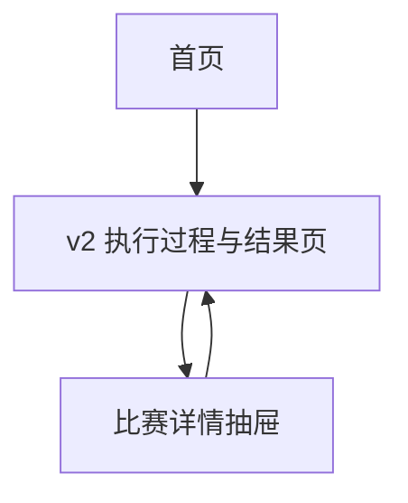

## 1. Product Overview
新增一个“v2 执行过程与执行结果”展示界面，用于聚焦查看当天（12:00~次日12:00）比赛数据、快照采集状态与最终预测结果。
主要价值：让你快速判断 v2 当天是否跑通、数据是否齐全、预测结果是否已产出。

## 2. Core Features

### 2.1 Feature Module
本次需求最小可用版本包含以下页面：
1. **首页**：今日（12:00~次日12:00）概览卡片、v2 页面入口、最近一次 v2 执行状态摘要。
2. **v2 执行过程与结果页**：当天比赛列表、v2 执行过程时间线、快照采集状态、最终预测结果展示。

### 2.2 Page Details
| Page Name | Module Name | Feature description |
|---|---|---|
| 首页 | 今日概览 | 展示“当天比赛总数/已采集快照数量/已完成预测数量/异常数量”摘要；默认统计窗口为当天 12:00~次日 12:00。 |
| 首页 | v2 执行状态摘要 | 展示最近一次 v2 执行的开始时间、结束时间、总体状态（进行中/成功/失败/部分成功）。 |
| 首页 | 导航入口 | 提供进入“v2 执行过程与结果页”的入口。 |
| v2 执行过程与结果页 | 比赛日选择 | 支持选择“比赛日”（以 12:00~次日 12:00 为一天）并默认定位到“今天”；切换后刷新该比赛日数据。 |
| v2 执行过程与结果页 | 当天比赛数据列表 | 按开赛时间排序展示比赛（联赛、主客队、开赛时间、比赛状态）；支持按联赛/关键字快速筛选。 |
| v2 执行过程与结果页 | v2 执行过程时间线 | 展示 v2 当天的执行阶段与时间点（开始、拉取比赛、采集快照、生成预测、产出完成/失败），并标识每阶段状态与耗时。 |
| v2 执行过程与结果页 | 快照采集状态面板 | 以比赛为维度展示快照是否已采集、采集时间、采集来源/版本（若有）、失败原因（若失败）；支持按“未采集/失败”一键过滤。 |
| v2 执行过程与结果页 | 最终预测结果面板 | 以比赛为维度展示最终预测结果（v2 输出字段原样展示）、生成时间、结果状态（已出/未出/失败）及失败原因（若失败）。 |
| v2 执行过程与结果页 | 详情查看 | 点击比赛行打开右侧抽屉：聚合展示该场比赛的基础信息、快照采集明细与最终预测结果明细（含状态与时间）。 |
| v2 执行过程与结果页 | 数据刷新与一致性提示 | 提供手动刷新；当存在“比赛存在但无快照/无预测”时，以明显提示说明当前不完整，并列出缺失数量。 |

## 3. Core Process
- 你打开首页，查看今天（12:00~次日12:00）的比赛与 v2 运行概览。
- 你进入“v2 执行过程与结果页”，默认加载今天比赛日的数据。
- 你在同一页查看：当天比赛列表 → v2 执行过程时间线 → 每场快照采集状态 → 每场最终预测结果。
- 若发现异常（未采集/预测失败），你点击某场比赛打开详情抽屉，定位失败阶段与原因。

