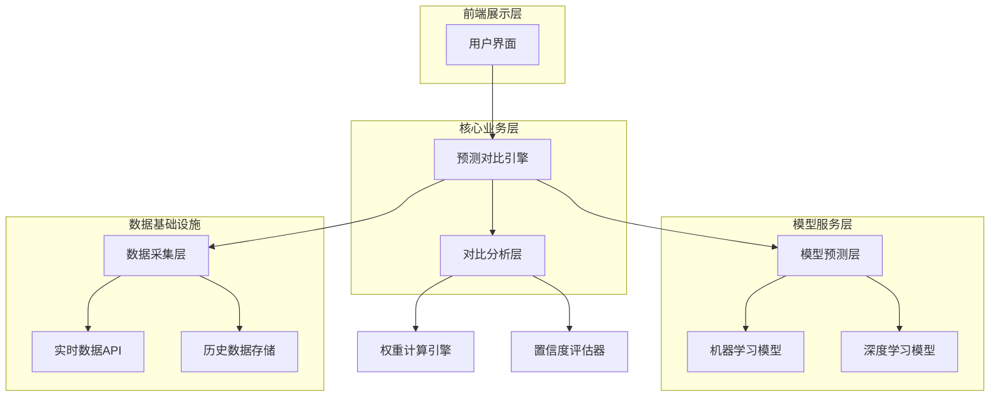
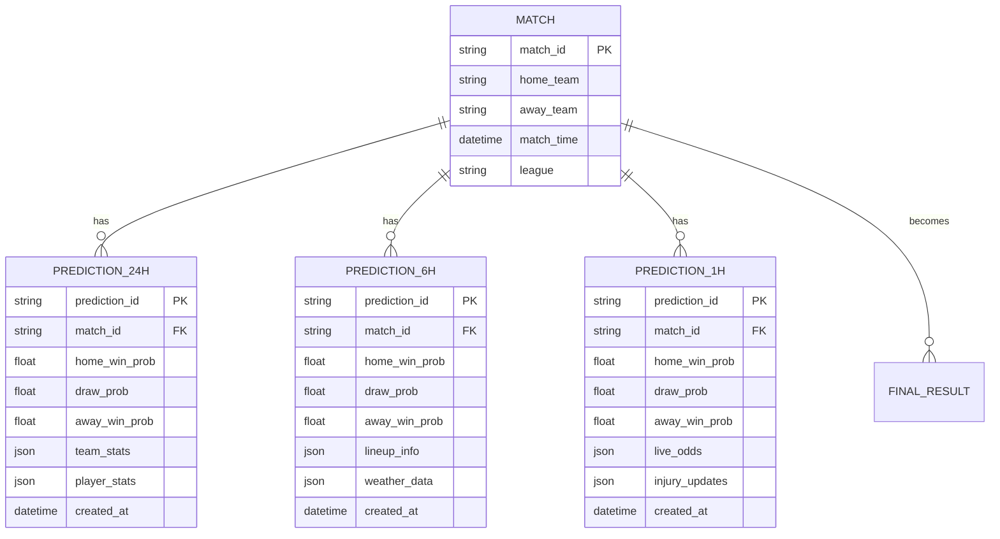
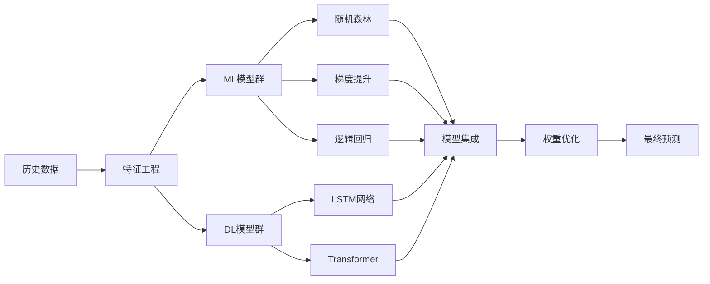

## 1. 架构设计



## 2. 技术描述

- 前端: React@18 + TypeScript + TailwindCSS
- 后端: Python@3.11 + FastAPI
- 数据库: PostgreSQL + Redis缓存
- 机器学习: scikit-learn + TensorFlow/PyTorch
- 数据处理: Pandas + NumPy
- 初始化工具: create-react-app + fastapi-cli

## 3. 核心API定义

### 3.1 三时间点预测API

```
POST /api/v1/predictions/three-point-comparison
```

Request:
| 参数名 | 类型 | 必需 | 描述 |
|--------|------|------|------|
| match_id | string | true | 比赛唯一标识 |
| prediction_times | array | true | 三个预测时间点 ["24h", "6h", "1h"] |
| model_types | array | false | 模型类型 ["ml", "dl", "ensemble"] |

Response:
| 参数名 | 类型 | 描述 |
|--------|------|------|
| comparison_id | string | 对比分析ID |
| predictions | object | 三个时间点的预测数据 |
| confidence_scores | object | 各时间点置信度 |
| final_conclusion | object | 最终结论 |

## 4. 数据采集策略

### 4.1 三时间点数据架构



## 5. 模型训练方法

### 5.1 多模型融合架构



### 5.2 时间衰减权重机制

```sql
-- 创建预测权重表
CREATE TABLE prediction_weights (
    id UUID PRIMARY KEY DEFAULT gen_random_uuid(),
    match_id VARCHAR(50) NOT NULL,
    time_point VARCHAR(10) NOT NULL, -- '24h', '6h', '1h'
    model_type VARCHAR(20) NOT NULL,
    base_weight DECIMAL(5,4) NOT NULL,
    time_decay_factor DECIMAL(5,4) NOT NULL,
    accuracy_history DECIMAL(5,4),
    final_weight DECIMAL(5,4) GENERATED ALWAYS AS (
        base_weight * time_decay_factor * COALESCE(accuracy_history, 1.0)
    ) STORED,
    created_at TIMESTAMP DEFAULT NOW()
);

-- 创建索引
CREATE INDEX idx_weights_match_time ON prediction_weights(match_id, time_point);
CREATE INDEX idx_weights_model ON prediction_weights(model_type);
```

## 6. 对比算法设计

### 6.1 动态权重计算

```python
class ThreePointComparisonEngine:
    def calculate_dynamic_weights(self, predictions_data):
        """
        基于以下因素计算动态权重：
        1. 时间衰减因子 (时间越近权重越高)
        2. 历史准确率 (基于过去表现)
        3. 数据完整性 (可用数据量)
        4. 市场变化敏感度 (赔率变化反应)
        """
        time_weights = {
            '24h': 0.2,  # 24小时前预测
            '6h': 0.3,   # 6小时前预测
            '1h': 0.5    # 1小时前预测
        }
        
        accuracy_weights = self.get_historical_accuracy()
        data_quality_weights = self.assess_data_quality()
        
        final_weights = {}
        for time_point in ['24h', '6h', '1h']:
            final_weights[time_point] = (
                time_weights[time_point] * 
                accuracy_weights.get(time_point, 1.0) * 
                data_quality_weights.get(time_point, 1.0)
            )
        
        return self.normalize_weights(final_weights)
```

### 6.2 置信度评估算法

```python
def calculate_confidence_score(self, predictions, weights):
    """
    置信度评分算法：
    - 预测一致性 (三个时间点预测结果的一致性)
    - 权重分布合理性
    - 历史验证准确率
    - 数据质量指标
    """
    consistency_score = self.calculate_consistency(predictions)
    weight_balance = self.assess_weight_distribution(weights)
    historical_validation = self.get_validation_score()
    data_quality = self.evaluate_data_completeness()
    
    confidence = (
        consistency_score * 0.35 +
        weight_balance * 0.25 +
        historical_validation * 0.25 +
        data_quality * 0.15
    )
    
    return min(confidence, 1.0)  # 确保不超过1.0
```

## 7. 最终结论生成机制

### 7.1 多维度决策矩阵

```python
class FinalConclusionGenerator:
    def generate_conclusion(self, three_point_data):
        """
        生成最终预测结论的决策逻辑：
        """
        weighted_predictions = self.apply_weights(
            three_point_data['predictions'],
            three_point_data['weights']
        )
        
        # 1. 基础预测结果
        base_result = self.determine_winner(weighted_predictions)
        
        # 2. 风险评估
        risk_assessment = self.assess_prediction_risk(
            three_point_data['confidence'],
            three_point_data['variance']
        )
        
        # 3. 投注建议
        betting_advice = self.generate_betting_recommendation(
            base_result,
            risk_assessment,
            three_point_data['odds_movement']
        )
        
        return {
            'final_prediction': base_result,
            'confidence_level': three_point_data['confidence'],
            'risk_level': risk_assessment,
            'betting_recommendation': betting_advice,
            'key_factors': self.extract_key_factors(three_point_data),
            'alternative_scenarios': self.generate_alternatives(three_point_data)
        }
```

### 7.2 结论质量验证

```sql
-- 创建结论验证表
CREATE TABLE conclusion_validation (
    id UUID PRIMARY KEY DEFAULT gen_random_uuid(),
    match_id VARCHAR(50) NOT NULL,
    conclusion_id VARCHAR(50) NOT NULL,
    predicted_result VARCHAR(20),
    actual_result VARCHAR(20),
    confidence_level DECIMAL(3,2),
    prediction_accuracy BOOLEAN,
    validation_score DECIMAL(3,2),
    feedback_notes TEXT,
    validated_at TIMESTAMP DEFAULT NOW()
);

-- 创建性能监控索引
CREATE INDEX idx_validation_accuracy ON conclusion_validation(prediction_accuracy);
CREATE INDEX idx_validation_date ON conclusion_validation(validated_at);
```

## 8. 实时更新机制

### 8.1 增量更新策略

```python
class IncrementalUpdateManager:
    def handle_real_time_updates(self, match_id, new_data):
        """
        处理实时数据更新：
        - 仅更新变化的数据点
        - 重新计算相关预测
        - 触发对比分析更新
        """
        changed_features = self.detect_changes(match_id, new_data)
        
        if changed_features:
            # 1. 更新特征数据
            self.update_feature_cache(match_id, changed_features)
            
            # 2. 重新预测受影响的时间点
            affected_predictions = self.recalculate_predictions(
                match_id, 
                changed_features
            )
            
            # 3. 更新对比分析
            updated_comparison = self.update_three_point_analysis(
                match_id,
                affected_predictions
            )
            
            # 4. 推送更新到前端
            self.push_updates_to_frontend(match_id, updated_comparison)
```

这个技术方案提供了完整的三时间点预测数据对比系统，包括数据采集、模型训练、对比算法和结论生成的全链路解决方案。