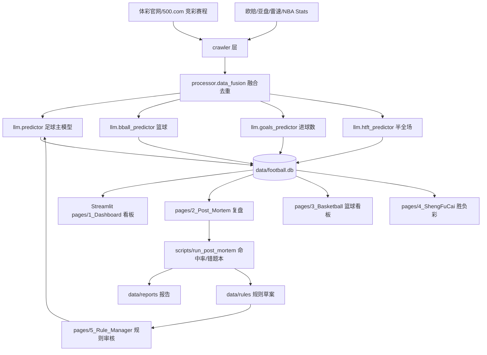

# 足球预测系统 · 系统文档

> 本文档描述仓库 `football-prediction` 的**实际当前实现**（源码快照），用于新成员上手、运维排障与二次开发。
> 对应入口：[src/app.py](../src/app.py)（Web）与 [src/main.py](../src/main.py)（CLI 批处理）。

---

## 1. 系统概述

本系统是一套围绕中国体彩（竞彩足球 / 竞彩篮球 / 胜负彩）的 **"数据抓取 + LLM 推理 + 复盘反馈"** 平台，核心能力：

| 能力 | 说明 |
| --- | --- |
| 每日赛事抓取 | 从 500.com / 体彩官方等渠道拉取竞彩足球、竞彩篮球、胜负彩赛程与官方赔率 |
| 多源数据融合 | 叠加第三方盘口、欧赔、亚盘、雷速伤停/交锋、NBA 基础数据 |
| 大模型推理 | 通过 `predictor.py` / `bball_predictor.py` / `goals_predictor.py` / `htft_predictor.py` 调用 OpenAI 兼容接口生成预测报告 |
| 结构化落库 | SQLite（本地 `data/football.db`）存储预测、赛果、复盘；Supabase 作为可选云端迁移目标 |
| Web 看板 | Streamlit 多页应用：Dashboard / 复盘 / 篮球 / 胜负彩 / 规则管理 |
| 规则引擎与反馈闭环 | `data/rules/*.json` + `rule_registry.py` + 规则管理页 + 复盘产出草案 → 二次入库 |
| 后评估（Post-Mortem） | 命中率统计、错误预测清单、进球分布统计、详细复盘报告（markdown + csv） |

---

## 2. 架构总览



---

## 3. 目录结构

```text
football-prediction/
├── config/                       # 环境变量与示例
│   ├── .env                      # 运行期密钥（不入库）
│   └── .env.example
├── data/                         # 运行数据与产出
│   ├── football.db               # 生产 SQLite 数据库
│   ├── database.db               # 空 stub（历史遗留）
│   ├── today_matches.json        # 足球当日融合缓存
│   ├── today_bball_matches.json  # 篮球当日融合缓存
│   ├── images/                   # 参考图（雷速指引等）
│   ├── knowledge_base/
│   ├── reports/                  # 复盘 md / csv 报告
│   ├── rules/                    # 规则库 JSON（micro/arbitration/drafts）
│   └── tmp_*.json                # 一次性脚本产物
├── docs/                         # 方案、计划、策略 markdown
│   ├── plans/                    # 阶段性研发计划
│   ├── wechat/                   # 公众号物料
│   ├── SYSTEM.md                 # 本文档
│   └── foot_prediction.xlsx      # 当日进球盘口/倾向（被 main.py 读取）
├── logs/                         # loguru 轮转日志
├── scripts/                      # 运维 / 复盘 / 一次性分析脚本
├── src/                          # 核心源码（见 §4）
│   ├── app.py                    # Streamlit 登录入口
│   ├── main.py                   # CLI 批处理主流程
│   ├── constants.py              # 共享常量
│   ├── logging_config.py         # loguru 配置
│   ├── manage_users.py           # 账号管理 CLI
│   ├── crawler/                  # 8 个爬虫
│   ├── processor/data_fusion.py  # 数据融合
│   ├── llm/                      # LLM 预测器与规则
│   ├── db/database.py            # SQLAlchemy 模型与 DAO
│   ├── pages/                    # Streamlit 页面
│   └── utils/                    # 规则引擎、敏感词、限流检测
├── supabase/migrations/          # 云端 SQL 迁移
├── tests/                        # pytest 主体 + 历史抓取样本
├── .streamlit/                   # Streamlit 配置
├── .vercel/ vercel.json          # 静态站点重写配置（预留）
├── requirements.txt
├── start_server.bat / .ps1       # 本地启动脚本
└── README.md
```

---

## 4. 源码模块（`src/`）

### 4.1 入口层

| 文件 | 说明 |
| --- | --- |
| [src/app.py](../src/app.py) | Streamlit 登录页；从 `config/.env` 加载 LLM/DB 配置；支持 URL `?auth=<token>` 免登陆恢复，token 用 base64 编码 `username\|timestamp`，TTL 由 [AUTH_TOKEN_TTL=28800s](../src/constants.py) 控制；登录成功后跳转 `pages/1_Dashboard.py`。 |
| [src/main.py](../src/main.py) | CLI 批处理入口。阶段 1~5：抓取竞彩赛程 → 外围盘赔/雷速融合 → 读取 `docs/foot_prediction.xlsx` 补充进球盘口 → 批量 LLM 预测 → 落库。完成足球后同流程跑一次竞彩篮球。 |
| [src/constants.py](../src/constants.py) | 共享常量，目前仅 `AUTH_TOKEN_TTL`。 |
| [src/logging_config.py](../src/logging_config.py) | loguru 统一配置：stderr 彩色输出 + `logs/app.log` 按天轮转保留 7 天。 |
| [src/manage_users.py](../src/manage_users.py) | 独立 CLI，SHA256 哈希密码，创建/更新 `users` 表中 admin/vip 账号及有效期。 |

### 4.2 数据采集层 `src/crawler/`（8 个爬虫）

| 文件 | 采集目标 |
| --- | --- |
| [jingcai_crawler.py](../src/crawler/jingcai_crawler.py) | 竞彩官网每日足球赛程及官方 SP |
| [jclq_crawler.py](../src/crawler/jclq_crawler.py) | 竞彩篮球每日赛程 |
| [odds_crawler.py](../src/crawler/odds_crawler.py) | 第三方亚盘/欧赔明细（附近期战绩/交锋/伤停聚合） |
| [leisu_crawler.py](../src/crawler/leisu_crawler.py) | 雷速体育：伤停、交锋比分、积分榜、进球分布、半全场、情报（基于 Playwright） |
| [sfc_crawler.py](../src/crawler/sfc_crawler.py) | 胜负彩期号、赛程 |
| [nba_stats_crawler.py](../src/crawler/nba_stats_crawler.py) | NBA 官方 stats（篮球预测基本面） |
| [euro_odds_crawler.py](../src/crawler/euro_odds_crawler.py) | 欧赔初赔 vs 临赔历史（写入 `euro_odds_history` 表） |
| [advanced_stats_crawler.py](../src/crawler/advanced_stats_crawler.py) | 进阶统计（xG、节奏等扩展指标） |

### 4.3 处理融合层 `src/processor/`

[data_fusion.py](../src/processor/data_fusion.py)：
- `build_leisu_crawler(headless=True)`：根据 `ENABLE_LEISU` 环境变量动态构造雷速爬虫，关闭/初始化失败返回 `None`。
- `inject_leisu_data(match, leisu_crawler)`：为已有赛事对象叠加伤停、交锋、进球分布、半全场、积分、情报字段。
- `DataFusion.merge_data(jingcai_matches, odds_crawler, leisu_crawler=None)`：遍历当日赛事，按 `fixture_id` 拉取 `odds_crawler.fetch_match_details()`，合并亚盘、欧赔、近期战绩、交锋、进阶统计。

### 4.4 LLM 预测层 `src/llm/`

| 文件 | 职责 |
| --- | --- |
| [predictor.py](../src/llm/predictor.py) | 足球主模型（约 292KB）：Prompt 模板、敏感词过滤、比赛信息格式化、亚/欧盘解读、错题规则注入、串关推荐、SWOT 分析。是系统最核心的大文件。 |
| [bball_predictor.py](../src/llm/bball_predictor.py) | 篮球预测，消费 `nba_stats_crawler` 数据。 |
| [goals_predictor.py](../src/llm/goals_predictor.py) | 总进球数专项（大小球/进球分布泊松分析）。 |
| [htft_predictor.py](../src/llm/htft_predictor.py) | 半全场（平胜、平负等）专项预测。 |
| [rules.py](../src/llm/rules.py) | 预测期间加载的硬编码规则汇总（与 `data/rules/` JSON 规则库独立）。 |
| `predictor_back.py` | 历史版本备份，当前代码无引用，保留作回滚参考。 |

LLM 关键环境变量：`LLM_API_KEY`、`LLM_API_BASE`（兼容 OpenAI / DeepSeek / 其他 OpenAI-compatible 网关）、`LLM_MODEL`。

### 4.5 数据库层 `src/db/database.py`

基于 SQLAlchemy + SQLite，核心 ORM 类：

| 表 | 用途 | 关键字段 |
| --- | --- | --- |
| `users` | 账号 | `username`, `password_hash`(sha256), `role` (admin/editor/vip), `valid_until` |
| `match_predictions` | 足球预测 | `fixture_id`, `match_num`, `prediction_period`(pre_24h/pre_12h/final/repredicted), `raw_data`(JSON), `prediction_text`, `htft_prediction_text`, `predicted_result`, `confidence`, `actual_result`, `actual_score`, `actual_bqc`, `is_correct` |
| `basketball_predictions` | 篮球预测 | `fixture_id`, `match_num`, `raw_data`, `prediction_text`, `actual_score` |
| `sfc_predictions` | 胜负彩预测 | `issue_num`, `match_num`, `raw_data`, `prediction_text` |
| `daily_parlays` | 每日串关方案 | `target_date`, `current_parlay`, `previous_parlay`, `comparison_text` |
| `daily_reviews` | 每日复盘 | `target_date`(unique), `review_content`, `htft_review_content` |
| `euro_odds_history` | 欧赔初赔 vs 临赔 | 每个博彩公司一条：`init_home/draw/away` + `live_home/draw/away`，附实际比分/胜负平 |

关键行为：
- `Database.__init__` 自动 `create_all()` + `_ensure_match_predictions_columns()` 对老库补 `predicted_result` 列。
- `save_prediction(match_data, period='pre_24h')`：按 `(fixture_id, prediction_period)` upsert。
- `get_predictions_by_date(target_date)`：日周期窗口为 **目标日 12:00 ~ 次日 12:00**，同 `fixture_id` 多 period 按优先级 `repredicted > final > pre_12h > pre_24h` 去重。
- `extract_prediction_recommendation(prediction_text)`：用正则从 LLM 报告中提取"竞彩推荐（不让球）"原文，落入 `predicted_result`。
- `update_actual_result(fixture_id, score, bqc_result=None)`：根据比分自动推导胜平负写回。

### 4.6 页面层 `src/pages/`（Streamlit）

| 页面 | 作用 |
| --- | --- |
| [1_Dashboard.py](../src/pages/1_Dashboard.py)（约 88KB） | 当日赛事总看板，集成多次重跑入口：`scripts/batch_predict_goals.predict_goals_for_date()`、`scripts/temp_analyze.analyze()`（热加载）。 |
| [2_Post_Mortem.py](../src/pages/2_Post_Mortem.py)（约 44KB） | 复盘看板。通过 `importlib.reload(scripts.run_post_mortem)` + `compute_accuracy_report` 计算命中率。 |
| [3_Basketball.py](../src/pages/3_Basketball.py) | 篮球看板。 |
| [4_ShengFuCai.py](../src/pages/4_ShengFuCai.py) | 胜负彩看板。 |
| [5_Rule_Manager.py](../src/pages/5_Rule_Manager.py)（约 32KB） | 规则管理：查看/编辑 `micro_signals.json`、`arbitration_rules.json`、`rule_drafts.json`，支持审核并应用草案。 |
| [99_Test.py](../src/pages/99_Test.py) | 功能探针占位页。 |

### 4.7 工具层 `src/utils/`

| 文件 | 作用 |
| --- | --- |
| [rule_registry.py](../src/utils/rule_registry.py) | 规则库路径定位 + 条件/动作标准化（支持 `AND/OR/BETWEEN`、`market_trend='upgrade'` 等别名到 `asian['start_hv']/ctx['asian']` 的编译），`convert_draft_to_micro_rule` / `convert_draft_to_arbitration_rule` 将草案转为可执行规则。 |
| [rule_drafts.py](../src/utils/rule_drafts.py) | 草案 CRUD：`append/replace_pending_rule_drafts_for_date/get_pending_rule_drafts/update_rule_draft_status/delete_rule_draft`。 |
| [sensitive_filter.py](../src/utils/sensitive_filter.py) | 公众号内容敏感词替换 CLI，字典来源 `docs/wechat/sensitive_dict.json`。 |
| [limitation_detector.py](../src/utils/limitation_detector.py) / `_simple.py` | 公众号限流/受限词汇检测（独立 CLI 工具）。 |

---

## 5. 每日数据流（足球）

参考 [src/main.py](../src/main.py) 的执行顺序：

1. **阶段 1 抓赛程**：`JingcaiCrawler().fetch_today_matches()`。
2. **阶段 2 抓盘赔**：`OddsCrawler()` + `LeisuCrawler(headless=True)`（受 `ENABLE_LEISU` 控制）。
3. **阶段 3 融合**：`DataFusion().merge_data(matches, odds_crawler, leisu_crawler=leisu)`。
4. **阶段 3.5 Excel 补盘**：读取 `docs/foot_prediction.xlsx` 最后一个 sheet，按"编码"列回填 `goals_pan` / `goals_diff_percent` / `goals_trend`。
5. **缓存落盘**：写入 `data/today_matches.json`。
6. **阶段 4 批量预测**：遍历 `merged_matches`，`LLMPredictor().predict(match, total_matches_count=total)` 返回 `(prediction_result, period)`，每场都覆盖写回 JSON 缓存，便于中断续跑。
7. **阶段 5 落库**：`Database().save_prediction(match)`。
8. **篮球分支**：`JclqCrawler` 拉篮球赛程，遇"美职篮"联赛再用 `NBAStatsCrawler` 补 `home_stats/away_stats`，`BBallPredictor().predict()` 后 `save_bball_prediction()`。

---

## 6. 规则引擎与反馈闭环

规则库位于 [data/rules/](../data/rules/)：

| 文件 | 用途 |
| --- | --- |
| `micro_signals.json` | 微观信号规则（盘口、赔率、伤停等触发），条件表达式运行期以 `asian/euro/league` 上下文求值。 |
| `arbitration_rules.json` | 仲裁类规则，`action_type` ∈ `abort_prediction / force_double / cap_confidence / forbid_override / require_override_reason`。 |
| `rule_drafts.json` | 复盘产出的候选草案，状态字段 `status` ∈ `draft/approved/rejected`。 |

反馈闭环：
1. [scripts/run_post_mortem.py](../scripts/run_post_mortem.py) 复盘错题 → 生成草案并 `replace_pending_rule_drafts_for_date(source_date, drafts)`。
2. [src/pages/5_Rule_Manager.py](../src/pages/5_Rule_Manager.py) 审核草案；通过则 `convert_draft_to_micro_rule` / `convert_draft_to_arbitration_rule` 写入正式库。
3. 下次预测 `predictor.py` 启动时重新加载规则，完成闭环。

---

## 7. 复盘工作流

| 工具 | 作用 |
| --- | --- |
| [scripts/run_post_mortem.py](../scripts/run_post_mortem.py) | 主复盘脚本，输出 `data/reports/all_compared_matches.json`、`wrong_predictions.json`、`post_mortem_report.md`，并触发 `generate_detailed_report(yesterday)`。 |
| [scripts/generate_detailed_report.py](../scripts/generate_detailed_report.py) | 基于 `all_compared_matches.json` 产出按日 `detailed_post_mortem_report_YYYY-MM-DD.md` + `detailed_post_mortem_report.csv`。 |
| [scripts/run_bball_post_mortem.py](../scripts/run_bball_post_mortem.py) | 篮球版本复盘。 |
| [scripts/batch_predict_goals.py](../scripts/batch_predict_goals.py) | 指定日期批量（重）预测进球数，被 Dashboard 按钮触发。 |
| [scripts/temp_analyze.py](../scripts/temp_analyze.py) | 泊松集群统计报告，被 Dashboard 触发。 |
| [scripts/analyze_errors.py](../scripts/analyze_errors.py) | 错题归因辅助。 |
| [scripts/analyze_euro_odds_patterns.py](../scripts/analyze_euro_odds_patterns.py) | 欧赔规律分析，输出 `data/reports/euro_odds_pattern_analysis.json`。 |
| [scripts/analyze_odds_drop_trap.py](../scripts/analyze_odds_drop_trap.py) | 降水陷阱分析。 |
| [scripts/crawl_euro_odds_history.py](../scripts/crawl_euro_odds_history.py) | 补抓欧赔历史，写入 `euro_odds_history` 表。 |

其余 `scripts/test_*.py`、`rerun_*.py`、`verify_*.py`、`temp_check*.py`、`get_review*.py`、`check_*` 为**一次性诊断脚本**，与主业务解耦，保留作历史复查。

---

## 8. 配置

[config/.env](../config/.env)（参考 `.env.example`）关键键：

```
LLM_API_KEY=...
LLM_API_BASE=https://api.deepseek.com/v1   # 或 OpenAI / 其他兼容网关
LLM_MODEL=deepseek-chat                    # 或 gpt-4o / claude-...
ENABLE_LEISU=1                             # 设 0/false/no/off 禁用雷速
```

其他：
- [.streamlit/](../.streamlit/)：Streamlit 主题/服务器配置。
- [start_server.bat](../start_server.bat) / [start_server.ps1](../start_server.ps1)：本地启动 `streamlit run src/app.py --server.port 8501 --server.address 127.0.0.1`。

---

## 9. 运行与部署

### 本地开发
```
python -m venv venv
venv\Scripts\activate          # Windows
pip install -r requirements.txt
python -m playwright install chromium   # 雷速爬虫需要
# 配置 config/.env
python src\manage_users.py     # 首次创建管理员/VIP 账号
.\start_server.bat             # 或 .\start_server.ps1
```

### CLI 批量预测
```
python src\main.py             # 足球+篮球全流程
```

### Supabase 迁移
```
supabase db push               # 运行 supabase/migrations/20240326_add_prediction_period.sql
```

### Vercel
[vercel.json](../vercel.json) 当前只包含 SPA 重写规则，用于静态前端的预留托管；核心 Streamlit 服务建议部署于 Windows Server / 云主机内网。

---

## 10. 测试

```
python -m pytest tests/test_predictor_rules.py -v
python -m pytest tests/test_rule_feedback_loop.py -v
python -m pytest tests/test_post_mortem_report.py -v
python -m pytest tests/test_jingcai.py -v
python -m pytest tests/test_leisu_swot.py -v
python -m pytest tests/test_database_prediction_extract.py -v
```

`tests/` 目录同时保留了历史用于样本回放的 `test_500*.py`、`parse_*.py` 与 `500_*.html`，由开发者手动运行。

---

## 11. 已知遗留与技术债

| 类别 | 条目 |
| --- | --- |
| 历史代码 | [src/llm/predictor_back.py](../src/llm/predictor_back.py) 无引用，仅作回滚参考。 |
| 一次性脚本 | `scripts/` 下存在 ~30 个 `temp_*` / `rerun_*` / `verify_*` / `test_*` / `check_*` / `get_review*` 脚本，未被主流程引用，保留作历史证据。 |
| 产物沉淀 | `data/tmp_*.json` 为历史重跑产物；`data/database.db` 为 0 字节空 stub，可在后续维护周期清理。 |
| 二进制附件 | `docs/01122840`、`docs/41332840` 为来源不明的二进制，未被引用。 |
| 日志 | `logs/app.*.log` 为旧轮转日志，`logging_config.py` 默认保留 7 天滚动。 |
| 根目录清理（已执行） | 31 个根目录 `temp_*` / `test_*` / `get_kelong.py` / `run_kelong.py` / `inspect_history.py` / `debug.log` 已删除，详见 Git 历史。 |

---

## 12. 关键路径速查

| 场景 | 跳转 |
| --- | --- |
| 改 Prompt | [src/llm/predictor.py](../src/llm/predictor.py) |
| 新增爬虫 | [src/crawler/](../src/crawler/) + [src/processor/data_fusion.py](../src/processor/data_fusion.py) |
| 新增规则 | 在 [5_Rule_Manager.py](../src/pages/5_Rule_Manager.py) 页面操作或直接改 [data/rules/](../data/rules/) |
| 新增/修改 DB 字段 | [src/db/database.py](../src/db/database.py) + 必要时新增 Supabase 迁移 |
| 新增页面 | 在 [src/pages/](../src/pages/) 下新增 `N_Xxx.py`，参考 `99_Test.py` |
| 调整日志 | [src/logging_config.py](../src/logging_config.py) |
